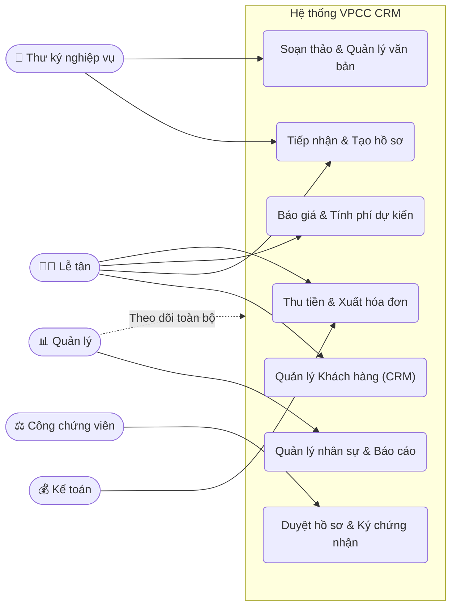

# Tài liệu Đặc tả Yêu cầu Phần mềm (Software Requirements Specification - SRS)
**Dự án:** Hệ thống CRM cho Văn phòng Công chứng
**Phiên bản:** 1.0

---

## 1. Introduction (Giới thiệu)

### 1.1 Purpose (Mục đích)
Tài liệu SRS này đặc tả các yêu cầu phần mềm cho **Hệ thống CRM dành cho Văn phòng công chứng (VPCC)**. Mục đích của hệ thống là trở thành một "trung tâm điều hành số", hỗ trợ quản lý tổng thể hoạt động của VPCC: quản lý khách hàng, nhân sự, quy trình tiếp nhận và xử lý hồ sơ, soạn thảo văn bản, tính phí dịch vụ, lưu trữ điện tử, và chăm sóc khách hàng sau dịch vụ.

### 1.2 Document Conventions (Quy ước tài liệu)
- **Mức độ ưu tiên (Priority):** Cao (High), Trung bình (Medium), Thấp (Low).
- **Mã yêu cầu:** Đánh mã theo định dạng `REQ-[Mã_Module]-[Số_thứ_tự]` (VD: `REQ-CRM-01`).
- Các tính năng chính ở giai đoạn 1 tập trung vào quy trình mẫu: Dịch vụ sao y, chứng thực bản sao.

### 1.3 Intended Audience and Reading Suggestions (Đối tượng độc giả)
- **Quản lý / Trưởng VPCC:** Đọc phần 1 và 2 để nắm bắt mục tiêu, phạm vi và bối cảnh vận hành.
- **Đội ngũ phát triển (Developers) & Kiểm thử (Testers):** Đọc kỹ toàn bộ tài liệu, đặc biệt chú trọng phần 3, 4, 5 để cài đặt và kiểm tra.
- **Nghiệp vụ (Công chứng viên, Thư ký, Lễ tân):** Đọc phần 2 và phần 4 để đối chiếu với quy trình làm việc thực tế.

### 1.4 Product Scope (Phạm vi sản phẩm)
Phần mềm này giúp số hóa toàn bộ quy trình vận hành của một Văn phòng công chứng. Thay vì dữ liệu rải rác trên giấy tờ, Excel, sổ tay hay Zalo cá nhân, hệ thống gom dữ liệu về một nền tảng chung. Nó bao quát 3 lớp vận hành:
1. Lớp khách hàng: Quản lý định danh, lịch sử, chăm sóc.
2. Lớp nghiệp vụ: Quy trình hồ sơ, văn bản, tính phí, checklist.
3. Lớp quản trị: Phân quyền nhân sự, báo cáo, theo dõi tiến độ.

### 1.5 References (Tài liệu tham khảo)
- Tài liệu PRD: *TỔNG QUAN HỆ THỐNG CRM CHO VĂN PHÒNG CÔNG CHỨNG* (he_thong_cong_chung_crm_tong_quan.md).

---

## 2. Overall Description (Mô tả tổng thể)

### 2.1 Product Perspective (Bối cảnh sản phẩm)
Đây là một hệ thống phần mềm mới, hoạt động độc lập (Self-contained product) triển khai trên nền tảng Web-based. Hệ thống sẽ thay thế các phương thức làm việc thủ công và công cụ rời rạc hiện tại. Trong tương lai, hệ thống sẽ mở rộng kết nối thông qua API với các dịch vụ bên ngoài (Zalo OA, Hóa đơn điện tử, Cơ sở dữ liệu UCHI).

### 2.2 Product Functions (Các chức năng chính)
- Quản lý tập trung thông tin khách hàng (CRM).
- Quản lý tài khoản, vai trò và phân công nhân sự.
- Tiếp nhận, tạo mới hồ sơ công chứng/sao y.
- Quản lý tiến độ xử lý và checklist nghiệp vụ.
- Quản lý biểu mẫu, hợp đồng và các phiên bản văn bản.
- Tính phí tự động, theo dõi thanh toán.
- Lưu trữ hồ sơ điện tử thông minh.
- Gửi thông báo/chăm sóc tự động qua Zalo OA.

### 2.3 User Classes and Characteristics (Đối tượng người dùng)
1. **Lễ tân:** Thường xuyên thao tác tạo hồ sơ, tìm kiếm khách, thu tiền. Cần giao diện nhập liệu nhanh.
2. **Thư ký nghiệp vụ:** Soạn thảo văn bản, kiểm tra checklist giấy tờ. Cần công cụ quản lý biểu mẫu và phiên bản văn bản linh hoạt.
3. **Công chứng viên:** Chịu trách nhiệm duyệt hồ sơ và ký chứng nhận. Cần theo dõi danh sách chờ ký rõ ràng.
4. **Kế toán:** Theo dõi doanh thu, phí, đối soát.
5. **Trưởng phòng/Quản lý:** Cần Dashboard tổng quan, công cụ phân công công việc và phân quyền hệ thống.

### 2.4 Operating Environment (Môi trường vận hành)
- Ứng dụng Web (Client-Server), chạy trên các trình duyệt phổ biến (Chrome, Safari, Firefox, Edge).
- Thiết kế Responsive hỗ trợ hiển thị tốt trên máy tính bảng (Tablet) cho thao tác tại quầy.

### 2.5 Design and Implementation Constraints (Ràng buộc hệ thống)
- Bảo mật thông tin nghiêm ngặt do đặc thù dữ liệu cá nhân (CCCD, Hộ chiếu) và tài sản.
- Tuân thủ quy định lưu trữ của ngành công chứng.

### 2.6 User Documentation (Tài liệu người dùng)
- Sẽ cung cấp Hướng dẫn sử dụng trực tuyến (Online Help) theo từng vai trò (Role-based tutorial).

### 2.7 Assumptions and Dependencies (Giả định và Phụ thuộc)
- **Tích hợp Zalo:** Phụ thuộc vào chính sách và phí của Zalo OA.
- **Hóa đơn điện tử:** Phụ thuộc vào API của các nhà cung cấp như VNPT, Viettel, MISA.

---

## 3. External Interface Requirements (Yêu cầu giao diện bên ngoài)

### 3.1 User Interfaces (Giao diện người dùng)
- Giao diện ngôn ngữ Tiếng Việt, sử dụng thuật ngữ chuyên ngành công chứng chính xác.
- Bố cục gọn gàng, có màn hình Dashboard riêng cho từng vai trò.
- Hỗ trợ phím tắt và auto-fill cho các form tạo hồ sơ sao y để tăng tốc độ tại quầy.

### 3.2 Hardware Interfaces (Giao diện phần cứng)
- Tương thích kết nối với máy in (in hóa đơn, in hợp đồng, lời chứng).
- Tương thích thiết bị đọc/quét mã vạch, mã QR trên thẻ CCCD gắn chip (nếu có).

### 3.3 Software Interfaces (Giao diện phần mềm)
- API giao tiếp với nhà cung cấp Hóa đơn điện tử.
- (Tương lai) API truy vấn CSDL ngăn chặn UCHI (nếu được phép kết nối).

### 3.4 Communications Interfaces (Giao diện truyền thông)
- Tích hợp HTTPS mã hóa dữ liệu đầu cuối.
- Giao tiếp với Zalo OA API qua webhook để gửi và nhận phản hồi chăm sóc khách hàng.

---

## 4. System Features (Tính năng hệ thống)

### 4.1. Module CRM và Quản lý khách hàng
#### 4.1.1 Description and Priority
Quản lý tập trung định danh khách hàng (CCCD, SĐT) để tránh mất dữ liệu và hỗ trợ CSKH.
#### 4.1.2 Functional Requirements
- `REQ-CRM-01`: Thêm mới, cập nhật thông tin khách hàng (hỗ trợ phân loại: cá nhân, tổ chức/công ty,...).
- `REQ-CRM-02`: Tra cứu khách hàng siêu tốc theo CCCD/Hộ chiếu hoặc Số điện thoại.
- `REQ-CRM-03`: Lưu vết và hiển thị toàn bộ lịch sử các giao dịch, hồ sơ khách đã từng làm tại VPCC.

### 4.2. Module Quản lý Nhân sự & Phân quyền
#### 4.2.1 Description and Priority
Bảo mật hệ thống thông qua việc cấp quyền truy cập theo vai trò công việc.
#### 4.2.2 Functional Requirements
- `REQ-HR-01`: Quản trị viên có thể tạo, khóa, mở khóa tài khoản nhân sự.
- `REQ-HR-02`: Phân quyền (Role-Based Access Control) cho Lễ tân, Thư ký, Công chứng viên, Kế toán, Quản lý.
- `REQ-HR-03`: Giới hạn truy cập: Nhân sự chỉ xem/xử lý hồ sơ được phân công (tùy cấu hình).

### 4.3. Module Tiếp nhận, Tạo & Theo dõi hồ sơ
#### 4.3.1 Description and Priority
Khởi tạo mã hồ sơ, ghi nhận loại dịch vụ, phân công xử lý và theo dõi trạng thái.
#### 4.3.2 Functional Requirements
- `REQ-HS-01`: Khởi tạo hồ sơ, tự động sinh mã hồ sơ duy nhất. Giao diện tạo hồ sơ cung cấp form nhập thông tin khách hàng tương tự `REQ-CRM-01`. Nếu người dùng nhập SĐT hoặc CCCD/Mã số thuế trùng với dữ liệu khách cũ, hệ thống tự động điền (auto-fill) các trường thông tin còn lại.
- `REQ-HS-02`: Chọn nhóm dịch vụ (vd: Sao y CCCD, Chứng thực) và cập nhật số lượng/thông số liên quan.
- `REQ-HS-03`: Upload/scan đính kèm các tài liệu, giấy tờ ban đầu.
- `REQ-HS-03b`: Tự động tính phí dự kiến ngay sau khi nhập số lượng/dịch vụ. Bắt buộc nhân viên báo giá và check chọn "Khách hàng đồng ý báo phí" thì hệ thống mới cho phép chuyển sang bước Ký/Duyệt (tránh rủi ro khách từ chối trả tiền sau khi đã ký).
- `REQ-HS-04`: Phân công hồ sơ cho thư ký/công chứng viên (Tùy chọn - Optional, không bắt buộc).
- `REQ-HS-05`: Theo dõi và cập nhật trạng thái hồ sơ (Mới tiếp nhận, Đang xử lý, Chờ ký, Đã hoàn tất...).

### 4.4. Module Kiểm tra Checklist Nghiệp vụ
#### 4.4.1 Description and Priority
Đảm bảo tuân thủ chặt chẽ nghiệp vụ, tránh rủi ro pháp lý. 
#### 4.4.2 Functional Requirements
- `REQ-CHK-01`: Quản lý có thể định nghĩa các tiêu chí checklist riêng cho từng loại dịch vụ.
- `REQ-CHK-02`: Bắt buộc nhân viên check đủ các mục bắt buộc (vd: "Kiểm tra tình trạng ngăn chặn") mới được chuyển bước xử lý tiếp theo.

### 4.5. Module Quản lý Hợp đồng, Văn bản, Biểu mẫu
#### 4.5.1 Description and Priority
Tự động hóa soạn thảo, quản lý phiên bản. 
#### 4.5.2 Functional Requirements
- `REQ-DOC-01`: Lưu trữ kho biểu mẫu động (Template).
- `REQ-DOC-02`: Auto-fill (Merge data) thông tin hồ sơ/khách hàng vào biểu mẫu tương ứng.
- `REQ-DOC-03`: Quản lý các phiên bản văn bản (Nháp, Đã sửa, Chờ duyệt, Đã ký).

### 4.6. Module Quản lý Phí & Hóa đơn
#### 4.6.1 Description and Priority
Tự động tính phí và báo giá dịch vụ ngay từ khâu tiếp nhận.
#### 4.6.2 Functional Requirements
- `REQ-FEE-01`: Thiết lập công thức giá cho nhóm dịch vụ. Hệ thống tự động xuất báo giá để nhân viên thông báo cho khách hàng trước khi thực hiện nghiệp vụ.
- `REQ-FEE-02`: Hỗ trợ sửa đổi phí thủ công hoặc thêm phụ phí (yêu cầu ghi chú nguyên nhân).
- `REQ-FEE-03`: Ghi nhận thanh toán và hỗ trợ đẩy dữ liệu sang phần mềm xuất hóa đơn.

### 4.7. Module Lưu trữ Hồ sơ Điện tử
#### 4.7.1 Description and Priority
Đóng gói tài liệu khi hồ sơ hoàn tất. 
#### 4.7.2 Functional Requirements
- `REQ-ARC-01`: Đóng gói hồ sơ (bao gồm: bản nháp, bản scan đã ký, ảnh chụp).
- `REQ-ARC-02`: Gắn mã lưu trữ và tìm kiếm hồ sơ cũ với đa tiêu chí.

### 4.8. Module Chăm sóc Khách hàng (Zalo OA)
#### 4.8.1 Description and Priority
Tự động hóa luồng tương tác sau dịch vụ. **(Priority: Low - Mở rộng sau)**
#### 4.8.2 Functional Requirements
- `REQ-ZAL-01`: Tự động gửi tin nhắn Zalo OA cảm ơn / Khảo sát khi trạng thái hồ sơ là "Đã hoàn tất".

---

## 5. Other Nonfunctional Requirements (Các yêu cầu phi chức năng khác)

### 5.1 Performance Requirements (Hiệu năng)
- Hệ thống cần tải dữ liệu tra cứu khách hàng trong thời gian < 1 giây.
- Hỗ trợ tốt hoạt động liên tục trong giờ cao điểm của văn phòng (tối thiểu 30-50 users thao tác đồng thời).

### 5.2 Safety Requirements (An toàn dữ liệu)
- Có tính năng Soft-delete (xóa mềm). Không ai (kể cả admin) được xóa vĩnh viễn dữ liệu hồ sơ liên quan đến pháp lý mà không có log.
- Backup database mỗi 24 giờ.

### 5.3 Security Requirements (Bảo mật)
- Mật khẩu mã hóa một chiều.
- Log lại lịch sử (Audit Trails): Ai tạo hồ sơ, ai sửa biểu mẫu, ai thu tiền, thời gian nào.

### 5.4 Software Quality Attributes (Thuộc tính chất lượng)
- **Usability (Khả năng sử dụng):** Lễ tân/nhân viên mới có thể sử dụng thành thạo luồng tạo hồ sơ sao y cơ bản trong vòng 1-2 giờ đào tạo.
- **Reliability (Độ tin cậy):** Đảm bảo hoạt động ổn định trong giờ hành chính của văn phòng.

### 5.5 Business Rules (Quy tắc nghiệp vụ)
- **Bắt buộc Báo phí trước:** Phải có thao tác xác nhận khách hàng đồng ý với mức phí báo giá thì hệ thống mới cho phép in Lời chứng hoặc chuyển hồ sơ cho Công chứng viên duyệt/ký. (Việc thu tiền thực tế có thể linh động trước hoặc sau khi hoàn tất tùy VPCC).
- Công chứng viên chỉ được duyệt hồ sơ khi đã đánh dấu đủ checklist bắt buộc.

---

## 6. Other Requirements (Yêu cầu khác)
*(Chưa có yêu cầu phát sinh thêm ngoài scope dự án hiện tại)*

## Appendix A: Glossary (Bảng thuật ngữ)
- **VPCC:** Văn phòng Công chứng.
- **CCV:** Công chứng viên.
- **UCHI:** Hệ thống thông tin lưu trữ dữ liệu công chứng/ngăn chặn tài sản.
- **CRM:** Customer Relationship Management (Quản lý Quan hệ Khách hàng).

## Appendix B: Analysis Models (Mô hình phân tích)
*(Tham khảo tài liệu Use Case phân tích sâu: [UseCase_ChungThucChuKy.md](file:///Users/nguyenvantuan/Documents/Free/VPCC/UseCase_ChungThucChuKy.md))*

### Sơ đồ Use Case Tổng quan Hệ thống

## Appendix C: To Be Determined List (Các vấn đề chờ xác nhận)
- [TBD] Xác nhận API nhà cung cấp phần mềm Hóa đơn điện tử để lên phương án kết nối.
- [TBD] Xin cấp quyền cấu hình Zalo OA của VPCC.
