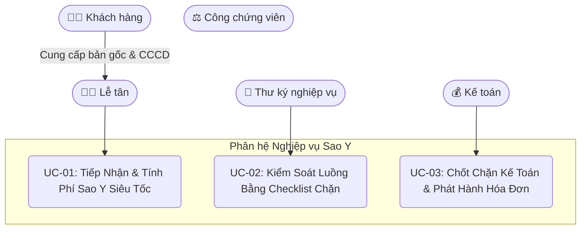
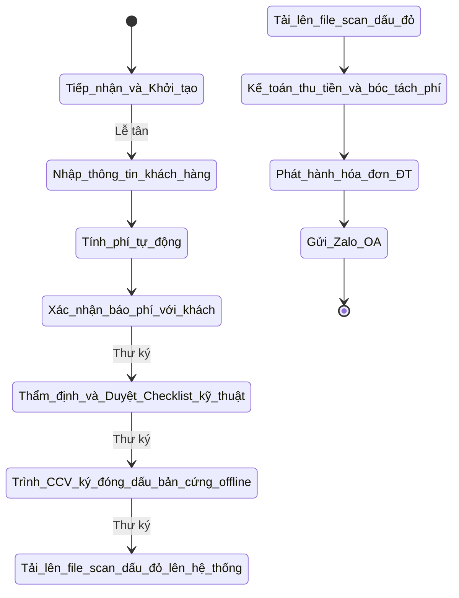
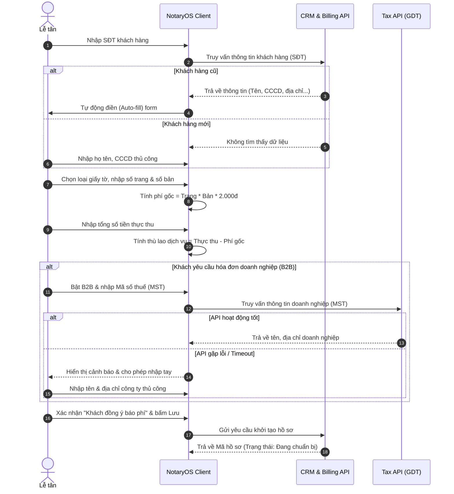
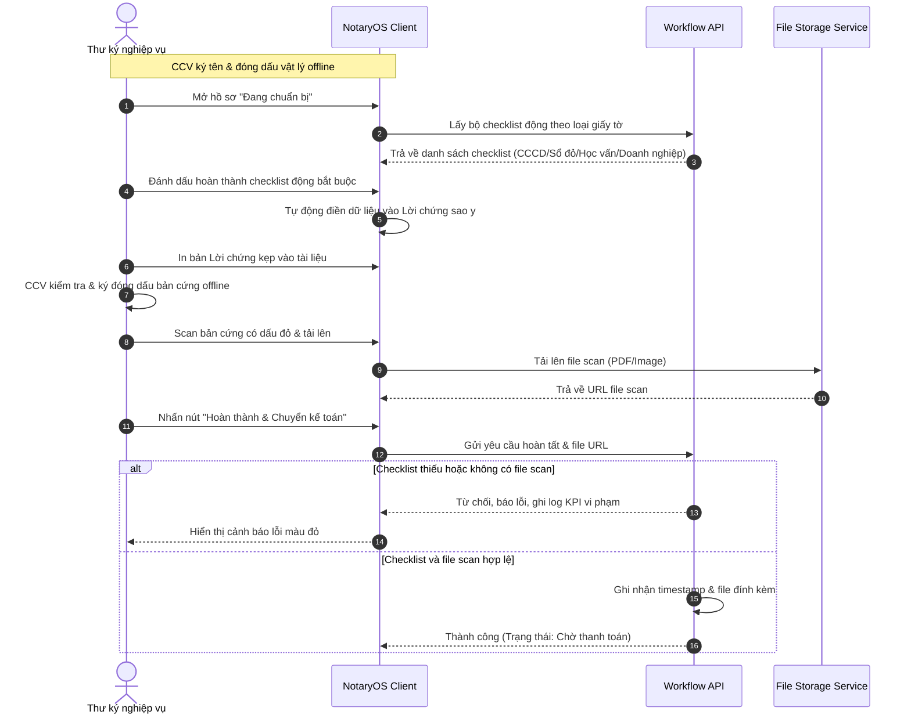
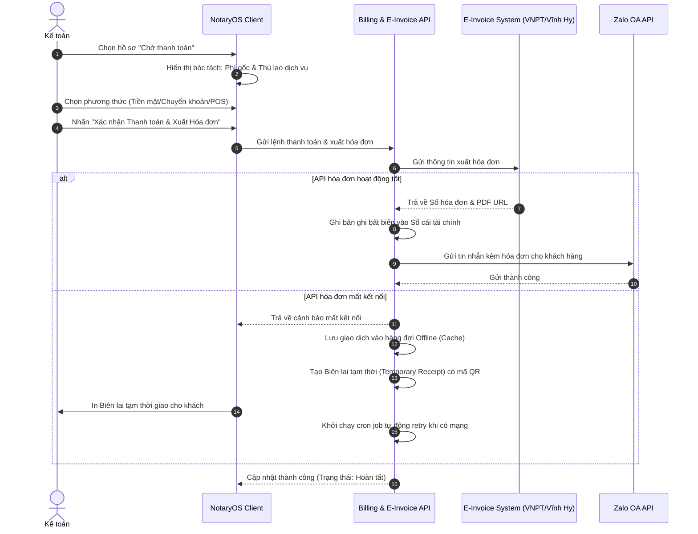

# TÀI LIỆU ĐẶC TẢ YÊU CẦU PHẦN MỀM (SRS) – DỰ ÁN NOTARYOS
## Nghiệp vụ: Sao Y Bản Chính & Chứng Thực Bản Sao

**Phiên bản:** 1.3 - Chi tiết Kỹ thuật  
**Tác giả:** Vũ Minh Hoàng  
**Ngày hoàn thiện:** 17 tháng 06, 2026  

---

## 1. GIỚI THIỆU (INTRODUCTION)

### 1.1 Phạm vi sản phẩm (Product Scope)
**NotaryOS** là giải pháp phần mềm lõi (ERP) điều phối toàn bộ luồng vận hành của văn phòng công chứng (VPCC). Nghiệp vụ Sao y được thiết kế nhằm tối ưu hóa tốc độ xử lý tại quầy (Sao y siêu tốc), phân công vai trò phối hợp giữa Lễ tân, Thư ký, Công chứng viên, tích hợp chốt chặn kiểm soát quy trình nghiệp vụ và chốt chặn tài chính kế toán, tự động kết nối với API hóa đơn điện tử và gửi thông báo cảm ơn/chăm sóc qua Zalo OA.

### 1.2 Từ điển thuật ngữ (Glossary)
| Thuật ngữ | Định nghĩa |
|---|---|
| **VPCC** | Văn phòng Công chứng |
| **CCV** | Công chứng viên |
| **CCCD** | Căn cước công dân |
| **UCHI** | Hệ thống thông tin lưu trữ dữ liệu công chứng/ngăn chặn tài sản của Sở Tư pháp |
| **Zalo OA** | Zalo Official Account - tài khoản chính thức của văn phòng |
| **B2B** | Business-to-Business (Giao dịch liên quan đến khách hàng doanh nghiệp) |

### 1.3 Tổng quát
Tài liệu này tập trung làm rõ luồng đi của hồ sơ Sao y qua 3 giai đoạn tương ứng với 3 Use Case chính: Tiếp nhận và tạo hồ sơ (Lễ tân), Thẩm định và kiểm soát quy trình (Thư ký nghiệp vụ), Phê duyệt và ký số (Công chứng viên), và Chốt chặn tài chính (Kế toán).

---

## 2. MÔ TẢ TỔNG QUAN (OVERALL DESCRIPTION)

### 2.1 Mô hình Kiến trúc và Phân quyền Người dùng
Hệ thống vận hành trên môi trường Web, sử dụng kiến trúc vi dịch vụ (microservices). Quyền hạn trên hệ thống được phân tách nghiêm ngặt dựa trên vai trò (Role-based Access Control):
* **Lễ tân (Reception Clerk):** Tiếp nhận khách hàng, tạo hồ sơ, thực hiện tính phí và thu thập thông tin ban đầu.
* **Thư ký nghiệp vụ (Notary Secretary):** Đối chiếu bản gốc, photocopy tài liệu, soạn thảo Lời chứng sao y, thực hiện kiểm tra checklist kỹ thuật trước khi trình Công chứng viên phê duyệt.
* **Công chứng viên (Notary Officer):** Ký tên và đóng dấu bản cứng thực tế (offline). CCV không cần tương tác trực tiếp với hệ thống phần mềm đối với luồng hồ sơ Sao y này.
* **Kế toán (Financial Accountant):** Kiểm soát dòng tiền, đối soát biểu phí, xác nhận thanh toán và phát hành hóa đơn điện tử.

### 2.2 Sơ đồ Thực thể Dữ liệu Cốt lõi (ERD Entities)
* **CUSTOMER (Khách hàng):** Lưu trữ định danh độc nhất (SĐT hoặc CCCD/MST).
* **TRANSACTION_FILE (Hồ sơ giao dịch):** Lưu trạng thái hồ sơ sao y, số lượng bản, số trang, ID thư ký xử lý và lịch sử thay đổi trạng thái.
* **CHECKLIST_LOG (Nhật ký quy trình):** Lưu trạng thái chặn an toàn (Đã tra cứu UCHI, Đã báo phí, File scan dấu đỏ bản cứng, người phê duyệt checklist).
* **BILLING_LEDGER (Sổ cái tài chính):** Bản ghi bất biến (immutable ledger) lưu chi tiết doanh thu (Phí gốc nhà nước, thù lao dịch vụ khác, VAT).

### 2.3 Sơ đồ Use Case Tổng quan nghiệp vụ Sao y

### 2.4 Sơ đồ Luồng hoạt động Nghiệp vụ (Activity Diagram)

### 2.5 Các trường hợp thực tế (Real Cases)

> [!NOTE]
> Nghiệp vụ sao y tại văn phòng công chứng rất đa dạng về đối tượng tài liệu và yêu cầu hạch toán thuế/pháp lý. Dưới đây là 4 trường hợp thực tế điển hình được xử lý trên NotaryOS.

#### Case 1: Sao y CCCD / Giấy tờ tùy thân của cá nhân tại quầy (Siêu tốc)
* **Bối cảnh:** Anh A đến văn phòng yêu cầu sao y 3 bản CCCD lấy ngay.
* **Hành vi thực tế:** Anh A đưa bản gốc CCCD. Lễ tân quét nhanh SĐT của anh A.
* **Luồng xử lý trên hệ thống:**
  * Lễ tân nhập SĐT -> Hệ thống tìm thấy thông tin anh A và tự động điền (Auto-fill) Họ tên, CCCD, Địa chỉ.
  * Lễ tân chọn loại giấy tờ: **CCCD (Chip-based)**, hệ thống ghi nhận số trang gốc mặc định là 2 (tương ứng với 2 mặt trước và sau của thẻ). Số bản sao y mặc định ban đầu là 1, lễ tân điều chỉnh lại thành 3 bản theo yêu cầu của khách.
  * Lễ tân điền số bản cần sao y: 3 bản.
  * Hệ thống tính Phí Gốc nhà nước: $2 \text{ trang} \times 3 \text{ bản} \times 2.000đ = 12.000đ$.
  * Lễ tân báo phí trọn gói dịch vụ cho khách là $20.000đ$ và nhập số tiền này vào ô "Tổng thực thu".
  * Hệ thống tự động hạch toán phần chênh lệch $8.000đ$ vào mục "Thù lao dịch vụ khác" (phí photo, bìa hồ sơ).
  * Lễ tân tích chọn `Khách hàng đồng ý báo phí` và nhấn "Lưu & Chuyển xử lý".
  * Thư ký nhận tài liệu, photo bản sao, thực hiện đối khớp ảnh chân dung, kiểm tra hạn dùng CCCD và khớp mặt trước/sau. Thư ký in lời chứng tự động, trình CCV ký đóng dấu bản cứng offline.
  * Thư ký scan bản cứng đã ký đóng dấu tải lên hệ thống. Hệ thống tự động chuyển hồ sơ sang trạng thái Chờ thanh toán.
  * Kế toán thu tiền mặt $20.000đ$, bấm xuất hóa đơn. Hệ thống gọi API VNPT xuất hóa đơn điện tử tự động gửi Zalo OA cho anh A.

#### Case 2: Sao y Sổ đỏ / Giấy tờ sở hữu tài sản có kiểm tra ngăn chặn (UCHI)
* **Bối cảnh:** Chị B mang bản gốc Sổ đỏ đến sao y 2 bản để làm hồ sơ vay vốn thế chấp ngân hàng.
* **Hành vi thực tế:** Tài sản liên quan đến đất đai có rủi ro giả mạo và ngăn chặn giao dịch cao.
* **Luồng xử lý trên hệ thống:**
  * Lễ tân tiếp nhận, nhập SĐT chị B, chọn loại giấy tờ: **Sổ đỏ / Giấy chứng nhận quyền sử dụng đất** (4 trang, 2 bản).
  * Phí Gốc: $4 \text{ trang} \times 2 \text{ bản} \times 2.000đ = 16.000đ$. Thực thu thỏa thuận: $50.000đ$ (chênh lệch $34.000đ$ phí thù lao dịch vụ và phí tra cứu ngăn chặn).
  * Chuyển hồ sơ sang bước Thẩm định. **Thư ký bắt buộc phải click vào liên kết "UCHI Search" trên màn hình** để gọi API tra cứu trạng thái ngăn chặn của thửa đất trên CSDL UCHI của Sở Tư pháp.
  * *Nhánh rẽ 1 (Hợp lệ):* CSDL trả về trạng thái "Bình thường". Thư ký tích chọn checklist (UCHI kiểm tra sạch, đối khớp chủ sở hữu, không tẩy xóa), in Lời chứng trình CCV ký đóng dấu vật lý. Thư ký scan bản cứng có dấu đỏ tải lên hệ thống để mở chặn thanh toán.
  * *Nhánh rẽ 2 (Ngăn chặn):* CSDL trả về trạng thái "Đang bị ngăn chặn giao dịch" (do tranh chấp hoặc kê biên). Hệ thống lập tức khóa nút in lời chứng, hiển thị cảnh báo đỏ nổi bật, tự động ghi nhận lỗi ngăn chặn vào log và Thư ký thực hiện trả lại hồ sơ cho khách.

#### Case 3: Sao y số lượng lớn (Vượt trần quy định) & Tự động tách hóa đơn
* **Bối cảnh:** Công ty X mang 5 bộ hồ sơ thầu (mỗi bộ 250 trang) đến sao y bản chính. Tổng số trang sao y: 1250 trang.
* **Hành vi thực tế:** Theo luật Phí và Lệ phí, phí sao y/chứng thực bản sao tối đa không quá $200.000đ/\text{lần yêu cầu}$ (hoặc theo mức trần quy định của địa phương). Nếu xuất một hóa đơn phí gốc 1250 trang x 2.000đ = 2.500.000đ sẽ vi phạm quy định pháp lý về phí lệ phí.
* **Luồng xử lý trên hệ thống:**
  * Lễ tân nhập số trang 250, số bản 5. Phí tính toán ban đầu là $2.500.000đ$.
  * Hệ thống phát hiện số tiền vượt mức trần $200.000đ$ cho một giao dịch độc lập.
  * Khi Lễ tân nhấn "Lưu", hệ thống tự động tách hồ sơ thầu thành 13 bản ghi giao dịch (transaction records) con độc lập trên hệ thống (mỗi bản ghi tối đa 100 trang sao y trị giá $200.000đ$ hoặc tương đương) để khi kế toán xuất hóa đơn điện tử, hóa đơn sẽ tự động được phân tách thành 13 hóa đơn hợp lệ có giá trị mỗi hóa đơn $\le 200.000đ$, đảm bảo tuân thủ 100% quy định pháp luật thuế và phí lệ phí.

#### Case 4: Doanh nghiệp sao y giấy phép & Yêu cầu hóa đơn VAT (B2B)
* **Bối cảnh:** Đại diện Công ty X đến sao y Giấy đăng ký kinh doanh và Giấy phép môi trường, yêu cầu xuất hóa đơn điện tử B2B gửi về email doanh nghiệp để làm báo cáo thuế.
* **Hành vi thực tế:** Cần thông tin chính xác của doanh nghiệp (Mã số thuế, Tên doanh nghiệp, Địa chỉ trụ sở chính) và đối chiếu tính hiệu lực hoạt động của pháp nhân.
* **Luồng xử lý trên hệ thống:**
  * Lễ tân tạo hồ sơ, tích chọn toggle `Xuất hóa đơn doanh nghiệp (B2B)`.
  * Lễ tân nhập Mã số thuế: `0314456789`. Hệ thống gọi API Tổng cục Thuế, tự động điền Tên công ty: "Công ty Cổ phần Đầu tư X" và địa chỉ trụ sở chính vào hóa đơn.
  * Thư ký nhận việc, thực hiện checklist nghiệp vụ doanh nghiệp: Truy vấn nhanh trên Cổng thông tin Quốc gia về Đăng ký Doanh nghiệp xem Công ty X có đang hoạt động bình thường hay đã giải thể/ngừng hoạt động.
  * Thư ký đối khớp con dấu doanh nghiệp trên bản chính, in Lời chứng trình CCV ký offline. Scan tải lên hệ thống.
  * Kế toán chọn thanh toán bằng "Chuyển khoản ngân hàng", đối soát tiền về tài khoản VPCC, bấm "Xác nhận & Phát hành".
  * Hệ thống gọi API VNPT xuất hóa đơn điện tử, đồng thời tự động gửi email chứa hóa đơn XML/PDF và tin nhắn Zalo OA cảm ơn đến số điện thoại của người đại diện công ty.

---

## 3. ĐẶC TẢ USE CASE CHI TIẾT (USE CASE SPECIFICATIONS)

### 3.1 UC-01: Tiếp Nhận & Tính Phí Sao Y Siêu Tốc (Certified Copying)

#### 3.1.1 Đặc tả chi tiết
| Mã Use Case | UC-01 |
|---|---|
| **Tên Use Case** | Tiếp Nhận & Tính Phí Sao Y Siêu Tốc |
| **Tác nhân chính** | Lễ tân (Reception Clerk) |
| **Mô tả** | Tiếp nhận hồ sơ giấy tờ từ khách hàng, tra cứu/nhập thông tin khách, tự động tính phí gốc và điều phối thù lao dịch vụ thỏa thuận. |
| **Sự kiện kích hoạt** | Lễ tân nhấn nút "Tạo hồ sơ Sao y" trên màn hình Dashboard. |
| **Tiền điều kiện** | Lễ tân đã đăng nhập vào hệ thống; Khách hàng cung cấp giấy tờ gốc. |
| **Hậu điều kiện** | Hồ sơ được tạo thành công với mã số duy nhất và chuyển sang trạng thái "Đang chuẩn bị". |

##### Luồng sự kiện chính (Thành công):
| STT | Thực hiện bởi | Hành động |
|---|---|---|
| 1 | Lễ tân | Nhập số điện thoại khách hàng vào trường tìm kiếm. |
| 2 | Hệ thống | Tra cứu CSDL: Nếu tìm thấy, tự động điền (Auto-fill) họ tên, CCCD, địa chỉ. Nếu không thấy, mở form nhập thông tin khách hàng mới. |
| 3 | Lễ tân | Chọn loại giấy tờ cần sao y (ví dụ: CCCD, Sổ đỏ, Bằng cấp) từ danh sách dropdown. |
| 4 | Lễ tân | Nhập số trang gốc của tài liệu và số bản cần sao y. |
| 5 | Hệ thống | Tự động tính phí gốc theo công thức Nhà nước: $Phí\_Gốc = Số\_trang \times Số\_bản \times 2.000đ$. |
| 6 | Lễ tân | Nhập tổng số tiền thực tế thống nhất thu từ khách vào trường "Tổng thực thu". |
| 7 | Hệ thống | Tự động tính phần chênh lệch thù lao dịch vụ: $Thù\_lao = Tổng\_thực\_thu - Phí\_Gốc$ và lưu vào mục "Phí dịch vụ khác". |
| 8 | Lễ tân | Xác nhận báo phí với khách và tích chọn checkbox `Khách hàng đồng ý báo phí`. |
| 9 | Lễ tân | Nhấn "Lưu và Chuyển xử lý". Hệ thống lưu hồ sơ, chuyển trạng thái sang "Đang chuẩn bị" và gán cho Thư ký phụ trách. |

##### Luồng sự kiện thay thế (Ngoại lệ):
* **6a. Số tiền thực thu nhỏ hơn Phí Gốc:** Hệ thống hiển thị cảnh báo đỏ và không cho phép lưu (Tổng thực thu tối thiểu phải bằng Phí Gốc nhà nước).
* **8a. Khách hàng yêu cầu hóa đơn doanh nghiệp (B2B):** 
  * 1. Nhân viên bật toggle `Xuất hóa đơn doanh nghiệp`.
  * 2. Nhân viên nhập Mã số thuế doanh nghiệp.
  * 3. Hệ thống gọi API Tổng cục Thuế để lấy Tên công ty và Địa chỉ doanh nghiệp.
  * *Ngoại lệ API thuế lỗi/timeout:* Hệ thống hiển thị thông báo "API Thuế không phản hồi, vui lòng tự điền thông tin" và mở khóa các ô nhập Tên công ty, Địa chỉ cho nhân viên nhập tay.
* **9a. Số lượng bản sao y quá lớn vượt trần quy định (Phí gốc > 200.000đ/bản):**
  * 1. Hệ thống tự động hiển thị gợi ý tách hóa đơn.
  * 2. Khi lưu, hệ thống tự động tạo các bản ghi con độc lập để đảm bảo đơn giá mỗi bản xuất hóa đơn luôn $\le 200.000đ$ theo đúng quy định pháp luật.

#### 3.1.2 Sơ đồ Luồng xử lý kỹ thuật (Sequence Diagram)

#### 3.1.3 Bảng dữ liệu đầu vào (Input Data Specification)
| STT | Trường dữ liệu | Mô tả | Bắt buộc? | Điều kiện hợp lệ | Ví dụ |
|---|---|---|---|---|---|
| 1 | Số điện thoại | SĐT liên lạc của khách hàng | Có | Chỉ nhập số, độ dài 10 ký tự | 0909123456 |
| 2 | Họ và tên | Tên khách hàng cá nhân | Có | Chuỗi chữ không dấu/có dấu | Nguyễn Văn A |
| 3 | Loại giấy tờ | Dropdown chọn loại tài liệu | Có | Phải thuộc danh mục hệ thống | CCCD (Chip-based) |
| 4 | Số trang | Số trang của bản gốc tài liệu | Có | Số nguyên dương > 0 | 2 |
| 5 | Số bản | Số bản sao y cần thực hiện | Có | Số nguyên dương > 0 | 5 |
| 6 | Tổng thực thu | Số tiền thực tế thu của khách | Có | Số tiền $\ge$ Phí Gốc tính toán | 150000 |
| 7 | Toggle B2B | Lựa chọn xuất hóa đơn VAT công ty | Không | Giá trị Boolean (ON/OFF) | ON |
| 8 | Mã số thuế | MST của doanh nghiệp | Chỉ khi B2B=ON | Chuỗi ký tự số (10 hoặc 13 số) | 0314456789 |

---

### 3.2 UC-02: Kiểm Soát Luồng Bằng Checklist Chặn (Workflow Enforcement)

#### 3.2.1 Đặc tả chi tiết
| Mã Use Case | UC-02 |
|---|---|
| **Tên Use Case** | Kiểm Soát Luồng Bằng Checklist Chặn |
| **Tác nhân chính** | Thư ký nghiệp vụ (Notary Secretary) |
| **Mô tả** | Thư ký thực hiện đối chiếu bản chính, chuẩn bị lời chứng sao y, trình CCV ký đóng dấu bản cứng offline, chụp/scan bản cứng đóng dấu đỏ tải lên hệ thống để mở chặn thanh toán. CCV thực hiện ký/đóng dấu vật lý (offline). |
| **Sự kiện kích hoạt** | Thư ký mở hồ sơ "Đang chuẩn bị" trên màn hình Dashboard. |
| **Tiền điều kiện** | Hồ sơ đã hoàn tất khâu tiếp nhận (UC-01) và đã tích xác nhận báo phí. |
| **Hậu điều kiện** | Bản scan dấu đỏ được tải lên hệ thống thành công; hồ sơ tự động chuyển sang trạng thái "Chờ thanh toán". |

##### Luồng sự kiện chính (Thành công):
| STT | Thực hiện bởi | Hành động |
|---|---|---|
| 1 | Thư ký | Mở hồ sơ. Hệ thống dựa trên loại giấy tờ đã chọn ở UC-01 để hiển thị bộ Checklist kỹ thuật động tương ứng (CCCD, Sổ đỏ, Bằng cấp hoặc Giấy phép DN). |
| 2 | Thư ký | Thực hiện đối chiếu thực tế bản chính và bản photocopy, sau đó tích chọn đầy đủ checklist bắt buộc của loại giấy tờ tương ứng (xem chi tiết ở mục 3.2.1.1). |
| 3 | Hệ thống | Tự động điền dữ liệu (Auto-fill) thông tin khách hàng vào biểu mẫu **Lời chứng sao y** tương ứng. |
| 4 | Thư ký | In Lời chứng kẹp vào bản photocopy. |
| 5 | Thư ký | Trình bản cứng tài liệu cho CCV kiểm tra và ký đóng dấu vật lý (offline). |
| 6 | Thư ký | Nhận lại bản cứng đã ký đóng dấu, thực hiện chụp/scan và tải file scan lên hệ thống. |
| 7 | Thư ký | Nhấn nút "Hoàn thành & Chuyển kế toán". |
| 8 | Hệ thống | Lưu dấu timestamp, lưu file scan vào hồ sơ giao dịch, tự động chuyển trạng thái hồ sơ sang "Chờ thanh toán" của Kế toán. |

#### 3.2.1.1 Phân loại Checklist Động theo loại Giấy tờ Sao Y
Hệ thống NotaryOS tự động áp đặt các bộ điều kiện kiểm soát và checklist chặn khác nhau tùy thuộc vào loại giấy tờ cần sao y để hạn chế tối đa rủi ro pháp lý:

##### A. Nhóm 1: Sao y CCCD / Hộ chiếu / Giấy tờ tùy thân
* **Đặc điểm:** Tần suất rất cao, yêu cầu đối khớp định danh cá nhân nhanh.
* **Bộ checklist bắt buộc:**
  * `[ ]` Đối chiếu ảnh chân dung trên bản gốc khớp với diện mạo của khách hàng tại quầy.
  * `[ ]` Kiểm tra thời hạn hiệu lực của giấy tờ tùy thân (CCCD còn hạn sử dụng, Hộ chiếu còn hạn).
  * `[ ]` Đối khớp mặt trước và mặt sau của CCCD gắn chip (tránh trường hợp tải lên mặt sau của người khác).

##### B. Nhóm 2: Sao y Sổ đỏ / Giấy tờ sở hữu tài sản / Quyền sử dụng đất
* **Đặc điểm:** Rủi ro pháp lý cực cao liên quan đến tranh chấp, giả mạo tài sản.
* **Bộ checklist bắt buộc:**
  * `[ ]` **Bắt buộc click liên kết tra cứu ngăn chặn trên CSDL UCHI** (UCHI Search) để kiểm tra xem tài sản có đang bị phong tỏa, kê biên hoặc ngăn chặn giao dịch hay không.
  * `[ ]` Đối chiếu thông tin chủ sở hữu bản chính khớp với dữ liệu trên CRM.
  * `[ ]` Kiểm tra và đối chiếu các trang bổ sung/thay đổi đính kèm của Sổ đỏ (các biến động đất đai).
  * `[ ]` Kiểm tra vật lý: không có dấu hiệu tẩy xóa, cạo sửa thông tin trên bản chính.

##### C. Nhóm 3: Sao y Bằng cấp / Học bạ / Giấy tờ học vấn
* **Đặc điểm:** Thường có dấu nổi đặc thù của các cơ sở giáo dục.
* **Bộ checklist bắt buộc:**
  * `[ ]` Đối chiếu Họ tên, Ngày sinh khớp với thông tin định danh của khách hàng trên CCCD.
  * `[ ]` Kiểm tra sự tồn tại của dấu nổi/dấu giáp lai nổi của trường học/cơ sở đào tạo trên bản gốc.

##### D. Nhóm 4: Sao y Giấy phép doanh nghiệp / Đăng ký kinh doanh / Quyết định thành lập
* **Đặc điểm:** Liên quan đến tư cách pháp nhân (B2B).
* **Bộ checklist bắt buộc:**
  * `[ ]` Tra cứu tình trạng hoạt động của doanh nghiệp trên Cổng thông tin Quốc gia về đăng ký doanh nghiệp.
  * `[ ]` Kiểm tra thông tin của Người đại diện pháp luật khớp với thông tin CCCD đính kèm trong hồ sơ.
  * `[ ]` Kiểm tra tính hợp lệ của con dấu doanh nghiệp và chữ ký đại diện trên bản gốc giấy phép.

##### Luồng sự kiện thay thế (Ngoại lệ):
* **1a. Phát hiện bản chính bị lỗi/giả mạo:** Thư ký nhấn nút "Từ chối hồ sơ", nhập lý do từ chối. Hồ sơ chuyển về trạng thái hủy, ghi nhận log và thông báo cho lễ tân trả lại giấy tờ cho khách.
* **6a. Chưa hoàn thành checklist hoặc thiếu file scan dấu đỏ:** Khi Thư ký bấm "Hoàn thành & Chuyển kế toán", hệ thống kiểm tra nếu chưa tích đủ checklist kỹ thuật hoặc chưa upload file scan dấu đỏ thành công thì sẽ chặn nút gửi, hiển thị cảnh báo màu đỏ và ghi nhận vi phạm quy trình vào báo cáo hiệu suất (Workflow KPI) của Thư ký.
* **5a. Tải lên file không đúng định dạng:** Hệ thống chỉ chấp nhận file dạng PDF hoặc ảnh (PNG/JPG) có dung lượng dưới 25MB. Nếu tải file khác, hệ thống sẽ báo lỗi và yêu cầu tải lại.

#### 3.2.2 Sơ đồ Luồng xử lý kỹ thuật (Sequence Diagram)

#### 3.2.3 Bảng dữ liệu đầu vào (Input Data Specification)
| STT | Trường dữ liệu | Mô tả | Bắt buộc? | Điều kiện hợp lệ | Ví dụ |
|---|---|---|---|---|---|
| 1 | Checklist Động | Danh sách các đầu mục kiểm tra bắt buộc tùy thuộc vào loại giấy tờ đã chọn ở UC-01 | Có | Phải tích chọn đủ 100% các mục bắt buộc trong danh sách của loại giấy tờ tương ứng | Mảng các giá trị Boolean (tất cả là True) |
| 2 | File scan bản cứng | File chụp/scan hồ sơ có dấu đỏ | Có | Định dạng PDF, PNG, JPG; dung lượng < 25MB | scan_sao_y_redseal.pdf |

---

### 3.3 UC-03: Chốt Chặn Kế Toán & Phát Hành Hóa Đơn Tự Động (Accounting Gateway)

#### 3.3.1 Đặc tả chi tiết
| Mã Use Case | UC-03 |
|---|---|
| **Tên Use Case** | Chốt Chặn Kế Toán & Phát Hành Hóa Đơn Tự Động |
| **Tác nhân chính** | Kế toán (Financial Accountant) |
| **Mô tả** | Bóc tách dòng tiền, xác nhận thanh toán của khách hàng, gọi API phát hành hóa đơn điện tử tự động và kích hoạt gửi tin nhắn Zalo OA. |
| **Sự kiện kích hoạt** | Kế toán chọn hồ sơ từ màn hình danh sách "Chờ thanh toán & Xuất hóa đơn". |
| **Tiền điều kiện** | Hồ sơ đã được Thư ký hoàn thành checklist và tải lên file scan dấu đỏ thành công (UC-02). |
| **Hậu điều kiện** | Dữ liệu tài chính được lưu bất biến vào sổ cái; hóa đơn điện tử được phát hành; Zalo OA gửi thành công. |

##### Luồng sự kiện chính (Thành công):
| STT | Thực hiện bởi | Hành động |
|---|---|---|
| 1 | Kế toán | Xem thông tin bóc tách chi phí tự động trên màn hình thanh toán. |
| 2 | Hệ thống | Tách chi tiết doanh thu: Phí gốc nhà nước (miễn thuế) và Thù lao dịch vụ khác (đã tính thuế VAT 8% hoặc 10% tùy loại dịch vụ). |
| 3 | Kế toán | Chọn phương thức thanh toán của khách hàng: Tiền mặt, Chuyển khoản, hoặc Quẹt thẻ POS. |
| 4 | Kế toán | Nhấn nút "Xác nhận Thanh toán & Xuất Hóa đơn". |
| 5 | Hệ thống | Gọi API tự động đồng bộ sang nhà cung cấp hóa đơn điện tử (VNPT/Vĩnh Hy) và nhận về Số hóa đơn chính thức cùng file hóa đơn PDF. |
| 6 | Hệ thống | Ghi bản ghi tài chính bất biến vào sổ cái hệ thống (không cho phép bất kỳ ai chỉnh sửa hay xóa). |
| 7 | Hệ thống | Kích hoạt gọi API Zalo OA, tự động gửi tin nhắn kèm link tải hóa đơn VAT và lời cảm ơn đến số điện thoại của khách hàng. |

##### Luồng sự kiện thay thế (Ngoại lệ):
* **5a. Mất kết nối API nhà cung cấp hóa đơn điện tử:**
  * 1. Hệ thống hiển thị cảnh báo "Mất kết nối với nhà cung cấp hóa đơn điện tử".
  * 2. Hệ thống lưu giao dịch thanh toán vào hàng đợi xử lý ngầm (Offline Queue).
  * 3. Hệ thống tạo và cho phép kế toán in một Biên lai tạm thời (Temporary Receipt) có chứa mã QR tra cứu tạm thời cho khách.
  * 4. Khi kết nối Internet / API khôi phục, tiến trình chạy ngầm (cron job) tự động thực hiện lại lệnh gọi (retry) để xuất hóa đơn điện tử và gửi Zalo OA cho khách hàng.
* **7a. Khách hàng không đăng ký Zalo:** Hệ thống tự động phát hiện gửi tin nhắn Zalo thất bại và thực hiện fallback tự động chuyển sang gửi tin nhắn SMS truyền thống.

#### 3.3.2 Sơ đồ Luồng xử lý kỹ thuật (Sequence Diagram)

#### 3.3.3 Bảng dữ liệu đầu vào (Input Data Specification)
| STT | Trường dữ liệu | Mô tả | Bắt buộc? | Điều kiện hợp lệ | Ví dụ |
|---|---|---|---|---|---|
| 1 | Phương thức thanh toán | Lựa chọn cách thức thanh toán | Có | Phải thuộc danh mục (Cash, Bank Transfer, POS) | Bank Transfer |
| 2 | Xác nhận thanh toán | Nút bấm xác thực đã nhận đủ tiền | Có | Giá trị Boolean khi nhấn xác nhận | True |
| 3 | API E-Invoice Response | Chuỗi dữ liệu trả về từ API hóa đơn | Có (tự động) | Phải chứa Số hóa đơn hợp lệ từ VNPT/Vĩnh Hy | VNPT-2026-00918 |

---

## 4. CÁC YÊU CẦU PHI CHỨC NĂNG (NON-FUNCTIONAL REQUIREMENTS)

### 4.1 Giao diện người dùng (User Interface)
* Thiết kế chế độ tối (Dark mode) sang trọng, giảm mỏi mắt cho nhân viên làm việc liên tục tại quầy.
* Bố cục màn hình tiếp nhận sao y tối giản, hỗ trợ tự động điền thông tin giúp thời gian thao tác tạo mới hồ sơ của lễ tân dưới 30 giây.

### 4.2 Tính bảo mật và Toàn vẹn tài chính (Security & Financial Integrity)
* Sổ cái kế toán ghi nhận giao dịch thanh toán là bất biến (Read-only sau khi đã lưu). Nghiêm cấm mọi hành vi chỉnh sửa trực tiếp vào cơ sở dữ liệu.
* Lịch sử tác động (Audit Log) ghi nhận chi tiết: Ai đã tạo (Lễ tân), Thư ký nào xử lý checklist kỹ thuật & scan tài liệu, Kế toán nào bấm xuất hóa đơn, kèm theo mốc thời gian (timestamp) chính xác.

### 4.3 Ràng buộc (Constraints)
* Hệ thống bắt buộc phải có kết nối Internet để đồng bộ dữ liệu UCHI và API hóa đơn điện tử.
* Trong trường hợp ngoại tuyến, hệ thống chỉ cho phép lưu trữ tạm thời hồ sơ sao y và in biên lai tạm, khóa tất cả luồng phê duyệt hợp đồng hoặc giao dịch pháp lý phức tạp khác.