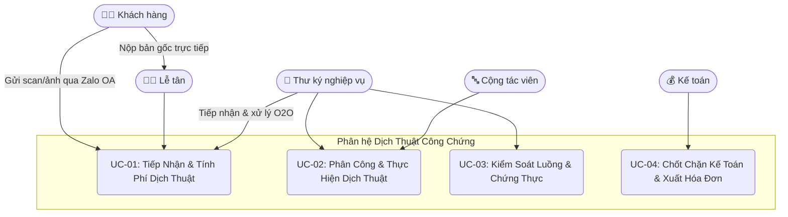
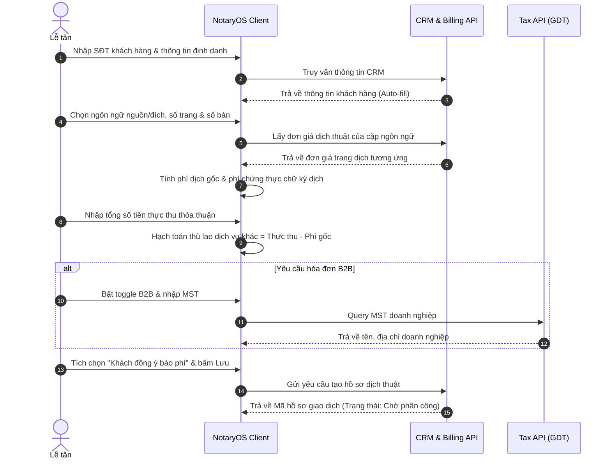
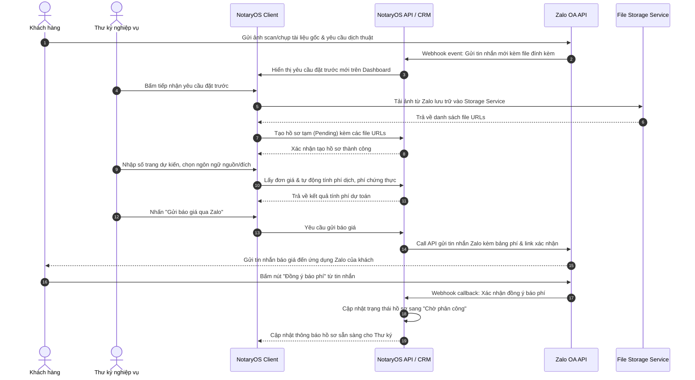
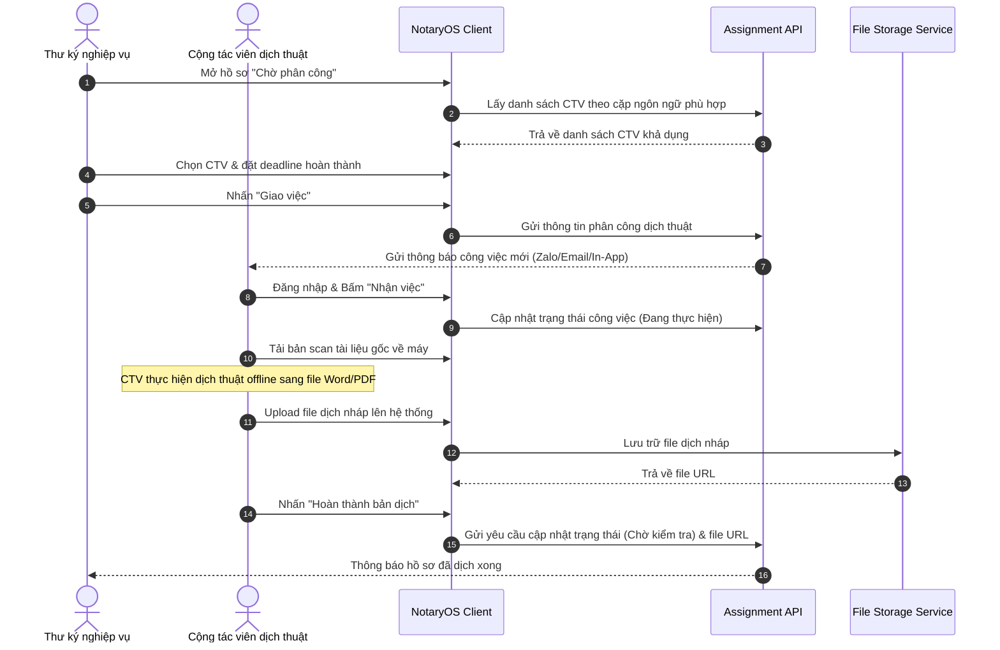
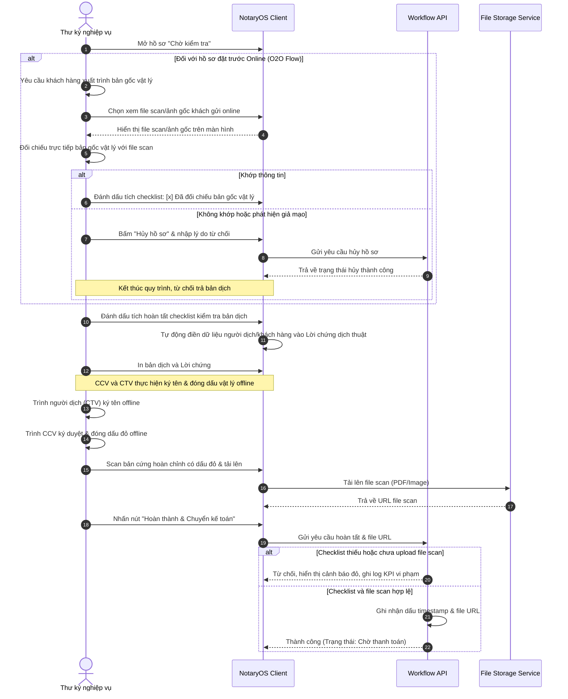
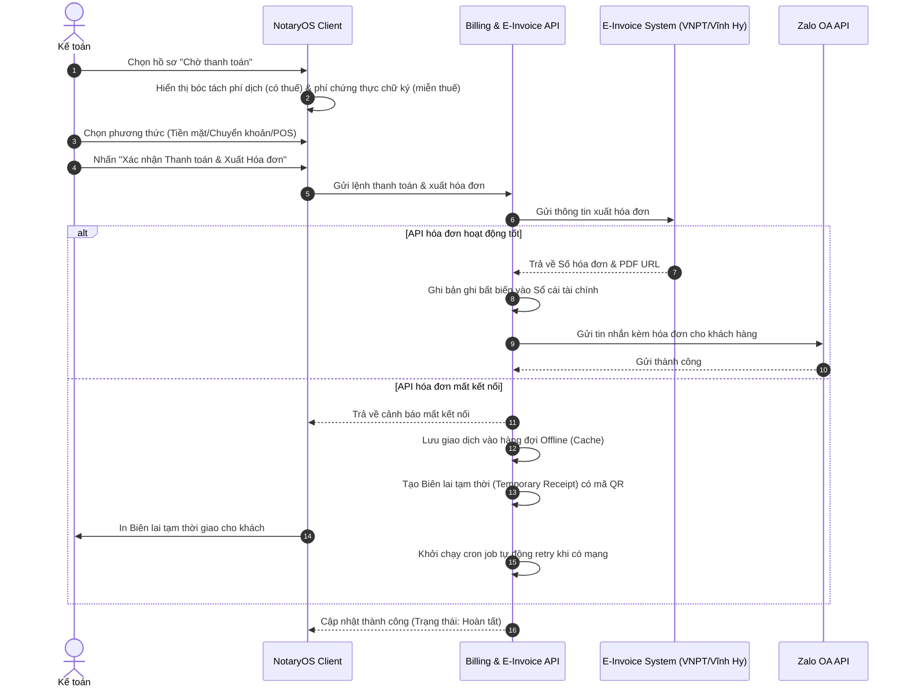
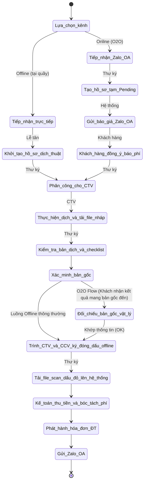

# Software Requirements Specification
## for Phân hệ Nghiệp vụ Dịch Thuật Công Chứng & Chứng Thực Chữ Ký Người Dịch - Dự án ERP VPCC (NotaryOS)

**Version 1.0 approved**  
**Prepared by Vũ Minh Hoàng**  
**Danish Software**  
**17 tháng 06, 2026**  

---

## 1. Giới thiệu (Introduction)

### 1.1 Quy ước tài liệu (Document Conventions)
- Mức độ ưu tiên (Priority): Cao (High), Trung bình (Medium), Thấp (Low).
- Mã yêu cầu: Đánh mã theo định dạng `REQ-[Module]-[ID]` (VD: `REQ-TRN-01`).
- Các biểu đồ luồng và trình tự được thể hiện bằng Mermaid format.

### 1.2 Đối tượng độc giả (Intended Audience)
- **Nhà quản lý/Trưởng VPCC:** Đọc Phần 1 và Phần 2 để nắm bắt mục tiêu và bối cảnh vận hành.
- **Lập trình viên (Developers) & Kiểm thử viên (Testers):** Đọc kỹ Phần 3, Phần 4 và Phần 5 để hiểu rõ đặc tả kỹ thuật, các ràng buộc và logic xử lý.
- **Nhân sự nghiệp vụ (Lễ tân, Thư ký, CTV, CCV, Kế toán):** Đọc Phần 4 để hiểu chi tiết luồng xử lý và tương tác với hệ thống.

### 1.3 Phạm vi sản phẩm (Product Scope)
**NotaryOS** (ERP VPCC) là giải pháp phần mềm lõi (ERP) điều phối toàn bộ luồng vận hành của văn phòng công chứng (VPCC). Nghiệp vụ Dịch thuật Công chứng được thiết kế nhằm số hóa quy trình quản lý cộng tác viên dịch thuật (CTV), quản lý bản dịch nháp, kiểm soát tính chính xác của bản dịch, tự động tính phí dịch thuật dựa trên ngôn ngữ nguồn/đích, và tổ chức chứng thực chữ ký người dịch (chữ ký của CTV). Hệ thống đóng vai trò như một chốt chặn tài chính nghiêm ngặt, tích hợp hóa đơn điện tử và tương tác khách hàng qua Zalo OA.

### 1.4 Từ điển thuật ngữ (Glossary)
| Thuật ngữ | Định nghĩa |
|---|---|
| **VPCC** | Văn phòng Công chứng |
| **CTV** | Cộng tác viên dịch thuật (External Translator) |
| **CCV** | Công chứng viên (Notary Officer) |
| **CCCD** | Căn cước công dân |
| **Zalo OA** | Zalo Official Account - tài khoản chính thức của văn phòng |
| **B2B** | Business-to-Business (Giao dịch liên quan đến khách hàng doanh nghiệp) |
| **Lời chứng dịch** | Phần văn bản chứng thực chữ ký người dịch (translator's signature certification) theo mẫu pháp luật |
| **CRM** | Customer Relationship Management - Hệ thống quản lý quan hệ khách hàng |
| **ERP** | Enterprise Resource Planning - Hệ thống quản lý và hoạch định tài nguyên doanh nghiệp |
| **VAT** | Value Added Tax - Thuế giá trị gia tăng |
| **Audit Log** | Nhật ký lưu vết chi tiết các thao tác của người dùng trên hệ thống |

### 1.5 Tổng quát
Tài liệu này tập trung làm rõ luồng đi của hồ sơ Dịch thuật Công chứng qua 4 giai đoạn tương ứng với 4 Use Case chính: Tiếp nhận phân loại (Lễ tân), Phân công & Dịch thuật (Thư ký & CTV), Kiểm soát luồng & Ký đóng dấu (Thư ký & CCV offline), và Chốt chặn tài chính (Kế toán).

---

## 2. Mô tả tổng quan (Overall Description)

### 2.1 Bối cảnh sản phẩm (Product Perspective)
Hệ thống vận hành trên môi trường Web/Mobile, sử dụng kiến trúc vi dịch vụ (microservices). Quyền hạn trên hệ thống được phân tách nghiêm ngặt dựa trên vai trò (Role-based Access Control). Hệ thống tương tác với các API của Tổng cục Thuế, nhà cung cấp Hóa đơn điện tử (VNPT/Vĩnh Hy) và Zalo OA API.

### 2.2 Chức năng cốt lõi (Product Functions)
- Tiếp nhận thông tin khách hàng, chọn ngôn ngữ nguồn/đích, tự động tính toán biểu phí dịch thuật và phí chứng thực chữ ký người dịch.
- Phân công hồ sơ dịch thuật cho CTV in-house hoặc external dựa trên ngôn ngữ; quản lý tiến độ và tải lên tài liệu nháp.
- Kiểm soát quy trình thông qua checklist động, tự động điền Lời chứng bản dịch, trình ký CCV/CTV offline và quản lý tài liệu scan dấu đỏ.
- Bóc tách doanh thu dịch vụ và phí nhà nước, quản lý thanh toán, phát hành hóa đơn điện tử tự động, gửi cảm ơn qua Zalo OA.

### 2.3 Phân quyền người dùng (User Classes and Characteristics)
* **Lễ tân (Reception Clerk):** Tiếp nhận bản gốc tài liệu trực tiếp, nhập thông tin khách hàng, tính phí dự kiến, và tạo hồ sơ nháp.
* **Thư ký nghiệp vụ (Notary Secretary):** Phân công hồ sơ cho CTV, kiểm tra chất lượng bản dịch, chuẩn bị lời chứng bản dịch, trình CCV và người dịch ký offline, scan tài liệu hoàn tất tải lên hệ thống.
* **Cộng tác viên dịch thuật (CTV / Translator):** Đăng nhập tài khoản dành riêng cho CTV, nhận hồ sơ được phân công, tải tài liệu gốc, thực hiện dịch thuật và tải file dịch nháp (Word/PDF) lên hệ thống.
* **Công chứng viên (Notary Officer):** Ký tên và đóng dấu bản cứng thực tế (offline) xác nhận chữ ký người dịch. CCV không cần thao tác trực tiếp trên phần mềm đối với luồng dịch thuật.
* **Kế toán (Financial Accountant):** Đối soát doanh thu bóc tách (phí dịch, phí chứng thực chữ ký dịch), thu tiền và phát hành hóa đơn điện tử.

### 2.4 Môi trường hoạt động (Operating Environment)
- Ứng dụng Web-based và tối ưu thiết bị di động, yêu cầu kết nối Internet.
- Chạy ổn định trên các trình duyệt hiện đại (Chrome, Safari, Edge, Firefox).

### 2.5 Ràng buộc thiết kế và triển khai (Design and Implementation Constraints)
- Đảm bảo tính bất biến của sổ cái kế toán (Billing Ledger) sau khi đã xác nhận giao dịch.
- CTV chỉ được tải tài liệu gốc B2B sau khi xác nhận cam kết bảo mật (NDA) trực tuyến.
- Trong trường hợp offline, hệ thống chỉ cho phép lưu trữ tạm và in biên lai giấy, tạm dừng luồng phê duyệt và hóa đơn điện tử.

### 2.6 Tài liệu hướng dẫn (User Documentation)
- Hướng dẫn vận hành hệ thống NotaryOS cho Lễ tân, Thư ký, Kế toán và Cộng tác viên dịch thuật.

### 2.7 Giả định và phụ thuộc (Assumptions and Dependencies)
- API của Zalo OA và nhà cung cấp hóa đơn điện tử hoạt động ổn định với thời gian phản hồi thấp.
- Khách hàng doanh nghiệp cung cấp đúng Mã số thuế để tự động truy vấn thông tin định danh pháp nhân.

### 2.8 Sơ đồ Thực thể Dữ liệu Cốt lõi (ERD Entities)
- **CUSTOMER (Khách hàng):** Lưu trữ thông tin định danh (SĐT, Họ tên, CCCD, Email, MST nếu doanh nghiệp).
- **TRANSACTION_FILE (Hồ sơ giao dịch):** Lưu trạng thái dịch thuật, số trang gốc, ngôn ngữ nguồn/đích, ID thư ký phụ trách.
- **TRANSLATION_ASSIGNMENT (Phân công dịch thuật):** Lưu trữ liên kết giữa Hồ sơ giao dịch với ID CTV, mức thù lao trả cho CTV, hạn chót hoàn thành (deadline), và URL tập tin dịch nháp.
- **CHECKLIST_LOG (Nhật ký quy trình):** Lưu trạng thái kiểm tra (Đối khớp bản dịch, Chữ ký CTV vật lý, File scan bản cứng dấu đỏ, Đối chiếu bản gốc vật lý).
- **BILLING_LEDGER (Sổ cái tài chính):** Bản ghi bất biến hạch toán chi tiết Phí dịch thuật (có thuế), Phí chứng thực chữ ký (miễn thuế), Phụ phí khác.

### 2.9 Sơ đồ Use Case Tổng quan nghiệp vụ Dịch thuật

### 2.10 Các trường hợp thực tế (Real World Cases)

#### Case 1: Dịch thuật tài liệu cá nhân thông thường sang tiếng Anh (Phổ biến)
- **Bối cảnh:** Chị A mang Giấy khai sinh bản gốc đến yêu cầu dịch sang tiếng Anh và công chứng 2 bản lấy trong ngày.
- **Luồng xử lý trên hệ thống:**
  * Lễ tân tiếp nhận, nhập SĐT chị A (Hệ thống Auto-fill thông tin cá nhân). Lễ tân chọn Ngôn ngữ nguồn: **Tiếng Việt**, Ngôn ngữ đích: **Tiếng Anh**.
  * Lễ tân chọn loại tài liệu: **Giấy khai sinh** (1 trang gốc). Số bản cần dịch công chứng: 2 bản.
  * Hệ thống tự động áp đơn giá biểu phí: $50.000đ/\text{trang dịch tiếng Anh}$. Phí dịch gốc: $50.000đ$.
  * Phí chứng thực chữ ký người dịch (Nhà nước): $10.000đ/\text{chữ ký/bản} \times 2 \text{ bản} = 20.000đ$.
  * Tổng tính toán hệ thống: $70.000đ$. Lễ tân báo phí trọn gói $70.000đ$ và tích chọn `Khách hàng đồng ý báo phí`.
  * Thư ký phân công việc cho CTV dịch tiếng Anh in-house. CTV dịch xong, tải file dịch nháp (Word) lên NotaryOS.
  * Thư ký tải file nháp về kiểm tra, hệ thống tự động điền Lời chứng bản dịch. Thư ký in ra, trình CTV ký tên trực tiếp và CCV đóng dấu xác nhận chữ ký offline.
  * Thư ký scan bản cứng đã ký đóng dấu, tải lên hệ thống để mở chặn thanh toán. Kế toán thu $70.000đ$ tiền mặt và xuất hóa đơn điện tử tự động.

#### Case 2: Dịch thuật tài liệu doanh nghiệp chuyên ngành phức tạp sang tiếng Đức (B2B)
- **Bối cảnh:** Đại diện Công ty Y mang 1 tài liệu "Báo cáo tài chính" (15 trang) đến yêu cầu dịch sang tiếng Đức và chứng thực chữ ký dịch để gửi đối tác nước ngoài. Yêu cầu xuất hóa đơn doanh nghiệp gửi về email công ty.
- **Luồng xử lý trên hệ thống:**
  * Lễ tân bật toggle `Xuất hóa đơn doanh nghiệp (B2B)`, nhập MST của Công ty Y để tự động điền Tên công ty, Địa chỉ đăng ký.
  * Lễ tân chọn Ngôn ngữ nguồn: **Tiếng Việt**, Ngôn ngữ đích: **Tiếng Đức**. Nhập số trang gốc: 15 trang.
  * Hệ thống tự động áp đơn giá dịch tiếng Đức (ngôn ngữ hiếm): $150.000đ/\text{trang}$. Phí dịch gốc: $15 \times 150.000đ = 2.250.000đ$.
  * Lễ tân thỏa thuận thù lao dịch thuật chuyên ngành phức tạp và nhập "Tổng thực thu" là $2.500.000đ$ (chênh lệch $250.000đ$ là phụ phí thù lao dịch vụ tăng thêm). Hệ thống tự động hạch toán phần chênh lệch này vào mục "Phí dịch vụ khác".
  * Thư ký chỉ định một CTV chuyên dịch tài chính tiếng Đức trong danh sách liên kết. CTV nhận việc, ký cam kết bảo mật (NDA) trên hệ thống trước khi được phép tải bản scan tài liệu gốc.
  * CTV hoàn thành bản dịch, tải file dịch lên hệ thống. Thư ký kiểm tra, in bản dịch kèm lời chứng. CTV đến văn phòng ký tên offline trước mặt Thư ký và CCV đóng dấu xác nhận.
  * Thư ký scan bản cứng có dấu đỏ tải lên hệ thống. Kế toán xác nhận nhận chuyển khoản $2.500.000đ$, bấm phát hành hóa đơn B2B. Hệ thống gọi API xuất hóa đơn điện tử VAT gửi thẳng vào email Công ty Y.

#### Case 3: Dịch thuật công chứng đặt trước Online (O2O)
- **Bối cảnh:** Anh B chụp ảnh bản gốc Bằng tốt nghiệp đại học gửi qua tài khoản Zalo OA của văn phòng yêu cầu dịch sẵn sang tiếng Pháp để tiết kiệm thời gian chờ đợi.
- **Luồng xử lý trên hệ thống:**
  * Thư ký nhận được tin nhắn Zalo OA, lưu file ảnh và tạo một **Hồ sơ nháp (Pending)** trên NotaryOS.
  * Thư ký phân công ngay cho CTV dịch tiếng Pháp dịch trước. CTV tải file ảnh từ hồ sơ nháp, dịch xong và upload file dịch nháp lên hệ thống.
  * Thư ký chuẩn bị sẵn Lời chứng bản dịch in ra chờ sẵn.
  * Chiều cùng ngày, anh B đến văn phòng, cung cấp SĐT. Lễ tân nhập SĐT, hệ thống lấy ra ngay hồ sơ đặt trước. Thư ký đối chiếu bằng gốc vật lý của anh B với file ảnh trên hệ thống. 
  * Xác nhận khớp -> Cho CTV ký bản dịch offline, CCV đóng dấu. Thư ký scan file dấu đỏ tải lên. Kế toán thu tiền và đóng hồ sơ trong vòng 3 phút.

#### Case 4: Dịch thuật công chứng đa ngôn ngữ cho một bộ hồ sơ
- **Bối cảnh:** Chị C mang 1 bộ học bạ cấp 3 (5 trang) yêu cầu dịch sang cả **tiếng Anh** và **tiếng Pháp** để làm hồ sơ du học.
- **Luồng xử lý trên hệ thống:**
  * Lễ tân tạo hồ sơ, chọn Ngôn ngữ nguồn: Tiếng Việt, và chọn nhiều Ngôn ngữ đích: **Tiếng Anh** và **Tiếng Pháp** cùng lúc.
  * Hệ thống tự động tách hồ sơ thầu thành 2 hồ sơ giao dịch con độc lập:
    * Hồ sơ con 1: Dịch Tiếng Anh (5 trang, phí gốc 250.000đ).
    * Hồ sơ con 2: Dịch Tiếng Pháp (5 trang, phí gốc 400.000đ).
  * Hai hồ sơ con được gán cho 2 CTV khác nhau thực hiện dịch độc lập trên hệ thống.
  * Tuy nhiên, hệ thống tự động gom chung dữ liệu tài chính của 2 hồ sơ này dưới 1 mã thanh toán duy nhất có Tổng thực thu là $670.000đ$ để kế toán chỉ cần thực hiện thu tiền và xuất 1 hóa đơn tổng duy nhất cho chị C.

---

## 3. Yêu cầu Giao diện bên ngoài (External Interface Requirements)

### 3.1 Giao diện người dùng (User Interfaces)
* Thiết kế chế độ tối (Light mode) sang trọng, giảm mỏi mắt cho nhân viên làm việc liên tục tại quầy.
* Bảng Dashboard điều phối dịch thuật của Thư ký phải hiển thị danh sách các hồ sơ "Chờ phân công" và "Chờ kiểm tra" trực quan, hỗ trợ lọc theo ngôn ngữ để phân công công việc nhanh gọn.
* CTV có giao diện tối giản trên cả Web và Mobile để nhận việc và upload tập tin dễ dàng.

### 3.2 Giao diện phần cứng (Hardware Interfaces)
* Tương thích với các loại máy in tại văn phòng để in ấn bản dịch, Lời chứng và biên lai tạm thời.
* Kết nối trực tiếp với máy quét (Scanner) để hỗ trợ Thư ký scan tài liệu đã ký đóng dấu vật lý tải lên hệ thống.

### 3.3 Giao diện phần mềm (Software Interfaces)
- **API Tổng cục Thuế:** Sử dụng truy vấn Mã số thuế (MST) tự động để lấy đầy đủ thông tin định danh doanh nghiệp (B2B).
- **API Hóa đơn điện tử (VNPT/Vĩnh Hy):** Gọi API để phát hành hóa đơn tự động và lấy file hóa đơn dạng PDF/XML.
- **Zalo OA API:** Đồng bộ trạng thái, gửi báo giá kèm link phê duyệt cho khách, và gửi tin nhắn cảm ơn đính kèm hóa đơn.

### 3.4 Giao thức truyền thông (Communications Interfaces)
- Sử dụng giao thức HTTPS để truyền tải thông tin an toàn giữa NotaryOS client và server.
- Cơ chế hàng đợi ngoại tuyến (Offline Queue/Cron job) tự động đồng bộ hóa đơn và gửi Zalo OA khi kết nối internet được khôi phục.

---

## 4. Tính năng Hệ thống (System Features)

### 4.1 UC-01: Tiếp Nhận & Tính Phí Dịch Thuật (Translation Reception)

#### 4.1.1 Đặc tả chi tiết
| Mã Use Case | UC-01 |
|---|---|
| **Tên Use Case** | Tiếp Nhận & Tính Phí Dịch Thuật |
| **Tác nhân chính** | Lễ tân (Reception Clerk) |
| **Mô tả** | Tiếp nhận tài liệu gốc từ khách hàng, chọn ngôn ngữ nguồn/đích, nhập số lượng trang gốc, tự động tính phí dịch thuật theo biểu giá và lưu hồ sơ dịch thuật. |
| **Sự kiện kích hoạt** | Lễ tân nhấn nút "Tạo hồ sơ Dịch thuật" trên màn hình Dashboard. |
| **Tiền điều kiện** | Lễ tân đã đăng nhập hệ thống; Khách hàng cung cấp tài liệu gốc. |
| **Hậu điều kiện** | Hồ sơ dịch thuật được tạo thành công trên hệ thống với trạng thái "Chờ phân công". |

##### Luồng sự kiện chính (Thành công):
| Mã yêu cầu | STT | Thực hiện bởi | Hành động |
|---|---|---|---|
| **REQ-TRN-101** | 1 | Lễ tân | Nhập số điện thoại khách hàng vào trường tìm kiếm để Auto-fill hoặc tạo mới profile khách. |
| **REQ-TRN-102** | 2 | Lễ tân | Chọn Ngôn ngữ nguồn (ví dụ: Tiếng Việt) và Ngôn ngữ đích (ví dụ: Tiếng Anh, Tiếng Pháp, Tiếng Đức). |
| **REQ-TRN-103** | 3 | Lễ tân | Nhập số trang gốc của tài liệu và số bản dịch công chứng cần xuất ra. |
| **REQ-TRN-104** | 4 | Hệ thống | Truy vấn bảng biểu phí ngôn ngữ, tự động tính phí dịch gốc: $Phí\_Dịch = Số\_trang \times Đơn\_giá\_ngôn\_ngữ$ và phí chứng thực chữ ký dịch: $10.000đ \times Số\_bản$. |
| **REQ-TRN-105** | 5 | Lễ tân | Nhập tổng số tiền thỏa thuận thực tế với khách vào trường "Tổng thực thu". |
| **REQ-TRN-106** | 6 | Hệ thống | Tự động tính phụ phí chênh lệch (nếu có) và lưu vào mục "Phí dịch vụ khác". |
| **REQ-TRN-107** | 7 | Lễ tân | Xác nhận báo phí với khách hàng và tích chọn checkbox `Khách hàng đồng ý báo phí`. |
| **REQ-TRN-108** | 8 | Lễ tân | Nhấn nút "Lưu và Chuyển xử lý". Hồ sơ được khởi tạo và gửi sang hàng đợi của Thư ký. |

##### Luồng sự kiện thay thế (Ngoại lệ):
* **REQ-TRN-ERR-101 (5a. Tổng thực thu nhỏ hơn tổng phí gốc quy định):** Hệ thống hiển thị cảnh báo đỏ và khóa nút lưu (Tổng thực thu không được thấp hơn Phí dịch + Phí chứng thực nhà nước).
* **REQ-TRN-B2B-101 (7a. Khách hàng yêu cầu hóa đơn doanh nghiệp B2B):** Lễ tân bật toggle B2B và nhập MST doanh nghiệp. Hệ thống tự động gọi API Tổng cục Thuế để lấy tên và địa chỉ công ty đính kèm vào thông tin hóa đơn.
* **REQ-TRN-O2O-101 (8a. Tiếp nhận đặt trước dịch thuật Online - O2O Flow):**
  * 1. Khách hàng gửi ảnh chụp/scan tài liệu gốc và yêu cầu qua kênh Zalo OA của văn phòng.
  * 2. Thư ký nghiệp vụ tiếp nhận yêu cầu từ Dashboard tích hợp Zalo OA, lưu trữ file ảnh và tạo "Hồ sơ tạm (Pending)" trên hệ thống.
  * 3. Thư ký nhập số trang dự kiến, chọn ngôn ngữ nguồn/đích. Hệ thống tự động tính phí dựa trên biểu giá.
  * 4. Thư ký bấm "Gửi báo giá qua Zalo". Hệ thống gửi tin nhắn thông báo kèm link xác nhận phí đến Zalo OA của khách hàng.
  * 5. Khách hàng bấm "Đồng ý báo phí" từ tin nhắn Zalo OA. Trạng thái hồ sơ tự động chuyển sang "Chờ phân công" và Thư ký tiến hành phân công CTV dịch trước (tiết kiệm thời gian chờ đợi).

#### 4.1.2 Sơ đồ Luồng xử lý kỹ thuật (Sequence Diagram)

##### Luồng Offline (Tại quầy)

##### Sơ đồ Luồng kỹ thuật đặt trước Online (O2O Sequence Diagram)

#### 4.1.3 Bảng dữ liệu đầu vào (Input Data Specification)
| STT | Trường dữ liệu | Mô tả | Bắt buộc? | Điều kiện hợp lệ | Ví dụ |
|---|---|---|---|---|---|
| 1 | Số điện thoại | SĐT liên lạc của khách hàng | Có | Chỉ nhập số, độ dài 10 ký tự | 0909123456 |
| 2 | Họ và tên | Tên khách hàng cá nhân | Có | Chuỗi ký tự chữ | Nguyễn Văn A |
| 3 | Ngôn ngữ nguồn | Ngôn ngữ gốc của tài liệu | Có | Dropdown chọn từ danh sách | Tiếng Việt |
| 4 | Ngôn ngữ đích | Ngôn ngữ cần dịch sang | Có | Dropdown chọn từ danh sách | Tiếng Đức |
| 5 | Số trang gốc | Số trang tài liệu gốc | Có | Số nguyên dương > 0 | 15 |
| 6 | Số bản công chứng | Số bản dịch công chứng cần ra | Có | Số nguyên dương > 0 | 2 |
| 7 | Tổng thực thu | Số tiền thực tế thỏa thuận thu | Có | Số tiền $\ge$ Phí Gốc tính toán | 2500000 |
| 8 | Mã số thuế | MST của doanh nghiệp | Chỉ khi B2B=ON | Chuỗi ký tự số (10 hoặc 13 số) | 0314456789 |
| 9 | Zalo UID | ID định danh khách hàng trên Zalo OA | Chỉ khi O2O=ON | Định dạng UID của Zalo | 482910398492019482 |
| 10 | File scan/ảnh gốc | Danh sách URL tập tin scan hoặc ảnh chụp tài liệu gốc | Chỉ khi O2O=ON | Danh sách URL hợp lệ (.png, .jpg, .pdf) | `["https://s.vpcc.vn/doc1.pdf"]` |
| 11 | Trạng thái báo giá Online | Trạng thái duyệt báo giá của khách hàng qua Zalo | Chỉ khi O2O=ON | Thuộc danh mục: PENDING, APPROVED, REJECTED | APPROVED |

---

### 4.2 UC-02: Phân Công & Thực Hiện Dịch Thuật (Assignment & Translation)

#### 4.2.1 Đặc tả chi tiết
| Mã Use Case | UC-02 |
|---|---|
| **Tên Use Case** | Phân Công & Thực Hiện Dịch Thuật |
| **Tác nhân chính** | Thư ký nghiệp vụ (Notary Secretary), Cộng tác viên dịch thuật (CTV / Translator) |
| **Mô tả** | Thư ký lựa chọn và phân công hồ sơ dịch thuật cho CTV phù hợp; CTV nhận việc, dịch thuật tài liệu và tải bản dịch nháp lên hệ thống. |
| **Sự kiện kích hoạt** | Thư ký mở hồ sơ "Chờ phân công" và chọn CTV. |
| **Tiền điều kiện** | Hồ sơ dịch thuật đã được tạo thành công ở UC-01. |
| **Hậu điều kiện** | Bản dịch nháp (Word/PDF) được tải lên hệ thống; hồ sơ chuyển sang trạng thái "Chờ kiểm tra". |

##### Luồng sự kiện chính (Thành công):
| Mã yêu cầu | STT | Thực hiện bởi | Hành động |
|---|---|---|---|
| **REQ-TRN-201** | 1 | Thư ký | Mở hồ sơ dịch thuật ở trạng thái "Chờ phân công". |
| **REQ-TRN-202** | 2 | Thư ký | Chọn Cộng tác viên dịch thuật (CTV) từ danh sách gợi ý của hệ thống (lọc theo cặp ngôn ngữ) và đặt thời hạn hoàn thành (deadline). |
| **REQ-TRN-203** | 3 | Thư ký | Nhấn nút "Giao việc". |
| **REQ-TRN-204** | 4 | Hệ thống | Gửi thông báo công việc mới đến tài khoản của CTV trên hệ thống. |
| **REQ-TRN-205** | 5 | CTV | Đăng nhập hệ thống, nhấn "Nhận việc" và tải bản scan tài liệu gốc về máy. |
| **REQ-TRN-206** | 6 | CTV | Thực hiện dịch thuật offline và lưu dưới dạng tập tin (.docx hoặc .pdf). |
| **REQ-TRN-207** | 7 | CTV | Tải tập tin dịch nháp lên hệ thống NotaryOS và nhấn "Hoàn thành bản dịch". |
| **REQ-TRN-208** | 8 | Hệ thống | Lưu file dịch nháp vào hồ sơ giao dịch, chuyển trạng thái hồ sơ sang "Chờ kiểm tra" và gửi thông báo cho Thư ký phụ trách. |

##### Luồng sự kiện thay thế (Ngoại lệ):
* **REQ-TRN-ERR-201 (2a. Không tìm thấy CTV phù hợp trong danh mục):** Thư ký có thể chọn hình thức "Dịch In-house" và tự phân công hồ sơ cho chính tài khoản của Thư ký đó để thực hiện dịch trực tiếp.
* **REQ-TRN-ERR-202 (5a. CTV không phản hồi/Từ chối nhận việc):** Hệ thống cho phép Thư ký thu hồi lệnh phân công sau 30 phút không phản hồi và thực hiện tái phân công hồ sơ cho CTV khác.

#### 4.2.2 Sơ đồ Luồng xử lý kỹ thuật (Sequence Diagram)

#### 4.2.3 Bảng dữ liệu đầu vào (Input Data Specification)
| STT | Trường dữ liệu | Mô tả | Bắt buộc? | Điều kiện hợp lệ | Ví dụ |
|---|---|---|---|---|---|
| 1 | ID Cộng tác viên | Mã định danh CTV được phân công | Có | CTV phải ở trạng thái "Hoạt động" | CTV-2026-009 |
| 2 | Thời hạn hoàn thành | Hạn chót nộp bản dịch (Deadline) | Có | Thời gian phải sau thời điểm hiện tại | 18/06/2026 17:00 |
| 3 | File dịch nháp | Tập tin chứa bản dịch của tài liệu | Có | Định dạng PDF hoặc DOCX; dung lượng < 25MB | ban_dich_khai_sinh.docx |

---

### 4.3 UC-03: Kiểm Soát Luồng & Chứng Thực Chữ Ký Người Dịch (Review & Certification)

#### 4.3.1 Đặc tả chi tiết
| Mã Use Case | UC-03 |
|---|---|
| **Tên Use Case** | Kiểm Soát Luồng & Chứng Thực Chữ Ký Người Dịch |
| **Tác nhân chính** | Thư ký nghiệp vụ (Notary Secretary) |
| **Mô tả** | Thư ký kiểm tra bản dịch nháp của CTV, in bản dịch kèm Lời chứng tự động điền, lấy chữ ký người dịch (CTV) và con dấu CCV offline, scan bản cứng dấu đỏ tải lên hệ thống để mở chặn thanh toán. |
| **Sự kiện kích hoạt** | Thư ký mở hồ sơ ở trạng thái "Chờ kiểm tra" trên Dashboard. |
| **Tiền điều kiện** | CTV đã upload bản dịch nháp lên hệ thống thành công (UC-02). |
| **Hậu điều kiện** | Bản scan dấu đỏ được tải lên hệ thống thành công; hồ sơ tự động chuyển sang trạng thái "Chờ thanh toán". |

##### Luồng sự kiện chính (Thành công):
| Mã yêu cầu | STT | Thực hiện bởi | Hành động |
|---|---|---|---|
| **REQ-TRN-301** | 1 | Thư ký | Mở hồ sơ dịch thuật, kiểm tra đối khớp nội dung bản dịch nháp với bản gốc. |
| **REQ-TRN-302** | 2 | Thư ký | Tích chọn checklist xác nhận: `[x] Bản dịch chính xác`, `[x] Đúng định dạng mẫu`. |
| **REQ-TRN-303** | 3 | Hệ thống | Tự động điền (Auto-fill) thông tin người dịch (Họ tên, bằng cấp ngôn ngữ của CTV), thông tin khách hàng vào biểu mẫu **Lời chứng bản dịch** tương ứng. |
| **REQ-TRN-304** | 4 | Thư ký | In bản dịch kèm Lời chứng ra giấy bản cứng. |
| **REQ-TRN-305** | 5 | Thư ký | Trình bản cứng cho CTV ký tên trực tiếp lên Lời chứng bản dịch (offline). |
| **REQ-TRN-306** | 6 | Thư ký | Trình bản cứng đã có chữ ký người dịch cho Công chứng viên (CCV) ký duyệt đóng dấu xác nhận chữ ký (offline). |
| **REQ-TRN-307** | 7 | Thư ký | Nhận lại bản cứng hoàn chỉnh có dấu đỏ, tiến hành chụp/scan và tải file scan lên hệ thống. |
| **REQ-TRN-308** | 8 | Thư ký | Nhấn nút "Hoàn thành & Chuyển kế toán". Hệ thống ghi nhận timestamp và tự động chuyển hồ sơ sang trạng thái "Chờ thanh toán" của Kế toán. |

##### Luồng sự kiện thay thế (Ngoại lệ):
* **REQ-TRN-ERR-301 (1a. Phát hiện bản dịch bị sai sót nội dung):** Thư ký nhấn nút "Yêu cầu dịch lại", nhập ghi chú lỗi sai. Hệ thống tự động chuyển hồ sơ về trạng thái "Đang thực hiện" của CTV đó và gửi thông báo yêu cầu chỉnh sửa gấp cho CTV.
* **REQ-TRN-O2O-301 (1b. Đối với hồ sơ Đặt trước Online - O2O Flow):**
  * 1. Khi khách hàng đến nhận kết quả dịch, Lễ tân/Thư ký yêu cầu khách hàng xuất trình bản gốc vật lý.
  * 2. Thư ký thực hiện đối chiếu bản gốc vật lý với file ảnh chụp/scan khách hàng đã gửi online lúc đặt trước.
  * 3. *Trường hợp khớp:* Thư ký tích chọn checklist `[x] Đã đối chiếu bản gốc vật lý` và tiếp tục luồng in Lời chứng trình người dịch và CCV ký đóng dấu offline.
  * 4. *Trường hợp không khớp hoặc phát hiện giả mạo:* Thư ký nhấn nút "Hủy hồ sơ" hoặc "Yêu cầu kiểm tra lại", ghi nhận lý do và từ chối cung cấp bản dịch chứng thực.
* **REQ-TRN-ERR-302 (8a. Chưa hoàn thành checklist hoặc thiếu file scan dấu đỏ):** Hệ thống chặn không cho phép nhấn nút Hoàn thành, hiển thị cảnh báo đỏ và ghi nhận lỗi vi phạm quy trình vào báo cáo hiệu suất (Workflow KPI) của Thư ký.

#### 4.3.2 Sơ đồ Luồng xử lý kỹ thuật (Sequence Diagram)

#### 4.3.3 Bảng dữ liệu đầu vào (Input Data Specification)
| STT | Trường dữ liệu | Mô tả | Bắt buộc? | Điều kiện hợp lệ | Ví dụ |
|---|---|---|---|---|---|
| 1 | Checklist Bản dịch | Xác nhận bản dịch chính xác | Có | Giá trị Boolean (True/False) | True |
| 2 | Checklist Định dạng | Xác nhận bản in đúng định dạng | Có | Giá trị Boolean (True/False) | True |
| 3 | File scan bản cứng | File scan tài liệu hoàn chỉnh có dấu đỏ | Có | Định dạng PDF, PNG, JPG; dung lượng < 25MB | scan_dich_thuat_hoan_thanh.pdf |

---

### 4.4 UC-04: Chốt Chặn Kế Toán & Phát Hành Hóa Đơn Tự Động (Accounting Gateway)

#### 4.4.1 Đặc tả chi tiết
| Mã Use Case | UC-04 |
|---|---|
| **Tên Use Case** | Chốt Chặn Kế Toán & Phát Hành Hóa Đơn Tự Động |
| **Tác nhân chính** | Kế toán (Financial Accountant) |
| **Mô tả** | Bóc tách dòng tiền doanh thu dịch vụ dịch thuật và lệ phí chứng thực chữ ký dịch của nhà nước, xác nhận thanh toán của khách hàng, gọi API xuất hóa đơn điện tử tự động và gửi Zalo OA cảm ơn. |
| **Sự kiện kích hoạt** | Kế toán chọn hồ sơ từ màn hình danh sách "Chờ thanh toán & Xuất hóa đơn". |
| **Tiền điều kiện** | Hồ sơ đã được Thư ký hoàn thành checklist kiểm soát và tải lên bản scan có dấu đỏ thành công (UC-03). |
| **Hậu điều kiện** | Dữ liệu tài chính được lưu bất biến vào sổ cái; hóa đơn điện tử được phát hành; Zalo OA gửi thành công. |

##### Luồng sự kiện chính (Thành công):
| Mã yêu cầu | STT | Thực hiện bởi | Hành động |
|---|---|---|---|
| **REQ-TRN-401** | 1 | Kế toán | Xem thông tin bóc tách chi phí tự động trên màn hình thanh toán. |
| **REQ-TRN-402** | 2 | Hệ thống | Tách biệt các mục doanh thu trên hóa đơn: Phí dịch thuật (doanh nghiệp thu, tính thuế VAT), Phí chứng thực chữ ký người dịch (Lệ phí nhà nước, miễn thuế). |
| **REQ-TRN-403** | 3 | Kế toán | Chọn phương thức thanh toán của khách hàng: Tiền mặt, Chuyển khoản, hoặc Quẹt thẻ POS. |
| **REQ-TRN-404** | 4 | Kế toán | Nhấn nút "Xác nhận Thanh toán & Xuất Hóa đơn". |
| **REQ-TRN-405** | 5 | Hệ thống | Gọi API tự động đồng bộ sang nhà cung cấp hóa đơn điện tử (VNPT/Vĩnh Hy) và nhận về Số hóa đơn chính thức cùng file hóa đơn PDF. |
| **REQ-TRN-406** | 6 | Hệ thống | Ghi bản ghi tài chính bất biến vào sổ cái hệ thống (không cho phép sửa đổi hay xóa). |
| **REQ-TRN-407** | 7 | Hệ thống | Kích hoạt gọi API Zalo OA, tự động gửi tin nhắn kèm link tải hóa đơn VAT và lời cảm ơn đến số điện thoại của khách hàng. |

##### Luồng sự kiện thay thế (Ngoại lệ):
* **REQ-TRN-ERR-401 (5a. Mất kết nối API nhà cung cấp hóa đơn điện tử):**
  * 1. Hệ thống hiển thị cảnh báo "Mất kết nối với nhà cung cấp hóa đơn điện tử".
  * 2. Hệ thống lưu giao dịch thanh toán vào hàng đợi xử lý ngầm (Offline Queue).
  * 3. Hệ thống tạo và cho phép kế toán in một Biên lai tạm thời (Temporary Receipt) có chứa mã QR tra cứu tạm thời cho khách.
  * 4. Khi kết nối Internet / API khôi phục, tiến trình chạy ngầm (cron job) tự động thực hiện lại lệnh gọi (retry) để xuất hóa đơn điện tử và gửi Zalo OA cho khách hàng.
* **REQ-TRN-ERR-402 (7a. Khách hàng không đăng ký Zalo):** Hệ thống tự động phát hiện gửi tin nhắn Zalo thất bại và thực hiện fallback tự động chuyển sang gửi tin nhắn SMS truyền thống.

#### 4.4.2 Sơ đồ Luồng xử lý kỹ thuật (Sequence Diagram)

#### 4.4.3 Bảng dữ liệu đầu vào (Input Data Specification)
| STT | Trường dữ liệu | Mô tả | Bắt buộc? | Điều kiện hợp lệ | Ví dụ |
|---|---|---|---|---|---|
| 1 | Phương thức thanh toán | Lựa chọn cách thức thanh toán | Có | Phải thuộc danh mục (Cash, Bank Transfer, POS) | Bank Transfer |
| 2 | Xác nhận thanh toán | Nút bấm xác thực đã nhận đủ tiền | Có | Giá trị Boolean khi nhấn xác nhận | True |
| 3 | API E-Invoice Response | Chuỗi dữ liệu trả về từ API hóa đơn | Có (tự động) | Phải chứa Số hóa đơn hợp lệ từ VNPT/Vĩnh Hy | VNPT-2026-00918 |

---

## 5. Các Yêu cầu Phi chức năng khác (Other Nonfunctional Requirements)

### 5.1 Yêu cầu Hiệu năng (Performance Requirements)
- Thời gian tìm kiếm khách hàng bằng số điện thoại/CCCD phải < 1 giây.
- Thời gian tra cứu danh sách hồ sơ dịch thuật và phân công phải < 2 giây.

### 5.2 Yêu cầu An toàn (Safety Requirements)
- Không cho phép xóa vĩnh viễn các hồ sơ ở trạng thái COMPLETED hoặc ARCHIVED.
- Hỗ trợ lưu trữ bản sao dự phòng (Backup) cơ sở dữ liệu tự động định kỳ 24 giờ.

### 5.3 Yêu cầu Bảo mật (Security Requirements)
- Tài liệu gốc và dịch nháp của các doanh nghiệp (B2B) chỉ được phép hiển thị/tải xuống cho CTV được phân công sau khi đã bấm chấp nhận cam kết bảo mật (NDA) trực tuyến.
- Nhật ký lưu vết (Audit Log) ghi nhận đầy đủ: người tiếp nhận, người phân công, CTV nhận việc, người kiểm soát checklist, người scan dấu đỏ và kế toán thực hiện thu tiền/xuất hóa đơn kèm timestamp tương ứng.
- Đảm bảo tính bất biến của Sổ cái tài chính (Billing Ledger) để ngăn chặn sửa đổi trái phép các bản ghi thanh toán trực tiếp trong cơ sở dữ liệu.

### 5.4 Thuộc tính Chất lượng Phần mềm (Software Quality Attributes)
- **Availability (Tính khả dụng):** Đảm bảo duy trì thời gian hoạt động trực tuyến (Uptime) tối thiểu 99%.
- **Usability (Khả năng sử dụng):** Giao diện CTV tối giản giúp CTV bên ngoài làm quen và nhận việc/nộp bài ngay mà không cần đào tạo.

### 5.5 Quy tắc Nghiệp vụ (Business Rules)
- **Bắt buộc Báo phí trước:** Phải có tích chọn `Khách hàng đồng ý báo phí` ở khâu tiếp nhận (UC-01) thì hồ sơ mới hợp lệ để phân công CTV xử lý.
- **Tính bất biến của sổ cái:** Giao dịch thanh toán sau khi lưu vào Billing Ledger không được phép sửa/xóa trực tiếp.
- **Ràng buộc an toàn O2O:** Hồ sơ dịch thuật đặt trước Online (O2O) bắt buộc phải qua bước đối chiếu và xác nhận khớp bản gốc vật lý tại quầy (check checklist đối khớp) mới được in Lời chứng trình CTV và CCV ký đóng dấu.

---

## 6. Các yêu cầu khác (Other Requirements)
- [Cần xác nhận] Tuân thủ quy định về xử lý dữ liệu cá nhân (CCCD, Họ tên, SĐT) của khách hàng theo Nghị định 13/2023/NĐ-CP của Chính phủ.

---

## Phụ lục A: Sơ đồ Luồng hoạt động Nghiệp vụ (Activity Diagram)

---

## Phụ lục B: Danh sách các mục cần làm rõ (To Be Determined List - TBD)
- [TBD] Xin cấp tài khoản và thông tin cấu hình Zalo OA của Văn phòng Công chứng.
- [TBD] Nhận tài liệu và cấu hình API tích hợp hóa đơn điện tử (VNPT/Vĩnh Hy).
