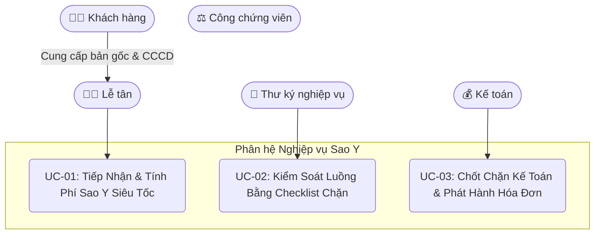
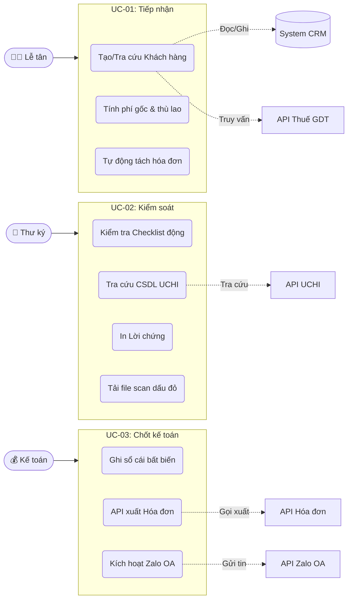
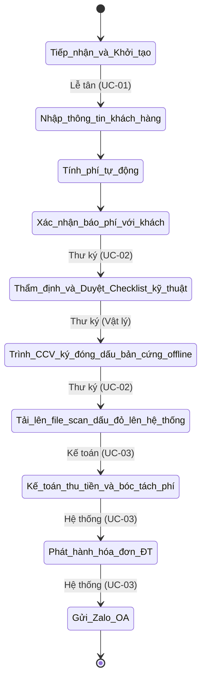
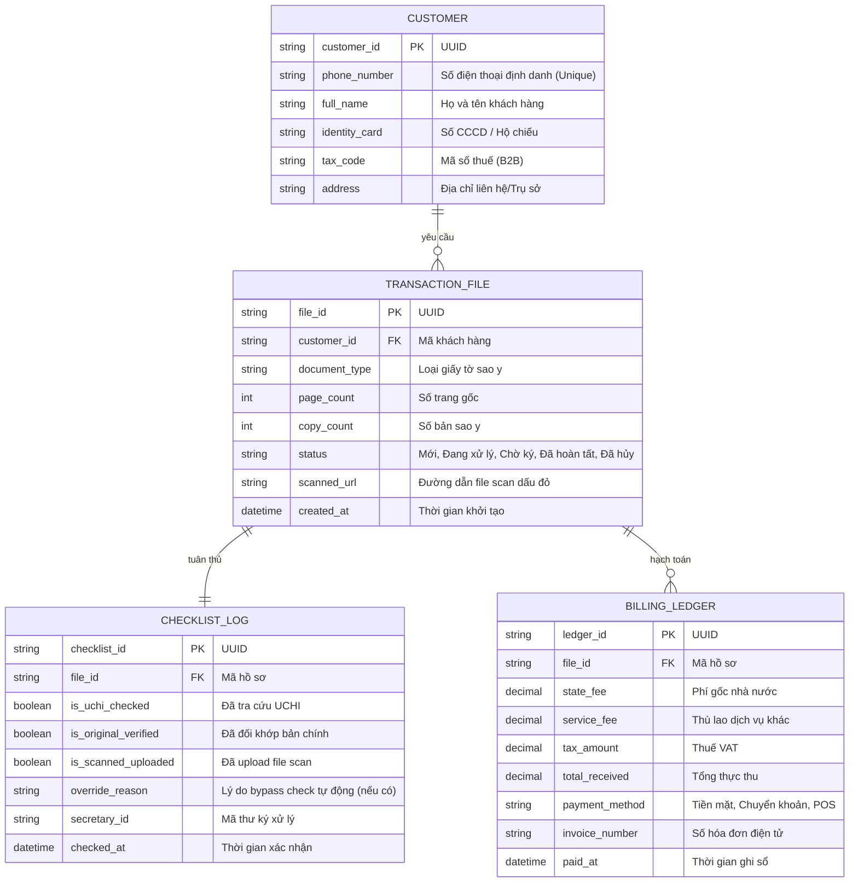

# Tài liệu Đặc tả Yêu cầu Phần mềm (Software Requirements Specification - SRS)
## Phân hệ Nghiệp vụ Sao Y - Dự án ERP VPCC (NotaryOS)

**Phiên bản:** 1.0  
**Đơn vị phát triển:** Danish Software  
**Người soạn thảo:** Vũ Minh Hoàng  
**Ngày tạo:** 17 tháng 06, 2026  

---

## Mục lục
- **[Chương 1. Giới thiệu (Introduction)](#1-giới-thiệu-introduction)**
  - [1.1 Mục đích (Purpose)](#11-mục-đích-purpose)
  - [1.2 Phạm vi (Scope)](#12-phạm-vi-scope)
  - [1.3 Từ điển thuật ngữ (Glossary)](#13-từ-điển-thuật-ngữ-glossary)
  - [1.4 Tài liệu tham khảo (References)](#14-tài-liệu-tham-khảo-references)
  - [1.5 Tổng quát (Overview)](#15-tổng-quát-overview)
- **[Chương 2. Các yêu cầu chức năng (Functional Requirements)](#2-các-yêu-cầu-chức-năng-functional-requirements)**
  - [2.1 Các tác nhân (Actors)](#21-các-tác-nhân-actors)
  - [2.2 Các chức năng của hệ thống (System Functions)](#22-các-chức-năng-của-hệ-thống-system-functions)
  - [2.3 Biểu đồ use case tổng quan (Overall Use Case Diagram)](#23-biểu-do-use-case-tổng-quan-overall-use-case-diagram)
  - [2.4 Biểu đồ use case phân rã (Decomposed Use Case Diagrams)](#24-biểu-do-use-case-phân-rã-decomposed-use-case-diagrams)
  - [2.5 Quy trình nghiệp vụ (Business Processes)](#25-quy-trình-nghiệp-vụ-business-processes)
    - [2.5.1 Sơ đồ luồng hoạt động nghiệp vụ (Activity Diagram)](#251-sơ-đồ-luồng-hoạt-động-nghiệp-vụ-activity-diagram)
    - [2.5.2 Kịch bản nghiệp vụ thực tế (Real World Cases)](#252-kịch-bản-nghiệp-vụ-thực-tế-real-world-cases)
  - [2.6 Đặc tả các usecase (Use Case Specifications)](#26-đặc-tả-các-usecase-use-case-specifications)
    - [2.6.1 UC-01: Tiếp Nhận & Tính Phí Sao Y Siêu Tốc](#261-uc-01-tiếp-nhận--tính-phí-sao-y-siêu-tốc)
    - [2.6.2 UC-02: Kiểm Soát Luồng Bằng Checklist Chặn](#262-uc-02-kiểm-soát-luồng-bằng-checklist-chặn)
    - [2.6.3 UC-03: Chốt Chặn Kế Toán & Phát Hành Hóa Đơn Tự Động](#263-uc-03-chốt-chặn-kế-toán--phát-hành-hóa-đơn-tự-động)
- **[Chương 3. Các yêu cầu phi chức năng (Non-functional Requirements)](#chương-3-các-yêu-cầu-phi-chức-năng-non-functional-requirements)**
  - [3.1 Giao diện người dùng (User Interfaces)](#31-giao-diện-người-dùng-user-interfaces)
  - [3.2 Tính bảo mật (Security & Safety)](#32-tính-bảo-mật-security--safety)
  - [3.3 Ràng buộc (Constraints & Business Rules)](#33-ràng-buộc-constraints--business-rules)
- **[Phụ lục A: Sơ đồ Thực thể Dữ liệu Cốt lõi (ERD Analysis Model)](#phụ-lục-a-sơ-đồ-thực-thể-dữ-liệu-cốt-lõi-erd-analysis-model)**
- **[Phụ lục B: Danh sách các mục cần làm rõ (To Be Determined List - TBD)](#phụ-lục-b-danh-sách-các-mục-cần-làm-rõ-to-be-determined-list---tbd)**

---

## 1. Giới thiệu (Introduction)

### 1.1 Mục đích (Purpose)
Tài liệu Đặc tả Yêu cầu Phần mềm (SRS) này xác định chi tiết các yêu cầu chức năng và phi chức năng cho **Phân hệ Nghiệp vụ Sao y** thuộc dự án **ERP Văn phòng Công chứng (NotaryOS)**. Tài liệu đóng vai trò là cơ sở cam kết giữa đội ngũ phát triển (Danish Software) và Ban quản lý Văn phòng Công chứng trong việc thiết kế, cài đặt và kiểm thử phân hệ này.

### 1.2 Phạm vi (Scope)
NotaryOS là giải pháp điều hành số tổng thể cho Văn phòng công chứng (VPCC). Phân hệ Nghiệp vụ Sao y được xây dựng nhằm mục tiêu:
- Tối ưu hóa tối đa tốc độ xử lý nghiệp vụ tại quầy tiếp nhận (mô hình "Sao y siêu tốc").
- Thiết lập quy trình phối hợp khép kín giữa các vai trò: Lễ tân, Thư ký nghiệp vụ, và Kế toán.
- Tích hợp chốt chặn an toàn nghiệp vụ thông qua tra cứu cơ sở dữ liệu ngăn chặn (UCHI) và danh sách kiểm tra động (Checklist).
- Tích hợp chốt chặn tài chính nhằm tự động hóa biểu phí lệ phí, kết nối API hóa đơn điện tử (VNPT/Vĩnh Hy) và tự động phân tách hóa đơn khi vượt mức trần quy định pháp luật.
- Tự động hóa chăm sóc khách hàng và gửi thông báo nhận kết quả qua Zalo OA.

### 1.3 Từ điển thuật ngữ (Glossary)
| Thuật ngữ | Định nghĩa |
| :--- | :--- |
| **VPCC** | Văn phòng Công chứng |
| **CCV** | Công chứng viên |
| **CCCD** | Căn cước công dân |
| **UCHI** | Hệ thống thông tin lưu trữ dữ liệu công chứng/ngăn chặn tài sản của Sở Tư pháp |
| **Zalo OA** | Zalo Official Account - tài khoản chính thức của văn phòng trên nền tảng Zalo |
| **B2B** | Business-to-Business (Giao dịch liên quan đến khách hàng doanh nghiệp) |
| **CRM** | Customer Relationship Management - Hệ thống quản lý quan hệ khách hàng |
| **ERP** | Enterprise Resource Planning - Hệ thống quản lý và hoạch định tài nguyên doanh nghiệp |
| **VAT** | Value Added Tax - Thuế giá trị gia tăng |
| **Audit Log** | Nhật ký lưu vết chi tiết các thao tác của người dùng trên hệ thống |

### 1.4 Tài liệu tham khảo (References)
- *IEEE Recommended Practice for Software Requirements Specifications,* IEEE Std 830-1998.
- Tài liệu PRD: *Tổng quan Hệ thống CRM cho Văn phòng Công chứng* (`he_thong_cong_chung_crm_tong_quan.md`).
- Quyết định và biểu phí chứng thực bản sao từ bản chính theo Thông tư số 226/2016/TT-BTC.
- Nghị định Bảo vệ Dữ liệu Cá nhân (Nghị định 13/2023/NĐ-CP).

### 1.5 Tổng quát (Overview)
Tài liệu được cấu trúc thành 3 phần chính theo chuẩn chuẩn hóa:
- **Chương 1 (Giới thiệu):** Trình bày mục đích, phạm vi, thuật ngữ và tài liệu tham khảo.
- **Chương 2 (Các yêu cầu chức năng):** Xác định các tác nhân, danh sách chức năng hệ thống, sơ đồ use case tổng quan, quy trình nghiệp vụ (Activity Diagram, kịch bản thực tế) và đặc tả chi tiết từng Use Case nghiệp vụ (UC-01, UC-02, UC-03).
- **Chương 3 (Các yêu cầu phi chức năng):** Chi tiết các yêu cầu về giao diện người dùng, tích hợp phần cứng/phần mềm bên ngoài, yêu cầu bảo mật, hiệu năng và các ràng buộc nghiệp vụ.
- **Phần Phụ lục:** Các mô hình phân tích bổ sung (ERD) và danh sách các hạng mục chờ xác định (TBD).

---

## 2. Các yêu cầu chức năng (Functional Requirements)

### 2.1 Các tác nhân (Actors)
- **Lễ tân (Receptionist - Actor):** Người tiếp nhận hồ sơ gốc của khách hàng tại quầy, thực hiện đăng ký/tra cứu thông tin khách hàng, nhập các thông số đầu vào của giấy tờ cần sao y, báo phí dịch vụ và bàn giao hồ sơ giấy cho Thư ký nghiệp vụ.
- **Thư ký nghiệp vụ (Secretary - Actor):** Người thực hiện photocopy giấy tờ, đối chiếu bản chính, thực hiện kiểm tra checklist động trên phần mềm (bao gồm tra cứu CSDL ngăn chặn UCHI), soạn thảo/in Lời chứng và chuyển CCV ký vật lý, sau đó quét bản cứng đã đóng dấu đỏ tải lên hệ thống.
- **Kế toán (Accountant - Actor):** Người kiểm soát tài chính, chọn hình thức thanh toán (tiền mặt/chuyển khoản/POS), ghi nhận thực thu của khách hàng, kích hoạt lệnh xuất hóa đơn điện tử tự động.
- **Công chứng viên (Notary Officer):** Người chịu trách nhiệm phê duyệt tối cao bản cứng (ký tên, đóng dấu offline). Vai trò này hoạt động vật lý offline và không trực tiếp tương tác phần mềm đối với phân hệ Sao y.

### 2.2 Các chức năng của hệ thống (System Functions)
- **Quản lý & Định danh Khách hàng (CRM Integration):** Tự động truy vấn thông tin khách hàng cũ qua SĐT hoặc truy vấn thông tin doanh nghiệp qua API Tổng cục Thuế bằng MST.
- **Tính toán biểu phí tự động:** Áp dụng công thức tính phí gốc theo trang/bản của Nhà nước và tách biệt khoản thù lao dịch vụ tăng thêm.
- **Kiểm soát quy trình qua Checklist động:** Áp đặt các danh sách checklist nghiệp vụ bắt buộc tùy thuộc vào loại giấy tờ sao y (CCCD, Sổ đỏ, Bằng cấp, Giấy phép kinh doanh).
- **Tra cứu ngăn chặn (UCHI Integration):** Tích hợp kiểm tra tình trạng pháp lý của tài sản rủi ro cao (Sổ đỏ).
- **Trộn dữ liệu và in ấn:** Tự động điền dữ liệu (auto-fill) vào mẫu Lời chứng sao y để in ấn.
- **Quản lý Tài chính & Tách hóa đơn:** Tự động tách nhỏ giao dịch con để đảm bảo đơn giá xuất hóa đơn tuân thủ hạn mức trần pháp luật ($\le 200.000đ$).
- **Đồng bộ Hóa đơn điện tử:** Đồng bộ tự động dữ liệu sang API hóa đơn của bên thứ ba (VNPT/Vĩnh Hy).
- **Thông báo đa kênh:** Kích hoạt gửi tin nhắn chăm sóc khách hàng và link hóa đơn qua Zalo OA (hoặc SMS dự phòng).

### 2.3 Biểu đồ use case tổng quan (Overall Use Case Diagram)

### 2.4 Biểu đồ use case phân rã (Decomposed Use Case Diagrams)
Phân hệ Sao y được thiết kế như một module xử lý tuần tự (Pipeline). Do đó, biểu đồ phân rã chi tiết thể hiện các use case thành phần tương tác trực tiếp với các phân hệ ngoại vi (CRM, API Thuế, API UCHI, API Hóa đơn, API Zalo OA) được mô tả chi tiết dưới đây:

### 2.5 Quy trình nghiệp vụ (Business Processes)

#### 2.5.1 Sơ đồ luồng hoạt động nghiệp vụ (Activity Diagram)
Sơ đồ dưới đây mô tả hành trình nghiệp vụ từ lúc tiếp nhận đến khi hoàn tất và trả hồ sơ cho khách hàng:

#### 2.5.2 Kịch bản nghiệp vụ thực tế (Real World Cases)

##### Case 1: Sao y CCCD / Giấy tờ tùy thân của cá nhân tại quầy (Siêu tốc)
- **Bối cảnh:** Anh A đến văn phòng yêu cầu sao y 3 bản CCCD lấy ngay.
- **Hành vi thực tế:** Anh A đưa bản gốc CCCD. Lễ tân quét nhanh SĐT của anh A.
- **Luồng xử lý trên hệ thống:**
  - Lễ tân nhập SĐT -> Hệ thống tìm thấy thông tin anh A và tự động điền (Auto-fill) Họ tên, CCCD, Địa chỉ.
  - Lễ tân chọn loại giấy tờ: **CCCD (Chip-based)**, hệ thống ghi nhận số trang gốc mặc định là 2 (tương ứng với 2 mặt trước và sau của thẻ). Số bản sao y mặc định ban đầu là 1, lễ tân điều chỉnh lại thành 3 bản theo yêu cầu của khách.
  - Lễ tân điền số bản cần sao y: 3 bản.
  - Hệ thống tính Phí Gốc nhà nước: $2 \text{ trang} \times 3 \text{ bản} \times 2.000đ = 12.000đ$.
  - Lễ tân báo phí trọn gói dịch vụ cho khách là $20.000đ$ và nhập số tiền này vào ô "Tổng thực thu".
  - Hệ thống tự động hạch toán phần chênh lệch $8.000đ$ vào mục "Thù lao dịch vụ khác" (phí photo, bìa hồ sơ).
  - Lễ tân tích chọn `Khách hàng đồng ý báo phí` và nhấn "Lưu & Chuyển xử lý".
  - Thư ký nhận tài liệu, photo bản sao, thực hiện đối khớp ảnh chân dung, kiểm tra hạn dùng CCCD và khớp mặt trước/sau. Thư ký in lời chứng tự động, trình CCV ký đóng dấu bản cứng offline.
  - Thư ký scan bản cứng đã ký đóng dấu tải lên hệ thống. Hệ thống tự động chuyển hồ sơ sang trạng thái Chờ thanh toán.
  - Kế toán thu tiền mặt $20.000đ$, bấm xuất hóa đơn. Hệ thống gọi API VNPT xuất hóa đơn điện tử tự động gửi Zalo OA cho anh A.

##### Case 2: Sao y Sổ đỏ / Giấy tờ sở hữu tài sản có kiểm tra ngăn chặn (UCHI)
- **Bối cảnh:** Chị B mang bản gốc Sổ đỏ đến sao y 2 bản để làm hồ sơ vay vốn thế chấp ngân hàng.
- **Hành vi thực tế:** Tài sản liên quan đến đất đai có rủi ro giả mạo và ngăn chặn giao dịch cao.
- **Luồng xử lý trên hệ thống:**
  - Lễ tân tiếp nhận, nhập SĐT chị B, chọn loại giấy tờ: **Sổ đỏ / Giấy chứng nhận quyền sử dụng đất** (4 trang, 2 bản).
  - Phí Gốc: $4 \text{ trang} \times 2 \text{ bản} \times 2.000đ = 16.000đ$. Thực thu thỏa thuận: $50.000đ$ (chênh lệch $34.000đ$ phí thù lao dịch vụ và phí tra cứu ngăn chặn).
  - Chuyển hồ sơ sang bước Thẩm định. **Thư ký bắt buộc phải click vào liên kết "UCHI Search" trên màn hình** để gọi API tra cứu trạng thái ngăn chặn của thửa đất trên CSDL UCHI của Sở Tư pháp.
  - *Nhánh rẽ 1 (Hợp lệ):* CSDL trả về trạng thái "Bình thường". Thư ký tích chọn checklist (UCHI kiểm tra sạch, đối khớp chủ sở hữu, không tẩy xóa), in Lời chứng trình CCV ký đóng dấu vật lý. Thư ký scan bản cứng có dấu đỏ tải lên hệ thống để mở chặn thanh toán.
  - *Nhánh rẽ 2 (Ngăn chặn):* CSDL trả về trạng thái "Đang bị ngăn chặn giao dịch" (do tranh chấp hoặc kê biên). Hệ thống lập tức khóa nút in lời chứng, hiển thị cảnh báo đỏ nổi bật, tự động ghi nhận lỗi ngăn chặn vào log và Thư ký thực hiện trả lại hồ sơ cho khách.

##### Case 3: Sao y số lượng lớn (Vượt trần quy định) & Tự động tách hóa đơn
- **Bối cảnh:** Công ty X mang 5 bộ hồ sơ thầu (mỗi bộ 250 trang) đến sao y bản chính. Tổng số trang sao y: 1250 trang.
- **Hành vi thực tế:** Theo luật Phí và Lệ phí, phí sao y/chứng thực bản sao tối đa không quá $200.000đ/\text{lần yêu cầu}$ (hoặc theo mức trần quy định của địa phương). Nếu xuất một hóa đơn phí gốc 1250 trang x 2.000đ = 2.500.000đ sẽ vi phạm quy định pháp lý về phí lệ phí.
- **Luồng xử lý trên hệ thống:**
  - Lễ tân nhập số trang 250, số bản 5. Phí tính toán ban đầu là $2.500.000đ$.
  - Hệ thống phát hiện số tiền vượt mức trần $200.000đ$ cho một giao dịch độc lập.
  - Khi Lễ tân nhấn "Lưu", hệ thống tự động tách hồ sơ thầu thành 13 bản ghi giao dịch (transaction records) con độc lập trên hệ thống (mỗi bản ghi tối đa 100 trang sao y trị giá $200.000đ$ hoặc tương đương) để khi kế toán xuất hóa đơn điện tử, hóa đơn sẽ tự động được phân tách thành 13 hóa đơn hợp lệ có giá trị mỗi hóa đơn $\le 200.000đ$, đảm bảo tuân thủ 100% quy định pháp luật thuế và phí lệ phí.

##### Case 4: Doanh nghiệp sao y giấy phép & Yêu cầu hóa đơn VAT (B2B)
- **Bối cảnh:** Đại diện Công ty X đến sao y Giấy đăng ký kinh doanh và Giấy phép môi trường, yêu cầu xuất hóa đơn điện tử B2B gửi về email doanh nghiệp để làm báo cáo thuế.
- **Hành vi thực tế:** Cần thông tin chính xác của doanh nghiệp (Mã số thuế, Tên doanh nghiệp, Địa chỉ trụ sở chính) và đối chiếu tính hiệu lực hoạt động của pháp nhân.
- **Luồng xử lý trên hệ thống:**
  - Lễ tân tạo hồ sơ, tích chọn toggle `Xuất hóa đơn doanh nghiệp (B2B)`.
  - Lễ tân nhập Mã số thuế: `0314456789`. Hệ thống gọi API Tổng cục Thuế, tự động điền Tên công ty: "Công ty Cổ phần Đầu tư X" và địa chỉ trụ sở chính vào hóa đơn.
  - Thư ký nhận việc, thực hiện checklist nghiệp vụ doanh nghiệp: Truy vấn nhanh trên Cổng thông tin Quốc gia về Đăng ký Doanh nghiệp xem Công ty X có đang hoạt động bình thường hay đã giải thể/ngừng hoạt động.
  - Thư ký đối khớp con dấu doanh nghiệp trên bản chính, in Lời chứng trình CCV ký offline. Scan tải lên hệ thống.
  - Kế toán chọn thanh toán bằng "Chuyển khoản ngân hàng", đối soát tiền về tài khoản VPCC, bấm "Xác nhận & Phát hành".
  - Hệ thống gọi API VNPT xuất hóa đơn điện tử, đồng thời tự động gửi email chứa hóa đơn XML/PDF và tin nhắn Zalo OA cảm ơn đến số điện thoại của người đại diện công ty.

---

### 2.6 Đặc tả các usecase (Use Case Specifications)

#### 2.6.1 UC-01: Tiếp Nhận & Tính Phí Sao Y Siêu Tốc
| Đặc tả Use Case | Chi tiết |
| :--- | :--- |
| **Mã Use Case** | UC-01 |
| **Tên Use Case** | Tiếp Nhận & Tính Phí Sao Y Siêu Tốc |
| **Tác nhân** | Lễ tân (Receptionist) |
| **Mô tả** | Tiếp nhận giấy tờ từ khách hàng, tra cứu/nhập thông tin định danh, chọn loại tài liệu và tính toán phân bổ dòng tiền (phí gốc và thù lao). |
| **Sự kiện kích hoạt** | Lễ tân nhấn nút "Tạo hồ sơ Sao y" trên giao diện chính. |
| **Tiền điều kiện** | Lễ tân đã đăng nhập thành công vào hệ thống. |
| **Luồng sự kiện chính (Thành công)** | **STT \| Thực hiện bởi \| Hành động**  1. Lễ tân \| Nhập số điện thoại khách hàng vào trường tìm kiếm.  2. Hệ thống \| Tìm kiếm trong CSDL CRM và tự động điền (Auto-fill) thông tin (nếu là khách cũ) hoặc hiển thị form thêm mới.  3. Lễ tân \| Chọn loại giấy tờ cần sao y từ danh sách dropdown.  4. Lễ tân \| Nhập số trang gốc của tài liệu và số bản sao y cần thực hiện.  5. Hệ thống \| Tự động tính phí gốc: $Phí\_Gốc = Số\_trang \times Số\_bản \times 2.000đ$.  6. Lễ tân \| Nhập số tiền thỏa thuận với khách vào trường "Tổng thực thu".  7. Hệ thống \| Tính chênh lệch thù lao: $Thù\_lao = Tổng\_thực\_thu - Phí\_Gốc$ và lưu vào mục "Phí dịch vụ khác".  8. Lễ tân \| Xác nhận và tích checkbox `Khách hàng đồng ý báo phí`.  9. Lễ tân \| Nhấn "Lưu và Chuyển xử lý" để đẩy hồ sơ sang trạng thái "Đang chuẩn bị". |
| **Luồng sự kiện thay thế / Ngoại lệ** | **STT \| Thực hiện bởi \| Hành động**  **[REQ-SAOY-ERR-01] Tổng thực thu nhỏ hơn Phí Gốc:**  6a. Hệ thống phát hiện $Tổng\_thực\_thu < Phí\_Gốc$ -> Hiển thị cảnh báo đỏ và khóa nút lưu.  **[REQ-SAOY-ERR-02] CRM mất kết nối:**  2a. Hệ thống báo lỗi kết nối CRM -> Chuyển sang cho phép Lễ tân nhập tay toàn bộ thông tin định danh.  **[REQ-SAOY-B2B-01] Khách yêu cầu xuất hóa đơn doanh nghiệp (B2B):**  8a. Lễ tân bật toggle `B2B` và nhập Mã số thuế.  8b. Hệ thống gọi API Tổng cục Thuế, lấy thông tin và auto-fill tên, địa chỉ doanh nghiệp. (Nếu API thuế lỗi, cho phép nhập tay).  **[REQ-SAOY-SPLIT-01] Phí gốc vượt trần 200.000đ:**  9a. Hệ thống phát hiện phí gốc vượt trần -> Tự động tách hồ sơ thầu thành nhiều giao dịch con độc lập có giá trị phí gốc mỗi giao dịch $\le 200.000đ$. |
| **Hậu điều kiện** | Hồ sơ được khởi tạo thành công trên hệ thống với mã số duy nhất và chuyển tiếp sang luồng xử lý của Thư ký. |

##### Bảng dữ liệu đầu vào của Use Case UC-01:
| STT | Trường dữ liệu | Mô tả | Bắt buộc? | Điều kiện hợp lệ | Ví dụ |
| :--- | :--- | :--- | :--- | :--- | :--- |
| 1 | Số điện thoại | SĐT liên lạc của khách hàng | Có | Chỉ nhập số, độ dài 10 ký tự | 0909123456 |
| 2 | Họ và tên | Tên khách hàng cá nhân | Có | Chuỗi chữ không chứa số | Nguyễn Văn A |
| 3 | Loại giấy tờ | Danh mục loại tài liệu | Có | Phải chọn từ dropdown của hệ thống | CCCD (Chip-based) |
| 4 | Số trang | Số trang của bản gốc tài liệu | Có | Số nguyên dương > 0 | 2 |
| 5 | Số bản | Số bản sao y cần thực hiện | Có | Số nguyên dương > 0 | 3 |
| 6 | Tổng thực thu | Số tiền thực tế thu từ khách | Có | Số tiền $\ge$ Phí Gốc tính toán | 20000 |
| 7 | Toggle B2B | Lựa chọn xuất hóa đơn VAT doanh nghiệp | Không | Boolean (ON/OFF) | ON |
| 8 | Mã số thuế | MST của doanh nghiệp | Chỉ khi B2B=ON | Chuỗi ký tự số (10 hoặc 13 số) | 0314456789 |

---

#### 2.6.2 UC-02: Kiểm Soát Luồng Bằng Checklist Chặn
| Đặc tả Use Case | Chi tiết |
| :--- | :--- |
| **Mã Use Case** | UC-02 |
| **Tên Use Case** | Kiểm Soát Luồng Bằng Checklist Chặn |
| **Tác nhân** | Thư ký nghiệp vụ (Secretary) |
| **Mô tả** | Thư ký nghiệp vụ nhận hồ sơ, đối chiếu bản chính với bản sao, thực hiện các checklist nghiệp vụ bắt buộc, in Lời chứng trộn dữ liệu để CCV ký đóng dấu offline, sau đó scan bản có dấu đỏ tải lên hệ thống. |
| **Sự kiện kích hoạt** | Thư ký mở hồ sơ ở trạng thái "Đang chuẩn bị" trên Dashboard của mình. |
| **Tiền điều kiện** | Hồ sơ đã hoàn tất khâu Tiếp nhận (UC-01) và đã tích chọn đồng ý báo phí. |
| **Luồng sự kiện chính (Thành công)** | **STT \| Thực hiện bởi \| Hành động**  1. Thư ký \| Mở hồ sơ. Hệ thống tự động tải bộ Checklist động tương ứng với loại giấy tờ đã chọn.  2. Thư ký \| Tiến hành photo, kiểm tra thực tế và tích chọn 100% các mục checklist bắt buộc.  3. Hệ thống \| Tự động điền (auto-fill) dữ liệu vào mẫu **Lời chứng sao y** tương ứng.  4. Thư ký \| In Lời chứng kẹp vào bản photo.  5. Thư ký \| Trình CCV ký và đóng dấu bản cứng (offline).  6. Thư ký \| Chụp/Scan bản cứng dấu đỏ, tải file scan lên hệ thống.  7. Thư ký \| Nhấn nút "Hoàn thành & Chuyển kế toán".  8. Hệ thống \| Lưu timestamp, lưu file scan vào hồ sơ giao dịch, đổi trạng thái sang "Chờ thanh toán". |
| **Luồng sự kiện thay thế / Ngoại lệ** | **STT \| Thực hiện bởi \| Hành động**  **[REQ-SAOY-ERR-05] Phát hiện bản chính giả mạo/lỗi:**  2a. Thư ký nhấn nút "Từ chối hồ sơ", nhập lý do hủy. Hệ thống lưu log và gửi thông báo Lễ tân trả lại giấy tờ cho khách.  **[REQ-SAOY-ERR-06] UCHI mất kết nối khi check Sổ đỏ:**  2b. Hệ thống báo lỗi kết nối UCHI -> Thư ký chuyển sang tra cứu thủ công và bắt buộc tích checklist: `Xác nhận đã kiểm tra ngăn chặn thủ công và chịu trách nhiệm pháp lý`. Hệ thống ghi nhận biên bản log override.  **[REQ-SAOY-ERR-07] File tải lên sai định dạng/quá dung lượng:**  6a. Tải file không phải PDF/PNG/JPG hoặc dung lượng > 25MB -> Hệ thống báo lỗi và chặn không cho upload.  **[REQ-SAOY-ERR-08] Chưa tích đủ checklist hoặc thiếu file scan:**  7a. Thư ký nhấn gửi khi chưa tích đủ checklist hoặc chưa có file scan -> Hệ thống báo lỗi đỏ, chặn nút gửi và ghi nhận lỗi quy trình vào KPI. |
| **Hậu điều kiện** | Bản scan dấu đỏ được lưu trữ thành công trên đám mây; hồ sơ được chuyển tiếp sang hàng chờ thanh toán của Kế toán. |

##### Bảng dữ liệu đầu vào của Use Case UC-02:
| STT | Trường dữ liệu | Mô tả | Bắt buộc? | Điều kiện hợp lệ | Ví dụ |
| :--- | :--- | :--- | :--- | :--- | :--- |
| 1 | Checklist Động | Mảng trạng thái của các checkbox nghiệp vụ bắt buộc tùy loại giấy tờ | Có | Tất cả các checkbox bắt buộc đều phải nhận giá trị True | `[True, True, True]` |
| 2 | File scan dấu đỏ | Tệp tin đính kèm bản cứng đã ký đóng dấu vật lý | Có | Định dạng PDF, PNG, JPG; dung lượng < 25MB | scan_sao_y_001.pdf |

---

#### 2.6.3 UC-03: Chốt Chặn Kế Toán & Phát Hành Hóa Đơn Tự Động
| Đặc tả Use Case | Chi tiết |
| :--- | :--- |
| **Mã Use Case** | UC-03 |
| **Tên Use Case** | Chốt Chặn Kế Toán & Phát Hành Hóa Đơn Tự Động |
| **Tác nhân** | Kế toán (Accountant) |
| **Mô tả** | Kế toán đối chiếu thực thu, ghi sổ cái tài chính bất biến, đồng bộ xuất hóa đơn điện tử tự động qua API và gửi thông báo cho khách hàng qua Zalo OA. |
| **Sự kiện kích hoạt** | Kế toán chọn một hồ sơ trong hàng chờ "Chờ thanh toán & Xuất hóa đơn". |
| **Tiền điều kiện** | Hồ sơ đã được Thư ký hoàn thành checklist nghiệp vụ và upload bản scan dấu đỏ (UC-02). |
| **Luồng sự kiện chính (Thành công)** | **STT \| Thực hiện bởi \| Hành động**  1. Kế toán \| Xem thông tin bóc tách phí hiển thị trên giao diện thanh toán.  2. Hệ thống \| Tự động bóc tách doanh thu: Phí gốc nhà nước (miễn thuế) và Thù lao dịch vụ khác (đã tính thuế VAT).  3. Kế toán \| Chọn phương thức thanh toán thực tế của khách hàng (Cash, Bank Transfer, POS).  4. Kế toán \| Nhấn nút "Xác nhận Thanh toán & Xuất Hóa đơn".  5. Hệ thống \| Gọi API nhà cung cấp hóa đơn điện tử (VNPT/Vĩnh Hy) để phát hành hóa đơn.  6. Hệ thống \| Ghi bản ghi tài chính bất biến vào sổ cái hệ thống (không cho phép sửa/xóa).  7. Hệ thống \| Gọi API Zalo OA tự động gửi tin nhắn cảm ơn kèm đường link tải hóa đơn PDF cho khách hàng.  8. Hệ thống \| Cập nhật trạng thái hồ sơ sang "Hoàn tất". |
| **Luồng sự kiện thay thế / Ngoại lệ** | **STT \| Thực hiện bởi \| Hành động**  **[REQ-SAOY-ERR-09] API nhà cung cấp Hóa đơn điện tử gặp lỗi/Timeout:**  5a. Hệ thống phát hiện API hóa đơn mất kết nối -> Chuyển giao dịch vào hàng đợi Offline Queue.  5b. Hệ thống tạo và cho phép Kế toán in **Biên lai tạm thời** chứa mã QR tra cứu cho khách.  5c. Tiến trình cron job chạy ngầm sẽ tự động thử lại (retry) phát hành hóa đơn điện tử khi API kết nối lại thành công.  **[REQ-SAOY-ERR-10] Khách hàng không dùng Zalo:**  7a. API Zalo OA báo lỗi không gửi được -> Hệ thống tự động chuyển đổi sang gửi SMS truyền thống để thông báo hóa đơn cho khách. |
| **Hậu điều kiện** | Doanh thu được ghi sổ cái bất biến; Hóa đơn điện tử phát hành thành công; Khách hàng nhận được tin nhắn xác nhận. |

##### Bảng dữ liệu đầu vào của Use Case UC-03:
| STT | Trường dữ liệu | Mô tả | Bắt buộc? | Điều kiện hợp lệ | Ví dụ |
| :--- | :--- | :--- | :--- | :--- | :--- |
| 1 | Phương thức thanh toán | Hình thức khách trả tiền | Có | Giá trị thuộc danh mục (Cash, Bank Transfer, POS) | Bank Transfer |
| 2 | Xác nhận thanh toán | Hành động kích hoạt thu tiền | Có | Click nút xác thực của kế toán | True |
| 3 | API E-Invoice Response | Dữ liệu phản hồi từ nhà cung cấp hóa đơn | Có (Tự động) | Chuỗi JSON hợp lệ chứa Số hóa đơn và Link PDF | `{ "invoiceNo": "VNPT-2026-0012", "pdfUrl": "..." }` |

---

## Chương 3. Các yêu cầu phi chức năng (Non-functional Requirements)

### 3.1 Giao diện người dùng (User Interfaces)
- **Thiết kế tổng quan:**
  - Giao diện dạng ứng dụng Web Responsive, tối ưu hóa hiển thị trên màn hình PC và máy tính bảng (Tablet) đặt tại quầy tiếp nhận.
  - Hỗ trợ chế độ tối (Dark mode) sang trọng, dịu mắt cho nhân sự vận hành liên tục.
  - Sử dụng phông chữ không chân hiện đại (Inter, Outfit), cỡ chữ tối thiểu 14px để đảm bảo dễ đọc.
- **Tối ưu hóa nhập liệu:**
  - Thiết kế luồng nhập liệu siêu tốc cho Lễ tân, hỗ trợ đầy đủ các phím tắt chuyển trường nhanh.
  - Cơ chế tự động điền (Auto-fill) thông tin khách hàng cũ từ SĐT hoặc truy vấn MST phải hoàn tất hiển thị dưới 2 giây.
- **Giao diện phần cứng (Hardware Interfaces):**
  - Tương thích kết nối với máy in tại văn phòng để in trực tiếp Lời chứng và Biên lai tạm thời.
  - Kết nối với máy quét tài liệu (Scanner) thông qua giao thức chuẩn để hỗ trợ Thư ký tải nhanh bản scan lên hệ thống.
- **Giao diện phần mềm (Software Interfaces):**
  - **API CRM:** Đồng bộ thông tin định danh và lịch sử giao dịch của khách hàng.
  - **API Thuế (GDT):** Truy vấn tên và địa chỉ doanh nghiệp theo Mã số thuế doanh nghiệp B2B.
  - **API Hóa đơn (VNPT/Vĩnh Hy):** Xuất hóa đơn điện tử tự động.
  - **API Zalo OA:** Webhook đồng bộ gửi tin nhắn chăm sóc khách hàng và link hóa đơn điện tử.
- **Giao thức truyền thông (Communications Interfaces):**
  - Toàn bộ kết nối mạng giữa Client và Server bắt buộc sử dụng giao thức bảo mật mã hóa đầu cuối HTTPS (SSL/TLS 1.3).
  - Sử dụng cơ chế hàng đợi xử lý ngầm (Offline Queue) để lưu tạm dữ liệu thanh toán khi mất kết nối API hóa đơn điện tử.

### 3.2 Tính bảo mật (Security & Safety)
- **Kiểm soát truy cập (RBAC):**
  - Hệ thống thực thi phân quyền dựa trên vai trò nghiêm ngặt (Role-Based Access Control). Nhân sự chỉ được thực hiện các tính năng được gán cho vai trò của mình (Lễ tân không được duyệt checklist, Thư ký không được bấm xác nhận thanh toán).
  - Giới hạn dữ liệu (Data Scoping): Nhân viên nghiệp vụ (Thư ký) chỉ được xem hồ sơ do mình phụ trách hoặc được phân công. Chỉ Quản lý và Kế toán mới có quyền xem toàn bộ báo cáo doanh thu và hồ sơ chéo của các nhân viên.
- **Tính bất biến của dữ liệu tài chính:**
  - Sổ cái tài chính (Billing Ledger) lưu trữ thông tin thực thu của hệ thống là bất biến (Immutable Ledger). Không có bất kỳ tài khoản nào (kể cả Admin hệ thống) được quyền ghi đè, sửa đổi hoặc xóa các bản ghi tài chính đã hoàn tất thanh toán.
  - Trong trường hợp sai lệch cần hoàn phí, kế toán phải tạo một bản ghi giao dịch hoàn trả (Refund Transaction) độc lập để đối trừ dòng tiền.
- **Nhật ký hệ thống (Audit Logs):**
  - Hệ thống tự động ghi nhật ký chi tiết tất cả các thao tác quan trọng bao gồm: Thời gian (timestamp), ID người thực hiện, địa chỉ IP Client, hành động, và dữ liệu trước/sau thay đổi.
  - Ghi log bắt buộc cho việc tra cứu UCHI, in Lời chứng, tải lên file scan dấu đỏ và phát hành hóa đơn.

### 3.3 Ràng buộc (Constraints & Business Rules)
- **Ràng buộc pháp lý:**
  - Tuân thủ quy định pháp luật về trần phí chứng thực bản sao từ bản chính: không vượt quá $200.000đ$ cho một giao dịch phí gốc (REQ-SAOY-SPLIT-01). Hệ thống bắt buộc tự động tách hóa đơn con khi tổng phí gốc vượt trần.
  - Tuân thủ quy định bảo mật thông tin cá nhân của khách hàng theo Nghị định 13/2023/NĐ-CP.
- **Ràng buộc quy trình nghiệp vụ (Business Rules):**
  - Tổng số tiền thực thu thỏa thuận với khách luôn phải lớn hơn hoặc bằng Phí gốc nhà nước tính toán theo trang/bản để tránh thâm hụt tài chính của VPCC.
  - Đối với loại giấy tờ là Sổ đỏ (Nhóm 2), hệ thống bắt buộc nhân viên phải click tra cứu UCHI. Nút in Lời chứng chỉ được mở khi trạng thái CSDL UCHI trả về là "Bình thường" (hoặc khi được ghi nhận log override thủ công do mất mạng).
  - Hồ sơ không được phép thanh toán nếu Thư ký chưa upload bản scan hồ sơ đã đóng dấu đỏ lên hệ thống.
- **Ràng buộc hiệu năng:**
  - Thời gian phản hồi cho các thao tác tra cứu tại quầy (SĐT, MST) phải hoàn thành trong vòng < 2 giây dưới điều kiện mạng bình thường.
  - Hệ thống phải đảm bảo hoạt động liên tục với độ sẵn sàng cao (uptime > 99.9%) trong suốt giờ hành chính của VPCC.

---

## Phụ lục A: Sơ đồ Thực thể Dữ liệu Cốt lõi (ERD Analysis Model)
Dưới đây là mô hình phân tích cơ sở dữ liệu cho các thực thực tham gia trực tiếp vào Phân hệ Sao y:

## Phụ lục B: Danh sách các mục cần làm rõ (To Be Determined List - TBD)
- **[TBD-01] Xác định API hóa đơn:** Đợi VPCC cung cấp thông tin tài khoản và tài liệu API nhà cung cấp hóa đơn điện tử được chọn (VNPT hoặc Vĩnh Hy) để xây dựng lớp kết nối (Integration Adapter).
- **[TBD-02] Tích hợp Zalo OA:** Xác nhận quyền cấu hình và chi phí tin nhắn gửi từ Zalo OA của VPCC để kích hoạt luồng tin nhắn ZNS gửi hóa đơn.
- **[TBD-03] Địa chỉ IP UCHI:** Xin dải địa chỉ IP tĩnh để cấu hình whitelist kết nối vào mạng diện rộng (WAN) của Sở Tư pháp phục vụ tra cứu CSDL ngăn chặn.
