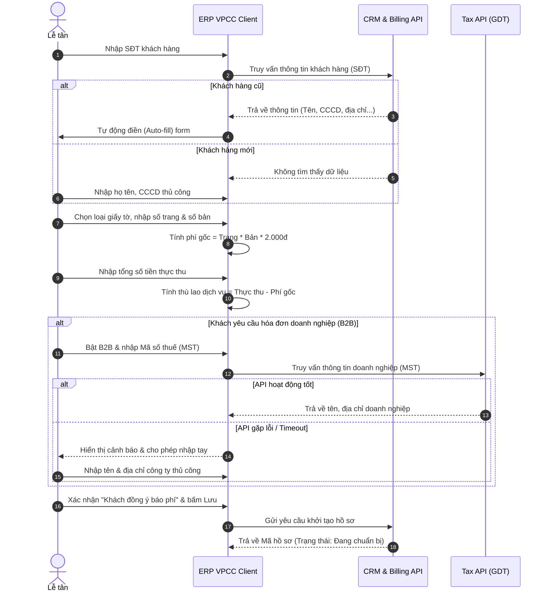
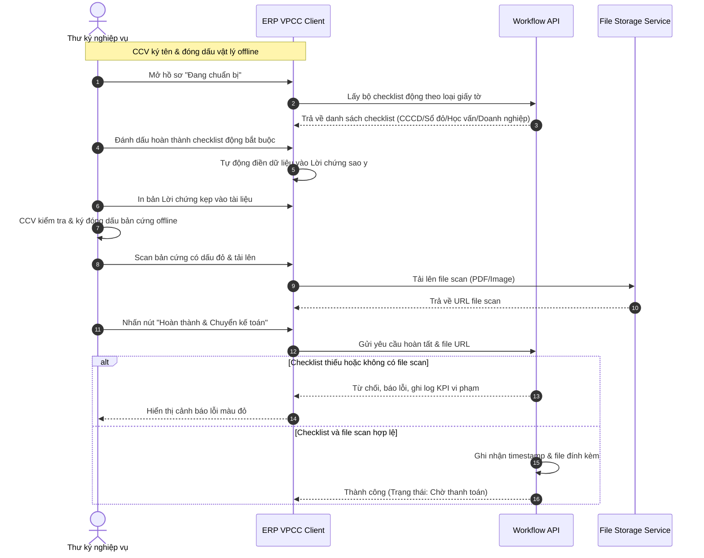
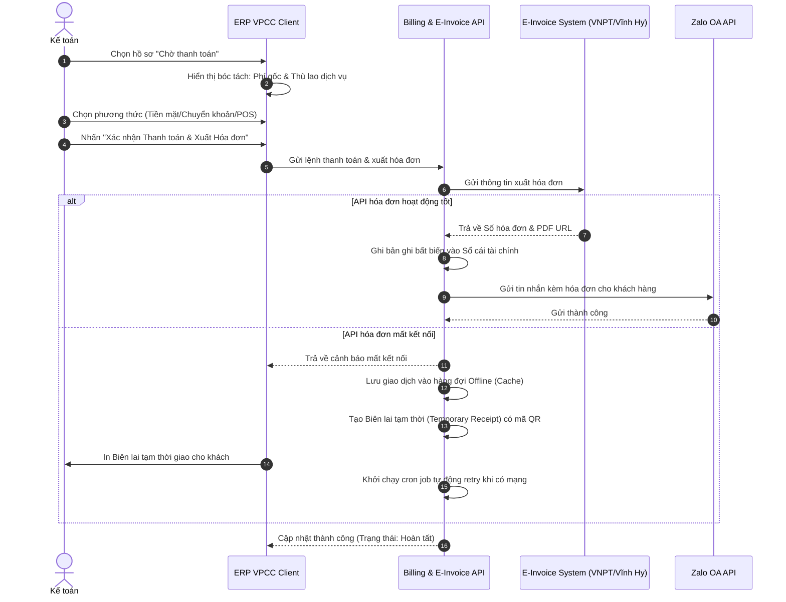
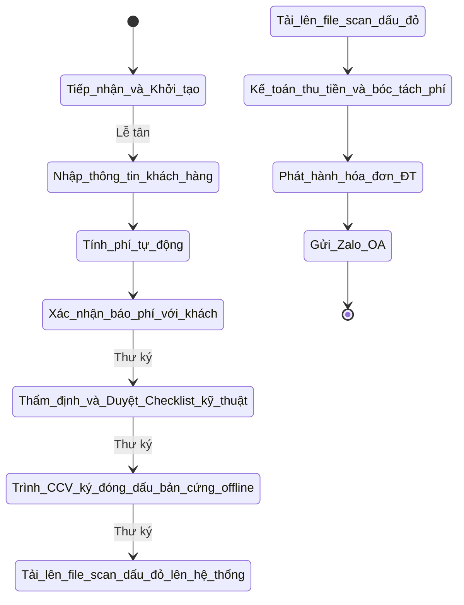

# Software Requirements Specification
## for Phân hệ Nghiệp vụ Sao Y - Dự án ERP VPCC

**Version 1.0 approved**
**Prepared by Vũ Minh Hoàng**
**Danish Software**
**17 tháng 06, 2026**

---

## 1. Giới thiệu (Introduction)
### 1.1 Mục đích (Purpose) 
Tài liệu SRS này đặc tả các yêu cầu phần mềm cho phân hệ **Nghiệp vụ Sao Y Bản Chính & Chứng Thực Bản Sao** thuộc dự án **ERP VPCC**. Mục đích của phân hệ là tối ưu hóa tốc độ xử lý tại quầy (Sao y siêu tốc), phân công vai trò phối hợp giữa Lễ tân, Thư ký, Công chứng viên, tích hợp chốt chặn kiểm soát quy trình nghiệp vụ và chốt chặn tài chính kế toán, tự động kết nối với API hóa đơn điện tử và gửi thông báo cảm ơn/chăm sóc qua Zalo OA.

### 1.2 Quy ước tài liệu (Document Conventions)
- Mức độ ưu tiên (Priority): Cao (High), Trung bình (Medium), Thấp (Low).
- Mã yêu cầu: Đánh mã theo định dạng `REQ-[Module]-[ID]` (VD: `REQ-SAOY-01`).
- Các biểu đồ luồng và trình tự được thể hiện bằng Mermaid format.

### 1.3 Đối tượng độc giả (Intended Audience)
- **Nhà quản lý/Trưởng VPCC:** Đọc Phần 1 và Phần 2 để nắm bắt mục tiêu và bối cảnh vận hành.
- **Lập trình viên (Developers) & Kiểm thử viên (Testers):** Đọc kỹ Phần 3, Phần 4 và Phần 5 để hiểu rõ đặc tả kỹ thuật, các ràng buộc và logic xử lý.
- **Nhân sự nghiệp vụ (Lễ tân, Thư ký, Kế toán):** Đọc Phần 4 để hiểu chi tiết luồng xử lý và tương tác với hệ thống.

### 1.4 Phạm vi sản phẩm (Product Scope)
ERP VPCC là giải pháp phần mềm lõi (ERP) điều phối toàn bộ luồng vận hành của văn phòng công chứng (VPCC). Phân hệ Sao y tập trung giải quyết quy trình tiếp nhận tài liệu, tự động tính toán chi phí (phí gốc và thù lao dịch vụ), cưỡng chế kiểm tra an toàn bằng checklist nghiệp vụ, và kết nối với các hệ thống kế toán/hoá đơn để khép kín chu trình.

### 1.5 Tài liệu tham khảo (References)
- Tài liệu PRD Tổng quan hệ thống CRM VPCC.
- Các quy định, luật hiện hành về Phí và Lệ phí Công chứng, Chứng thực.

## 2. Mô tả tổng quan (Overall Description)
### 2.1 Bối cảnh sản phẩm (Product Perspective)
Hệ thống là một phần (phân hệ) của nền tảng ERP VPCC, hoạt động trên môi trường Web, sử dụng kiến trúc vi dịch vụ (microservices). Phân hệ này sẽ tương tác chặt chẽ với các dịch vụ bên ngoài như hệ thống lưu trữ/ngăn chặn UCHI của Sở Tư pháp, API Tổng cục Thuế, API Hóa đơn điện tử (VNPT/Vĩnh Hy) và Zalo OA.

### 2.2 Chức năng cốt lõi (Product Functions)
- Tiếp nhận thông tin khách hàng (Cá nhân & Doanh nghiệp) tự động qua SĐT/MST.
- Tính toán và bóc tách phí tự động (Phí gốc nhà nước và thù lao dịch vụ).
- Kiểm soát quy trình nghiệp vụ thông qua Checklist động dựa trên loại giấy tờ.
- Tự động sinh Lời chứng sao y.
- Quản lý quá trình thanh toán và phát hành hóa đơn điện tử (bao gồm tự động tách hóa đơn vượt trần).
- Gửi thông báo chăm sóc khách hàng qua Zalo OA.

### 2.3 Phân quyền người dùng (User Classes and Characteristics)
- **Lễ tân (Reception Clerk):** Tiếp nhận khách hàng, tạo hồ sơ, thực hiện tính phí và thu thập thông tin ban đầu.
- **Thư ký nghiệp vụ (Notary Secretary):** Đối chiếu bản gốc, photocopy tài liệu, soạn thảo Lời chứng sao y, thực hiện kiểm tra checklist kỹ thuật trước khi trình Công chứng viên phê duyệt.
- **Công chứng viên (Notary Officer):** Ký tên và đóng dấu bản cứng thực tế (offline). CCV không cần tương tác trực tiếp với hệ thống phần mềm đối với luồng hồ sơ Sao y này.
- **Kế toán (Financial Accountant):** Kiểm soát dòng tiền, đối soát biểu phí, xác nhận thanh toán và phát hành hóa đơn điện tử.

### 2.4 Môi trường hoạt động (Operating Environment)
- Ứng dụng Web-based, yêu cầu kết nối Internet.
- Trình duyệt hiện đại (Chrome, Safari, Edge, Firefox).

### 2.5 Ràng buộc thiết kế và triển khai (Design and Implementation Constraints)
- Tuân thủ quy định pháp luật về trần phí sao y (không quá 200.000đ/bản/lần yêu cầu).
- Bắt buộc kiểm tra ngăn chặn (UCHI) đối với các tài sản rủi ro cao (Sổ đỏ).
- Phải lưu vết toàn bộ (Audit Log) không cho phép xóa vĩnh viễn dữ liệu tài chính.

### 2.6 Tài liệu hướng dẫn (User Documentation)
- [Cần xác nhận] Sổ tay hướng dẫn sử dụng ERP VPCC cho từng vai trò.

### 2.7 Giả định và phụ thuộc (Assumptions and Dependencies)
- Phụ thuộc vào sự ổn định của API UCHI, API Tổng cục Thuế, API VNPT/Vĩnh Hy và Zalo OA.
- Giả định khách hàng doanh nghiệp cung cấp đúng Mã số thuế để truy vấn.

### 2.8 Các trường hợp thực tế (Real World Cases)
#### Case 1: Khách hàng cá nhân sao y giấy tờ tùy thân/Bằng cấp (Thông thường)
- **Bối cảnh:** Anh A mang CCCD gốc và Bằng đại học đến yêu cầu sao y 5 bản mỗi loại.
- **Thực tế:** Thao tác cần cực kỳ nhanh gọn. Khách không cần xuất hóa đơn VAT.
- **Yêu cầu hệ thống:** Lễ tân gõ SĐT anh A, hệ thống tự động điền thông tin. Lễ tân nhập số trang/bản, báo phí cho khách và chuyển ngay cho Thư ký đem đi photo.

#### Case 2: Doanh nghiệp sao y số lượng lớn và yêu cầu Hóa đơn VAT (B2B)
- **Bối cảnh:** Nhân viên công ty X mang Đăng ký kinh doanh đến sao y 50 bản để nộp thầu.
- **Thực tế:** Cần lưu thông tin mã số thuế và xuất hóa đơn điện tử cho công ty X. Khả năng số tiền phí vượt quá 200.000đ.
- **Yêu cầu hệ thống:** Lễ tân nhập MST, hệ thống gọi API Thuế lấy tên/địa chỉ công ty X. Khi tính phí, nếu vượt 200.000đ phí gốc/bản, hệ thống phải cảnh báo chia tách hóa đơn hoặc bóc tách phần dôi dư vào "Thù lao dịch vụ". Kế toán xuất hóa đơn tự động qua API.

#### Case 3: Khách hàng sao y Sổ đỏ (Tài sản rủi ro)
- **Bối cảnh:** Khách mang Sổ đỏ đến sao y để đi thế chấp ngân hàng.
- **Thực tế:** Sổ đỏ là loại giấy tờ dễ bị làm giả hoặc đang bị kê biên, thế chấp. 
- **Yêu cầu hệ thống:** Khi Lễ tân chọn loại tài liệu là "Giấy chứng nhận QSDĐ", hệ thống kích hoạt Checklist bắt buộc: Bật cảnh báo đỏ yêu cầu Thư ký phải click vào link tra cứu UCHI trước khi cho phép in Lời chứng.

### 2.9 Hành trình khách hàng & Luồng xử lý trên phần mềm (Customer Journey & System Flow)
Quy trình "Sao y siêu tốc" với sự phối hợp của 3 vai trò:

1. **Tiếp nhận & Tính phí (Lễ tân):**
   - Khách đưa bản gốc. Lễ tân nhập SĐT/MST để hệ thống Auto-fill thông tin.
   - Lễ tân nhập số trang, số bản. Hệ thống tự động tính tổng phí (Phí gốc + Thù lao).
   - Lễ tân báo phí, khách đồng ý -> Check `[x] Đồng ý`. Hệ thống sinh mã hồ sơ và đẩy sang luồng của Thư ký.
2. **Xử lý Nghiệp vụ & In Lời chứng (Thư ký):**
   - Thư ký nhận thông báo trên màn hình, đem tài liệu gốc đi photocopy.
   - Thư ký check các điều kiện kỹ thuật trên phần mềm (VD: Kiểm tra UCHI nếu là Sổ đỏ).
   - Click "Sinh Lời chứng", hệ thống trộn dữ liệu vào template và in ra giấy.
3. **Ký duyệt (Công chứng viên - Offline):**
   - Thư ký kẹp bản gốc, bản photo và Lời chứng trình CCV kiểm tra vật lý, ký tên và đóng dấu đỏ.
4. **Đóng hồ sơ & Thu tiền (Kế toán):**
   - Thư ký scan file đã đóng dấu đẩy lên hệ thống.
   - Kế toán đối chiếu tiền mặt/chuyển khoản, bấm "Xác nhận thu tiền". 
   - Hệ thống tự động gọi API VNPT xuất hóa đơn điện tử. Trạng thái hồ sơ -> "Hoàn tất".
   - Hệ thống gửi Zalo OA cảm ơn khách hàng kèm link tải hóa đơn. Khách nhận lại bản gốc và bản sao y rồi ra về.

## 3. Yêu cầu Giao diện bên ngoài (External Interface Requirements)
### 3.1 Giao diện người dùng (User Interfaces)
- Thiết kế chế độ tối (Dark mode) sang trọng, giảm mỏi mắt cho nhân viên.
- Bố cục màn hình tiếp nhận tối giản, hỗ trợ tự động điền (Auto-fill) giúp thời gian thao tác dưới 30 giây.
- Hiển thị rõ ràng các cảnh báo màu đỏ khi phát sinh lỗi hoặc ngăn chặn UCHI.

### 3.2 Giao diện phần cứng (Hardware Interfaces)
- Tương thích với các máy scan/photocopy để tải tài liệu lên hệ thống.
- Hỗ trợ máy in để in Lời chứng và biên lai tạm thời.

### 3.3 Giao diện phần mềm (Software Interfaces)
- **API UCHI:** Kết nối để truy vấn thông tin ngăn chặn tài sản.
- **API Tổng cục Thuế:** Truy vấn thông tin doanh nghiệp qua MST.
- **API Hóa đơn điện tử (VNPT/Vĩnh Hy):** Gửi yêu cầu phát hành hóa đơn và nhận bản PDF/XML.
- **Zalo OA API:** Gửi tin nhắn ZNS chăm sóc khách hàng và link hóa đơn.

### 3.4 Giao thức truyền thông (Communications Interfaces)
- Giao tiếp qua HTTPS để đảm bảo bảo mật dữ liệu.
- Cơ chế Queue/Cron job cho xử lý ngoại tuyến khi mất kết nối mạng.

## 4. Tính năng Hệ thống (System Features)
### 4.1 UC-01: Tiếp Nhận & Tính Phí Sao Y Siêu Tốc
#### 4.1.1 Mô tả và Mức độ ưu tiên (Description and Priority)
- **Mô tả:** Lễ tân tiếp nhận hồ sơ, tra cứu khách hàng, nhập số lượng, phần mềm tự động tính phí gốc và thù lao dịch vụ.
- **Độ ưu tiên:** High

#### 4.1.2 Luồng xử lý / Tương tác (Stimulus/Response Sequences)

#### 4.1.3 Yêu cầu chức năng chi tiết (Functional Requirements)
- `REQ-SAOY-01`: Hệ thống auto-fill thông tin khách hàng khi nhập SĐT hợp lệ.
- `REQ-SAOY-02`: Hệ thống tự động tính Phí gốc = Số trang x Số bản x 2.000đ.
- `REQ-SAOY-03`: Hệ thống hiển thị cảnh báo nếu Tổng thực thu < Phí gốc.
- `REQ-SAOY-04`: Tự động gọi API Thuế khi bật B2B và nhập MST. Nếu API lỗi, cho phép nhập tay.
- `REQ-SAOY-05`: Tự động tách hồ sơ thành nhiều bản ghi nhỏ nếu Phí gốc > 200.000đ để đảm bảo quy định hóa đơn.
- `REQ-SAOY-06`: Cưỡng chế check box "Khách hàng đồng ý báo phí" trước khi lưu.

### 4.2 UC-02: Kiểm Soát Luồng Bằng Checklist Chặn
#### 4.2.1 Mô tả và Mức độ ưu tiên (Description and Priority)
- **Mô tả:** Thư ký thực hiện kiểm tra giấy tờ dựa trên checklist động, đối khớp với UCHI, in lời chứng, trình ký offline và scan file lên hệ thống.
- **Độ ưu tiên:** High

#### 4.2.2 Luồng xử lý / Tương tác (Stimulus/Response Sequences)

#### 4.2.3 Yêu cầu chức năng chi tiết (Functional Requirements)
- `REQ-CHK-01`: Hệ thống sinh Checklist động theo phân loại giấy tờ (Ví dụ: CCCD, Sổ Đỏ, Bằng Cấp).
- `REQ-CHK-02`: Bắt buộc Thư ký click link tra cứu UCHI nếu loại giấy tờ là "Sổ đỏ/Giấy chứng nhận QSDĐ".
- `REQ-CHK-03`: Tự động fill thông tin khách hàng vào template Lời chứng sao y để in.
- `REQ-CHK-04`: Ngăn chặn nút "Hoàn thành" nếu chưa tick 100% checklist và chưa upload file scan. File dung lượng < 25MB (PDF, PNG, JPG).
- `REQ-CHK-05`: Nếu hồ sơ bị từ chối/bị lỗi, ghi log và trả lại lễ tân.

### 4.3 UC-03: Chốt Chặn Kế Toán & Phát Hành Hóa Đơn Tự Động
#### 4.3.1 Mô tả và Mức độ ưu tiên (Description and Priority)
- **Mô tả:** Kế toán thực hiện thu tiền, hệ thống lưu vết bất biến, xuất hóa đơn điện tử tự động và nhắn Zalo cảm ơn.
- **Độ ưu tiên:** High

#### 4.3.2 Luồng xử lý / Tương tác (Stimulus/Response Sequences)

#### 4.3.3 Yêu cầu chức năng chi tiết (Functional Requirements)
- `REQ-BIL-01`: Hiển thị rõ bóc tách dòng tiền (Phí gốc miễn thuế và Thù lao tính thuế).
- `REQ-BIL-02`: Lưu sổ cái (Ledger) giao dịch bất biến khi xác nhận. Không ai được phép xoá dữ liệu này.
- `REQ-BIL-03`: Tự động gọi API Hóa đơn điện tử để xuất và nhận về Số hóa đơn.
- `REQ-BIL-04`: Tự động gọi API Zalo OA kèm link PDF hóa đơn. Fallback qua SMS nếu Zalo thất bại.
- `REQ-BIL-05`: Cho phép lưu ngoại tuyến (Offline Queue) và in biên lai tạm thời nếu mất kết nối Internet/API, tự động đồng bộ (cron job) khi có mạng.

## 5. Các Yêu cầu Phi chức năng khác (Other Nonfunctional Requirements)
### 5.1 Yêu cầu Hiệu năng (Performance Requirements)
- Thao tác tự động điền (Auto-fill) khách hàng và truy vấn API MST phải hoàn tất < 2 giây.

### 5.2 Yêu cầu An toàn (Safety Requirements)
- Cảnh báo đỏ nổi bật khi phát hiện tài sản bị ngăn chặn trên UCHI.

### 5.3 Yêu cầu Bảo mật (Security Requirements)
- Mọi thao tác cập nhật trạng thái (Tiếp nhận -> Thẩm định -> Thanh toán) phải lưu vết (Audit Log) gồm người thực hiện, hành động và Timestamp.
- Sổ cái tài chính (Billing Ledger) mang tính bất biến (Immutable), ngăn chặn mọi quyền ghi đè (override).

### 5.4 Thuộc tính Chất lượng Phần mềm (Software Quality Attributes)
- Tính linh hoạt: Dễ dàng cấu hình và thay đổi công thức tính phí hoặc thêm/bớt điều kiện Checklist mà không cần sửa code cốt lõi.

### 5.5 Quy tắc Nghiệp vụ (Business Rules)
- Tổng số tiền thực thu luôn phải lớn hơn hoặc bằng Phí gốc nhà nước.
- Hóa đơn phát hành không được vượt quá 200.000đ phí gốc cho một bộ tài liệu sao y (Phải auto-split).
- Hồ sơ Sổ đỏ bắt buộc phải qua bước tra cứu UCHI.
- Không cho phép thanh toán nếu Thư ký chưa upload bản scan hồ sơ đã đóng dấu.

## 6. Các yêu cầu khác (Other Requirements)
- [Cần xác nhận] Quy định về xử lý dữ liệu cá nhân theo Nghị định Bảo vệ Dữ liệu Cá nhân (ND13) cho việc gửi tin Zalo/SMS.

## Phụ lục A: Thuật ngữ (Glossary)
- **VPCC:** Văn phòng Công chứng
- **CCV:** Công chứng viên
- **CCCD:** Căn cước công dân
- **UCHI:** Hệ thống thông tin lưu trữ dữ liệu công chứng/ngăn chặn tài sản của Sở Tư pháp
- **Zalo OA:** Zalo Official Account - tài khoản chính thức của văn phòng
- **B2B:** Business-to-Business (Giao dịch liên quan đến khách hàng doanh nghiệp)

## Phụ lục B: Mô hình phân tích (Analysis Models)
### Sơ đồ Luồng hoạt động Nghiệp vụ (Activity Diagram)

## Phụ lục C: Danh sách các mục cần làm rõ (To Be Determined List - TBD)
- [TBD] Xin cấp quyền cấu hình Zalo OA của VPCC.
- [TBD] Xác nhận API nhà cung cấp phần mềm Hóa đơn điện tử để lên phương án kết nối.
