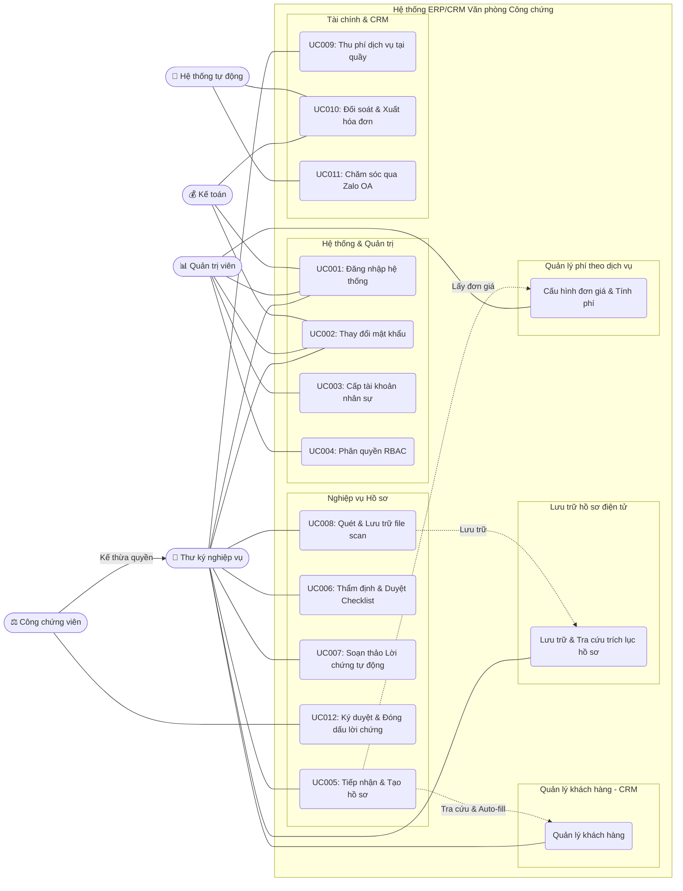
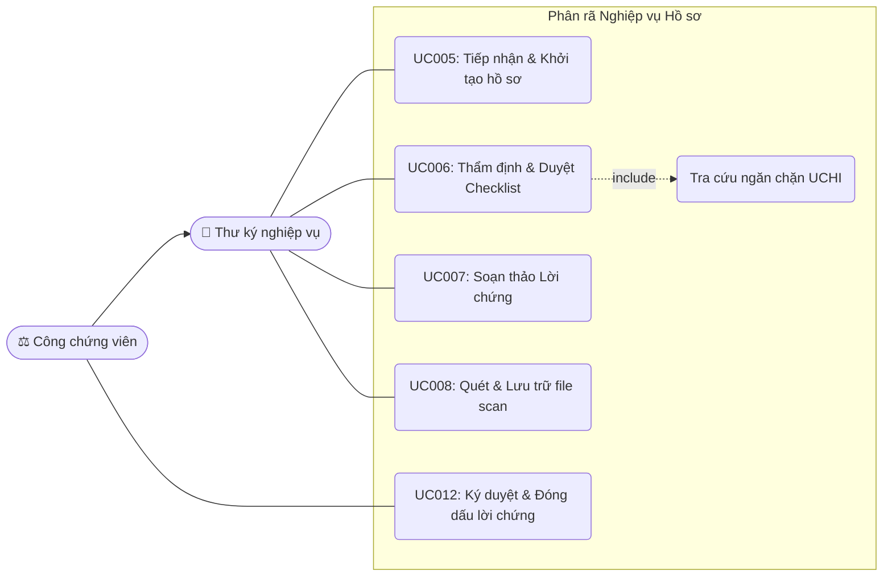
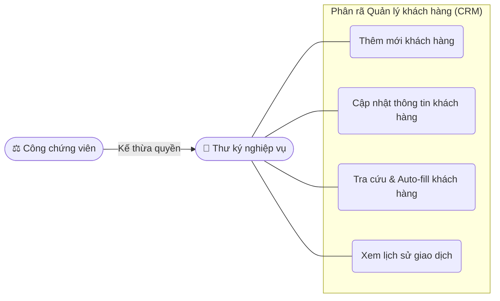
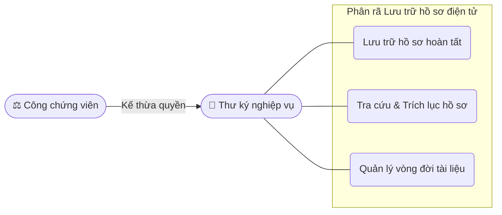
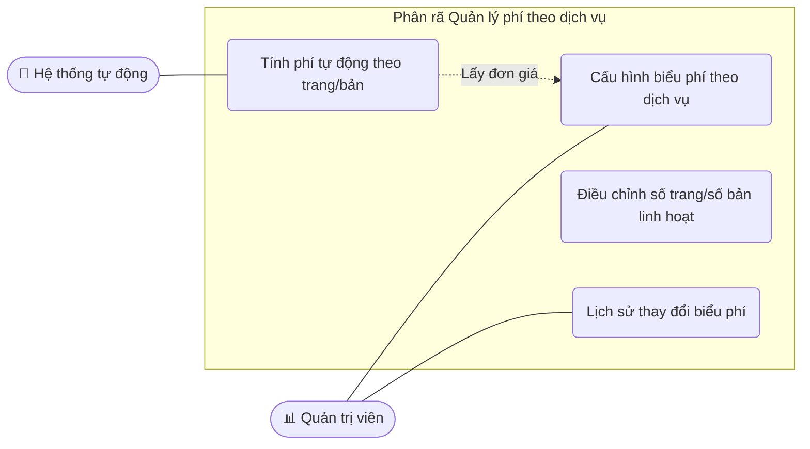
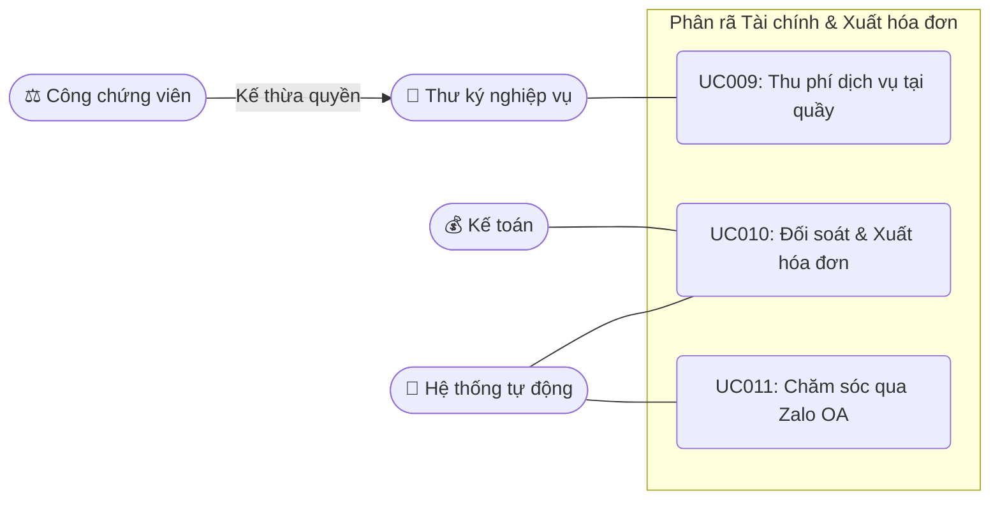
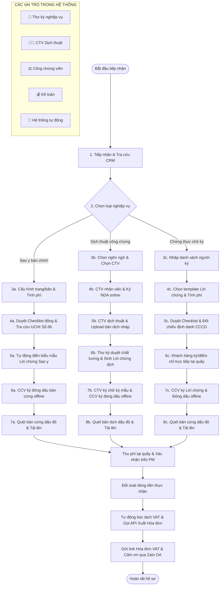

# Tài liệu Đặc tả Yêu cầu Phần mềm (Software Requirements Specification - SRS)
## Hệ thống ERP/CRM Văn phòng Công chứng )

**Phiên bản:** 1.0  
**Đơn vị phát triển:** Danish Software  
**Người soạn thảo:** Vũ Minh Hoàng  
**Ngày tạo:** 17 tháng 06, 2026  

---

## Mục lục

- **[Chương 1. Giới thiệu (Introduction)](#chương-1-giới-thiệu-introduction)**
  - [1.1 Mục đích (Purpose)](#11-mục-đích-purpose)
  - [1.2 Phạm vi (Scope)](#12-phạm-vi-scope)
  - [1.3 Từ điển thuật ngữ (Glossary)](#13-từ-điển-thuật-ngữ-glossary)
  - [1.4 Tài liệu tham khảo (References)](#14-tài-liệu-tham-khảo-references)
  - [1.5 Tổng quát (Overview)](#15-tổng-quát-overview)

- **[Chương 2. Các yêu cầu chức năng (Functional Requirements)](#chương-2-các-yêu-cầu-chức-năng-functional-requirements)**
  - [2.1 Các tác nhân (Actors)](#21-các-tác-nhân-actors)
  - [2.2 Các chức năng của hệ thống (System Functions)](#22-các-chức-năng-của-hệ-thống-system-functions)
  - [2.3 Biểu đồ use case tổng quan (Overall Use Case Diagram)](#23-biểu-đồ-use-case-tổng-quan-overall-use-case-diagram)
  - [2.4 Biểu đồ use case phân rã (Decomposed Use Case Diagrams)](#24-biểu-đồ-use-case-phân-rã-decomposed-use-case-diagrams)
    - [2.4.1 Phân rã nhóm chức năng Xác thực & Quản trị (Auth & Admin)](#241-phân-rã-nhóm-chức-năng-xác-thực--quản-trị-auth--admin)
    - [2.4.2 Phân rã nhóm chức năng Nghiệp vụ Hồ sơ (Dossier Processing)](#242-phân-rã-nhóm-chức-năng-nghiệp-vụ-hồ-sơ-dossier-processing)
    - [2.4.3 Phân rã module Quản lý khách hàng (CRM)](#243-phân-rã-module-quản-lý-khách-hàng-crm)
    - [2.4.4 Phân rã module Lưu trữ hồ sơ điện tử (Document Archive)](#244-phân-rã-module-lưu-trữ-hồ-sơ-điện-tử-document-archive)
    - [2.4.5 Phân rã module Quản lý phí & Tài chính (Fee & Billing)](#245-phân-rã-module-quản-lý-phí--tài-chính-fee--billing)
  - [2.5 Quy trình sử dụng phần mềm (Software User Workflow)](#2.5-quy-trinh-su-dung-phan-mem)
    - [2.5.1 Quy trình Nghiệp vụ Sao y bản chính](#2.5.1-quy-trinh-nghiep-vu-sao-y-ban-chinh)
    - [2.5.2 Quy trình Nghiệp vụ Dịch thuật công chứng](#2.5.2-quy-trinh-nghiep-vu-dich-thuat-cong-chung)
    - [2.5.3 Quy trình Nghiệp vụ Chứng thực chữ ký](#2.5.3-quy-trinh-nghiep-vu-chung-thuc-chu-ky)
  - [2.6 Đặc tả các usecase (Use Case Specifications)](#2.6-dac-ta-cac-usecase)
    - [2.6.1 Nhóm Use Case Xác thực & Hệ thống (Auth & Admin)](#2.6.1-nhom-use-case-xac-thuc-he-thong)
      - [UC001: Đăng nhập hệ thống](#uc001-đăng-nhập-hệ-thống)
      - [UC002: Thay đổi mật khẩu](#uc002-thay-đổi-mật-khẩu)
      - [UC003: Quản lý & Cấp tài khoản nhân sự](#uc003-quản-lý--cấp-tài-khoản-nhân-sự)
      - [UC004: Phân quyền & Thiết lập vai trò (RBAC)](#uc004-phân-quyền--thiết-lập-vai-trò-rbac)
    - [2.6.2 Nhóm Use Case Nghiệp vụ (Dossier & Checklist)](#2.6.2-nhom-use-case-nghiep-vu)
      - [UC005: Tiếp nhận khách hàng & Khởi tạo hồ sơ](#uc005-tiếp-nhận-khách-hàng--khởi-tạo-hồ-sơ)
      - [UC006: Thẩm định hồ sơ & Duyệt Checklist chặn](#uc006-thẩm-định-hồ-sơ--duyệt-checklist-chặn)
      - [UC007: Soạn thảo Lời chứng tự động](#uc007-soạn-thảo-lời-chứng-tự-động)
      - [UC008: Quét & Lưu trữ hồ sơ điện tử đã đóng dấu](#uc008-quét--lưu-trữ-hồ-sơ-điện-tử-đã-đóng-dấu)
    - [2.6.3 Nhóm Use Case Tài chính & Chăm sóc (Billing & CRM)](#2.6.3-nhom-use-case-tai-chinh-cham-soc)
      - [UC009: Thu phí & Đối soát dòng tiền](#uc009-thu-phí--đối-soát-dòng-tiền)
      - [UC010: Xuất hóa đơn điện tử tự động (VNPT/Vĩnh Hy)](#uc010-xuất-hoa-đơn-điện-tử-tự-động-vnptvĩnh-hy)
      - [UC011: Chăm sóc khách hàng tự động qua Zalo OA](#uc011-chăm-sóc-khách-hàng-tự-động-qua-zalo-oa)
  - [2.7 Tài liệu Khảo sát Nghiệp vụ Kế toán & Quy tắc Phần mềm VPCC](#2.7-quy-tac-nghiep-vu-ke-toan)
    - [2.7.1 Quản lý hệ thống Sổ sách Công chứng (Đồng bộ số liệu)](#2.7.1-quan-ly-he-thong-so-sach-cong-chung)
    - [2.7.2 Quy tắc Tài chính, Doanh thu & Hóa đơn GTGT](#2.7.2-quy-tac-tai-chinh-doanh-thu-hoa-don)
    - [2.7.3 Quy định Biểu phí & Cách tính phí dịch vụ](#2.7.3-quy-dinh-bieu-phi-cach-tinh-phi)
    - [2.7.4 Quản lý Nhân sự, KPI & Báo cáo Sở Tư pháp](#2.7.4-quan-ly-nhan-su-kpi-bao-cao)
    - [2.7.5 Thiết lập Quy tắc Hệ thống cốt lõi (Business Rules)](#2.7.5-thiet-lap-quy-tac-he-thong-cot-loi)
- **[Chương 3. Các kịch bản nghiệp vụ thực tế (Real-world Cases)](#3-cac-kich-ban-nghiep-vu-thuc-te)**
  - [3.1 Nghiệp vụ Sao y bản chính](#3.1-nghiep-vu-sao-y-ban-chinh)
    - [3.1.1 Case 1: Sao y CCCD / Giấy tờ tùy thân của cá nhân tại quầy (Siêu tốc)](#3.1.1-case-1-sao-y-cccd)
    - [3.1.2 Case 2: Sao y Sổ đỏ / Giấy tờ sở hữu tài sản có kiểm tra ngăn chặn (UCHI)](#3.1.2-case-2-sao-y-so-do)
    - [3.1.3 Case 3: Sao y số lượng lớn & Tự động điều chỉnh số trang](#3.1.3-case-3-sao-y-so-luong-lon)
    - [3.1.4 Case 4: Doanh nghiệp sao y giấy phép & Yêu cầu hóa đơn VAT (B2B)](#3.1.4-case-4-doanh-nghiep-sao-y-giay-phep)
    - [3.1.5 Case 5: Sao y giấy tờ có yếu tố nước ngoài (Yêu cầu Hợp pháp hóa lãnh sự)](#3.1.5-case-5-sao-y-giay-to-nuoc-ngoai)
    - [3.1.6 Case 6: Từ chối sao y các giấy tờ bị cấm chứng thực (Tẩy xóa, đóng dấu MẬT, rách nát)](#3.1.6-case-6-tu-choi-sao-y)
  - [3.2 Nghiệp vụ Dịch thuật công chứng (Certified Translation Cases)](#32-nghiệp-vụ-dịch-thuật-công-chứng-certified-translation-cases)
    - [3.2.1 Case 1: Dịch thuật công chứng Giấy tờ hộ tịch cá nhân (Anh - Việt) - Luồng siêu tốc lấy ngay](#321-case-1-dịch-hộ-tịch-siêu-tốc)
    - [3.2.2 Case 2: Dịch tài liệu thương mại đa trang (Tiếng Nga) - Luồng quản lý tiến độ CTV từ xa và Yêu cầu tạm ứng](#322-case-2-dịch-tài-liệu-hiem-va-quan-ly-tu-xa)
    - [3.2.3 Case 3: Khởi tạo hồ sơ dịch thuật từ xa qua Zalo OA - Luồng phê duyệt bản nháp trực tuyến](#323-case-3-khởi-tạo-từ-xa-qua-zalo-oa)
    - [3.2.4 Case 4: Dịch thuật đa ngôn ngữ cho cùng một tài liệu - Luồng tách hồ sơ con song song (Master - Sub Dossier)](#324-case-4-dịch-đa-ngôn-ngữ)
    - [3.2.5 Case 5: Từ chối dịch thuật công chứng tài liệu không hợp pháp (Chưa Hợp pháp hóa lãnh sự)](#325-case-5-từ-chối-dịch-thuật)

---

## Chương 1. Giới thiệu (Introduction)

### 1.1 Mục đích (Purpose)
Tài liệu Đặc tả Yêu cầu Phần mềm (SRS) này xác định và đặc tả chi tiết toàn bộ các yêu cầu chức năng và bối cảnh hoạt động của **Hệ thống ERP/CRM Văn phòng Công chứng ** được triển khai độc lập tại một văn phòng công chứng. Tài liệu đóng vai trò là:
- **Bản căn cứ kỹ thuật và nghiệp vụ:** Giúp Ban quản lý Văn phòng Công chứng và Danish Software thống nhất phạm vi tính năng, làm cơ sở chính xác để nghiệm thu sản phẩm.
- **Tài liệu đặc tả cho đội ngũ phát triển:** Hướng dẫn lập trình viên hiểu đúng luồng xử lý và quy tắc nghiệp vụ để thiết kế cơ sở dữ liệu và viết mã nguồn.
- **Căn cứ xây dựng kịch bản kiểm thử:** Giúp kiểm thử viên (Testers) xây dựng các ca kiểm thử (Test Cases) tương ứng với các luồng hoạt động chính và ngoại lệ của hệ thống.

### 1.2 Phạm vi (Scope)
Giải pháp quản trị tổng thể cho Văn phòng công chứng, giúp số hóa toàn bộ hoạt động vận hành thủ công lên một nền tảng chung. Hệ thống bao quát 3 lớp vận hành chính:
1. **Lớp Khách hàng (CRM):**     
    - Trung tâm lưu trữ dữ liệu khách hàng, Tổ chức / Công ty.
    - Hỗ trợ trực tiếp cho quá trình tạo hồ sơ nhanh chóng.
    - Lưu vết và hiển thị toàn bộ lịch sử các giao dịch với khách hàng và thông tin của khách hàng.
2. **Lớp Nghiệp vụ:** Số hóa toàn bộ quy trình xử lý hồ sơ bao gồm:
   - Quy trình tiếp nhận, khởi tạo và theo dõi trạng thái hồ sơ.
   - Quản lý biểu mẫu, hợp đồng và các phiên bản văn bản (được cấu hình chi tiết theo từng nghiệp vụ cụ thể).
   - Quản lý tính phí (tự động tính phí gốc, phí dịch vụ thù lao thỏa thuận, theo dõi trạng thái thanh toán và tích hợp xuất hóa đơn điện tử tự động).
   - Hệ thống checklist kiểm soát lỗi nghiệp vụ động và tích hợp tra cứu ngăn chặn tài sản (UCHI).
3. **Lớp Quản trị:** Quản lý nhân sự, thiết lập tài khoản và phân quyền vai trò (RBAC) chi tiết, báo cáo thống kê hiệu suất/doanh thu và theo dõi tiến độ công việc chung của toàn văn phòng.

#### Nghiệp vụ cốt lõi (Core Scope):
Tài liệu này đặc tả toàn diện và chi tiết tất cả các yêu cầu chức năng cho toàn bộ hệ thống cũng như quy trình chi tiết của 3 nghiệp vụ cốt lõi được định nghĩa trong Chương 2:
- Phân hệ nghiệp vụ **Sao y bản chính**.
- Phân hệ nghiệp vụ **Dịch thuật công chứng** (Chứng thực chữ ký người dịch).
- Phân hệ nghiệp vụ **Chứng thực chữ ký** (Cá nhân, ủy quyền, tờ khai).

Tất cả các mô tả, sơ đồ quy trình và đặc tả use case chi tiết của 3 nghiệp vụ này được trình bày trực tiếp và duy nhất trong tài liệu này để đảm bảo tính tập trung.

### 1.3 Từ điển thuật ngữ (Glossary)
| Thuật ngữ | Định nghĩa |
| :--- | :--- |
| **VPCC** | Văn phòng Công chứng |
| **CCV** | Công chứng viên (người có thẩm quyền ký và đóng dấu lời chứng) |
| **UCHI** | Cơ sở dữ liệu ngăn chặn giao dịch và lịch sử công chứng tài sản của Sở Tư pháp |
| **CRM** | Customer Relationship Management - Hệ thống quản lý thông tin khách hàng |
| **ERP** | Enterprise Resource Planning - Hệ thống quản trị nguồn lực doanh nghiệp |
| **RBAC** | Role-Based Access Control - Phân quyền truy cập dựa trên vai trò |
| **Lời chứng** | Phần nội dung pháp lý do CCV ký ghi nhận việc công chứng/chứng thực |
| **Bản chính** | Giấy tờ gốc do cơ quan thẩm quyền cấp làm cơ sở đối chiếu |
| **Audit Log** | Nhật ký hệ thống tự động lưu lại các hành động của người dùng |
| **MST** | Mã số thuế (dùng cho doanh nghiệp B2B) |
| **Người dịch** | Cộng tác viên dịch thuật tài liệu đã đăng ký chữ ký mẫu tại VPCC phục vụ luồng dịch thuật công chứng |
| **Người yêu cầu** | Cá nhân hoặc đại diện tổ chức nộp hồ sơ yêu cầu sao y, dịch thuật hoặc chứng thực chữ ký |
| **Biên lai tạm thời** | Chứng từ in tạm kèm mã QR tra cứu phục vụ khi API hóa đơn điện tử gặp sự cố mất kết nối |

### 1.4 Tài liệu tham khảo (References)
- Quy chuẩn đặc tả phần mềm: *IEEE Recommended Practice for Software Requirements Specifications,* IEEE Std 830-1998.
- [Luật Công chứng số 51/2014/QH13](https://vanban.chinhphu.vn/?pageid=27160&docid=177893) - Cổng Thông tin điện tử Chính phủ.
- [Nghị định số 13/2023/NĐ-CP về Bảo vệ dữ liệu cá nhân](https://vanban.chinhphu.vn/?pageid=27160&docid=207767) - Cổng Thông tin điện tử Chính phủ.
- [Nghị định số 23/2015/NĐ-CP về cấp bản sao, chứng thực bản sao, chứng thực chữ ký](https://vanban.chinhphu.vn/?pageid=27160&docid=178657) - Cổng Thông tin điện tử Chính phủ.
- [Nghị định số 123/2020/NĐ-CP quy định về hóa đơn, chứng từ](https://vanban.chinhphu.vn/?pageid=27160&docid=201488) - Cổng Thông tin điện tử Chính phủ.

### 1.5 Tổng quát (Overview)
Dự án được phát triển nhằm mục tiêu xây dựng một hệ thống quản trị tổng thể (ERP/CRM) chuyên biệt cho văn phòng công chứng. Hệ thống số hóa toàn bộ quy trình tiếp nhận hồ sơ tại quầy, (thẩm định pháp lý) và kiểm soát lỗi qua checklist chặn, tra cứu dữ liệu ngăn chặn giao dịch (UCHI), quản lý dòng tiền hạch toán và tự động xuất hóa đơn VAT, cũng như chăm sóc khách hàng tự động qua Zalo OA. Dự án giúp tối ưu hóa hiệu suất làm việc liên phòng ban (Thư ký, Công chứng viên, Kế toán, Admin), giảm thiểu 95% sai sót nghiệp vụ và nâng cao trải nghiệm dịch vụ khách hàng.

---

## Chương 2. Các yêu cầu chức năng (Functional Requirements)

### 2.1 Các tác nhân (Actors)
Hệ thống định nghĩa 5 tác nhân (vai trò người dùng) trực tiếp tương tác và vận hành trên hệ thống:

1. **Thư ký nghiệp vụ (Secretary):**
   - **Mô tả:** Nhân sự chuyên môn trực tiếp làm việc với khách hàng và xử lý hồ sơ từ đầu đến cuối quy trình nghiệp vụ.
   - **Nhiệm vụ trên hệ thống:**
     - Tiếp nhận khách hàng, tra cứu định danh hoặc tạo mới thông tin khách hàng (CRM).
     - Kết nối phần cứng tại quầy (máy đọc chip CCCD, máy quét mã QR, máy scan) để thu thập thông tin khách hàng và tài liệu gốc.
     - Khởi tạo hồ sơ nghiệp vụ, nhập các thông số đầu vào (loại giấy tờ, số trang, số bản).
     - Xác nhận báo phí dịch vụ với khách hàng.
     - Thực hiện kiểm tra các đầu mục của checklist động tương ứng với loại giấy tờ.
     - Tra cứu thông tin ngăn chặn tài sản trên CSDL UCHI đối với các tài sản rủi ro (như Sổ đỏ).
     - Sinh và in Lời chứng hoặc biểu mẫu hợp đồng để trình Công chứng viên ký offline.
     - Thu phí dịch vụ của khách hàng tại quầy (Tiền mặt, chuyển khoản hoặc POS) và bấm "Xác nhận đã thu phí" trên hệ thống.
     - Chụp/scan bản cứng tài liệu đã ký đóng dấu đỏ vật lý để tải lên hệ thống mở khóa luồng đối soát của Kế toán.

2. **Công chứng viên (Notary Officer):**
   - **Mô tả:** Người có thẩm quyền tư pháp chịu trách nhiệm xem xét, phê duyệt tối cao và ký lời chứng.
   - **Nhiệm vụ trên hệ thống:**
     - Công chứng viên có toàn bộ quyền hạn của Thư ký nghiệp vụ trên hệ thống (có thể tiếp nhận, xử lý hồ sơ và thu phí dịch vụ tại quầy).
     - Thực hiện ký đóng dấu bản cứng offline sau khi đã đối chiếu và duyệt trên hệ thống (đây là quyền hạn độc quyền của CCV, Thư ký không được phép ký).

3. **Kế toán (Accountant):**
   - **Mô tả:** Nhân sự phụ trách đối soát tài chính và quản lý hóa đơn tại văn phòng công chứng. Kế toán không trực tiếp thu phí tại quầy.
   - **Nhiệm vụ trên hệ thống:**
     - Theo dõi danh sách giao dịch ở trạng thái "Chờ đối soát".
     - Thực hiện đối soát tài chính: đối chiếu dòng tiền thực nhận (két tiền mặt thực tế hoặc tài khoản ngân hàng của văn phòng) với thông tin thu phí do Thư ký/CCV đã xác nhận.
     - Bấm "Xác nhận đối soát" để hệ thống tự động ghi sổ cái bất biến và gọi API phát hành hóa đơn điện tử gửi cho khách hàng.

4. **Quản trị viên (Admin):**
   - **Mô tả:** Nhân sự quản trị kỹ thuật, cấu hình hệ thống.
   - **Nhiệm vụ trên hệ thống:**
     - Quản lý tài khoản nhân sự (tạo mới, khóa, mở khóa tài khoản).
     - Thiết lập ma trận phân quyền dựa trên vai trò (RBAC) cho nhân viên.
     - Quản lý kho mẫu lời chứng, biểu mẫu hợp đồng động.
     - Cấu hình biểu phí dịch vụ (phí gốc và thù lao dịch vụ khác).
5. **Cộng tác viên dịch thuật:**
   - **Mô tả:** Nhân viên làm việc tự do bên ngoài, có thể truy cập vào hệ thống để thực hiện các công việc liên quan đến dịch thuật.
   - **Nhiệm vụ trên hệ thống:**
     - Thực hiện dịch thuật tài liệu do Thư ký gửi tải lên hồ sơ.
     - Upload bản dịch đã hoàn thiện để trình Công chứng viên phê duyệt.
     - Nhận phản hồi và chỉnh sửa bản dịch nếu cần.

### 2.2 Các chức năng của hệ thống (System Functions)
Các chức năng cốt lõi của hệ thống được phân chia theo các nhóm vận hành chính:

#### A. Quản lý khách hàng (CRM)
Module trung tâm lưu trữ dữ liệu khách hàng, hỗ trợ trực tiếp cho quá trình tạo hồ sơ nhanh chóng:
- **Quản lý khách hàng:** Thêm mới, cập nhật và lưu trữ thông tin định danh của khách hàng cá nhân (CCCD, SĐT) và doanh nghiệp/tổ chức (Mã số thuế, địa chỉ trụ sở).
- **Auto-fill & Tra cứu nhanh:** Tự động điền thông tin khách hàng cũ dựa vào SĐT, Căn cước công dân (CCCD) khi tạo hồ sơ mới, giúp rút ngắn thời gian nhập liệu.
- **Lịch sử giao dịch:** Lưu vết và hiển thị toàn bộ lịch sử hồ sơ, giao dịch của từng khách hàng tại văn phòng.
- **Tương tác đa kênh:** Tự động gửi tin nhắn chăm sóc, thông báo nhận kết quả và link hóa đơn VAT qua Zalo OA.

#### B. Nghiệp vụ Hồ sơ (Dossier Processing)
- **Tiếp nhận & Tạo hồ sơ:** Khởi tạo hồ sơ nghiệp vụ, tự động cấp mã hồ sơ duy nhất, chọn dịch vụ (Sao y, Dịch thuật, Chứng thực chữ ký). Tích hợp tra cứu CRM để auto-fill thông tin khách hàng.
- **Checklist động & Kiểm soát lỗi:** Áp đặt các danh sách kiểm tra bắt buộc tùy thuộc vào loại giấy tờ để ngăn ngừa lỗi kỹ thuật của Thư ký.
- **Tra cứu ngăn chặn (UCHI):** Kết nối API hệ thống UCHI của Sở Tư pháp để tra cứu trạng thái phong tỏa của thửa đất/tài sản rủi ro cao.
- **Soạn thảo & Quản lý phiên bản:** Tự động điền dữ liệu hồ sơ vào biểu mẫu Lời chứng có sẵn, quản lý các phiên bản tài liệu (Nháp, Đang xử lý, Chờ ký, Đã ký).
- **Ký duyệt & Đóng dấu:** Công chứng viên ký duyệt và đóng dấu lời chứng vật lý (quyền hạn độc quyền).
- **Scan & Lưu trữ tài liệu:** Hỗ trợ quét và lưu trữ bản chụp dấu đỏ đã hoàn thành lên hệ thống đám mây.

#### C. Lưu trữ hồ sơ điện tử (Document Archive)
Module lưu trữ toàn bộ các hồ sơ tài liệu đã hoàn thành giao dịch (sau khi đã in, ký và thu phí):
- **Kho lưu trữ tập trung:** Lưu trữ an toàn toàn bộ file scan bản cứng dấu đỏ, lời chứng, hợp đồng và các tài liệu liên quan lên hệ thống đám mây.
- **Tra cứu & Trích lục hồ sơ:** Hỗ trợ tìm kiếm nhanh theo mã hồ sơ, tên khách hàng, CCCD, ngày tạo, loại nghiệp vụ. Phục vụ việc trích lục hồ sơ nhanh chóng cho các nghiệp vụ về sau.
- **Quản lý vòng đời tài liệu:** Theo dõi trạng thái lưu trữ (Đang hoạt động, Lưu kho, Hết hạn bảo quản) theo quy định pháp luật.

#### D. Quản lý phí theo dịch vụ (Fee Management)
Module cung cấp cơ sở dữ liệu đơn giá để các module dịch vụ gọi ra và tính tổng tiền cho hồ sơ:
- **Cấu hình biểu phí:** Thiết lập đơn giá phí gốc nhà nước và thù lao dịch vụ riêng biệt cho từng loại dịch vụ (Sao y, Chứng thực chữ ký, Dịch thuật công chứng...).
- **Công thức tính phí tự động:** Tự động tính phí gốc theo số trang/bản, bóc tách thù lao dịch vụ khác, áp dụng đúng đơn giá từ biểu phí đã cấu hình.
- **Linh hoạt điều chỉnh số trang/số bản:** Cho phép Thư ký/Kế toán điều chỉnh linh hoạt số trang/số bản để khớp doanh thu thực tế mà không phân tách đơn hàng.
- **Lịch sử thay đổi biểu phí:** Ghi nhận nhật ký mọi lần cập nhật biểu phí (ai thay đổi, thời gian, giá trị cũ/mới).

#### E. Tài chính & Xuất hóa đơn (Billing & Invoice)
- **Thu phí dịch vụ tại quầy:** Thư ký/CCV tiếp nhận thanh toán từ khách hàng (Tiền mặt, Chuyển khoản, POS) và xác nhận thu phí trên hệ thống.
- **Đối soát dòng tiền:** Kế toán đối chiếu dòng tiền thực nhận (két tiền mặt, tài khoản ngân hàng) với giao dịch thu phí trên hệ thống.
- **Xuất hóa đơn điện tử:** Hệ thống tự động gọi API VNPT/Vĩnh Hy phát hành hóa đơn VAT sau khi Kế toán xác nhận đối soát.
- **Chăm sóc khách hàng:** Tự động gửi tin nhắn ZNS cảm ơn và link hóa đơn qua Zalo OA.

#### F. Hệ thống & Quản trị (Auth & Admin)
- **Xác thực & Bảo mật:** Đăng nhập, thay đổi mật khẩu, chính sách độ phức tạp mật khẩu, và session timeout tự động.
- **Quản trị tài khoản & Nhân sự:** Tạo mới, khóa/mở khóa tài khoản nhân viên.
- **Phân quyền RBAC:** Cấu hình ma trận quyền chi tiết (Xem, Thêm, Sửa, Xóa, Duyệt) cho từng vai trò đối với từng chức năng.
- **Nhật ký hệ thống (Audit Trail):** Ghi nhận bất biến thao tác của toàn bộ người dùng trên hệ thống.
- **Quản lý biểu mẫu:** Cấu hình mẫu lời chứng động và các biểu mẫu hợp đồng.

### 2.3 Biểu đồ use case tổng quan (Overall Use Case Diagram)

Dưới đây là sơ đồ Use Case tổng quan phân bổ theo các phân hệ chức năng và các tác nhân tương tác. Nhằm tối ưu hóa khả năng đọc hiểu, thông tin được thể hiện qua cả **Sơ đồ trực quan (Mermaid Diagram)** và **Bảng ma trận vai trò (Use Case Matrix)** chi tiết.

#### A. Sơ đồ Use Case tổng quan

Sơ đồ dưới đây phân chia hệ thống thành các phân vùng (subgraphs) tương ứng với các nhóm chức năng chính, cùng với các tác nhân (Actors) có liên kết tương tác trực tiếp hoặc kế thừa quyền:

#### B. Ma trận vai trò - Use Case (Use Case Matrix)

Bảng ma trận dưới đây làm rõ quyền hạn chi tiết và điểm tương tác của từng vai trò (Actor) đối với từng Use Case cụ thể trong hệ thống:

| Phân hệ / Nhóm chức năng | Mã UC | Tên Use Case | Thư ký nghiệp vụ | Công chứng viên | Kế toán | Quản trị viên | Hệ thống tự động |
| :--- | :--- | :--- | :---: | :---: | :---: | :---: | :---: |
| **Hệ thống & Quản trị** | **UC001** | Đăng nhập hệ thống | ✔️ | ✔️ | ✔️ | ✔️ | |
| | **UC002** | Thay đổi mật khẩu | ✔️ | ✔️ | ✔️ | ✔️ | |
| | **UC003** | Quản lý & Cấp tài khoản nhân sự | | | | ✔️ | |
| | **UC004** | Phân quyền & Thiết lập vai trò (RBAC) | | | | ✔️ | |
| **Quản lý khách hàng (CRM)** | — | Quản lý khách hàng (Lưu trữ, tra cứu, auto-fill) | ✔️ | ✔️ *(Kế thừa)* | | | |
| **Nghiệp vụ Hồ sơ** | **UC005** | Tiếp nhận & Khởi tạo hồ sơ | ✔️ | ✔️ *(Kế thừa)* | | | |
| | **UC006** | Thẩm định & Duyệt Checklist chặn | ✔️ | ✔️ *(Kế thừa)* | | | |
| | **UC007** | Soạn thảo Lời chứng tự động | ✔️ | ✔️ *(Kế thừa)* | | | |
| | **UC012** | Ký duyệt & Đóng dấu lời chứng | | ✔️ *(Độc quyền)* | | | |
| | **UC008** | Quét & Lưu trữ hồ sơ điện tử đã đóng dấu | ✔️ | ✔️ *(Kế thừa)* | | | |
| **Lưu trữ hồ sơ điện tử** | — | Lưu trữ & Tra cứu trích lục hồ sơ | ✔️ | ✔️ *(Kế thừa)* | | | |
| **Quản lý phí theo dịch vụ** | — | Cấu hình đơn giá & Tính phí theo dịch vụ | | | | ✔️ | |
| **Tài chính & CRM** | **UC009** | Thu phí dịch vụ tại quầy | ✔️ | ✔️ *(Kế thừa)* | | | |
| | **UC010** | Đối soát & Xuất hóa đơn | | | ✔️ | | ✔️ *(Gọi API)* |
| | **UC011** | Chăm sóc khách hàng tự động qua Zalo OA | | | | | ✔️ *(Tự động)* |

> **Ký hiệu & Quy ước:**
> - **✔️**: Tác nhân có quyền thực hiện trực tiếp Use Case này.
> - **Kế thừa**: Công chứng viên (CCV) kế thừa toàn bộ quyền hạn xử lý của Thư ký nghiệp vụ.
> - **Độc quyền**: Quyền hạn đặc thù của chức vụ đó, các tác nhân khác hoàn toàn không thể thực hiện.

### 2.4 Biểu đồ use case phân rã (Decomposed Use Case Diagrams)

#### 2.4.1 Phân rã nhóm chức năng đăng nhập & Quản trị (Auth & Admin)
Nhóm chức năng này phục vụ quản lý tài khoản nhân viên, thiết lập mật khẩu và phân quyền hoạt động trong hệ thống:

#### 2.4.2 Phân rã nhóm chức năng Nghiệp vụ Hồ sơ (Dossier Processing)
Nhóm chức năng nghiệp vụ xử lý tài liệu do Thư ký phụ trách, có sự tham gia phê duyệt nội dung trực tiếp của Công chứng viên:

#### 2.4.3 Phân rã module Quản lý khách hàng (CRM)
Module trung tâm lưu trữ dữ liệu khách hàng cá nhân và tổ chức/doanh nghiệp, hỗ trợ trực tiếp cho quá trình tạo hồ sơ nhanh chóng:

#### 2.4.4 Phân rã module Lưu trữ hồ sơ điện tử (Document Archive)
Module lưu trữ toàn bộ các hồ sơ tài liệu đã hoàn thành giao dịch, phục vụ việc tra cứu và trích lục hồ sơ nhanh chóng:

#### 2.4.5 Phân rã module Quản lý phí & Tài chính (Fee & Billing)
Module quản lý tổng thể về phí dịch vụ và tài chính, bao gồm: cấu hình biểu phí, tính phí tự động, thu phí tại quầy, đối soát dòng tiền và xuất hóa đơn điện tử.

##### A. Quản lý phí theo dịch vụ (Fee Management)
Cung cấp cơ sở dữ liệu về đơn giá để các module dịch vụ gọi ra và tính tổng tiền cho hồ sơ. Tính phí rõ ràng và minh bạch theo từng loại dịch vụ:

##### B. Tài chính & Xuất hóa đơn (Billing & Invoice)
Nhóm chức năng thu phí, đối soát dòng tiền và xuất hóa đơn điện tử tự động — sử dụng dữ liệu biểu phí từ module Quản lý phí:

### 2.5 Quy trình sử dụng phần mềm (Software User Workflow)

Phần này mô tả quy trình tương tác chi tiết từng bước trên phần mềm NotaryOS giữa các vai trò đối với 3 nghiệp vụ cốt lõi: **Sao y bản chính**, **Dịch thuật công chứng** và **Chứng thực chữ ký**. Vai trò nhập liệu và xử lý tại quầy được giao hoàn toàn cho **Thư ký nghiệp vụ**, không sử dụng vai trò Lễ tân.

#### A. Sơ đồ hoạt động phối hợp (Swimlanes Activity Diagram)

Dưới đây là sơ đồ thể hiện luồng hoạt động phối hợp giữa các vai trò trên hệ thống:

#### 2.5.1 Quy trình Nghiệp vụ Sao y bản chính (Certified Copying Workflow)

Quy trình sử dụng phần mềm đối với nghiệp vụ Sao y bản chính được thực hiện tuần tự như sau:

1. **Tiếp nhận & Định danh Khách hàng (CRM):**
   - Thư ký nghiệp vụ yêu cầu khách hàng cung cấp số điện thoại hoặc Căn cước công dân (CCCD).
   - Thư ký nhập thông tin vào ô tìm kiếm nhanh CRM trên phần mềm.
   - **Hệ thống tự động tra cứu:** Nếu khách hàng đã từng giao dịch, hệ thống tự động điền (Auto-fill) các thông tin: Họ tên, số định danh cá nhân, địa chỉ liên hệ. Nếu khách hàng mới, Thư ký nhập nhanh các trường thông tin và lưu vào cơ sở dữ liệu CRM.
2. **Khởi tạo Hồ sơ & Áp phí tự động:**
   - Thư ký chọn loại dịch vụ là "Sao y bản chính", chọn loại giấy tờ tương ứng từ danh sách cấu hình sẵn (CCCD, Sổ đỏ, Bằng đại học, Học bạ...).
   - Thư ký nhập số trang của tài liệu gốc và số bản sao y khách hàng yêu cầu.
   - **Hệ thống tự động tính toán:** Tính phí gốc theo quy định nhà nước ($Phí\ gốc = Số\ trang \times Số\ bản \times 2.000đ$).
   - Thư ký báo phí trọn gói với khách hàng (bao gồm cả phí dịch vụ photo, in ấn, bìa hồ sơ, tra cứu...). Nhập số tiền thỏa thuận thực thu vào trường "Tổng thực thu". Hệ thống tự động ghi nhận phần chênh lệch thù lao dịch vụ khác.
   - Thư ký tích chọn checkbox `Khách hàng đồng ý báo phí` và bấm "Lưu hồ sơ". Hệ thống tạo mã hồ sơ duy nhất (dạng `SY-YYYYMMDD-XXXXX`) ở trạng thái "Đang xử lý".
3. **Thực hiện Checklist & Tra cứu Ngăn chặn (UCHI):**
   - Hệ thống tải động danh sách Checklist kiểm soát lỗi nghiệp vụ tương ứng với loại giấy tờ đã chọn.
   - Thư ký thực hiện đối chiếu thực tế bản chính và tích chọn hoàn thành 100% các đầu mục bắt buộc trên giao diện phần mềm (kiểm tra rách nát, tẩy xóa, dấu giáp lai, thời hạn sử dụng...).
   - *Đối với các giấy tờ sở hữu tài sản (như Sổ đỏ/Sổ hồng):* Thư ký bắt buộc phải click vào nút "UCHI Search". Hệ thống gọi API thời gian thực đến CSDL ngăn chặn của Sở Tư pháp.
     - **Nếu có ngăn chặn:** Hệ thống khóa nút in Lời chứng, đổi trạng thái hồ sơ thành "Bị ngăn chặn" và gửi cảnh báo đỏ. Thư ký thực hiện trả hồ sơ cho khách.
     - **Nếu bình thường:** Hệ thống mở khóa bước tiếp theo.
4. **Tự động điền & Tạo Lời chứng:**
   - Thư ký nhấn nút "Sinh Lời chứng". Hệ thống tự động lấy thông tin từ hồ sơ điền vào biểu mẫu lời chứng tương ứng (Ví dụ: `TEMP-SAOY-01`).
   - Thư ký xem trước bản nháp Lời chứng trên màn hình, chỉnh sửa thủ công nếu cần, sau đó nhấn "In Lời chứng" để chuyển lệnh in đến máy in vật lý tại văn phòng. Hồ sơ chuyển trạng thái sang "Chờ ký (CCV)".
5. **Ký tên & Đóng dấu (Offline):**
   - Thư ký kẹp bản sao y và Lời chứng vừa in trình Công chứng viên (CCV).
   - CCV thực hiện đối chiếu vật lý bản chính và bản sao, ký tên và đóng dấu đỏ vật lý lên tài liệu.
6. **Scan số hóa & Mở luồng thanh toán:**
   - Thư ký đặt tài liệu đã có chữ ký, con dấu đỏ của CCV vào máy scan tại quầy và tải file scan (định dạng PDF/JPG, tối đa 25MB) lên hồ sơ phần mềm.
   - Thư ký nhấn nút "Hoàn tất xử lý hồ sơ". Hệ thống chuyển trạng thái hồ sơ sang "Chờ thu phí".
7. **Thu phí tại quầy:**
   - Thư ký nhận tiền mặt, quẹt thẻ POS hoặc cho khách quét mã QR động chuyển khoản hiển thị trên màn hình.
   - Chọn phương thức thanh toán tương ứng trên phần mềm và nhấn "Xác nhận nhận đủ tiền". Trạng thái hồ sơ chuyển sang "Chờ đối soát".
8. **Đối soát & Phát hành Hóa đơn:**
   - Kế toán đối chiếu tiền mặt thực thu hoặc kiểm tra biến động số dư tài khoản ngân hàng, nhấn "Xác nhận đối soát".
   - **Hệ thống tự động xử lý tài chính:** Ghi nhận sổ cái bất biến, cho phép kế toán/thư ký điều chỉnh tăng số trang/số bản khớp tiền thực tế thu, gọi API VNPT/Vĩnh Hy phát hành hóa đơn điện tử VAT gửi trực tuyến cho khách hàng. Trạng thái hồ sơ chuyển sang "Đã hoàn tất".
9. **Chăm sóc Khách hàng:**
   - Hệ thống tự động gửi tin nhắn Zalo OA chứa lời cảm ơn và link tra cứu/tải hóa đơn VAT cho khách hàng. Nếu khách hàng không đăng ký Zalo, hệ thống gửi SMS fallback.

#### 2.5.2 Quy trình Nghiệp vụ Dịch thuật công chứng (Certified Translation Workflow)

Quy trình sử dụng phần mềm đối với phân hệ nghiệp vụ Dịch thuật công chứng (Chứng thực chữ ký người dịch) được thực hiện tuần tự theo các bước chuẩn hóa và kiểm soát rủi ro như sau:

1. **Tiếp nhận, Phân loại & CRM (Quầy hoặc Đa kênh từ xa):**
    - **Luồng tại quầy:** Thư ký nghiệp vụ tiếp nhận bản chính tài liệu, nhập Số điện thoại/CCCD (Cá nhân) hoặc Mã số thuế (Doanh nghiệp) vào CRM để tự động điền (Auto-fill) thông tin.
    - **Luồng từ xa qua Zalo OA:** Nếu khách hàng gửi ảnh tài liệu qua Zalo OA, Thư ký trực kênh chat sẽ kiểm tra độ nét và bấm nút **"Khởi tạo hồ sơ từ Chat"**. Hệ thống tự động tạo mã hồ sơ mới (trạng thái: *"Chờ bản gốc"*), gom toàn bộ ảnh chụp trong hội thoại thành tệp đính kèm của hồ sơ.
    - Thư ký phân loại tài liệu, chọn ngôn ngữ nguồn và ngôn ngữ đích (ví dụ: Tiếng Anh $\rightarrow$ Tiếng Việt, Tiếng Việt $\rightarrow$ Tiếng Nga...).

2. **Áp dụng Mô hình Giá lai linh hoạt (Hybrid Pricing Model):**
    - Thư ký nhập số trang tài liệu gốc và số bản kết quả yêu cầu.
    - **Hệ thống gợi ý giá sàn:** Hệ thống tự động tính toán Phí gốc nhà nước ($15.000đ/\text{chữ ký người dịch} \times \text{Số bản}$) và hiển thị mức giá sàn thù lao dịch thuật tối giản theo nhóm ngôn ngữ đã được Admin cấu hình.
    - **Cơ chế ghi đè giá (Price Override):** Để tránh mất thời gian cấu hình ma trận cặp ngôn ngữ A $\rightarrow$ B thuận nghịch phức tạp, Thư ký được quyền nhập trực tiếp số tiền thực tế thỏa thuận với khách hàng vào trường `Tổng thực thu` (bao gồm phí dịch thuật chuyên ngành, phí dịch vụ hỏa tốc, in ấn).
    - **Cơ chế an toàn (Financial Guardrails):** Nếu tổng số tiền Thư ký nhập thấp hơn mức Giá sàn tối thiểu của văn phòng, hệ thống tự động bật cờ kiểm soát `Chờ phê duyệt giá` và gửi thông báo đến tài khoản Quản lý/CCV để duyệt quyền đặc biệt trước khi cho phép in lời chứng.
    - **Quản lý đa ngôn ngữ (Master - Sub Dossier):** Nếu tài liệu gốc cần dịch ra nhiều ngôn ngữ cùng lúc (ví dụ: Anh, Pháp, Đức), Thư ký bấm **"Thêm nhánh dịch thuật"**. Hệ thống tự động sinh ra các hồ sơ con độc lập (`DT-SUB-ANH`, `DT-SUB-PHAP`...) liên kết với một `Hồ sơ cha (MASTER)` duy nhất để gộp biểu phí và xuất một hóa đơn VAT tổng.

3. **Kiểm soát rủi ro pháp lý & Chặn nghiệp vụ (Checklist động):**
    - Tùy thuộc vào nhãn tài liệu đầu vào (Văn bản trong nước hay Văn bản do cơ quan nước ngoài cấp), hệ thống tự động tải bộ Checklist kiểm soát lỗi tương ứng.
    - **Cơ chế chặn:** Đối với văn bản nước ngoài, hệ thống bắt buộc Thư ký phải tích chọn đầu mục `[ ] Kiểm tra tem và con dấu Hợp pháp hóa lãnh sự`. Nếu Thư ký chọn `Không đạt (Fail)`, hệ thống sẽ kích hoạt cơ chế khóa bảo vệ, ẩn toàn bộ nút **"Giao việc cho CTV"** và nút **"In Lời chứng"**, đồng thời hỗ trợ in *"Phiếu từ chối chứng thực"* tự động nêu rõ căn cứ luật định.

4. **Yêu cầu Tạm ứng & Kích hoạt luồng dịch:**
    - Đối với các hồ sơ có giá trị lớn (doanh nghiệp B2B) hoặc ngôn ngữ hiếm, hệ thống tự động bật cờ `Yêu cầu tạm ứng` và khóa tính năng phân công cho đến khi Thư ký xác nhận đã thu trước tối thiểu 50% tiền cọc (Khách hàng quẹt thẻ POS hoặc quét mã QR động chuyển khoản).
    - Khi hệ thống mở khóa, Thư ký lựa chọn Cộng tác viên (CTV) phù hợp từ danh sách phân quyền của hệ thống và thiết lập deadline.

5. **Phân công & Quản lý cộng tác viên từ xa (Collaborative Translation):**
    - Hệ thống gửi thông báo đẩy (Push Notification/Email) đến tài khoản của CTV được chỉ định.
    - **Ràng buộc bảo mật:** CTV đăng nhập vào hệ thống, bắt buộc phải click vào nút **"Đồng ý cam kết bảo mật NDA trực tuyến"** thì nút **"Tải tài liệu gốc"** mới hiển thị.
    - Trong quá trình làm việc, CTV có thể cập nhật thanh tiến độ theo phần trăm (%) công việc và thực hiện upload file dịch hoàn chỉnh (định dạng `.docx`) lên hệ thống khi hoàn thành.

6. **Phê duyệt bản nháp trực tuyến & Duyệt chất lượng:**
    - **Gửi bản nháp qua Zalo OA:** Thư ký nhận thông báo file dịch hoàn thành, bấm nút **"Gửi bản nháp duyệt"**. Hệ thống tự động xuất file PDF bản dịch nháp có chèn chữ chìm (Watermark) *"BẢN NHÁP KIỂM TRA - CHƯA CÓ GIÁ TRỊ PHÁP LÝ"* gửi qua Zalo OA cho khách hàng kiểm tra thông tin (họ tên, ngày sinh, số hiệu) từ xa trước khi in ấn.
    - Khách hàng phản hồi xác nhận chuẩn trực tuyến, Thư ký thực hiện tích chọn checklist chất lượng dịch thuật và nhấn nút **"Duyệt bản dịch"**.

7. **Sinh Lời chứng dịch thuật & Ký chứng thực:**
    - Hệ thống tự động gọi cấu hình mẫu lời chứng dịch thuật (Mẫu `TEMP-DICH-01`), trích xuất thông tin định danh khách hàng, thông tin ngôn ngữ và thông tin đăng ký tư pháp của CTV để sinh Lời chứng tự động. Thư ký thực hiện in ấn toàn bộ tài liệu.
    - **Xác thực chữ ký mẫu từ xa:** Trường hợp CTV dịch thuật từ xa không có mặt tại quầy, hệ thống hiển thị ảnh chụp độ phân giải cao của *Chữ ký mẫu đã đăng ký trước đó* của CTV trên màn hình xử lý hồ sơ. Thư ký và Công chứng viên (CCV) đối chiếu chữ ký mẫu vật lý trên bản dịch do CTV đã ký sẵn và gửi kèm trước đó.
    - CCV xem xét hồ sơ, thực hiện ký tên vào lời chứng và đóng dấu đỏ vật lý offline lên tài liệu kết quả.

8. **Scan số hóa, Thu phí & Xuất hóa đơn đối soát:**
    - Thư ký đặt tập tài liệu đã đóng dấu đỏ hoàn chỉnh vào máy scan tại quầy, quét và tải file scan lên hồ sơ để đóng luồng nghiệp vụ.
    - Hệ thống chuyển hồ sơ sang trạng thái *"Chờ thu phí"* (hoặc *"Chờ thu nốt 50% tiền còn lại"* nếu có tạm ứng).
    - Khách hàng thanh toán tại quầy, Thư ký nhấn **"Xác nhận nhận đủ tiền"** để đẩy hồ sơ sang tab của Kế toán.
    - Kế toán kiểm tra dòng tiền thực nhận (tiền mặt thực tế hoặc biến động số dư tài khoản văn phòng) và bấm **"Xác nhận đối soát"**.
    - **Hệ thống tự động phát hành:** Ghi sổ cái kế toán bất biến, gọi API đối tác (VNPT/Vĩnh Hy) xuất hóa đơn điện tử VAT (hỗ trợ bóc tách phần phí gốc và thù lao dịch vụ theo luật định), tự động gửi link hóa đơn kèm lời cảm ơn qua Zalo OA cho khách hàng. Hồ sơ chuyển trạng thái **"Đã hoàn tất"** và tự động đồng bộ vào kho lưu trữ điện tử.

#### 2.5.3 Quy trình Nghiệp vụ Chứng thực chữ ký (Signature Certification Workflow)

Quy trình sử dụng phần mềm đối với nghiệp vụ Chứng thực chữ ký (tờ khai, giấy ủy quyền, sơ yếu lý lịch...) gồm các bước sau:

1. **Tạo hồ sơ:**
   - Thư ký tạo hồ sơ mới trên hệ thống, chọn dịch vụ **"Chứng thực chữ ký"**.
   - Hệ thống tự động cấp mã hồ sơ duy nhất (dạng `CTCK-YYYYMMDD-XXXXX`) ở trạng thái "Đang xử lý".

2. **Chọn loại văn bản:**
   - Thư ký chọn loại văn bản chứng thực cụ thể từ danh mục được cấu hình sẵn trên hệ thống (Ví dụ: Tờ khai lý lịch, Giấy ủy quyền cá nhân, Sơ yếu lý lịch, Đơn xin phép, Giấy cam đoan, Giấy ủy quyền tổ chức...).
   - Loại văn bản đã chọn sẽ quyết định bộ checklist nghiệp vụ và mẫu Lời chứng tương ứng ở các bước sau.

3. **Nhập form thông tin khách hàng:**
   - Thư ký nhập thông tin định danh của người yêu cầu chứng thực vào form hồ sơ.
   - **Trường hợp khách hàng đưa CCCD hoặc đọc số điện thoại:** Thư ký nhập số CCCD hoặc SĐT vào ô tìm kiếm nhanh. Nếu trùng khớp dữ liệu trong Module Quản lý khách hàng (CRM), các trường thông tin còn lại (Họ tên, ngày sinh, địa chỉ, giới tính...) sẽ **auto-fill** (tự động điền).
   - Nếu văn bản yêu cầu nhiều người ký (ví dụ: vợ chồng cùng ủy quyền), Thư ký bấm **"Thêm người ký"** trên hệ thống để nhập định danh của tất cả các chủ thể cùng tham gia ký.
   - *(Thư ký có thể chưa cần nhập hoàn thiện tất cả các trường thông tin ở bước này để đẩy nhanh tiến độ xử lý, thông tin còn thiếu sẽ được bổ sung ở bước 7 trước khi thu phí).*

4. **Báo phí:**
   - Hệ thống tự động tính phí dựa trên Module **Quản lý phí theo dịch vụ**: Phí gốc chứng thực chữ ký = $15.000đ/\text{chữ ký} \times \text{Số chữ ký} \times \text{Số bản}$.
   - Thư ký nhập số bản cần chứng thực và xem tổng phí hệ thống hiển thị.
   - Thư ký báo phí trọn gói với khách hàng (bao gồm cả phí dịch vụ in ấn, bìa hồ sơ nếu có). Nhập số tiền thỏa thuận thực thu vào trường `Tổng thực thu`. Hệ thống tự động ghi nhận phần chênh lệch thù lao dịch vụ khác.

5. **Checklist nghiệp vụ (động theo loại văn bản):**
   - Hệ thống tự động hiển thị bộ checklist kiểm soát lỗi tương ứng với **loại văn bản đã chọn ở bước 2**.
   - Các đầu mục kiểm tra bắt buộc bao gồm: Kiểm tra năng lực hành vi dân sự, giấy tờ tùy thân còn hạn, văn bản không vi phạm điều cấm của pháp luật, không có nội dung hợp đồng chuyển dịch quyền sở hữu tài sản bắt buộc phải công chứng...
   - Đối với các loại văn bản có yêu cầu tra cứu UCHI (ví dụ: ủy quyền liên quan đến tài sản), hệ thống sẽ hiển thị thêm đầu mục xác nhận UCHI.
   - Thư ký/CCV **bắt buộc tích chọn xác nhận 100%** tất cả các đầu mục checklist trước khi hệ thống mở khóa bước tiếp theo.
   - Thư ký đối khớp khuôn mặt khách hàng với ảnh trên CCCD vật lý và tích chọn hoàn thành checklist đối chiếu định danh trên phần mềm.

6. **In ấn và Ký duyệt:**
   - Thư ký in Lời chứng tương ứng (đã được hệ thống tự động điền dữ liệu từ form hồ sơ), dán kẹp vào văn bản.
   - Khách hàng ký tên hoặc điểm chỉ trực tiếp lên văn bản giấy trước sự chứng kiến của Thư ký và CCV.
   - Công chứng viên (CCV) ký tên xác nhận lên Lời chứng và đóng dấu đỏ vật lý lên văn bản kẹp Lời chứng.

7. **Hoàn tất form và Thu phí:**
   - Thư ký xin thông tin khách hàng để nhập hoàn thiện các trường còn thiếu trên form hồ sơ (nếu trước đó đã bỏ qua ở bước 3).
   - Thư ký scan bản văn bản đã ký đóng dấu đầy đủ, tải file scan lên hệ thống và bấm **"Hoàn tất xử lý"**. Hồ sơ chuyển sang trạng thái "Chờ thu phí".
   - Thư ký tiến hành in hóa đơn (biên lai) và thu tiền mặt/chuyển khoản tại quầy từ khách hàng, nhấn **"Xác nhận nhận đủ tiền"**. Trạng thái hồ sơ chuyển sang "Chờ đối soát".
   - Kế toán đối soát dòng tiền thực tế, nhấn "Xác nhận đối soát". Hệ thống ghi sổ cái bất biến, tự động bóc tách thuế VAT thù lao dịch vụ, gọi API VNPT/Vĩnh Hy xuất hóa đơn điện tử gửi cho khách hàng. Trạng thái đổi thành "Đã hoàn tất".
   - Hệ thống tự động gửi tin nhắn Zalo OA/SMS cảm ơn kèm liên kết tải hóa đơn điện tử cho khách hàng.

#### 2.5.4 Quy tắc Nghiệp vụ: Cấu hình Biểu phí Dịch thuật Linh hoạt (Hybrid Pricing Model)

Để tối ưu hóa thời gian triển khai hệ thống và đáp ứng tính biến động liên tục của thị trường dịch thuật (biên độ giá thay đổi theo cặp ngôn ngữ thuận/nghịch, độ khó tài liệu, thời gian hoàn thành), hệ thống áp dụng cơ chế thiết lập giá linh hoạt theo từng hồ sơ (Price Override):

1. **Cấu hình bảng giá nền (Base Price Template):**
    - Hệ thống cho phép Quản trị viên cấu hình một danh mục giá trần/giá sàn tối giản theo các Nhóm ngôn ngữ (Không bắt buộc phải cấu hình chi tiết từng cặp ngôn ngữ A $\rightarrow$ B và B $\rightarrow$ A).
    - Giá chứng thực chữ ký người dịch (Phí Nhà nước) được cấu hình cố định theo quy định pháp luật hiện hành ($15.000đ/\text{chữ ký}$).

2. **Cơ chế nhập giá linh hoạt tại quầy (Dynamic Pricing Entry):**
    - Khi Thư ký nghiệp vụ tạo hồ sơ dịch thuật, hệ thống sẽ tự động hiển thị giá gợi ý dựa trên bảng giá nền (nếu có).
    - **Tính năng cho phép ghi đè (Override):** Thư ký được quyền nhập trực tiếp các giá trị tài chính thực tế thương lượng với khách hàng vào các trường thông tin: `Thù lao dịch thuật thực tế/trang`, `Phí dịch vụ dịch thuật trọn gói`, và `Phí dịch vụ ngoài quầy`. Hệ thống sẽ tính toán tổng tiền dựa trên số liệu nhập tay này để xuất biên lai.

3. **Ràng buộc an toàn hệ thống (Financial Guardrails):**
    - **Cảnh báo lệch giá:** Nếu tổng số tiền Thư ký tự nhập thấp hơn mức Giá sàn tối thiểu được quy định trong cấu hình hệ thống, ô nhập liệu sẽ chuyển sang màu cam và hệ thống tự động bật cờ kiểm soát `Chờ phê duyệt giá`.
    - **Luồng phê duyệt:** Hồ sơ có cờ kiểm soát giá sẽ bị khóa tính năng "In lời chứng" và "Xuất hóa đơn" cho đến khi tài khoản có thẩm quyền (Quản lý văn phòng/Công chứng viên) nhấn nút **Phê duyệt giá đặc biệt** trên màn hình quản trị hoặc phê duyệt thông qua mã xác thực (Approval Code).
    - **Lưu vết lịch sử (Audit Trail):** Mọi thao tác sửa giá bằng tay của Thư ký, giá gốc của hệ thống, lý do sửa giá (ví dụ: *khách hàng thân thiết, tài liệu form mẫu dễ*) và định danh người phê duyệt đều phải được ghi lại trong lịch sử hệ thống (Log) và hiển thị trong Báo cáo đối soát tài chính cuối ngày.

### 2.6 Đặc tả các usecase (Use Case Specifications)

#### 2.6.1 Nhóm Use Case Xác thực & Hệ thống (Auth & Admin)

##### UC001: Đăng nhập hệ thống
| Đặc tả Use Case | Chi tiết |
| :--- | :--- |
| **Mã Use Case** | UC001 |
| **Tên Use Case** | Đăng nhập hệ thống |
| **Tác nhân** | Thư ký nghiệp vụ, Công chứng viên, Kế toán, Quản trị viên (Tất cả nhân sự) |
| **Mô tả** | Người dùng đăng nhập vào hệ thống bằng tài khoản (Email) và mật khẩu để bắt đầu phiên làm việc. |
| **Sự kiện kích hoạt** | Người dùng truy cập đường dẫn hệ thống và nhấn nút Đăng nhập. |
| **Tiền điều kiện** | Người dùng đã được cấp tài khoản hoạt động trên hệ thống. |
| **Luồng sự kiện chính (Thành công)** | **STT \| Thực hiện bởi \| Hành động**  1. Người dùng \| Nhập Email và Mật khẩu vào form đăng nhập.  2. Người dùng \| Nhấn nút "Đăng nhập".  3. Hệ thống \| Kiểm tra tính hợp lệ của định dạng Email và sự tồn tại của tài khoản.  4. Hệ thống \| Xác thực mật khẩu đã mã hóa một chiều trong cơ sở dữ liệu.  5. Hệ thống \| Khởi tạo phiên làm việc (JWT Session), phân quyền theo vai trò người dùng.  6. Hệ thống \| Điều hướng người dùng về trang Dashboard tương ứng với vai trò của họ. |
| **Luồng sự kiện thay thế / Ngoại lệ** | **STT \| Thực hiện bởi \| Hành động**  **[ERR-AUTH-01] Nhập thiếu thông tin:**  3a. Hệ thống phát hiện bỏ trống Email hoặc Mật khẩu -> Hiển thị thông báo: "Vui lòng nhập đầy đủ thông tin".  **[ERR-AUTH-02] Tài khoản bị khóa:**  3b. Hệ thống phát hiện tài khoản đang bị khóa (Deactivated) -> Từ chối đăng nhập và hiển thị: "Tài khoản của bạn đã bị khóa, vui lòng liên hệ Admin".  **[ERR-AUTH-03] Sai mật khẩu:**  4a. Hệ thống phát hiện sai mật khẩu -> Hiển thị: "Email hoặc mật khẩu không chính xác" và tăng số lần đăng nhập sai của tài khoản lên 1.  **[ERR-AUTH-04] Khóa tài khoản do sai quá 5 lần:**  4b. Hệ thống phát hiện số lần nhập sai liên tiếp đạt 5 lần -> Tự động khóa tài khoản tạm thời trong 15 phút và hiển thị: "Tài khoản đã bị tạm khóa 15 phút do nhập sai quá 5 lần". |
| **Hậu điều kiện** | Phiên làm việc được tạo thành công; người dùng truy cập được Dashboard phân quyền. |

##### Bảng dữ liệu đầu vào của Use Case UC001:
| STT | Trường dữ liệu | Mô tả | Bắt buộc? | Điều kiện hợp lệ | Ví dụ |
| :--- | :--- | :--- | :--- | :--- | :--- |
| 1 | Email | Tên đăng nhập của nhân viên | Có | Đúng định dạng email tiêu chuẩn | secretary@notary.vn |
| 2 | Mật khẩu | Mật khẩu truy cập | Có | Độ dài tối thiểu 8 ký tự | P@ssw0rd123 |

---

##### UC002: Thay đổi mật khẩu
| Đặc tả Use Case | Chi tiết |
| :--- | :--- |
| **Mã Use Case** | UC002 |
| **Tên Use Case** | Thay đổi mật khẩu |
| **Tác nhân** | Thư ký nghiệp vụ, Công chứng viên, Kế toán, Quản trị viên (Tất cả nhân sự) |
| **Mô tả** | Người dùng tự thay đổi mật khẩu hiện tại của mình để nâng cao tính bảo mật cho tài khoản. |
| **Sự kiện kích hoạt** | Người dùng nhấn vào nút "Đổi mật khẩu" trong phần cấu hình cá nhân. |
| **Tiền điều kiện** | Người dùng đã đăng nhập thành công vào hệ thống. |
| **Luồng sự kiện chính (Thành công)** | **STT \| Thực hiện bởi \| Hành động**  1. Người dùng \| Nhập mật khẩu hiện tại, mật khẩu mới và xác nhận mật khẩu mới.  2. Người dùng \| Nhấn nút "Lưu thay đổi".  3. Hệ thống \| Xác thực mật khẩu hiện tại có trùng khớp với dữ liệu lưu trữ.  4. Hệ thống \| Kiểm tra mật khẩu mới có đạt độ phức tạp yêu cầu (8 ký tự, chữ hoa, thường, số, ký tự đặc biệt).  5. Hệ thống \| Kiểm tra mật khẩu mới và xác nhận mật khẩu mới phải khớp nhau.  6. Hệ thống \| Mã hóa mật khẩu mới và lưu đè vào CSDL.  7. Hệ thống \| Hiển thị thông báo "Đổi mật khẩu thành công" và yêu cầu đăng nhập lại. |
| **Luồng sự kiện thay thế / Ngoại lệ** | **STT \| Thực hiện bởi \| Hành động**  **[ERR-PWD-01] Sai mật khẩu hiện tại:**  3a. Hệ thống phát hiện mật khẩu hiện tại không khớp -> Báo lỗi: "Mật khẩu hiện tại không chính xác".  **[ERR-PWD-02] Mật khẩu mới không đạt độ phức tạp:**  4a. Hệ thống phát hiện mật khẩu mới yếu -> Báo lỗi: "Mật khẩu phải từ 8 ký tự trở lên, gồm chữ hoa, thường, số và ký tự đặc biệt".  **[ERR-PWD-03] Xác nhận mật khẩu mới không khớp:**  5a. Hệ thống phát hiện mật khẩu mới và mật khẩu xác nhận không khớp -> Báo lỗi: "Xác nhận mật khẩu mới không trùng khớp". |
| **Hậu điều kiện** | Mật khẩu tài khoản được cập nhật; toàn bộ phiên đăng nhập cũ trên các thiết bị khác bị hủy bỏ. |

##### Bảng dữ liệu đầu vào của Use Case UC002:
| STT | Trường dữ liệu | Mô tả | Bắt buộc? | Điều kiện hợp lệ | Ví dụ |
| :--- | :--- | :--- | :--- | :--- | :--- |
| 1 | Mật khẩu hiện tại | Mật khẩu đang sử dụng | Có | Khớp với mật khẩu hiện tại trong CSDL | P@ssw0rd123 |
| 2 | Mật khẩu mới | Mật khẩu mới mong muốn | Có | Tối thiểu 8 ký tự, đủ hoa/thường/số/đặc biệt | NewP@ss2026 |
| 3 | Xác nhận mật khẩu | Nhập lại mật khẩu mới để đối khớp | Có | Trùng khít hoàn toàn với trường "Mật khẩu mới" | NewP@ss2026 |

---

##### UC003: Quản lý & Cấp tài khoản nhân sự
| Đặc tả Use Case | Chi tiết |
| :--- | :--- |
| **Mã Use Case** | UC003 |
| **Tên Use Case** | Quản lý & Cấp tài khoản nhân sự |
| **Tác nhân** | Quản trị viên (Admin) |
| **Mô tả** | Admin thực hiện các thao tác quản lý vòng đời tài khoản của nhân viên: Cấp mới tài khoản, khóa hoặc mở khóa tài khoản. |
| **Sự kiện kích hoạt** | Admin truy cập mục "Quản lý nhân sự" và chọn "Thêm nhân viên" hoặc click nút "Khóa/Mở khóa" trên một tài khoản hiện có. |
| **Tiền điều kiện** | Admin đã đăng nhập thành công vào hệ thống. |
| **Luồng sự kiện chính (Thành công - Tạo tài khoản):** | **STT \| Thực hiện bởi \| Hành động**  1. Admin \| Nhập thông tin nhân viên mới: Họ tên, Email, Số điện thoại và chọn vai trò mặc định ban đầu.  2. Admin \| Nhấn nút "Tạo tài khoản".  3. Hệ thống \| Kiểm tra tính duy nhất của Email và Số điện thoại trong CSDL.  4. Hệ thống \| Tạo bản ghi tài khoản mới ở trạng thái "Chờ kích hoạt".  5. Hệ thống \| Tự động sinh mật khẩu ngẫu nhiên đạt chuẩn an toàn.  6. Hệ thống \| Gửi một email kích hoạt tự động chứa thông tin tài khoản và mật khẩu tạm thời kèm liên kết kích hoạt đến email nhân viên.  7. Hệ thống \| Hiển thị thông báo "Tạo tài khoản nhân viên thành công". |
| **Luồng sự kiện thay thế / Ngoại lệ** | **STT \| Thực hiện bởi \| Hành động**  **[ERR-ACC-01] Email hoặc SĐT đã tồn tại:**  3a. Hệ thống phát hiện Email hoặc SĐT đã được đăng ký bởi nhân viên khác -> Báo lỗi: "Email hoặc Số điện thoại đã tồn tại trên hệ thống".  **[Luồng phụ 1] Khóa tài khoản:**  1. Admin click nút "Khóa tài khoản" trên tài khoản nhân viên đang hoạt động.  2. Hệ thống chuyển trạng thái tài khoản sang "Bị khóa" (Deactivated). Toàn bộ JWT token hiện tại của tài khoản đó bị hủy lập tức, nhân viên bị logout và không thể đăng nhập.  **[Luồng phụ 2] Mở khóa tài khoản:**  1. Admin click nút "Mở khóa tài khoản" trên tài khoản đang bị khóa.  2. Hệ thống chuyển trạng thái tài khoản sang "Đang hoạt động" (Active), cho phép nhân viên đăng nhập bình thường. |
| **Hậu điều kiện** | Tài khoản nhân sự mới được tạo ở trạng thái Chờ kích hoạt hoặc tài khoản hiện tại được Khóa/Mở khóa thành công. |

##### Bảng dữ liệu đầu vào của Use Case UC003:
| STT | Trường dữ liệu | Mô tả | Bắt buộc? | Điều kiện hợp lệ | Ví dụ |
| :--- | :--- | :--- | :--- | :--- | :--- |
| 1 | Họ và tên | Họ tên của nhân viên mới | Có | Chuỗi ký tự chữ | Trần Văn B |
| 2 | Email | Email công việc của nhân viên | Có | Định dạng email, chưa tồn tại trong hệ thống | tranvanb@notary.vn |
| 3 | Số điện thoại | SĐT liên hệ | Có | Gồm 10 số, chưa tồn tại trong hệ thống | 0987654321 |
| 4 | Vai trò | Vai trò phân quyền ban đầu | Có | Chọn 1 trong các vai trò (Thư ký, CCV, Kế toán, Admin) | Thư ký nghiệp vụ |

---

##### UC004: Phân quyền & Thiết lập vai trò (RBAC)
| Đặc tả Use Case | Chi tiết |
| :--- | :--- |
| **Mã Use Case** | UC004 |
| **Tên Use Case** | Phân quyền & Thiết lập vai trò (RBAC) |
| **Tác nhân** | Quản trị viên (Admin) |
| **Mô tả** | Admin cấu hình ma trận quyền hạn (Quyền Xem, Thêm, Sửa, Xóa mềm, Phê duyệt) cho từng vai trò trên từng module chức năng của hệ thống. |
| **Sự kiện kích hoạt** | Admin truy cập màn hình "Cấu hình phân quyền" trên hệ thống. |
| **Tiền điều kiện** | Admin đã đăng nhập thành công vào hệ thống. |
| **Luồng sự kiện chính (Thành công)** | **STT \| Thực hiện bởi \| Hành động**  1. Admin \| Chọn vai trò cần cấu hình (ví dụ: Thư ký nghiệp vụ).  2. Hệ thống \| Hiển thị danh sách các module chức năng và ma trận các quyền check/uncheck tương ứng.  3. Admin \| Thực hiện tích chọn hoặc bỏ tích chọn các quyền chi tiết cho vai trò đó.  4. Admin \| Nhấn nút "Lưu cấu hình quyền".  5. Hệ thống \| Kiểm tra tính hợp lệ của thiết lập quyền và ghi nhận cấu hình mới vào CSDL.  6. Hệ thống \| Áp dụng quyền mới ngay lập tức cho toàn bộ các tài khoản thuộc vai trò đó.  7. Hệ thống \| Ghi nhận hành động thay đổi phân quyền vào nhật ký hệ thống (Audit Log) (ID Admin, vai trò bị sửa đổi, danh sách quyền cũ/mới).  8. Hệ thống \| Thông báo "Cập nhật ma trận phân quyền thành công". |
| **Luồng sự kiện thay thế / Ngoại lệ** | **STT \| Thực hiện bởi \| Hành động**  **[ERR-RBAC-01] Tự tước quyền Admin:**  5a. Hệ thống phát hiện Admin bỏ chọn quyền "Quản lý phân quyền" của chính vai trò Admin -> Chặn lưu và báo lỗi: "Không thể tự tước quyền quản trị phân quyền của vai trò Admin hệ thống". |
| **Hậu điều kiện** | Ma trận phân quyền của hệ thống được cập nhật; Audit Log được ghi nhận chi tiết. |

##### Bảng dữ liệu đầu vào của Use Case UC004:
| STT | Trường dữ liệu | Mô tả | Bắt buộc? | Điều kiện hợp lệ | Ví dụ |
| :--- | :--- | :--- | :--- | :--- | :--- |
| 1 | Vai trò | Vai trò cần cấu hình quyền | Có | Phải tồn tại trong danh mục vai trò hệ thống | Thư ký nghiệp vụ |
| 2 | Ma trận quyền | Tập hợp các checkbox quyền (Read, Create, Update, Delete, Approve) theo từng module | Có | Mảng các giá trị Boolean | `[{ module: "CRM", read: true, create: true, update: false }]` |

---

#### 2.6.2 Nhóm Use Case Nghiệp vụ (Dossier & Checklist)

##### UC005: Tiếp nhận khách hàng & Khởi tạo hồ sơ
| Đặc tả Use Case | Chi tiết |
| :--- | :--- |
| **Mã Use Case** | UC005 |
| **Tên Use Case** | Tiếp nhận khách hàng & Khởi tạo hồ sơ |
| **Tác nhân** | Thư ký nghiệp vụ |
| **Mô tả** | Thư ký tiếp nhận yêu cầu chứng thực từ khách hàng, tra cứu/nhập thông tin định danh và khởi tạo hồ sơ nghiệp vụ trên hệ thống. |
| **Sự kiện kích hoạt** | Thư ký nhấn nút "Tạo hồ sơ mới" trên Dashboard nghiệp vụ. |
| **Tiền điều kiện** | Thư ký nghiệp vụ đã đăng nhập thành công vào hệ thống. |
| **Luồng sự kiện chính (Thành công)** | **STT \| Thực hiện bởi \| Hành động**  1. Thư ký \| Nhập Số điện thoại/CCCD (Cá nhân) hoặc Mã số thuế (Doanh nghiệp) vào ô tìm kiếm.  2. Hệ thống \| Tìm kiếm trong CRM: Nếu có dữ liệu cũ, tự động điền (Auto-fill) thông tin định danh. Nếu chưa có, mở form thêm mới khách hàng.  3. Thư ký \| Chọn loại nghiệp vụ (Sao y bản chính, Chứng thực chữ ký, Dịch thuật công chứng).  4. Thư ký \| Chọn loại giấy tờ (CCCD, Sổ đỏ, Bằng cấp, Giấy phép kinh doanh,...) từ danh sách dropdown.  5. Thư ký \| Nhập các thông số kỹ thuật (Số trang gốc, Số bản cần làm).  6. Hệ thống \| Tự động tính phí gốc theo công thức của Nhà nước.  7. Thư ký \| Nhập số tiền thực tế thống nhất thu vào trường "Tổng thực thu" và báo phí cho khách.  8. Thư ký \| Tích chọn checkbox `Khách hàng đồng ý báo phí` và nhấn "Lưu hồ sơ".  9. Hệ thống \| Khởi tạo hồ sơ, tự động sinh Mã hồ sơ duy nhất, đặt trạng thái hồ sơ thành "Đang xử lý". |
| **Luồng sự kiện thay thế / Ngoại lệ** | **STT \| Thực hiện bởi \| Hành động**  **[ERR-DOS-01] Tổng thực thu nhỏ hơn Phí gốc:**  7a. Hệ thống phát hiện số thực thu nhỏ hơn phí gốc tính toán -> Hiển thị cảnh báo đỏ và chặn không cho lưu.  **[ERR-DOS-02] Kết nối API Thuế lỗi khi nhập MST:**  2a. Hệ thống gọi API thuế bị timeout -> Báo lỗi: "Mất kết nối API Thuế, vui lòng nhập tay thông tin doanh nghiệp" và mở khóa các ô tên công ty, địa chỉ để Thư ký nhập thủ công.  **[Luồng phụ 1] Chứng thực chữ ký người dịch:**  3a. Thư ký chọn loại "Dịch thuật công chứng" -> Hệ thống hiển thị thêm trường tìm kiếm "Người dịch (Cộng tác viên)". Thư ký nhập thông tin Người dịch để hệ thống liên kết chữ ký mẫu. |
| **Hậu điều kiện** | Bản ghi hồ sơ được tạo thành công trên hệ thống với trạng thái "Đang xử lý". |

##### Bảng dữ liệu đầu vào của Use Case UC005:
| STT | Trường dữ liệu | Mô tả | Bắt buộc? | Điều kiện hợp lệ | Ví dụ |
| :--- | :--- | :--- | :--- | :--- | :--- |
| 1 | Số điện thoại | SĐT của khách hàng | Có | Gồm 10 chữ số | 0912345678 |
| 2 | Họ và tên | Tên khách hàng | Có | Chuỗi ký tự chữ | Nguyễn Văn A |
| 3 | Loại nghiệp vụ | Phân loại hồ sơ | Có | Thuộc danh mục (Sao y, Dịch thuật, Chứng thực) | Sao y bản chính |
| 4 | Loại giấy tờ | Danh mục giấy tờ hệ thống | Có | Phải chọn từ danh sách cấu hình sẵn | Sổ đỏ / Giấy chứng nhận |
| 5 | Số trang | Số trang tài liệu gốc | Có | Số nguyên dương > 0 | 4 |
| 6 | Số bản | Số bản cần chứng thực | Có | Số nguyên dương > 0 | 5 |
| 7 | Tổng thực thu | Tiền thu thỏa thuận | Có | Số tiền $\ge$ Phí gốc nhà nước | 100000 |
| 8 | Người dịch | ID của Cộng tác viên dịch thuật | Chỉ khi là Dịch thuật | Phải tồn tại trong CSDL cộng tác viên | CTV-002 |

---

##### UC006: Thẩm định hồ sơ & Duyệt Checklist chặn
| Đặc tả Use Case | Chi tiết |
| :--- | :--- |
| **Mã Use Case** | UC006 |
| **Tên Use Case** | Thẩm định hồ sơ & Duyệt Checklist chặn |
| **Tác nhân** | Thư ký nghiệp vụ |
| **Mô tả** | Thư ký đối chiếu tài liệu vật lý và thực hiện tích chọn đầy đủ checklist nghiệp vụ tương ứng và tra cứu trạng thái ngăn chặn tài sản (nếu có). |
| **Sự kiện kích hoạt** | Thư ký mở một hồ sơ ở trạng thái "Đang xử lý". |
| **Tiền điều kiện** | Hồ sơ đã được tạo thành công (UC005). |
| **Luồng sự kiện chính (Thành công)** | **STT \| Thực hiện bởi \| Hành động**  1. Thư ký \| Kiểm tra các tài liệu đính kèm. Hệ thống tự động tải bộ Checklist động theo loại giấy tờ đã chọn.  2. Thư ký \| Tích chọn hoàn thành lần lượt 100% các đầu mục trong checklist bắt buộc.  3. Thư ký \| Nhấn nút "UCHI Search" để hệ thống tự động gọi API kiểm tra ngăn chặn trên CSDL của Sở Tư pháp (nếu là giấy tờ tài sản như Sổ đỏ).  4. Hệ thống \| Trả về kết quả "Không có ngăn chặn".  5. Thư ký \| Nhấn nút "Xác nhận hoàn thành thẩm định".  6. Hệ thống \| Ghi nhận log hoàn tất thẩm định (Timestamp, ID Thư ký, checklist được chọn) và mở khóa tính năng in Lời chứng (UC007). |
| **Luồng sự kiện thay thế / Ngoại lệ** | **STT \| Thực hiện bởi \| Hành động**  **[ERR-CHK-01] Phát hiện giấy tờ giả mạo/lỗi vật lý:**  2a. Thư ký phát hiện lỗi vật lý -> Nhấn nút "Từ chối hồ sơ", nhập lý do từ chối. Hệ thống cập nhật hồ sơ thành "Đã hủy" và lưu log.  **[ERR-CHK-02] UCHI phát hiện tài sản đang bị ngăn chặn:**  4a. API UCHI trả về cờ "Đang bị ngăn chặn giao dịch" -> Hệ thống lập tức hiển thị cảnh báo đỏ, khóa nút in Lời chứng, đổi trạng thái hồ sơ sang "Bị ngăn chặn" và gửi cảnh báo về màn hình Quản lý.  **[ERR-CHK-03] Mất mạng / API UCHI lỗi:**  4b. API UCHI lỗi kết nối -> Hệ thống hiển thị: "UCHI offline, yêu cầu kiểm tra thủ công". Thư ký kiểm tra sổ ngăn chặn vật lý và tích chọn checklist bổ sung: `Xác nhận kiểm tra thủ công và chịu trách nhiệm`. Hệ thống ghi nhận log override. |
| **Hậu điều kiện** | Hệ thống xác thực hoàn tất thẩm định, ghi log an toàn và mở khóa quyền in Lời chứng. |

##### Bảng dữ liệu đầu vào của Use Case UC006:
| STT | Trường dữ liệu | Mô tả | Bắt buộc? | Điều kiện hợp lệ | Ví dụ |
| :--- | :--- | :--- | :--- | :--- | :--- |
| 1 | Checklist trạng thái | Tập hợp các checkbox nghiệp vụ bắt buộc | Có | 100% phần tử phải nhận giá trị True | `[True, True, True]` |
| 2 | UCHI API Response | Kết quả trả về từ CSDL ngăn chặn | Chỉ khi check tài sản | Mã phản hồi thành công và không bị block | `{ blocked: false }` |
| 3 | Lý do override | Lý do kiểm tra thủ công khi mất mạng | Chỉ khi UCHI offline | Chuỗi văn bản mô tả nguyên nhân | "UCHI lỗi kết nối, đã check sổ ngăn chặn số 12" |

---

##### UC007: Soạn thảo Lời chứng tự động
| Đặc tả Use Case | Chi tiết |
| :--- | :--- |
| **Mã Use Case** | UC007 |
| **Tên Use Case** | Soạn thảo Lời chứng tự động |
| **Tác nhân** | Thư ký nghiệp vụ |
| **Mô tả** | Hệ thống tự động lấy thông tin khách hàng, số trang, số bản điền vào biểu mẫu Lời chứng (hoặc mẫu hợp đồng) tương ứng để Thư ký in ra giấy kẹp hồ sơ trình CCV. |
| **Sự kiện kích hoạt** | Thư ký click vào nút "Tạo Lời chứng" trong giao diện xử lý hồ sơ. |
| **Tiền điều kiện** | Hồ sơ đã vượt qua bước thẩm định checklist bắt buộc (UC006). |
| **Luồng sự kiện chính (Thành công)** | **STT \| Thực hiện bởi \| Hành động**  1. Thư ký \| Click chọn "Tạo Lời chứng" (hoặc chọn template hợp đồng tương ứng).  2. Hệ thống \| Tự động truy vấn thông tin khách hàng, thông tin nghiệp vụ và thông tin CCV phụ trách.  3. Hệ thống \| Điền tự động (Auto-fill) các dữ liệu trên vào biểu mẫu Lời chứng.  4. Hệ thống \| Hiển thị bản nháp Lời chứng trên màn hình cho Thư ký kiểm tra.  5. Thư ký \| Nhấn nút "In Lời chứng".  6. Hệ thống \| Chuyển lệnh in tới máy in tại văn phòng và đổi trạng thái hồ sơ sang "Chờ ký (CCV)". |
| **Luồng sự kiện thay thế / Ngoại lệ** | **STT \| Thực hiện bởi \| Hành động**  **[ERR-PRT-01] Lỗi máy in vật lý:**  6a. Máy in mất kết nối hoặc kẹt giấy -> Hệ thống hiển thị cảnh báo: "Lỗi kết nối máy in, vui lòng kiểm tra thiết bị" và cho phép Thư ký tải về file PDF Lời chứng để thực hiện in thủ công từ thiết bị khác. |
| **Hậu điều kiện** | Bản Lời chứng được in thành công; trạng thái hồ sơ chuyển sang "Chờ ký (CCV)". |

##### Bảng dữ liệu đầu vào của Use Case UC007:
| STT | Trường dữ liệu | Mô tả | Bắt buộc? | Điều kiện hợp lệ | Ví dụ |
| :--- | :--- | :--- | :--- | :--- | :--- |
| 1 | Template ID | Mã biểu mẫu cần điền dữ liệu | Có | Phải thuộc kho mẫu lời chứng hệ thống | TEMP-SAOY-01 |

---

##### UC008: Quét & Lưu trữ hồ sơ điện tử đã đóng dấu
| Đặc tả Use Case | Chi tiết |
| :--- | :--- |
| **Mã Use Case** | UC008 |
| **Tên Use Case** | Quét & Lưu trữ hồ sơ điện tử đã đóng dấu |
| **Tác nhân** | Thư ký nghiệp vụ, Công chứng viên |
| **Mô tả** | Sau khi CCV ký tên đóng dấu vật lý offline, Thư ký hoặc CCV thực hiện quét (scan)/chụp bản dấu đỏ và tải file lên hệ thống để lưu trữ điện tử và mở khóa luồng thu phí cho Thư ký/CCV tại quầy. |
| **Sự kiện kích hoạt** | Thư ký hoặc CCV nhấn nút "Tải lên bản scan dấu đỏ" trong giao diện hồ sơ. |
| **Tiền điều kiện** | Hồ sơ ở trạng thái "Chờ ký (CCV)" và đã được CCV ký đóng dấu vật lý hoàn tất. |
| **Luồng sự kiện chính (Thành công)** | **STT \| Thực hiện bởi \| Hành động**  1. Thư ký / CCV \| Đặt tài liệu đã đóng dấu vào máy scan kết nối hoặc chụp hình tài liệu.  2. Thư ký / CCV \| Click chọn file scan (PDF hoặc hình ảnh) từ thiết bị và tải lên hệ thống.  3. Hệ thống \| Kiểm tra dung lượng và định dạng file tải lên.  4. Hệ thống \| Lưu trữ file an toàn lên cloud storage và ghi URL vào hồ sơ.  5. Thư ký / CCV \| Nhấn nút "Hoàn tất xử lý hồ sơ".  6. Hệ thống \| Cập nhật hồ sơ thành trạng thái "Chờ thu phí", mở khóa tính năng thu phí trên màn hình nghiệp vụ của Thư ký/CCV. |
| **Luồng sự kiện thay thế / Ngoại lệ** | **STT \| Thực hiện bởi \| Hành động**  **[ERR-SCAN-01] Sai định dạng hoặc file quá nặng:**  3a. File tải lên không phải PDF/PNG/JPG hoặc dung lượng > 25MB -> Hệ thống báo lỗi và từ chối nhận file.  **[ERR-SCAN-02] Chưa tải file đã bấm hoàn tất:**  5a. Thư ký/CCV bấm hoàn tất khi chưa có file đính kèm -> Hệ thống báo lỗi đỏ: "Bắt buộc phải tải file scan bản cứng dấu đỏ để tiếp tục quy trình", khóa nút gửi. |
| **Hậu điều kiện** | Hồ sơ số hóa được lưu trữ thành công; hồ sơ được mở chặn để Thư ký/CCV thu phí dịch vụ. |

##### Bảng dữ liệu đầu vào của Use Case UC008:
| STT | Trường dữ liệu | Mô tả | Bắt buộc? | Điều kiện hợp lệ | Ví dụ |
| :--- | :--- | :--- | :--- | :--- | :--- |
| 1 | File tài liệu scan | File chụp hoặc scan của tài liệu có con dấu đỏ của CCV | Có | Định dạng PDF, PNG, JPG; dung lượng < 25MB | signed_dossier_0918.pdf |

---

#### 2.6.3 Nhóm Use Case Tài chính & Chăm sóc (Billing & CRM)

##### UC009: Thu phí dịch vụ
| Đặc tả Use Case | Chi tiết |
| :--- | :--- |
| **Mã Use Case** | UC009 |
| **Tên Use Case** | Thu phí dịch vụ |
| **Tác nhân** | Thư ký nghiệp vụ, Công chứng viên |
| **Mô tả** | Thư ký nghiệp vụ hoặc Công chứng viên tiếp nhận thanh toán từ khách hàng tại quầy, thực hiện xác nhận nhận tiền thực thu và ghi nhận giao dịch thu phí lên hệ thống. |
| **Sự kiện kích hoạt** | Thư ký hoặc CCV chọn một hồ sơ trong danh sách "Chờ thu phí" trên giao diện nghiệp vụ tại quầy. |
| **Tiền điều kiện** | Hồ sơ đã được Thư ký upload file scan dấu đỏ vật lý thành công (UC008). |
| **Luồng sự kiện chính (Thành công)** | **STT \| Thực hiện bởi \| Hành động**  1. Thư ký / CCV \| Kiểm tra thông tin phí cần thu của hồ sơ.  2. Thư ký / CCV \| Chọn phương thức thanh toán thực tế của khách hàng (Tiền mặt, Chuyển khoản ngân hàng, Quẹt thẻ POS).  3. Thư ký / CCV \| Nhấn nút "Xác nhận nhận đủ tiền".  4. Hệ thống \| Ghi nhận giao dịch thu phí của hồ sơ và chuyển trạng thái hồ sơ sang "Chờ đối soát". |
| **Luồng sự kiện thay thế / Ngoại lệ** | **STT \| Thực hiện bởi \| Hành động**  **[ERR-PAY-01] Thiếu file scan dấu đỏ:**  1a. Hệ thống phát hiện hồ sơ chưa có file scan dấu đỏ -> Khóa nút xác nhận thanh toán và báo lỗi: "Hồ sơ chưa có file scan dấu đỏ, không thể thu tiền". |
| **Hậu điều kiện** | Giao dịch thu phí được ghi nhận tạm thời; hồ sơ chuyển sang trạng thái chờ đối soát dòng tiền của Kế toán. |

##### Bảng dữ liệu đầu vào của Use Case UC009:
| STT | Trường dữ liệu | Mô tả | Bắt buộc? | Điều kiện hợp lệ | Ví dụ |
| :--- | :--- | :--- | :--- | :--- | :--- |
| 1 | Phương thức thanh toán | Hình thức thanh toán của khách | Có | Thuộc danh mục (Cash, Bank Transfer, POS) | Bank Transfer |
| 2 | Xác nhận nhận tiền | Trạng thái thu phí tại quầy | Có | Click chọn nút xác nhận thu phí | True |

---

##### UC010: Đối soát & Xuất hóa đơn điện tử tự động (VNPT/Vĩnh Hy)
| Đặc tả Use Case | Chi tiết |
| :--- | :--- |
| **Mã Use Case** | UC010 |
| **Tên Use Case** | Đối soát & Xuất hóa đơn điện tử tự động (VNPT/Vĩnh Hy) |
| **Tác nhân** | Kế toán, Hệ thống tự động |
| **Mô tả** | Kế toán thực hiện đối soát dòng tiền thực nhận (đối chiếu két tiền mặt hoặc tài khoản ngân hàng thực tế) với giao dịch hệ thống, sau đó bấm xác nhận đối soát để ghi nhận sổ cái bất biến và gọi API VNPT/Vĩnh Hy phát hành hóa đơn điện tử VAT tương ứng cho khách hàng. |
| **Sự kiện kích hoạt** | Kế toán chọn một hồ sơ trong danh sách "Chờ đối soát" trên Dashboard kế toán. |
| **Tiền điều kiện** | Giao dịch thu phí của hồ sơ đã được Thư ký hoặc CCV xác nhận nhận tiền thành công (UC009). |
| **Luồng sự kiện chính (Thành công)** | **STT \| Thực hiện bởi \| Hành động**  1. Kế toán \| Kiểm tra phương thức thanh toán và số tiền thực thu, đối chiếu với nguồn dòng tiền thực tế (tài khoản ngân hàng/két tiền mặt).  2. Kế toán \| Nhấn nút "Xác nhận đối soát & Xuất hóa đơn".  3. Hệ thống \| Ghi bản ghi giao dịch tài chính bất biến vào Sổ cái tài chính (không cho phép sửa/xóa).  4. Hệ thống \| Tự động bóc tách dòng tiền: Phí gốc nhà nước (miễn thuế) và Thù lao dịch vụ khác (đã tính thuế VAT).  5. Hệ thống \| Gọi API nhà cung cấp hóa đơn điện tử (VNPT/Vĩnh Hy), truyền các thông tin hóa đơn và định danh khách hàng.  6. Hệ thống \| Nhận phản hồi thành công từ API chứa Số hóa đơn chính thức và link tải file hóa đơn (PDF/XML).  7. Hệ thống \| Ghi nhận Số hóa đơn và URL file hóa đơn vào sổ cái tài chính.  8. Hệ thống \| Đổi trạng thái hồ sơ sang "Đã hoàn tất".  9. Hệ thống \| Tự động kích hoạt gọi API Zalo OA để gửi thông báo cho khách hàng (UC011). |
| **Luồng sự kiện thay thế / Ngoại lệ** | **STT \| Thực hiện bởi \| Hành động**  **[ERR-INV-01] API hóa đơn mất kết nối / Timeout:**  5a. API hóa đơn gặp lỗi -> Hệ thống tự động chuyển giao dịch hóa đơn vào hàng đợi xử lý ngầm (Offline Queue).  5b. Hệ thống tạo và cho phép Kế toán/Thư ký in **Biên lai tạm thời** chứa mã QR tra cứu tạm cho khách.  5c. Tiến trình cron job chạy ngầm tự động thực hiện lệnh gọi lại (retry) phát hành hóa đơn điện tử khi API hóa đơn trực tuyến hoạt động lại bình thường.  **[Luồng phụ 1] Tự động điều chỉnh số trang khi cần khớp doanh thu:**  4a. Kế toán phát hiện số tiền thực thu cao hơn phí gốc theo trang gốc -> Điều chỉnh tăng số trang trên giao diện thu phí để tổng tiền khớp tuyệt đối trước khi xuất hóa đơn. |
| **Hậu điều kiện** | Hóa đơn điện tử phát hành thành công hoặc được đưa vào hàng đợi xử lý offline; hồ sơ đổi thành trạng thái "Đã hoàn tất". |

##### Bảng dữ liệu đầu vào của Use Case UC010:
| STT | Trường dữ liệu | Mô tả | Bắt buộc? | Điều kiện hợp lệ | Ví dụ |
| :--- | :--- | :--- | :--- | :--- | :--- |
| 1 | E-Invoice API Response | Phản hồi từ nhà cung cấp hóa đơn điện tử | Có (Tự động) | Định dạng JSON hợp lệ chứa Số hóa đơn và Link PDF | `{ "invoiceNo": "VNPT-2026-0012", "pdfUrl": "..." }` |

---

##### UC011: Chăm sóc khách hàng tự động qua Zalo OA
| Đặc tả Use Case | Chi tiết |
| :--- | :--- |
| **Mã Use Case** | UC011 |
| **Tên Use Case** | Chăm sóc khách hàng tự động qua Zalo OA |
| **Tác nhân** | Hệ thống tự động |
| **Mô tả** | Hệ thống tự động gửi tin nhắn ZNS qua Zalo OA của VPCC để gửi lời cảm ơn và đường dẫn tải hóa đơn điện tử cho khách hàng. |
| **Sự kiện kích hoạt** | Trạng thái hồ sơ chuyển sang "Đã hoàn tất" sau khi phát hành hóa đơn (UC010). |
| **Tiền điều kiện** | Hóa đơn điện tử đã được cấp số hóa đơn và link tải PDF thành công. |
| **Luồng sự kiện chính (Thành công)** | **STT \| Thực hiện bởi \| Hành động**  1. Hệ thống \| Lấy số điện thoại định danh khách hàng, tên khách hàng và link hóa đơn điện tử PDF.  2. Hệ thống \| Gọi API Zalo OA (Zalo Notification Service - ZNS) truyền thông tin tin nhắn.  3. Hệ thống \| Nhận phản hồi gửi thành công từ Zalo.  4. Hệ thống \| Ghi nhận timestamp gửi tin nhắn thành công vào lịch sử hồ sơ. |
| **Luồng sự kiện thay thế / Ngoại lệ** | **STT \| Thực hiện bởi \| Hành động**  **[ERR-ZAL-01] Khách hàng không đăng ký Zalo:**  3a. API Zalo OA báo lỗi số điện thoại không đăng ký Zalo -> Hệ thống tự động kích hoạt cổng fallback gửi tin nhắn SMS truyền thống chứa nội dung tương tự. |
| **Hậu điều kiện** | Tin nhắn cảm ơn kèm đường dẫn hóa đơn được gửi thành công tới số điện thoại khách hàng. |

##### Bảng dữ liệu đầu vào của Use Case UC011:
| STT | Trường dữ liệu | Mô tả | Bắt buộc? | Điều kiện hợp lệ | Ví dụ |
| :--- | :--- | :--- | :--- | :--- | :--- |
| 1 | Zalo API Response | Phản hồi kết quả gửi tin từ Zalo | Có (Tự động) | JSON phản hồi thành công | `{ "status": "success", "msgId": "msg-091" }` |

---

### 2.7 Tài liệu Khảo sát Nghiệp vụ Kế toán & Quy tắc Phần mềm VPCC
*(Tài liệu khảo sát thực tế bộ phận Kế toán - Nghiệp vụ và thiết lập quy tắc hệ thống từ [ketoan.md](file:///Users/vuminhhoang/Desktop/danish/VPCC/ketoan.md))*

#### 2.7.1 Quản lý hệ thống Sổ sách Công chứng (Đồng bộ số liệu)
Hàng ngày, dữ liệu đóng dấu thực tế từ Google Drive chung sẽ được đồng bộ lên hệ thống để Kế toán quản lý và ghi sổ điện tử (thay thế nhập liệu thủ công):
- **Sổ Công chứng Sao y:** Ghi nhận ngày tháng, số công chứng liên tiếp từ đầu năm, nội dung, CCV ký, số bản và số tiền thu.
- **Sổ Công chứng Hợp đồng:** Theo dõi chi tiết từng hợp đồng, ngày tháng, thông tin các bên, loại giao dịch, CCV ký tên.
  - *Quy tắc phân tách tài chính:* Hệ thống tự động bóc tách tổng tiền thực thu thành 2 mục độc lập: **Phí công chứng** (theo Thông tư 257/2016/TT-BTC) và **Thù lao soạn thảo/dịch vụ khác** sao cho tổng số khớp chính xác với số tiền thực tế đã thu.
- **Sổ Chứng thực chữ ký & Sổ bản dịch:** Ghi nhận số thứ tự chạy liên tục từ đầu năm, ngày tháng, tên khách hàng, nội dung chứng thực/dịch thuật, người ký và số tiền thực thu.

#### 2.7.2 Quy tắc Tài chính, Doanh thu & Hóa đơn GTGT

##### 2.7.2.1 Xử lý "Tăng số bản" để khớp doanh thu thực tế
- **Vấn đề:** Do mức giá thu thực tế của VPCC bao gồm cả phần thù lao dịch vụ ngoài (theo biểu phí thỏa thuận riêng hoặc thỏa thuận miệng), tổng số tiền thực thu thường cao hơn tổng phí gốc nhà nước.
- **Cơ chế phần mềm:** Hệ thống hỗ trợ tính năng cho phép Kế toán/Thư ký điều chỉnh linh hoạt, tăng số lượng bản sao y hoặc sửa tổng tiền ở các mục dịch vụ (*sao y, hợp đồng, chứng thực chữ ký, dịch thuật*) để khớp tuyệt đối với số tiền thực tế thu từ khách trước khi ghi nhận và xuất hóa đơn.
- **Hóa đơn GTGT xuất cho khách hàng:** 
  - *Nội dung ghi nhận:* Ghi nhận chung chung dạng: *"Phí chứng thực bản sao từ bản chính theo số... đến số..."*
  - *Hiển thị tiền:* Chỉ hiển thị tổng số tiền sau khi đã điều chỉnh tăng số bản để khớp thực thu; hoàn toàn không hiển thị chi tiết đơn giá hay số trang thực tế nhằm tuân thủ quy chuẩn thuế.
  - *Phương thức xuất:* Kế toán gom lệnh xuất hóa đơn hàng loạt vào cuối ngày trên phần mềm Vĩnh Hy rồi thực hiện ký số điện tử tập trung một lần.

#### 2.7.3 Quy định Biểu phí & Cách tính phí dịch vụ

##### 2.7.3.1 Biểu phí Sao y bản chính (Photocopy)
- **Đơn giá quy định chung:** **3.000đ / trang**.
- **Trường hợp tài liệu chỉ có đúng 1 trang gốc:** Áp giá tối thiểu là **5.000đ / bản** (thay vì 3.000đ).
- **Quy tắc làm tròn gần theo số tiền (Rounding Logic):**
  - **2 trang:** 10.000đ
  - **3 trang:** 10.000đ
  - **4 trang:** 15.000đ
  - **5 trang:** 15.000đ
  - **6 trang:** 20.000đ
  - **7 trang:** 20.000đ
  - **8 trang:** 25.000đ
  - **9 trang:** 30.000đ

##### 2.7.3.2 Biểu phí Sao y điện tử
- **Đơn giá cố định:** **20.000đ / bản**.

##### 2.7.3.3 Phí Dịch vụ Ngoài giờ / Ngoài trụ sở
- **Cơ chế cộng thêm chi phí thỏa thuận:** Thực hiện ngoài giờ hành chính hoặc ngoài văn phòng sẽ cộng thêm phụ phí thù lao dịch vụ (Ví dụ: hợp đồng ủy quyền bình thường là 850.000đ, nếu thực hiện ngoài giờ hoặc ngoài trụ sở có thể thu thành 2.000.000đ hoặc 3.000.000đ tùy trường hợp).
- **Quy định pháp lý bắt buộc:** Đối với hợp đồng thực hiện ngoài trụ sở, **bắt buộc phải ghi chính xác thời gian (mấy giờ, ngày nào) và địa điểm thực hiện cụ thể** vào trong phần nội dung lời chứng của CCV.

##### 2.7.3.4 Biểu phí Bản dịch (Dịch thuật)
- **Phí công chứng bản dịch:** Cố định theo biểu phí Thông tư 257/2016/TT-BTC.
- **Thù lao dịch thuật:** Thay đổi tùy thuộc vào ngôn ngữ dịch nguồn/đích đã được cấu hình trong bảng giá hệ thống (Tiếng Anh, Tiếng Trung, Tiếng Ý...).

#### 2.7.4 Quản lý Nhân sự, KPI & Báo cáo Sở Tư pháp

##### 2.7.4.1 Tính toán Hoa hồng & KPI cuối tháng
Kế toán thực hiện đối soát lương cuối tháng:
- **Hoa hồng Cộng tác viên (CTV) giới thiệu:** Hệ thống tự động phân loại nguồn khách hàng khi tạo hồ sơ để tính hoa hồng:
  - *Nguồn văn phòng* (Khách tự đến).
  - *Nguồn cá nhân* (Nhân viên khai thác).
  - *Nguồn đối tác liên kết* (Ngân hàng, văn phòng Bất động sản, Chủ đầu tư...).
- **Lương KPI nhân sự:** Thống kê sản lượng thực tế trong tháng:
  - *Công chứng viên:* Số lượng hồ sơ đã duyệt ký.
  - *Thư ký nghiệp vụ:* Số lượng hợp đồng đã soạn thảo hoàn thành.

##### 2.7.4.2 Báo cáo định kỳ lên Sở Tư pháp
- Tổng hợp số liệu định kỳ (5 tháng đầu năm, 10 tháng, và báo cáo năm).
- Yêu cầu xuất số liệu tự động về: Tổng số việc, Số lượng người yêu cầu, Tổng thù lao thu được, và Tổng phí công chứng nộp ngân sách.

#### 2.7.5 Thiết lập Quy tắc Hệ thống cốt lõi (Business Rules)

> [!TIP]
> Danish Software cần tích hợp trực tiếp 6 quy tắc này vào logic hệ thống NotaryOS để vận hành tự động.

| Quy tắc hệ thống | Logic xử lý chi tiết trên phần mềm |
| :--- | :--- |
| **Cấu trúc Đơn hàng** | **1 khách hàng làm nhiều dịch vụ vẫn tính là 1 Đơn hàng (Order).** Các dịch vụ trong đơn có thể đi kèm hoặc liên kết chéo với nhau. |
| **Giá sao y mặc định** | Hiển thị theo công thức mặc định nhưng **cho phép chỉnh sửa thủ công (override)** tùy thuộc vào loại sao y thực tế. |
| **Trần phí sao y (200k)** | Khi phí gốc vượt trần **200.000đ** cho một hồ sơ sao y: -> Hệ thống **không chia tách đơn hàng/hóa đơn**, chỉ cho phép Thư ký/Kế toán điều chỉnh tăng số trang hoặc số bản trực tiếp trên giao diện của đơn hàng để khớp với số tiền thực tế thu từ khách. |
| **Mẫu Giấy ủy quyền** | Hệ thống cấu hình sẵn hai mẫu Giấy ủy quyền cố định để nhân viên tải xuống sử dụng đúng nghiệp vụ: 1. **Mẫu Giấy ủy quyền chứng thực chữ ký**. 2. **Mẫu Hợp đồng ủy quyền** (soạn thảo theo mẫu hợp đồng). |
| **Linh hoạt sửa đổi số bản** | Cung cấp tính năng ghi đè số bản và tổng tiền tại giao diện thu phí ở tất cả phân hệ dịch vụ (*sao y, hợp đồng, chứng thực chữ ký, dịch thuật*) phục vụ đối soát khớp doanh thu của Kế toán. |
| **Chứng thực ngoài trụ sở** | Mở thêm các trường nhập liệu bắt buộc gồm: **Giờ thực hiện**, **Ngày thực hiện**, và **Địa điểm cụ thể** trong biểu mẫu Lời chứng khi hồ sơ được tick chọn thực hiện ngoài văn phòng. |

---

## Chương 3. Các kịch bản nghiệp vụ thực tế (Real-world Cases)

### 3.1 Nghiệp vụ Sao y bản chính

Dưới đây là các kịch bản nghiệp vụ thực tế của phân hệ **Sao y bản chính** thường gặp trong vận hành hàng ngày của Văn phòng công chứng, nhằm cụ thể hóa các Use Case chung đã nêu trên:

#### 3.1.1 Case 1: Sao y CCCD / Giấy tờ tùy thân của cá nhân tại quầy (Siêu tốc)
- **Bối cảnh:** Anh A đến văn phòng yêu cầu sao y 3 bản CCCD lấy ngay.
- **Hành vi thực tế:** Anh A đưa bản gốc CCCD. Thư ký quét nhanh SĐT của anh A.
- **Luồng xử lý trên hệ thống:**
  - Thư ký nhập SĐT -> Hệ thống tìm thấy thông tin anh A và tự động điền (Auto-fill) Họ tên, CCCD, Địa chỉ.
  - Thư ký chọn loại giấy tờ: **CCCD (Chip-based)**, hệ thống ghi nhận số trang gốc mặc định là 2 (tương ứng với 2 mặt trước và sau của thẻ). Số bản sao y mặc định ban đầu là 1, thư ký điều chỉnh lại thành 3 bản theo yêu cầu của khách.
  - Thư ký điền số bản cần sao y: 3 bản.
  - Hệ thống tính Phí Gốc nhà nước: $2 \text{ trang} \times 3 \text{ bản} \times 2.000đ = 12.000đ$.
  - Thư ký báo phí trọn gói dịch vụ cho khách là $20.000đ$ và nhập số tiền này vào ô "Tổng thực thu".
  - Hệ thống tự động hạch toán phần chênh lệch $8.000đ$ vào mục "Thù lao dịch vụ khác" (phí photo, bìa hồ sơ).
  - Thư ký tích chọn `Khách hàng đồng ý báo phí` và nhấn "Lưu & Chuyển xử lý".
  - Thư ký nhận tài liệu, photo bản sao, thực hiện đối khớp ảnh chân dung, kiểm tra hạn dùng CCCD và khớp mặt trước/sau. Thư ký in lời chứng tự động, trình CCV ký đóng dấu bản cứng offline.
  - Thư ký scan bản cứng đã ký đóng dấu tải lên hệ thống. Hệ thống tự động chuyển hồ sơ sang trạng thái Chờ thu phí.
  - Thư ký nhận tiền mặt $20.000đ$ tại quầy và bấm xác nhận thu phí trên hệ thống. Kế toán thực hiện đối soát tài chính, hệ thống tự động gọi API VNPT xuất hóa đơn điện tử gửi Zalo OA cho anh A.

#### 3.1.2 Case 2: Sao y Sổ đỏ / Giấy tờ sở hữu tài sản có kiểm tra ngăn chặn (UCHI)
- **Bối cảnh:** Chị B mang bản gốc Sổ đỏ đến sao y 2 bản để làm hồ sơ vay vốn thế chấp ngân hàng.
- **Hành vi thực tế:** Tài sản liên quan đến đất đai có rủi ro giả mạo và ngăn chặn giao dịch cao.
- **Luồng xử lý trên hệ thống:**
  - Thư ký tiếp nhận, nhập SĐT chị B, chọn loại giấy tờ: **Sổ đỏ / Giấy chứng nhận quyền sử dụng đất** (4 trang, 2 bản).
  - Phí Gốc: $4 \text{ trang} \times 2 \text{ bản} \times 2.000đ = 16.000đ$. Thực thu thỏa thuận: $50.000đ$ (chênh lệch $34.000đ$ phí thù lao dịch vụ và phí tra cứu ngăn chặn).
  - Chuyển hồ sơ sang bước Thẩm định. **Thư ký bắt buộc phải click vào liên kết "UCHI Search" trên màn hình** để gọi API tra cứu trạng thái ngăn chặn của thửa đất trên CSDL UCHI của Sở Tư pháp.
  - *Nhánh rẽ 1 (Hợp lệ):* CSDL trả về trạng thái "Bình thường". Thư ký tích chọn checklist (UCHI kiểm tra sạch, đối khớp chủ sở hữu, không tẩy xóa), in Lời chứng trình CCV ký đóng dấu vật lý. Thư ký scan bản cứng có dấu đỏ tải lên hệ thống để mở chặn thanh toán.
  - *Nhánh rẽ 2 (Ngăn chặn):* CSDL trả về trạng thái "Đang bị ngăn chặn giao dịch" (do tranh chấp hoặc kê biên). Hệ thống lập tức khóa nút in lời chứng, hiển thị cảnh báo đỏ nổi bật, tự động ghi nhận lỗi ngăn chặn vào log và Thư ký thực hiện trả lại hồ sơ cho khách.

#### 3.1.3 Case 3: Sao y số lượng lớn & Tự động điều chỉnh số trang
- **Bối cảnh:** Công ty X mang 5 bộ hồ sơ thầu (mỗi bộ 250 trang) đến sao y bản chính. Tổng số trang sao y: 1250 trang.
- **Hành vi thực tế:** Theo biểu phí quy định và thỏa thuận thực tế của văn phòng, tổng số tiền thực thu là $2.500.000đ$. Kế toán cần điều chỉnh số trang trực tiếp trên hệ thống để khớp tuyệt đối với số tiền thu thực tế này mà không chia tách thành nhiều đơn hàng hay hóa đơn độc lập.
- **Luồng xử lý trên hệ thống:**
  - Thư ký nhập số trang thực tế 250, số bản 5.
  - Phí tính toán ban đầu theo công thức mặc định.
  - Hệ thống phát hiện số tiền vượt mức trần quy định. Để khớp tuyệt đối với số tiền thực thu $2.500.000đ$ mà khách hàng đã thanh toán, Thư ký hoặc Kế toán điều chỉnh tăng số trang trực tiếp trên giao diện của đơn hàng đó.
  - Hệ thống ghi nhận số lượng trang đã điều chỉnh và cập nhật tổng tiền thực thu khớp với thực tế.
  - Khi xuất hóa đơn GTGT, hệ thống gọi API VNPT/Vĩnh Hy xuất một hóa đơn duy nhất hiển thị tổng số tiền thực thu sau khi điều chỉnh (nội dung ghi nhận chung chung là "Phí chứng thực bản sao từ bản chính theo số... đến số..."), không hiển thị chi tiết đơn giá hay số trang thực tế để tuân thủ quy chuẩn thuế.

#### 3.1.4 Case 4: Doanh nghiệp sao y giấy phép & Yêu cầu hóa đơn VAT (B2B)
- **Bối cảnh:** Đại diện Công ty X đến sao y Giấy đăng ký kinh doanh và Giấy phép môi trường, yêu cầu xuất hóa đơn điện tử B2B gửi về email doanh nghiệp để làm báo cáo thuế.
- **Hành vi thực tế:** Cần thông tin chính xác của doanh nghiệp (Mã số thuế, Tên doanh nghiệp, Địa chỉ trụ sở chính) và đối chiếu tính hiệu lực hoạt động của pháp nhân.
- **Luồng xử lý trên hệ thống:**
  - Thư ký tạo hồ sơ, tích chọn toggle `Xuất hóa đơn doanh nghiệp (B2B)`.
  - Thư ký nhập Mã số thuế: `0314456789`. Hệ thống gọi API Tổng cục Thuế, tự động điền Tên công ty: "Công ty Cổ phần Đầu tư X" và địa chỉ trụ sở chính vào hóa đơn.
  - Thư ký nhận việc, thực hiện checklist nghiệp vụ doanh nghiệp: Truy vấn nhanh trên Cổng thông tin Quốc gia về Đăng ký Doanh nghiệp xem Công ty X có đang hoạt động bình thường hay đã giải thể/ngừng hoạt động.
  - Thư ký đối khớp con dấu doanh nghiệp trên bản chính, in Lời chứng trình CCV ký offline. Scan tải lên hệ thống.
  - Kế toán chọn thanh toán bằng "Chuyển khoản ngân hàng", đối soát tiền về tài khoản VPCC, bấm "Xác nhận & Phát hành".
  - Hệ thống gọi API VNPT xuất hóa đơn điện tử, đồng thời tự động gửi email chứa hóa đơn XML/PDF và tin nhắn Zalo OA cảm ơn đến số điện thoại của người đại diện công ty.

#### 3.1.5 Case 5: Sao y giấy tờ có yếu tố nước ngoài (Yêu cầu Hợp pháp hóa lãnh sự)
- **Bối cảnh:** Ông C mang bằng đại học do trường nước ngoài cấp bằng tiếng Anh đến sao y.
- **Hành vi thực tế:** Giấy tờ do cơ quan/tổ chức nước ngoài cấp phải được hợp pháp hóa lãnh sự trước khi chứng thực sao y bản chính tại Việt Nam (trừ trường hợp được miễn trừ theo điều ước quốc tế).
- **Luồng xử lý trên hệ thống:**
  - Thư ký tạo hồ sơ, chọn loại giấy tờ: **Giấy tờ nước ngoài / Song ngữ**.
  - Hệ thống tự động kích hoạt checklist động dành riêng cho tài liệu nước ngoài, bao gồm mục kiểm tra bắt buộc: `Đã kiểm tra tem và con dấu Hợp pháp hóa lãnh sự của Bộ Ngoại giao Việt Nam`.
  - Thư ký tiếp nhận tài liệu, đối chiếu bản chính. Nếu bản chính chưa có tem hợp pháp hóa lãnh sự và không thuộc diện miễn trừ:
    - Thư ký tích chọn "Không đủ điều kiện" -> Hệ thống tự động khóa tính năng in Lời chứng.
    - Thư ký bấm "Từ chối tiếp nhận" -> Hệ thống hiển thị popup cho phép chọn in "Phiếu hướng dẫn hoàn thiện hồ sơ" (trong đó ghi rõ yêu cầu hợp pháp hóa lãnh sự trước khi sao y) để gửi cho khách hàng.
  - Nếu bản chính đã được hợp pháp hóa lãnh sự hợp lệ: Thư ký tích chọn hoàn thành checklist, in Lời chứng trình CCV ký, chụp/scan tài liệu tải lên hệ thống để chuyển thanh toán bình thường.

#### 3.1.6 Case 6: Từ chối sao y các giấy tờ bị cấm chứng thực (Tẩy xóa, đóng dấu MẬT, rách nát)
- **Bối cảnh:** Bà D mang một quyết định hành chính có đóng dấu "MẬT" hoặc một học bạ bị tẩy xóa điểm số, rách nát mất chữ đến yêu cầu sao y.
- **Hành vi thực tế:** Tuân thủ Điều 22 Nghị định 23/2015/NĐ-CP, cấm chứng thực bản sao từ bản chính đối với giấy tờ bị tẩy xóa, sửa chữa, rách nát hư hỏng không xác định được nội dung, hoặc có đóng dấu mật/cấm sao chụp.
- **Luồng xử lý trên hệ thống:**
  - Thư ký tiếp nhận và kiểm tra bản gốc tài liệu của bà D, phát hiện tài liệu bị tẩy xóa hoặc đóng dấu "MẬT".
  - Thư ký truy cập hồ sơ trên hệ thống, bấm nút **Từ chối hồ sơ**.
  - Hệ thống hiển thị form yêu cầu chọn lý do từ chối luật định:
    1. Bản chính bị tẩy xóa, sửa chữa, thêm, bớt nội dung không hợp lệ.
    2. Bản chính bị hư hỏng, rách nát, không xác định được nội dung.
    3. Bản chính đóng dấu mật hoặc ghi rõ không được sao chụp.
    4. Bản chính có nội dung trái pháp luật, đạo đức xã hội.
    5. Lý do khác (cho phép nhập tay).
  - Thư ký chọn lý do tương ứng (ví dụ: "Bản chính đóng dấu mật").
  - Hệ thống ghi nhận trạng thái hồ sơ là **Đã hủy (Từ chối nghiệp vụ)**, tự động lưu nhật ký hệ thống (Audit Log) chứa thông tin Thư ký từ chối, lý do từ chối và timestamp.
  - Hệ thống hỗ trợ in **Phiếu từ chối chứng thực** tự động chứa căn cứ pháp lý của Điều 22 Nghị định 23/2015/NĐ-CP để gửi cho khách hàng.

### 3.2 Nghiệp vụ Dịch thuật công chứng (Certified Translation Cases)

Dưới đây là các kịch bản nghiệp vụ thực tế của phân hệ **Dịch thuật công chứng** (Chứng thực chữ ký người dịch) nhằm cụ thể hóa quy trình phối hợp giữa Thư ký nghiệp vụ, Cộng tác viên (CTV) dịch thuật và Công chứng viên (CCV) trên hệ thống:

#### 3.2.1 Case 1: Dịch thuật công chứng Giấy tờ hộ tịch cá nhân (Anh - Việt) - Luồng siêu tốc lấy ngay
- **Bối cảnh:** Anh A mang Giấy khai sinh bản gốc đến văn phòng yêu cầu dịch thuật sang tiếng Anh và công chứng 3 bản lấy gấp trong ngày để kịp nộp hồ sơ xin visa du học.
- **Hành vi thực tế:** Tài liệu ngắn (1 trang), có biểu mẫu cấu hình sẵn (Template). Khách hàng có tâm lý nôn nóng, cần tối ưu hóa thời gian dịch và ký duyệt.
- **Luồng xử lý trên hệ thống:**
    - Thư ký nhập SĐT anh A vào CRM để auto-fill thông tin định danh cá nhân, chọn nghiệp vụ **Dịch thuật công chứng**, chọn ngôn ngữ nguồn: **Tiếng Việt**, ngôn ngữ đích: **Tiếng Anh**.
    - Thư ký nhập số trang gốc: 1, số bản kết quả yêu cầu: 3. Chọn mức độ ưu tiên: **Hỏa tốc (Urgent)**.
    - Hệ thống tự động truy vấn biểu phí dịch thuật, tính toán: $Phí\ gốc\ nhà\ nước = 3\ \text{bản} \times 15.000đ/chữ\ ký = 45.000đ$. Thù lao dịch thuật cấu hình sẵn cho mẫu hộ tịch Việt - Anh là $100.000đ$. Tổng phí gốc tính toán: $145.000đ$.
    - Thư ký báo phí trọn gói dịch vụ (bao gồm cả phí in ấn, bìa) là $200.000đ$. Nhập vào ô "Tổng thực thu". Hệ thống hạch toán phần chênh lệch $55.000đ$ vào mục "Thù lao dịch vụ khác". Thư ký tích chọn `Khách hàng đồng ý báo phí` và lưu hồ sơ (`DT-YYYYMMDD-XXXXX`).
    - Hệ thống tự động gửi thông báo đẩy (Push Notification) đến app/tài khoản của một CTV tiếng Anh đang túc trực tại quầy. CTV nhận việc, tải file chụp tài liệu gốc, áp biểu mẫu template Giấy khai sinh tiếng Anh có sẵn, điền thông tin dịch thuật trong 15 phút và bấm "Upload bản dịch hoàn thành" (.docx).
    - Thư ký nhận thông báo, kiểm tra bản dịch nháp trên màn hình, tích chọn checklist dịch thuật (khớp ngày sinh, họ tên, số sổ), bấm "Duyệt bản dịch". Hệ thống tự động sinh Lời chứng dịch thuật (Mẫu `TEMP-DICH-01`). Thư ký in toàn bộ tài liệu kẹp bản dịch.
    - CTV thực hiện ký vật lý vào bản kết quả (đối khớp chữ ký mẫu đã đăng ký). CCV đối chiếu bản gốc, ký lời chứng offline. Thư ký scan bản cứng dấu đỏ tải lên hệ thống để đóng hồ sơ, thu tiền mặt $200.000đ$ tại quầy. Kế toán đối soát, hệ thống xuất hóa đơn điện tử gửi qua Zalo OA cho anh A.

#### 3.2.2 Case 2: Dịch tài liệu thương mại đa trang (Tiếng Nga) - Luồng quản lý tiến độ CTV từ xa và Yêu cầu tạm ứng
- **Bối cảnh:** Công ty X mang một tập tài liệu thuyết minh kỹ thuật và báo cáo tài chính dài 45 trang bằng tiếng Nga đến yêu cầu dịch sang tiếng Việt và công chứng để phục vụ nghiệm thu dự án.
- **Hành vi thực tế:** Tài liệu dài, thuật ngữ chuyên ngành phức tạp, ngôn ngữ hiếm không có CTV túc trực tại văn phòng. Rủi ro CTV bùng deadline hoặc làm lộ thông tin thương mại của doanh nghiệp.
- **Luồng xử lý trên hệ thống:**
    - Thư ký tạo hồ sơ doanh nghiệp bằng cách nhập MST (hệ thống tự động gọi API Thuế điền tên công ty), chọn ngôn ngữ: **Tiếng Nga -> Tiếng Việt**. Nhập số trang: 45, số bản kết quả: 1.
    - Hệ thống tự động áp đơn giá ngôn ngữ hiếm/chuyên ngành ($250.000đ/\text{trang}$). Tổng tiền hệ thống tính toán: $11.250.000đ$.
    - Do giá trị hồ sơ lớn, hệ thống tự động bật cờ cảnh báo `Yêu cầu tạm ứng`. Hệ thống khóa tính năng giao việc cho đến khi Thư ký thu trước tối thiểu 50% tiền cọc ($5.625.000đ$). Công ty X quẹt thẻ POS tạm ứng. Thư ký nhấn "Xác nhận đã nhận cọc", hệ thống mở khóa luồng xử lý tiếp theo.
    - Thư ký chọn chức năng "Phân công CTV", hệ thống lọc ra các CTV tiếng Nga đang hoạt động từ xa, Thư ký chọn CTV thiết lập deadline là 3 ngày.
    - CTV nhận được email và thông báo trên hệ thống. **Hệ thống bắt buộc CTV phải click vào nút "Đồng ý cam kết bảo mật NDA trực tuyến"** thì nút "Tải tài liệu gốc" mới hiển thị.
    - Hàng ngày, CTV truy cập hệ thống để cập nhật thanh tiến độ (ví dụ: "Đã hoàn thành 40%"). Đến ngày thứ 3, CTV upload file dịch hoàn chỉnh (.docx). Thư ký tải về, duyệt chất lượng đạt yêu cầu, sinh Lời chứng dịch thuật và in ấn.
    - Do CTV ở xa không thể đến ký trực tiếp, hệ thống sử dụng tính năng **Xác thực chữ ký mẫu**: Hệ thống hiển thị chữ ký mẫu đã đăng ký của CTV trên màn hình để Thư ký và CCV đối chiếu vật lý với chữ ký trên bản dịch do CTV ký sẵn và gửi kèm. CCV ký đóng dấu lời chứng offline. Thư ký scan tải file lên hệ thống.
    - Kế toán thu nốt 50% số tiền còn lại, bấm xác nhận đối soát. Hệ thống gọi API xuất hóa đơn điện tử B2B truyền thẳng về email phòng kế toán của Công ty X.

#### 3.2.3 Case 3: Khởi tạo hồ sơ dịch thuật từ xa qua Zalo OA - Luồng phê duyệt bản nháp trực tuyến
- **Bối cảnh:** Chị B muốn dịch công chứng Bằng tốt nghiệp Đại học và Học bạ sang tiếng Hàn để làm hồ sơ xuất khẩu lao động nhưng đang đi làm giờ hành chính, không thể đến văn phòng ngồi chờ dịch. Chị chụp ảnh tài liệu gửi qua Zalo OA của văn phòng công chứng.
- **Hành vi thực tế:** Khách hàng muốn xử lý từ xa, muốn kiểm tra trước thông tin bản dịch nháp (Họ tên, ngày sinh, tên trường bằng tiếng Hàn) xem chính xác chưa để khi đến văn phòng chỉ cần nộp bản gốc, đối chiếu và lấy ngay tài liệu dấu đỏ.
- **Luồng xử lý trên hệ thống:**
    - Hình ảnh và tin nhắn của chị B đổ về module **Tương tác đa kênh (CRM)** của phần mềm. Thư ký trực kênh chat kiểm tra độ nét của ảnh chụp (đảm bảo không mất chữ, mất dấu) và nhấn nút **Khởi tạo hồ sơ từ Chat**.
    - Hệ thống tự động tạo mã hồ sơ dịch thuật mới (trạng thái: "Chờ bản gốc"), tự động gom toàn bộ ảnh chụp trong hội thoại thành tệp tài liệu đính kèm của hồ sơ. Thư ký gửi tin nhắn báo giá tự động kèm link thanh toán mã QR động qua Zalo OA. Chị B quét mã thanh toán chuyển khoản thành công. Hệ thống tự động ghi nhận thanh toán trực tuyến.
    - Thư ký chỉ định CTV tiếng Hàn dịch thuật dựa trên file ảnh đính kèm. Sau khi CTV hoàn thành và upload file dịch, Thư ký bấm nút **Gửi bản nháp duyệt**.
    - Hệ thống tự động xuất một file PDF bản dịch nháp có chèn chữ chìm (Watermark) *“BẢN NHÁP KIỂM TRA - CHƯA CÓ GIÁ TRỊ PHÁP LÝ”* và gửi tự động qua Zalo OA cho chị B.
    - Chị B xem file trên điện thoại, phát hiện tên trường bị sai 1 ký tự, chị phản hồi qua Zalo OA. Thư ký ghi nhận ghi chú, chuyển lại cho CTV sửa. CTV upload bản cập nhật, hệ thống gửi lại cho chị B. Chị B click vào nút `Xác nhận bản dịch chuẩn` trên link Zalo.
    - Hệ thống chuyển trạng thái hồ sơ thành "Chờ đối chiếu bản gốc" và gửi tin nhắn: *“Bản dịch của bà đã hoàn thành. Mời bà mang theo bản gốc đến quầy số 2 để đối chiếu và nhận kết quả đóng dấu”*. Khi chị B đến văn phòng, Thư ký chỉ cần đối khớp bản gốc với ảnh chụp, in bản dịch đã duyệt, trình CCV ký đóng dấu offline trong vòng 5 phút, giải phóng luồng xử lý siêu tốc tại quầy.

#### 3.2.4 Case 4: Dịch thuật đa ngôn ngữ cho cùng một tài liệu - Luồng tách hồ sơ con song song (Master - Sub Dossier)
- **Bối cảnh:** Tập đoàn Y mang một bộ hồ sơ năng lực doanh nghiệp và Giấy đăng ký kinh doanh đến yêu cầu dịch sang 3 ngôn ngữ: Tiếng Anh, Tiếng Pháp, Tiếng Đức để nộp hồ sơ đấu thầu quốc tế, yêu cầu xuất một hóa đơn VAT tổng.
- **Hành vi thực tế:** Một bộ tài liệu gốc đầu vào nhưng phát sinh 3 luồng dịch thuật hoàn toàn độc lập với 3 biên dịch viên thuộc các ngôn ngữ khác nhau, nhưng tài chính hạch toán và thông tin giao dịch phải quy về một mối để dễ quản lý.
- **Luồng xử lý trên hệ thống:**
    - Thư ký tiếp nhận bộ hồ sơ gốc của Tập đoàn Y, tạo một **Hồ sơ cha (Master Dossier)** mang mã số `DT-MASTER-YYYYMMDD-XXXXX`.
    - Trên giao diện phần mềm, Thư ký bấm nút **Thêm nhánh dịch thuật (Multi-Language Session)** và tích chọn cùng lúc 3 checkbox ngôn ngữ đích: Anh, Pháp, Đức.
    - Hệ thống tự động nhân bản thông tin khách hàng và sinh ra 3 hồ sơ con (Sub-dossiers) độc lập chạy song song, liên kết chặt chẽ với hồ sơ cha: `DT-SUB-ANH`, `DT-SUB-PHAP`, `DT-SUB-DUC`.
    - Thư ký thực hiện phân phối công việc độc lập: Giao hồ sơ Anh cho CTV A, hồ sơ Pháp cho CTV B, hồ sơ Đức cho CTV C. Các CTV nhận việc độc lập và không nhìn thấy tài liệu của nhau nhằm bảo mật.
    - Module quản lý phí tự động tổng hợp biểu phí của cả 3 ngôn ngữ và số tiền thù lao chứng thực chữ ký của cả 3 bộ kết quả hiển thị dồn về màn hình thanh toán của Hồ sơ cha. Thư ký báo tổng chi phí trọn gói cho khách hàng. Người đại diện Tập đoàn Y thực hiện chuyển khoản một lần duy nhất vào số tài khoản văn phòng.
    - Khi cả 3 CTV hoàn thành việc tải lên file dịch, hệ thống gửi thông báo gom kết quả cho Thư ký. Thư ký bấm nút "In Lời chứng đồng loạt", hệ thống in ra 3 bộ Lời chứng dịch thuật tương ứng. CCV thực hiện ký duyệt và đóng dấu đỏ vật lý một lượt cho cả 3 bộ tài liệu. Thư ký scan toàn bộ kết quả tải lên hệ thống. Kế toán bấm đối soát hồ sơ cha, hệ thống gọi API VNPT xuất duy nhất một hóa đơn điện tử tổng ghi nhận toàn bộ các hạng mục dịch thuật đa ngôn ngữ theo yêu cầu của doanh nghiệp.

#### 3.2.5 Case 5: Từ chối dịch thuật công chứng tài liệu không hợp pháp (Chưa Hợp pháp hóa lãnh sự)
- **Bối cảnh:** Ông C mang một Giấy chứng nhận độc thân do cơ quan Thẩm quyền bang Texas (Mỹ) cấp bằng tiếng Anh đến yêu cầu dịch sang tiếng Việt và công chứng để làm thủ tục đăng ký kết hôn với người Việt Nam.
- **Hành vi thực tế:** Theo quy định tại Điều 22 và Điều 32 Nghị định 23/2015/NĐ-CP, giấy tờ, văn bản do cơ quan có thẩm quyền của nước ngoài cấp phải được Hợp pháp hóa lãnh sự tại Bộ Ngoại giao Việt Nam (trừ trường hợp được miễn trừ theo điều ước quốc tế) thì mới được phép dịch thuật công chứng chữ ký người dịch. Thư ký nếu sơ suất dịch và công chứng các giấy tờ này sẽ vi phạm nghiêm trọng luật tư pháp.
- **Luồng xử lý trên hệ thống:**
    - Thư ký tiếp nhận tài liệu của ông C, khởi tạo hồ sơ dịch thuật trên hệ thống, tích chọn nhãn loại giấy tờ: **Văn bản nước ngoài cấp**.
    - Hệ thống tự động tải bộ **Checklist chặn nghiệp vụ nước ngoài**, trong đó hiển thị đầu mục bắt buộc có dấu sao đỏ: `[ ] Kiểm tra tem và con dấu Hợp pháp hóa lãnh sự của Cục Lãnh sự/Sở Ngoại vụ - Bộ Ngoại giao Việt Nam`.
    - Thư ký kiểm tra thực tế mặt sau bản gốc tài liệu của ông C, phát hiện hoàn toàn không có tem hợp pháp hóa lãnh sự (chỉ có con dấu của Công chứng viên tại Mỹ - Notary Public). Thư ký tích chọn giá trị `Không đạt (Fail)` tại đầu mục checklist này trên phần mềm.
    - Hệ thống lập tức kích hoạt cơ chế khóa bảo vệ: **Khóa toàn bộ nút "In Lời chứng" và nút "Giao việc cho CTV"**, không cho phép hồ sơ tiếp tục luồng vận hành bình thường.
    - Thư ký bấm nút **Từ chối tiếp nhận hồ sơ**. Hệ thống hiển thị popup yêu cầu xác nhận lý do từ chối luật định, Thư ký tích chọn lý do: *“Văn bản do cơ quan thẩm quyền nước ngoài cấp chưa được hợp pháp hóa lãnh sự theo quy định tại Khoản 1 Điều 22 Nghị định 23/2015/NĐ-CP”*.
    - Hệ thống chuyển trạng thái hồ sơ thành **Đã hủy (Từ chối nghiệp vụ)**, tự động ghi nhận ID Thư ký, lý do từ chối và timestamp vào Sổ nhật ký hệ thống (Audit Log) bất biến. Đồng thời, hệ thống hỗ trợ Thư ký bấm nút "In Phiếu từ chối chứng thực" tự động để gửi cho ông C, trên phiếu ghi rõ căn cứ pháp lý lý do từ chối và hướng dẫn ông C đến cơ quan ngoại giao hợp pháp hóa tài liệu trước khi quay lại văn phòng.