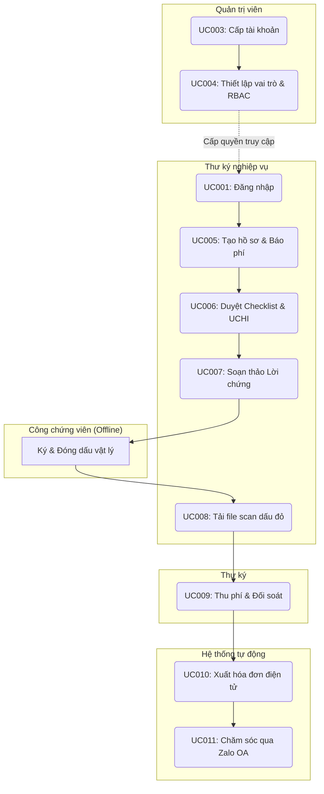
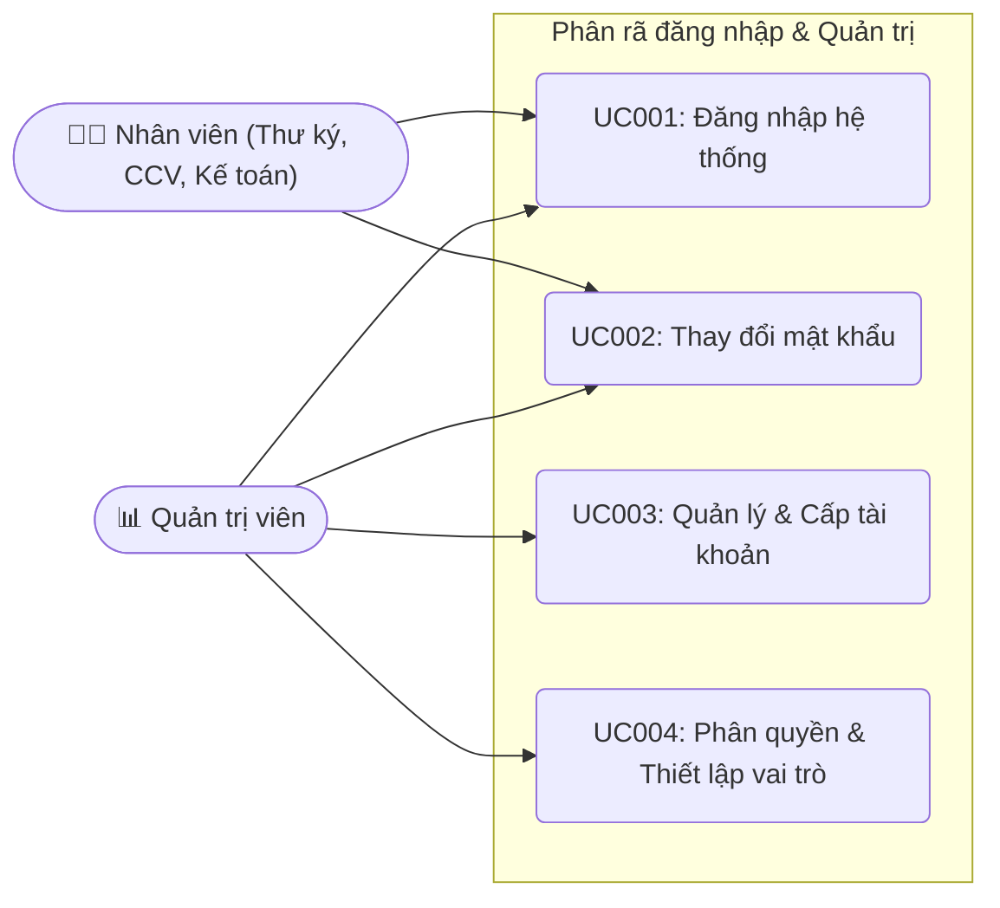
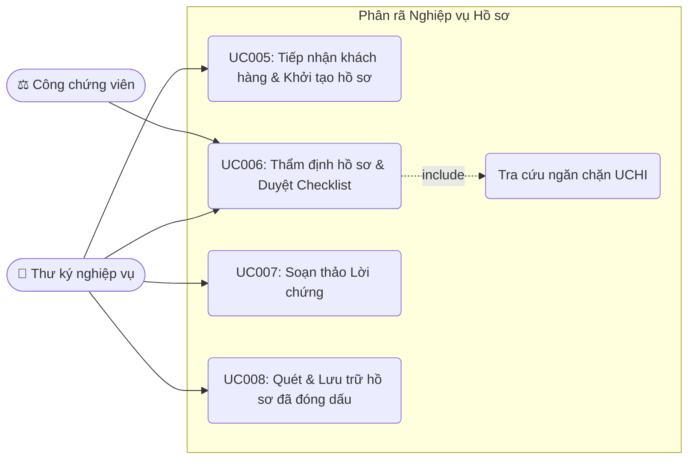
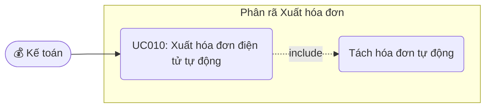
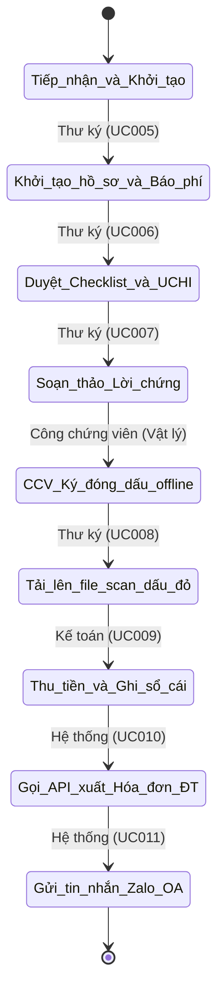

# Tài liệu Đặc tả Yêu cầu Phần mềm (Software Requirements Specification - SRS)
## Hệ thống ERP/CRM Văn phòng Công chứng )

**Phiên bản:** 1.0  
**Đơn vị phát triển:** Danish Software  
**Người soạn thảo:** Vũ Minh Hoàng  
**Ngày tạo:** 17 tháng 06, 2026  

---

## Mục lục

- **[Chương 1. Giới thiệu (Introduction)](#chương-1-giới-thiệu-introduction)**
  - [1.1 Mục đích (Purpose)](#11-mục-đích-purpose)
  - [1.2 Phạm vi (Scope)](#12-phạm-vi-scope)
  - [1.3 Từ điển thuật ngữ (Glossary)](#13-từ-điển-thuật-ngữ-glossary)
  - [1.4 Tài liệu tham khảo (References)](#14-tài-liệu-tham-khảo-references)
  - [1.5 Tổng quát (Overview)](#15-tổng-quát-overview)

- **[Chương 2. Các yêu cầu chức năng (Functional Requirements)](#chương-2-các-yêu-cầu-chức-năng-functional-requirements)**
  - [2.1 Các tác nhân (Actors)](#21-các-tác-nhân-actors)
  - [2.2 Các chức năng của hệ thống (System Functions)](#22-các-chức-năng-của-hệ-thống-system-functions)
  - [2.3 Biểu đồ use case tổng quan (Overall Use Case Diagram)](#23-biểu-đồ-use-case-tổng-quan-overall-use-case-diagram)
  - [2.4 Biểu đồ use case phân rã (Decomposed Use Case Diagrams)](#24-biểu-đồ-use-case-phân-rã-decomposed-use-case-diagrams)
    - [2.4.1 Phân rã nhóm chức năng Xác thực & Quản trị (Auth & Admin)](#241-phân-rã-nhóm-chức-năng-xác-thực--quản-trị-auth--admin)
    - [2.4.2 Phân rã nhóm chức năng Nghiệp vụ Hồ sơ (Dossier Processing)](#242-phân-rã-nhóm-chức-năng-nghiệp-vụ-hồ-sơ-dossier-processing)
    - [2.4.3 Phân rã nhóm chức năng Tài chính & Xuất hóa đơn (Billing & Invoice)](#243-phân-rã-nhóm-chức-năng-tài-chính--xuất-hóa-đơn-billing--invoice)
  - [2.5 Quy trình nghiệp vụ (Business Processes)](#25-quy-trình-nghiệp-vụ-business-processes)
    - [2.5.1 Sơ đồ luồng hoạt động nghiệp vụ tổng quát (Activity Diagram)](#251-sơ-đồ-luồng-hoạt-động-nghiệp-vụ-tổng-quát-activity-diagram)
    - [2.5.2 Luồng xử lý chi tiết theo phân hệ (Sub-system Workflows)](#252-luồng-xử-lý-chi-tết-theo-phân-hệ-sub-system-workflows)
  - [2.6 Đặc tả các usecase (Use Case Specifications)](#26-đặc-tả-các-usecase-use-case-specifications)
    - [2.6.1 Nhóm Use Case Xác thực & Hệ thống (Auth & Admin)](#261-nhóm-use-case-xác-thực--hệ-thống-auth--admin)
      - [UC001: Đăng nhập hệ thống](#uc001-đăng-nhập-hệ-thống)
      - [UC002: Thay đổi mật khẩu](#uc002-thay-đổi-mật-khẩu)
      - [UC003: Quản lý & Cấp tài khoản nhân sự](#uc003-quản-lý--cấp-tài-khoản-nhân-sự)
      - [UC004: Phân quyền & Thiết lập vai trò (RBAC)](#uc004-phân-quyền--thiết-lập-vai-trò-rbac)
    - [2.6.2 Nhóm Use Case Nghiệp vụ (Dossier & Checklist)](#262-nhóm-use-case-nghiệp-vụ-dossier--checklist)
      - [UC005: Tiếp nhận khách hàng & Khởi tạo hồ sơ](#uc005-tiếp-nhận-khách-hàng--khởi-tạo-hồ-sơ)
      - [UC006: Thẩm định hồ sơ & Duyệt Checklist chặn](#uc006-thẩm-định-hồ-sơ--duyệt-checklist-chặn)
      - [UC007: Trộn dữ liệu & Soạn thảo Lời chứng tự động](#uc007-trộn-dữ-liệu--soạn-thảo-lời-chứng-tự-động)
      - [UC008: Quét & Lưu trữ hồ sơ điện tử đã đóng dấu](#uc008-quét--lưu-trữ-hồ-sơ-điện-tử-đã-đóng-dấu)
    - [2.6.3 Nhóm Use Case Tài chính & Chăm sóc (Billing & CRM)](#263-nhóm-use-case-tài-chính--chăm-sóc-billing--crm)
      - [UC009: Thu phí & Đối soát dòng tiền](#uc009-thu-phí--đối-soát-dòng-tiền)
      - [UC010: Xuất hóa đơn điện tử tự động (VNPT/Vĩnh Hy)](#uc010-xuất-hoa-đơn-điện-tử-tự-động-vnptvĩnh-hy)
      - [UC011: Chăm sóc khách hàng tự động qua Zalo OA](#uc011-chăm-sóc-khách-hàng-tự-động-qua-zalo-oa)

---

## Chương 1. Giới thiệu (Introduction)

### 1.1 Mục đích (Purpose)
Tài liệu Đặc tả Yêu cầu Phần mềm (SRS) này xác định và đặc tả chi tiết toàn bộ các yêu cầu chức năng và bối cảnh hoạt động của **Hệ thống ERP/CRM Văn phòng Công chứng ** được triển khai độc lập tại một văn phòng công chứng. Tài liệu đóng vai trò là:
- **Bản căn cứ kỹ thuật và nghiệp vụ:** Giúp Ban quản lý Văn phòng Công chứng và Danish Software thống nhất phạm vi tính năng, làm cơ sở chính xác để nghiệm thu sản phẩm.
- **Tài liệu đặc tả cho đội ngũ phát triển:** Hướng dẫn lập trình viên hiểu đúng luồng xử lý và quy tắc nghiệp vụ để thiết kế cơ sở dữ liệu và viết mã nguồn.
- **Căn cứ xây dựng kịch bản kiểm thử:** Giúp kiểm thử viên (Testers) xây dựng các ca kiểm thử (Test Cases) tương ứng với các luồng hoạt động chính và ngoại lệ của hệ thống.

### 1.2 Phạm vi (Scope)
Giải pháp quản trị tổng thể cho Văn phòng công chứng, giúp số hóa toàn bộ hoạt động vận hành thủ công lên một nền tảng chung. Hệ thống bao quát 3 lớp vận hành chính:
1. **Lớp Khách hàng (CRM):**     
    - Trung tâm lưu trữ dữ liệu khách hàng, Tổ chức / Công ty.
    - Hỗ trợ trực tiếp cho quá trình tạo hồ sơ nhanh chóng.
    - Lưu vết và hiển thị toàn bộ lịch sử các giao dịch với khách hàng và thông tin của khách hàng.
2. **Lớp Nghiệp vụ:** Số hóa toàn bộ quy trình xử lý hồ sơ bao gồm:
   - Quy trình tiếp nhận, khởi tạo và theo dõi trạng thái hồ sơ.
   - Quản lý biểu mẫu, hợp đồng và các phiên bản văn bản (được cấu hình chi tiết theo từng nghiệp vụ cụ thể).
   - Quản lý tính phí (tự động tính phí gốc, phí dịch vụ thù lao thỏa thuận, theo dõi trạng thái thanh toán và tích hợp xuất hóa đơn điện tử tự động).
   - Hệ thống checklist kiểm soát lỗi nghiệp vụ động và tích hợp tra cứu ngăn chặn tài sản (UCHI).
3. **Lớp Quản trị:** Quản lý nhân sự, thiết lập tài khoản và phân quyền vai trò (RBAC) chi tiết, báo cáo thống kê hiệu suất/doanh thu và theo dõi tiến độ công việc chung của toàn văn phòng.

#### Nghiệp vụ cốt lõi (Core Scope):
Tài liệu này đặc tả toàn diện và chi tiết tất cả các yêu cầu chức năng cho toàn bộ hệ thống cũng như quy trình chi tiết của 3 nghiệp vụ cốt lõi được định nghĩa trong Chương 2:
- Phân hệ nghiệp vụ **Sao y bản chính**.
- Phân hệ nghiệp vụ **Dịch thuật công chứng** (Chứng thực chữ ký người dịch).
- Phân hệ nghiệp vụ **Chứng thực chữ ký** (Cá nhân, ủy quyền, tờ khai).

Tất cả các mô tả, sơ đồ quy trình và đặc tả use case chi tiết của 3 nghiệp vụ này được trình bày trực tiếp và duy nhất trong tài liệu này để đảm bảo tính tập trung.

### 1.3 Từ điển thuật ngữ (Glossary)
| Thuật ngữ | Định nghĩa |
| :--- | :--- |
| **VPCC** | Văn phòng Công chứng |
| **CCV** | Công chứng viên (người có thẩm quyền ký và đóng dấu lời chứng) |
| **UCHI** | Cơ sở dữ liệu ngăn chặn giao dịch và lịch sử công chứng tài sản của Sở Tư pháp |
| **CRM** | Customer Relationship Management - Hệ thống quản lý thông tin khách hàng |
| **ERP** | Enterprise Resource Planning - Hệ thống quản trị nguồn lực doanh nghiệp |
| **RBAC** | Role-Based Access Control - Phân quyền truy cập dựa trên vai trò |
| **Lời chứng** | Phần nội dung pháp lý do CCV ký ghi nhận việc công chứng/chứng thực |
| **Bản chính** | Giấy tờ gốc do cơ quan thẩm quyền cấp làm cơ sở đối chiếu |
| **Audit Log** | Nhật ký hệ thống tự động lưu lại các hành động của người dùng |
| **MST** | Mã số thuế (dùng cho doanh nghiệp B2B) |
| **Người dịch** | Cộng tác viên dịch thuật tài liệu đã đăng ký chữ ký mẫu tại VPCC phục vụ luồng dịch thuật công chứng |
| **Người yêu cầu** | Cá nhân hoặc đại diện tổ chức nộp hồ sơ yêu cầu sao y, dịch thuật hoặc chứng thực chữ ký |
| **Biên lai tạm thời** | Chứng từ in tạm kèm mã QR tra cứu phục vụ khi API hóa đơn điện tử gặp sự cố mất kết nối |

### 1.4 Tài liệu tham khảo (References)
- Quy chuẩn đặc tả phần mềm: *IEEE Recommended Practice for Software Requirements Specifications,* IEEE Std 830-1998.
- [Luật Công chứng số 51/2014/QH13](https://vanban.chinhphu.vn/?pageid=27160&docid=177893) - Cổng Thông tin điện tử Chính phủ.
- [Nghị định số 13/2023/NĐ-CP về Bảo vệ dữ liệu cá nhân](https://vanban.chinhphu.vn/?pageid=27160&docid=207767) - Cổng Thông tin điện tử Chính phủ.
- [Nghị định số 23/2015/NĐ-CP về cấp bản sao, chứng thực bản sao, chứng thực chữ ký](https://vanban.chinhphu.vn/?pageid=27160&docid=178657) - Cổng Thông tin điện tử Chính phủ.
- [Nghị định số 123/2020/NĐ-CP quy định về hóa đơn, chứng từ](https://vanban.chinhphu.vn/?pageid=27160&docid=201488) - Cổng Thông tin điện tử Chính phủ.

### 1.5 Tổng quát (Overview)
Dự án được phát triển nhằm mục tiêu xây dựng một hệ thống quản trị tổng thể (ERP/CRM) chuyên biệt cho văn phòng công chứng. Hệ thống số hóa toàn bộ quy trình tiếp nhận hồ sơ tại quầy, (thẩm định pháp lý) và kiểm soát lỗi qua checklist chặn, tra cứu dữ liệu ngăn chặn giao dịch (UCHI), quản lý dòng tiền hạch toán và tự động xuất hóa đơn VAT, cũng như chăm sóc khách hàng tự động qua Zalo OA. Dự án giúp tối ưu hóa hiệu suất làm việc liên phòng ban (Thư ký, Công chứng viên, Kế toán, Admin), giảm thiểu 95% sai sót nghiệp vụ và nâng cao trải nghiệm dịch vụ khách hàng.

---

## Chương 2. Các yêu cầu chức năng (Functional Requirements)

### 2.1 Các tác nhân (Actors)
Hệ thống định nghĩa 5 tác nhân (vai trò người dùng) trực tiếp tương tác và vận hành trên hệ thống:

1. **Thư ký nghiệp vụ (Secretary):**
   - **Mô tả:** Nhân sự chuyên môn trực tiếp làm việc với khách hàng và xử lý hồ sơ từ đầu đến cuối quy trình nghiệp vụ.
   - **Nhiệm vụ trên hệ thống:**
     - Tiếp nhận khách hàng, tra cứu định danh hoặc tạo mới thông tin khách hàng (CRM).
     - Kết nối phần cứng tại quầy (máy đọc chip CCCD, máy quét mã QR, máy scan) để thu thập thông tin khách hàng và tài liệu gốc.
     - Khởi tạo hồ sơ nghiệp vụ, nhập các thông số đầu vào (loại giấy tờ, số trang, số bản).
     - Xác nhận báo phí dịch vụ với khách hàng.
     - Thực hiện kiểm tra các đầu mục của checklist động tương ứng với loại giấy tờ.
     - Tra cứu thông tin ngăn chặn tài sản trên CSDL UCHI đối với các tài sản rủi ro (như Sổ đỏ).
     - Sinh và in Lời chứng hoặc biểu mẫu hợp đồng để trình Công chứng viên ký offline.
     - Chụp/scan bản cứng tài liệu đã ký đóng dấu đỏ vật lý để tải lên hệ thống mở khóa luồng kế toán.

2. **Công chứng viên (Notary Officer):**
   - **Mô tả:** Người có thẩm quyền tư pháp chịu trách nhiệm xem xét, phê duyệt tối cao và ký lời chứng.
   - **Nhiệm vụ trên hệ thống:**
     - Đăng nhập hệ thống để theo dõi và phê duyệt trực tuyến các hồ sơ nghiệp vụ do Thư ký chuẩn bị.
     - Thực hiện ký đóng dấu bản cứng offline sau khi đã đối chiếu và duyệt trên hệ thống.

3. **Kế toán (Accountant):**
   - **Mô tả:** Nhân sự phụ trách thu chi tài chính và quản lý hóa đơn tại văn phòng công chứng.
   - **Nhiệm vụ trên hệ thống:**
     - Theo dõi danh sách hồ sơ ở trạng thái "Chờ thanh toán".
     - Xác nhận phương thức thanh toán thực tế của khách hàng (tiền mặt, chuyển khoản ngân hàng hoặc quẹt thẻ POS).
     - Xác nhận nhận đủ tiền, hệ thống tự động ghi sổ cái bất biến và gọi API phát hành hóa đơn điện tử tự động gửi Zalo OA cho khách hàng.

4. **Quản trị viên (Admin):**
   - **Mô tả:** Nhân sự quản trị kỹ thuật, cấu hình hệ thống.
   - **Nhiệm vụ trên hệ thống:**
     - Quản lý tài khoản nhân sự (tạo mới, khóa, mở khóa tài khoản).
     - Thiết lập ma trận phân quyền dựa trên vai trò (RBAC) cho nhân viên.
     - Quản lý kho mẫu lời chứng, biểu mẫu hợp đồng động.
     - Cấu hình biểu phí dịch vụ (phí gốc và thù lao dịch vụ khác).
5. **Cộng tác viên dịch thuật:**
   - **Mô tả:** Nhân viên làm việc tự do bên ngoài, có thể truy cập vào hệ thống để thực hiện các công việc liên quan đến dịch thuật.
   - **Nhiệm vụ trên hệ thống:**
     - Thực hiện dịch thuật tài liệu do Thư ký gửi tải lên hồ sơ.
     - Upload bản dịch đã hoàn thiện để trình Công chứng viên phê duyệt.
     - Nhận phản hồi và chỉnh sửa bản dịch nếu cần.

### 2.2 Các chức năng của hệ thống (System Functions)
Các chức năng cốt lõi của hệ thống được phân chia theo 3 lớp vận hành chính:

#### A. Lớp Khách hàng (CRM)
- **Quản lý khách hàng:** Thêm mới, cập nhật và lưu trữ thông tin định danh của khách hàng cá nhân (CCCD, SĐT) và doanh nghiệp (Mã số thuế, địa chỉ trụ sở).
- **Auto-fill & Tra cứu nhanh:** Tự động điền thông tin khách hàng cũ dựa vào SĐT, Căn cước công dân (CCCD) khi tạo hồ sơ mới.
- **Lịch sử giao dịch:** Lưu vết và hiển thị toàn bộ lịch sử hồ sơ, giao dịch của từng khách hàng tại văn phòng.
- **Tương tác đa kênh:** Tự động gửi tin nhắn chăm sóc, thông báo nhận kết quả và link hóa đơn VAT qua Zalo OA.

#### B. Lớp Nghiệp vụ
- **Tiếp nhận & Tạo hồ sơ:** Khởi tạo hồ sơ nghiệp vụ, tự động cấp mã hồ sơ duy nhất, chọn dịch vụ (Sao y, Dịch thuật, Chứng thực chữ ký).
- **Checklist động & Kiểm soát lỗi:** Áp đặt các danh sách kiểm tra bắt buộc tùy thuộc vào loại giấy tờ để ngăn ngừa lỗi kỹ thuật của Thư ký.
- **Tra cứu ngăn chặn (UCHI):** Kết nối API hệ thống UCHI của Sở Tư pháp để tra cứu trạng thái phong tỏa của thửa đất/tài sản rủi ro cao.
- **Soạn thảo & Quản lý phiên bản:** Tự động trộn dữ liệu hồ sơ vào mẫu Lời chứng, quản lý các phiên bản tài liệu (Nháp, Đang xử lý, Chờ ký, Đã ký).
- **Quản lý tính phí nghiệp vụ:** Tự động tính phí gốc nhà nước theo trang/bản, bóc tách thù lao dịch vụ khác, và tự động phân tách hóa đơn con khi phí gốc vượt trần pháp luật quy định ($\le 200.000đ$).
- **Scan & Lưu trữ tài liệu:** Hỗ trợ quét và lưu trữ bản chụp dấu đỏ đã hoàn thành lên hệ thống đám mây làm cơ sở đối chiếu và lưu trữ điện tử.

#### C. Lớp Quản trị
- **Xác thực & Bảo mật:** Đăng nhập, thay đổi mật khẩu, chính sách độ phức tạp mật khẩu, và session timeout tự động.
- **Quản trị tài khoản & Nhân sự:** Tạo mới, khóa/mở khóa tài khoản nhân viên.
- **Phân quyền RBAC:** Cấu hình ma trận quyền chi tiết (Xem, Thêm, Sửa, Xóa, Duyệt) cho từng vai trò đối với từng chức năng.
- **Nhật ký hệ thống (Audit Trail):** Ghi nhận bất biến thao tác của toàn bộ người dùng trên hệ thống.
- **Quản lý biểu mẫu & Biểu phí:** Cấu hình mẫu lời chứng động và thiết lập công thức tính phí cho từng nhóm dịch vụ.

### 2.3 Biểu đồ use case tổng quan (Overall Use Case Diagram)
Biểu đồ dưới đây phân bổ các Use Case vào các phân vùng (Swimlanes) đại diện cho từng tác nhân thực hiện, thể hiện luồng di chuyển và tương tác của hồ sơ qua các bộ phận:

### 2.4 Biểu đồ use case phân rã (Decomposed Use Case Diagrams)

#### 2.4.1 Phân rã nhóm chức năng đăng nhập & Quản trị (Auth & Admin)
Nhóm chức năng này phục vụ quản lý tài khoản nhân viên, thiết lập mật khẩu và phân quyền hoạt động trong hệ thống:

#### 2.4.2 Phân rã nhóm chức năng Nghiệp vụ Hồ sơ (Dossier Processing)
Nhóm chức năng nghiệp vụ xử lý tài liệu do Thư ký phụ trách, có sự tham gia phê duyệt nội dung trực tiếp của Công chứng viên:

#### 2.4.3 Phân rã nhóm chức năng Xuất hóa đơn (Billing & Invoice)
Nhóm chức năng xuất hóa đơn điện tử tự động, kết hợp với các tiến trình tự động hóa của hệ thống:

### 2.5 Quy trình nghiệp vụ (Business Processes)

#### 2.5.1 Sơ đồ luồng hoạt động nghiệp vụ tổng quát (Activity Diagram)
Quy trình nghiệp vụ khép kín của một hồ sơ công chứng/chứng thực chung từ khi tiếp nhận khách hàng cho tới lúc hoàn tất được mô tả qua sơ đồ dưới đây:

#### 2.5.2 Luồng xử lý chi tiết theo phân hệ (Sub-system Workflows)
Quy trình vận hành chung trên hệ thống được điều phối qua 5 bước chính:
1. **Tiếp nhận & Tạo hồ sơ (Thư ký):** Thư ký nhận bản gốc và yêu cầu từ khách hàng. Thư ký quét SĐT/CCCD/MST của khách, hệ thống tự động điền (auto-fill) thông tin định danh cũ. Thư ký nhập loại giấy tờ, số trang, số bản. Hệ thống tự động tính phí gốc, Thư ký nhập số tiền thực thu thỏa thuận và báo phí cho khách. Khách hàng xác nhận đồng ý.
2. **Kiểm soát quy trình & Thẩm định (Thư ký):** Thư ký đối chiếu thực tế bản chính. Hệ thống tự động kích hoạt bộ checklist động kiểm soát lỗi tương ứng với loại tài liệu. Nếu giấy tờ thuộc danh mục rủi ro (như Sổ đỏ), Thư ký bắt buộc click tra cứu trạng thái ngăn chặn trên CSDL UCHI của Sở Tư pháp.
3. **Ký duyệt (Thư ký & Công chứng viên):** Sau khi hoàn thành checklist và kết quả tra cứu hợp lệ, Thư ký click in lời chứng/hợp đồng đã trộn dữ liệu tự động. Thư ký kẹp bản in trình CCV duyệt. CCV xem danh sách chờ trên màn hình của mình và ký đóng dấu đỏ vật lý lên bản cứng offline. Thư ký nhận lại bản cứng, scan chụp ảnh và tải lên hệ thống để lưu trữ điện tử, mở chặn luồng kế toán.
4. **Hạch toán & Xuất hóa đơn (Kế toán):** Hồ sơ tự động chuyển sang hàng chờ thanh toán. Kế toán đối chiếu thực thu, chọn hình thức thanh toán (Cash/Bank Transfer/POS) và bấm xác nhận đã nhận tiền. Hệ thống tự động ghi bản ghi tài chính bất biến vào sổ cái. Đồng thời gọi API tự động xuất hóa đơn điện tử thông qua nhà cung cấp VNPT/Vĩnh Hy.
5. **Trả kết quả & Chăm sóc khách hàng (Hệ thống):** Hệ thống gọi API Zalo OA tự động gửi tin nhắn ZNS cảm ơn khách hàng kèm đường dẫn tải hóa đơn VAT. Khách hàng nhận lại hồ sơ gốc, bản sao y đóng dấu đỏ hợp lệ và ra về.

---

### 2.6 Đặc tả các usecase (Use Case Specifications)

#### 2.6.1 Nhóm Use Case Xác thực & Hệ thống (Auth & Admin)

##### UC001: Đăng nhập hệ thống
| Đặc tả Use Case | Chi tiết |
| :--- | :--- |
| **Mã Use Case** | UC001 |
| **Tên Use Case** | Đăng nhập hệ thống |
| **Tác nhân** | Thư ký nghiệp vụ, Công chứng viên, Kế toán, Quản trị viên (Tất cả nhân sự) |
| **Mô tả** | Người dùng đăng nhập vào hệ thống bằng tài khoản (Email) và mật khẩu để bắt đầu phiên làm việc. |
| **Sự kiện kích hoạt** | Người dùng truy cập đường dẫn hệ thống và nhấn nút Đăng nhập. |
| **Tiền điều kiện** | Người dùng đã được cấp tài khoản hoạt động trên hệ thống. |
| **Luồng sự kiện chính (Thành công)** | **STT \| Thực hiện bởi \| Hành động**  1. Người dùng \| Nhập Email và Mật khẩu vào form đăng nhập.  2. Người dùng \| Nhấn nút "Đăng nhập".  3. Hệ thống \| Kiểm tra tính hợp lệ của định dạng Email và sự tồn tại của tài khoản.  4. Hệ thống \| Xác thực mật khẩu đã mã hóa một chiều trong cơ sở dữ liệu.  5. Hệ thống \| Khởi tạo phiên làm việc (JWT Session), phân quyền theo vai trò người dùng.  6. Hệ thống \| Điều hướng người dùng về trang Dashboard tương ứng với vai trò của họ. |
| **Luồng sự kiện thay thế / Ngoại lệ** | **STT \| Thực hiện bởi \| Hành động**  **[ERR-AUTH-01] Nhập thiếu thông tin:**  3a. Hệ thống phát hiện bỏ trống Email hoặc Mật khẩu -> Hiển thị thông báo: "Vui lòng nhập đầy đủ thông tin".  **[ERR-AUTH-02] Tài khoản bị khóa:**  3b. Hệ thống phát hiện tài khoản đang bị khóa (Deactivated) -> Từ chối đăng nhập và hiển thị: "Tài khoản của bạn đã bị khóa, vui lòng liên hệ Admin".  **[ERR-AUTH-03] Sai mật khẩu:**  4a. Hệ thống phát hiện sai mật khẩu -> Hiển thị: "Email hoặc mật khẩu không chính xác" và tăng số lần đăng nhập sai của tài khoản lên 1.  **[ERR-AUTH-04] Khóa tài khoản do sai quá 5 lần:**  4b. Hệ thống phát hiện số lần nhập sai liên tiếp đạt 5 lần -> Tự động khóa tài khoản tạm thời trong 15 phút và hiển thị: "Tài khoản đã bị tạm khóa 15 phút do nhập sai quá 5 lần". |
| **Hậu điều kiện** | Phiên làm việc được tạo thành công; người dùng truy cập được Dashboard phân quyền. |

##### Bảng dữ liệu đầu vào của Use Case UC001:
| STT | Trường dữ liệu | Mô tả | Bắt buộc? | Điều kiện hợp lệ | Ví dụ |
| :--- | :--- | :--- | :--- | :--- | :--- |
| 1 | Email | Tên đăng nhập của nhân viên | Có | Đúng định dạng email tiêu chuẩn | secretary@notary.vn |
| 2 | Mật khẩu | Mật khẩu truy cập | Có | Độ dài tối thiểu 8 ký tự | P@ssw0rd123 |

---

##### UC002: Thay đổi mật khẩu
| Đặc tả Use Case | Chi tiết |
| :--- | :--- |
| **Mã Use Case** | UC002 |
| **Tên Use Case** | Thay đổi mật khẩu |
| **Tác nhân** | Thư ký nghiệp vụ, Công chứng viên, Kế toán, Quản trị viên (Tất cả nhân sự) |
| **Mô tả** | Người dùng tự thay đổi mật khẩu hiện tại của mình để nâng cao tính bảo mật cho tài khoản. |
| **Sự kiện kích hoạt** | Người dùng nhấn vào nút "Đổi mật khẩu" trong phần cấu hình cá nhân. |
| **Tiền điều kiện** | Người dùng đã đăng nhập thành công vào hệ thống. |
| **Luồng sự kiện chính (Thành công)** | **STT \| Thực hiện bởi \| Hành động**  1. Người dùng \| Nhập mật khẩu hiện tại, mật khẩu mới và xác nhận mật khẩu mới.  2. Người dùng \| Nhấn nút "Lưu thay đổi".  3. Hệ thống \| Xác thực mật khẩu hiện tại có trùng khớp với dữ liệu lưu trữ.  4. Hệ thống \| Kiểm tra mật khẩu mới có đạt độ phức tạp yêu cầu (8 ký tự, chữ hoa, thường, số, ký tự đặc biệt).  5. Hệ thống \| Kiểm tra mật khẩu mới và xác nhận mật khẩu mới phải khớp nhau.  6. Hệ thống \| Mã hóa mật khẩu mới và lưu đè vào CSDL.  7. Hệ thống \| Hiển thị thông báo "Đổi mật khẩu thành công" và yêu cầu đăng nhập lại. |
| **Luồng sự kiện thay thế / Ngoại lệ** | **STT \| Thực hiện bởi \| Hành động**  **[ERR-PWD-01] Sai mật khẩu hiện tại:**  3a. Hệ thống phát hiện mật khẩu hiện tại không khớp -> Báo lỗi: "Mật khẩu hiện tại không chính xác".  **[ERR-PWD-02] Mật khẩu mới không đạt độ phức tạp:**  4a. Hệ thống phát hiện mật khẩu mới yếu -> Báo lỗi: "Mật khẩu phải từ 8 ký tự trở lên, gồm chữ hoa, thường, số và ký tự đặc biệt".  **[ERR-PWD-03] Xác nhận mật khẩu mới không khớp:**  5a. Hệ thống phát hiện mật khẩu mới và mật khẩu xác nhận không khớp -> Báo lỗi: "Xác nhận mật khẩu mới không trùng khớp". |
| **Hậu điều kiện** | Mật khẩu tài khoản được cập nhật; toàn bộ phiên đăng nhập cũ trên các thiết bị khác bị hủy bỏ. |

##### Bảng dữ liệu đầu vào của Use Case UC002:
| STT | Trường dữ liệu | Mô tả | Bắt buộc? | Điều kiện hợp lệ | Ví dụ |
| :--- | :--- | :--- | :--- | :--- | :--- |
| 1 | Mật khẩu hiện tại | Mật khẩu đang sử dụng | Có | Khớp với mật khẩu hiện tại trong CSDL | P@ssw0rd123 |
| 2 | Mật khẩu mới | Mật khẩu mới mong muốn | Có | Tối thiểu 8 ký tự, đủ hoa/thường/số/đặc biệt | NewP@ss2026 |
| 3 | Xác nhận mật khẩu | Nhập lại mật khẩu mới để đối khớp | Có | Trùng khít hoàn toàn với trường "Mật khẩu mới" | NewP@ss2026 |

---

##### UC003: Quản lý & Cấp tài khoản nhân sự
| Đặc tả Use Case | Chi tiết |
| :--- | :--- |
| **Mã Use Case** | UC003 |
| **Tên Use Case** | Quản lý & Cấp tài khoản nhân sự |
| **Tác nhân** | Quản trị viên (Admin) |
| **Mô tả** | Admin thực hiện các thao tác quản lý vòng đời tài khoản của nhân viên: Cấp mới tài khoản, khóa hoặc mở khóa tài khoản. |
| **Sự kiện kích hoạt** | Admin truy cập mục "Quản lý nhân sự" và chọn "Thêm nhân viên" hoặc click nút "Khóa/Mở khóa" trên một tài khoản hiện có. |
| **Tiền điều kiện** | Admin đã đăng nhập thành công vào hệ thống. |
| **Luồng sự kiện chính (Thành công - Tạo tài khoản):** | **STT \| Thực hiện bởi \| Hành động**  1. Admin \| Nhập thông tin nhân viên mới: Họ tên, Email, Số điện thoại và chọn vai trò mặc định ban đầu.  2. Admin \| Nhấn nút "Tạo tài khoản".  3. Hệ thống \| Kiểm tra tính duy nhất của Email và Số điện thoại trong CSDL.  4. Hệ thống \| Tạo bản ghi tài khoản mới ở trạng thái "Chờ kích hoạt".  5. Hệ thống \| Tự động sinh mật khẩu ngẫu nhiên đạt chuẩn an toàn.  6. Hệ thống \| Gửi một email kích hoạt tự động chứa thông tin tài khoản và mật khẩu tạm thời kèm liên kết kích hoạt đến email nhân viên.  7. Hệ thống \| Hiển thị thông báo "Tạo tài khoản nhân viên thành công". |
| **Luồng sự kiện thay thế / Ngoại lệ** | **STT \| Thực hiện bởi \| Hành động**  **[ERR-ACC-01] Email hoặc SĐT đã tồn tại:**  3a. Hệ thống phát hiện Email hoặc SĐT đã được đăng ký bởi nhân viên khác -> Báo lỗi: "Email hoặc Số điện thoại đã tồn tại trên hệ thống".  **[Luồng phụ 1] Khóa tài khoản:**  1. Admin click nút "Khóa tài khoản" trên tài khoản nhân viên đang hoạt động.  2. Hệ thống chuyển trạng thái tài khoản sang "Bị khóa" (Deactivated). Toàn bộ JWT token hiện tại của tài khoản đó bị hủy lập tức, nhân viên bị logout và không thể đăng nhập.  **[Luồng phụ 2] Mở khóa tài khoản:**  1. Admin click nút "Mở khóa tài khoản" trên tài khoản đang bị khóa.  2. Hệ thống chuyển trạng thái tài khoản sang "Đang hoạt động" (Active), cho phép nhân viên đăng nhập bình thường. |
| **Hậu điều kiện** | Tài khoản nhân sự mới được tạo ở trạng thái Chờ kích hoạt hoặc tài khoản hiện tại được Khóa/Mở khóa thành công. |

##### Bảng dữ liệu đầu vào của Use Case UC003:
| STT | Trường dữ liệu | Mô tả | Bắt buộc? | Điều kiện hợp lệ | Ví dụ |
| :--- | :--- | :--- | :--- | :--- | :--- |
| 1 | Họ và tên | Họ tên của nhân viên mới | Có | Chuỗi ký tự chữ | Trần Văn B |
| 2 | Email | Email công việc của nhân viên | Có | Định dạng email, chưa tồn tại trong hệ thống | tranvanb@notary.vn |
| 3 | Số điện thoại | SĐT liên hệ | Có | Gồm 10 số, chưa tồn tại trong hệ thống | 0987654321 |
| 4 | Vai trò | Vai trò phân quyền ban đầu | Có | Chọn 1 trong các vai trò (Thư ký, CCV, Kế toán, Admin) | Thư ký nghiệp vụ |

---

##### UC004: Phân quyền & Thiết lập vai trò (RBAC)
| Đặc tả Use Case | Chi tiết |
| :--- | :--- |
| **Mã Use Case** | UC004 |
| **Tên Use Case** | Phân quyền & Thiết lập vai trò (RBAC) |
| **Tác nhân** | Quản trị viên (Admin) |
| **Mô tả** | Admin cấu hình ma trận quyền hạn (Quyền Xem, Thêm, Sửa, Xóa mềm, Phê duyệt) cho từng vai trò trên từng module chức năng của hệ thống. |
| **Sự kiện kích hoạt** | Admin truy cập màn hình "Cấu hình phân quyền" trên hệ thống. |
| **Tiền điều kiện** | Admin đã đăng nhập thành công vào hệ thống. |
| **Luồng sự kiện chính (Thành công)** | **STT \| Thực hiện bởi \| Hành động**  1. Admin \| Chọn vai trò cần cấu hình (ví dụ: Thư ký nghiệp vụ).  2. Hệ thống \| Hiển thị danh sách các module chức năng và ma trận các quyền check/uncheck tương ứng.  3. Admin \| Thực hiện tích chọn hoặc bỏ tích chọn các quyền chi tiết cho vai trò đó.  4. Admin \| Nhấn nút "Lưu cấu hình quyền".  5. Hệ thống \| Kiểm tra tính hợp lệ của thiết lập quyền và ghi nhận cấu hình mới vào CSDL.  6. Hệ thống \| Áp dụng quyền mới ngay lập tức cho toàn bộ các tài khoản thuộc vai trò đó.  7. Hệ thống \| Ghi nhận hành động thay đổi phân quyền vào nhật ký hệ thống (Audit Log) (ID Admin, vai trò bị sửa đổi, danh sách quyền cũ/mới).  8. Hệ thống \| Thông báo "Cập nhật ma trận phân quyền thành công". |
| **Luồng sự kiện thay thế / Ngoại lệ** | **STT \| Thực hiện bởi \| Hành động**  **[ERR-RBAC-01] Tự tước quyền Admin:**  5a. Hệ thống phát hiện Admin bỏ chọn quyền "Quản lý phân quyền" của chính vai trò Admin -> Chặn lưu và báo lỗi: "Không thể tự tước quyền quản trị phân quyền của vai trò Admin hệ thống". |
| **Hậu điều kiện** | Ma trận phân quyền của hệ thống được cập nhật; Audit Log được ghi nhận chi tiết. |

##### Bảng dữ liệu đầu vào của Use Case UC004:
| STT | Trường dữ liệu | Mô tả | Bắt buộc? | Điều kiện hợp lệ | Ví dụ |
| :--- | :--- | :--- | :--- | :--- | :--- |
| 1 | Vai trò | Vai trò cần cấu hình quyền | Có | Phải tồn tại trong danh mục vai trò hệ thống | Thư ký nghiệp vụ |
| 2 | Ma trận quyền | Tập hợp các checkbox quyền (Read, Create, Update, Delete, Approve) theo từng module | Có | Mảng các giá trị Boolean | `[{ module: "CRM", read: true, create: true, update: false }]` |

---

#### 2.6.2 Nhóm Use Case Nghiệp vụ (Dossier & Checklist)

##### UC005: Tiếp nhận khách hàng & Khởi tạo hồ sơ
| Đặc tả Use Case | Chi tiết |
| :--- | :--- |
| **Mã Use Case** | UC005 |
| **Tên Use Case** | Tiếp nhận khách hàng & Khởi tạo hồ sơ |
| **Tác nhân** | Thư ký nghiệp vụ |
| **Mô tả** | Thư ký tiếp nhận yêu cầu chứng thực từ khách hàng, tra cứu/nhập thông tin định danh và khởi tạo hồ sơ nghiệp vụ trên hệ thống. |
| **Sự kiện kích hoạt** | Thư ký nhấn nút "Tạo hồ sơ mới" trên Dashboard nghiệp vụ. |
| **Tiền điều kiện** | Thư ký nghiệp vụ đã đăng nhập thành công vào hệ thống. |
| **Luồng sự kiện chính (Thành công)** | **STT \| Thực hiện bởi \| Hành động**  1. Thư ký \| Nhập Số điện thoại/CCCD (Cá nhân) hoặc Mã số thuế (Doanh nghiệp) vào ô tìm kiếm.  2. Hệ thống \| Tìm kiếm trong CRM: Nếu có dữ liệu cũ, tự động điền (Auto-fill) thông tin định danh. Nếu chưa có, mở form thêm mới khách hàng.  3. Thư ký \| Chọn loại nghiệp vụ (Sao y bản chính, Chứng thực chữ ký, Dịch thuật công chứng).  4. Thư ký \| Chọn loại giấy tờ (CCCD, Sổ đỏ, Bằng cấp, Giấy phép kinh doanh,...) từ danh sách dropdown.  5. Thư ký \| Nhập các thông số kỹ thuật (Số trang gốc, Số bản cần làm).  6. Hệ thống \| Tự động tính phí gốc theo công thức của Nhà nước.  7. Thư ký \| Nhập số tiền thực tế thống nhất thu vào trường "Tổng thực thu" và báo phí cho khách.  8. Thư ký \| Tích chọn checkbox `Khách hàng đồng ý báo phí` và nhấn "Lưu hồ sơ".  9. Hệ thống \| Khởi tạo hồ sơ, tự động sinh Mã hồ sơ duy nhất, đặt trạng thái hồ sơ thành "Đang xử lý". |
| **Luồng sự kiện thay thế / Ngoại lệ** | **STT \| Thực hiện bởi \| Hành động**  **[ERR-DOS-01] Tổng thực thu nhỏ hơn Phí gốc:**  7a. Hệ thống phát hiện số thực thu nhỏ hơn phí gốc tính toán -> Hiển thị cảnh báo đỏ và chặn không cho lưu.  **[ERR-DOS-02] Kết nối API Thuế lỗi khi nhập MST:**  2a. Hệ thống gọi API thuế bị timeout -> Báo lỗi: "Mất kết nối API Thuế, vui lòng nhập tay thông tin doanh nghiệp" và mở khóa các ô tên công ty, địa chỉ để Thư ký nhập thủ công.  **[Luồng phụ 1] Chứng thực chữ ký người dịch:**  3a. Thư ký chọn loại "Dịch thuật công chứng" -> Hệ thống hiển thị thêm trường tìm kiếm "Người dịch (Cộng tác viên)". Thư ký nhập thông tin Người dịch để hệ thống liên kết chữ ký mẫu. |
| **Hậu điều kiện** | Bản ghi hồ sơ được tạo thành công trên hệ thống với trạng thái "Đang xử lý". |

##### Bảng dữ liệu đầu vào của Use Case UC005:
| STT | Trường dữ liệu | Mô tả | Bắt buộc? | Điều kiện hợp lệ | Ví dụ |
| :--- | :--- | :--- | :--- | :--- | :--- |
| 1 | Số điện thoại | SĐT của khách hàng | Có | Gồm 10 chữ số | 0912345678 |
| 2 | Họ và tên | Tên khách hàng | Có | Chuỗi ký tự chữ | Nguyễn Văn A |
| 3 | Loại nghiệp vụ | Phân loại hồ sơ | Có | Thuộc danh mục (Sao y, Dịch thuật, Chứng thực) | Sao y bản chính |
| 4 | Loại giấy tờ | Danh mục giấy tờ hệ thống | Có | Phải chọn từ danh sách cấu hình sẵn | Sổ đỏ / Giấy chứng nhận |
| 5 | Số trang | Số trang tài liệu gốc | Có | Số nguyên dương > 0 | 4 |
| 6 | Số bản | Số bản cần chứng thực | Có | Số nguyên dương > 0 | 5 |
| 7 | Tổng thực thu | Tiền thu thỏa thuận | Có | Số tiền $\ge$ Phí gốc nhà nước | 100000 |
| 8 | Người dịch | ID của Cộng tác viên dịch thuật | Chỉ khi là Dịch thuật | Phải tồn tại trong CSDL cộng tác viên | CTV-002 |

---

##### UC006: Thẩm định hồ sơ & Duyệt Checklist chặn
| Đặc tả Use Case | Chi tiết |
| :--- | :--- |
| **Mã Use Case** | UC006 |
| **Tên Use Case** | Thẩm định hồ sơ & Duyệt Checklist chặn |
| **Tác nhân** | Thư ký nghiệp vụ |
| **Mô tả** | Thư ký đối chiếu tài liệu vật lý và thực hiện tích chọn đầy đủ checklist nghiệp vụ tương ứng và tra cứu trạng thái ngăn chặn tài sản (nếu có). |
| **Sự kiện kích hoạt** | Thư ký mở một hồ sơ ở trạng thái "Đang xử lý". |
| **Tiền điều kiện** | Hồ sơ đã được tạo thành công (UC005). |
| **Luồng sự kiện chính (Thành công)** | **STT \| Thực hiện bởi \| Hành động**  1. Thư ký \| Kiểm tra các tài liệu đính kèm. Hệ thống tự động tải bộ Checklist động theo loại giấy tờ đã chọn.  2. Thư ký \| Tích chọn hoàn thành lần lượt 100% các đầu mục trong checklist bắt buộc.  3. Thư ký \| Nhấn nút "UCHI Search" để hệ thống tự động gọi API kiểm tra ngăn chặn trên CSDL của Sở Tư pháp (nếu là giấy tờ tài sản như Sổ đỏ).  4. Hệ thống \| Trả về kết quả "Không có ngăn chặn".  5. Thư ký \| Nhấn nút "Xác nhận hoàn thành thẩm định".  6. Hệ thống \| Ghi nhận log hoàn tất thẩm định (Timestamp, ID Thư ký, checklist được chọn) và mở khóa tính năng in Lời chứng (UC007). |
| **Luồng sự kiện thay thế / Ngoại lệ** | **STT \| Thực hiện bởi \| Hành động**  **[ERR-CHK-01] Phát hiện giấy tờ giả mạo/lỗi vật lý:**  2a. Thư ký phát hiện lỗi vật lý -> Nhấn nút "Từ chối hồ sơ", nhập lý do từ chối. Hệ thống cập nhật hồ sơ thành "Đã hủy" và lưu log.  **[ERR-CHK-02] UCHI phát hiện tài sản đang bị ngăn chặn:**  4a. API UCHI trả về cờ "Đang bị ngăn chặn giao dịch" -> Hệ thống lập tức hiển thị cảnh báo đỏ, khóa nút in Lời chứng, đổi trạng thái hồ sơ sang "Bị ngăn chặn" và gửi cảnh báo về màn hình Quản lý.  **[ERR-CHK-03] Mất mạng / API UCHI lỗi:**  4b. API UCHI lỗi kết nối -> Hệ thống hiển thị: "UCHI offline, yêu cầu kiểm tra thủ công". Thư ký kiểm tra sổ ngăn chặn vật lý và tích chọn checklist bổ sung: `Xác nhận kiểm tra thủ công và chịu trách nhiệm`. Hệ thống ghi nhận log override. |
| **Hậu điều kiện** | Hệ thống xác thực hoàn tất thẩm định, ghi log an toàn và mở khóa quyền in Lời chứng. |

##### Bảng dữ liệu đầu vào của Use Case UC006:
| STT | Trường dữ liệu | Mô tả | Bắt buộc? | Điều kiện hợp lệ | Ví dụ |
| :--- | :--- | :--- | :--- | :--- | :--- |
| 1 | Checklist trạng thái | Tập hợp các checkbox nghiệp vụ bắt buộc | Có | 100% phần tử phải nhận giá trị True | `[True, True, True]` |
| 2 | UCHI API Response | Kết quả trả về từ CSDL ngăn chặn | Chỉ khi check tài sản | Mã phản hồi thành công và không bị block | `{ blocked: false }` |
| 3 | Lý do override | Lý do kiểm tra thủ công khi mất mạng | Chỉ khi UCHI offline | Chuỗi văn bản mô tả nguyên nhân | "UCHI lỗi kết nối, đã check sổ ngăn chặn số 12" |

---

##### UC007: Trộn dữ liệu & Soạn thảo Lời chứng tự động
| Đặc tả Use Case | Chi tiết |
| :--- | :--- |
| **Mã Use Case** | UC007 |
| **Tên Use Case** | Trộn dữ liệu & Soạn thảo Lời chứng tự động |
| **Tác nhân** | Thư ký nghiệp vụ |
| **Mô tả** | Hệ thống tự động lấy thông tin khách hàng, số trang, số bản trộn vào mẫu Lời chứng (hoặc mẫu hợp đồng) tương ứng để Thư ký in ra giấy kẹp hồ sơ trình CCV. |
| **Sự kiện kích hoạt** | Thư ký click vào nút "Tạo Lời chứng" trong giao diện xử lý hồ sơ. |
| **Tiền điều kiện** | Hồ sơ đã vượt qua bước thẩm định checklist bắt buộc (UC006). |
| **Luồng sự kiện chính (Thành công)** | **STT \| Thực hiện bởi \| Hành động**  1. Thư ký \| Click chọn "Tạo Lời chứng" (hoặc chọn template hợp đồng tương ứng).  2. Hệ thống \| Tự động truy vấn thông tin khách hàng, thông tin nghiệp vụ và thông tin CCV phụ trách.  3. Hệ thống \| Điền tự động (Auto-fill) các dữ liệu trên vào biểu mẫu Lời chứng.  4. Hệ thống \| Hiển thị bản nháp Lời chứng trên màn hình cho Thư ký kiểm tra.  5. Thư ký \| Nhấn nút "In Lời chứng".  6. Hệ thống \| Chuyển lệnh in tới máy in tại văn phòng và đổi trạng thái hồ sơ sang "Chờ ký (CCV)". |
| **Luồng sự kiện thay thế / Ngoại lệ** | **STT \| Thực hiện bởi \| Hành động**  **[ERR-PRT-01] Lỗi máy in vật lý:**  6a. Máy in mất kết nối hoặc kẹt giấy -> Hệ thống hiển thị cảnh báo: "Lỗi kết nối máy in, vui lòng kiểm tra thiết bị" và cho phép Thư ký tải về file PDF Lời chứng để thực hiện in thủ công từ thiết bị khác. |
| **Hậu điều kiện** | Bản Lời chứng được in thành công; trạng thái hồ sơ chuyển sang "Chờ ký (CCV)". |

##### Bảng dữ liệu đầu vào của Use Case UC007:
| STT | Trường dữ liệu | Mô tả | Bắt buộc? | Điều kiện hợp lệ | Ví dụ |
| :--- | :--- | :--- | :--- | :--- | :--- |
| 1 | Template ID | Mã biểu mẫu cần trộn dữ liệu | Có | Phải thuộc kho mẫu lời chứng hệ thống | TEMP-SAOY-01 |

---

##### UC008: Quét & Lưu trữ hồ sơ điện tử đã đóng dấu
| Đặc tả Use Case | Chi tiết |
| :--- | :--- |
| **Mã Use Case** | UC008 |
| **Tên Use Case** | Quét & Lưu trữ hồ sơ điện tử đã đóng dấu |
| **Tác nhân** | Thư ký nghiệp vụ |
| **Mô tả** | Sau khi CCV ký tên đóng dấu vật lý offline, Thư ký thực hiện quét (scan)/chụp bản dấu đỏ và tải file lên hệ thống để lưu trữ điện tử và mở khóa luồng thanh toán cho Kế toán. |
| **Sự kiện kích hoạt** | Thư ký nhấn nút "Tải lên bản scan dấu đỏ" trong giao diện hồ sơ. |
| **Tiền điều kiện** | Hồ sơ ở trạng thái "Chờ ký (CCV)" và đã được CCV ký đóng dấu vật lý hoàn tất. |
| **Luồng sự kiện chính (Thành công)** | **STT \| Thực hiện bởi \| Hành động**  1. Thư ký \| Đặt tài liệu đã đóng dấu vào máy scan kết nối hoặc chụp hình tài liệu.  2. Thư ký \| Click chọn file scan (PDF hoặc hình ảnh) từ thiết bị và tải lên hệ thống.  3. Hệ thống \| Kiểm tra dung lượng và định dạng file tải lên.  4. Hệ thống \| Lưu trữ file an toàn lên cloud storage và ghi URL vào hồ sơ.  5. Thư ký \| Nhấn nút "Hoàn tất xử lý hồ sơ".  6. Hệ thống \| Cập nhật hồ sơ thành trạng thái "Chờ thanh toán", đồng thời gửi thông báo hồ sơ mới sang màn hình của Kế toán. |
| **Luồng sự kiện thay thế / Ngoại lệ** | **STT \| Thực hiện bởi \| Hành động**  **[ERR-SCAN-01] Sai định dạng hoặc file quá nặng:**  3a. File tải lên không phải PDF/PNG/JPG hoặc dung lượng > 25MB -> Hệ thống báo lỗi và từ chối nhận file.  **[ERR-SCAN-02] Chưa tải file đã bấm hoàn tất:**  5a. Thư ký bấm hoàn tất khi chưa có file đính kèm -> Hệ thống báo lỗi đỏ: "Bắt buộc phải tải file scan bản cứng dấu đỏ để tiếp tục quy trình", khóa nút gửi. |
| **Hậu điều kiện** | Hồ sơ số hóa được lưu trữ thành công; hồ sơ được mở chặn để Kế toán thu tiền. |

##### Bảng dữ liệu đầu vào của Use Case UC008:
| STT | Trường dữ liệu | Mô tả | Bắt buộc? | Điều kiện hợp lệ | Ví dụ |
| :--- | :--- | :--- | :--- | :--- | :--- |
| 1 | File tài liệu scan | File chụp hoặc scan của tài liệu có con dấu đỏ của CCV | Có | Định dạng PDF, PNG, JPG; dung lượng < 25MB | signed_dossier_0918.pdf |

---

#### 2.6.3 Nhóm Use Case Tài chính & Chăm sóc (Billing & CRM)

##### UC009: Thu phí & Đối soát dòng tiền
| Đặc tả Use Case | Chi tiết |
| :--- | :--- |
| **Mã Use Case** | UC009 |
| **Tên Use Case** | Thu phí & Đối soát dòng tiền |
| **Tác nhân** | Kế toán |
| **Mô tả** | Kế toán đối chiếu hồ sơ, thực hiện xác nhận nhận tiền thực thu và ghi nhận giao dịch tài chính bất biến vào sổ cái hệ thống. |
| **Sự kiện kích hoạt** | Kế toán chọn một hồ sơ trong danh sách "Chờ thanh toán" trên Dashboard kế toán. |
| **Tiền điều kiện** | Hồ sơ đã được Thư ký upload file scan dấu đỏ vật lý thành công (UC008). |
| **Luồng sự kiện chính (Thành công)** | **STT \| Thực hiện bởi \| Hành động**  1. Kế toán \| Kiểm tra thông tin thực thu và file scan dấu đỏ đính kèm trong hồ sơ.  2. Kế toán \| Chọn phương thức thanh toán thực tế của khách hàng (Tiền mặt, Chuyển khoản ngân hàng, Quẹt thẻ POS).  3. Kế toán \| Nhấn nút "Xác nhận nhận đủ tiền".  4. Hệ thống \| Ghi nhận bản ghi giao dịch thanh toán bất biến vào Sổ cái tài chính (không cho phép sửa/xóa).  5. Hệ thống \| Đổi trạng thái hồ sơ sang "Chờ xuất hóa đơn".  6. Hệ thống \| Tự động kích hoạt luồng gọi API xuất hóa đơn điện tử (UC010). |
| **Luồng sự kiện thay thế / Ngoại lệ** | **STT \| Thực hiện bởi \| Hành động**  **[ERR-PAY-01] Thiếu file scan dấu đỏ:**  1a. Hệ thống phát hiện hồ sơ chưa có file scan dấu đỏ -> Khóa nút xác nhận thanh toán và báo lỗi: "Hồ sơ chưa có file scan dấu đỏ, không thể thu tiền". |
| **Hậu điều kiện** | Bản ghi tài chính được lưu vĩnh viễn vào sổ cái; hồ sơ chuyển sang trạng thái chờ xuất hóa đơn. |

##### Bảng dữ liệu đầu vào của Use Case UC009:
| STT | Trường dữ liệu | Mô tả | Bắt buộc? | Điều kiện hợp lệ | Ví dụ |
| :--- | :--- | :--- | :--- | :--- | :--- |
| 1 | Phương thức thanh toán | Hình thức thanh toán của khách | Có | Thuộc danh mục (Cash, Bank Transfer, POS) | Bank Transfer |
| 2 | Xác nhận nhận tiền | Trạng thái thu tiền | Có | Click chọn nút xác nhận | True |

---

##### UC010: Xuất hóa đơn điện tử tự động (VNPT/Vĩnh Hy)
| Đặc tả Use Case | Chi tiết |
| :--- | :--- |
| **Mã Use Case** | UC010 |
| **Tên Use Case** | Xuất hóa đơn điện tử tự động (VNPT/Vĩnh Hy) |
| **Tác nhân** | Hệ thống tự động |
| **Mô tả** | Hệ thống tự động bóc tách doanh thu (phí gốc và thù lao), gọi API VNPT/Vĩnh Hy phát hành hóa đơn điện tử VAT tương ứng cho khách hàng. |
| **Sự kiện kích hoạt** | Hồ sơ chuyển sang trạng thái "Chờ xuất hóa đơn" sau khi kế toán xác nhận nhận tiền (UC009). |
| **Tiền điều kiện** | Giao dịch tài chính đã được ghi nhận vào sổ cái thành công. |
| **Luồng sự kiện chính (Thành công)** | **STT \| Thực hiện bởi \| Hành động**  1. Hệ thống \| Tự động bóc tách dòng tiền: Phí gốc nhà nước (miễn thuế) và Thù lao dịch vụ khác (đã tính thuế VAT).  2. Hệ thống \| Gọi API nhà cung cấp hóa đơn điện tử (VNPT/Vĩnh Hy), truyền các thông tin hóa đơn và định danh khách hàng.  3. Hệ thống \| Nhận phản hồi thành công từ API chứa Số hóa đơn chính thức và link tải file hóa đơn (PDF/XML).  4. Hệ thống \| Ghi nhận Số hóa đơn và URL file hóa đơn vào sổ cái tài chính.  5. Hệ thống \| Đổi trạng thái hồ sơ sang "Đã hoàn tất".  6. Hệ thống \| Tự động kích hoạt gọi API Zalo OA để gửi thông báo cho khách hàng (UC011). |
| **Luồng sự kiện thay thế / Ngoại lệ** | **STT \| Thực hiện bởi \| Hành động**  **[ERR-INV-01] API hóa đơn mất kết nối / Timeout:**  2a. API hóa đơn gặp lỗi -> Hệ thống tự động chuyển giao dịch hóa đơn vào hàng đợi xử lý ngầm (Offline Queue).  2b. Hệ thống tạo và cho phép Kế toán in **Biên lai tạm thời** chứa mã QR tra cứu tạm cho khách.  2c. Tiến trình cron job chạy ngầm tự động thực hiện lệnh gọi lại (retry) phát hành hóa đơn điện tử khi API hóa đơn trực tuyến hoạt động lại bình thường.  **[Luồng phụ 1] Tự động tách hóa đơn khi vượt trần:**  1a. Hệ thống phát hiện phí gốc vượt trần $200.000đ$ -> Tự động chia nhỏ thành các yêu cầu gọi xuất hóa đơn con độc lập có giá trị phí gốc mỗi hóa đơn $\le 200.000đ$. |
| **Hậu điều kiện** | Hóa đơn điện tử phát hành thành công hoặc được đưa vào hàng đợi xử lý offline; hồ sơ đổi thành trạng thái "Đã hoàn tất". |

##### Bảng dữ liệu đầu vào của Use Case UC010:
| STT | Trường dữ liệu | Mô tả | Bắt buộc? | Điều kiện hợp lệ | Ví dụ |
| :--- | :--- | :--- | :--- | :--- | :--- |
| 1 | E-Invoice API Response | Phản hồi từ nhà cung cấp hóa đơn điện tử | Có (Tự động) | Định dạng JSON hợp lệ chứa Số hóa đơn và Link PDF | `{ "invoiceNo": "VNPT-2026-0012", "pdfUrl": "..." }` |

---

##### UC011: Chăm sóc khách hàng tự động qua Zalo OA
| Đặc tả Use Case | Chi tiết |
| :--- | :--- |
| **Mã Use Case** | UC011 |
| **Tên Use Case** | Chăm sóc khách hàng tự động qua Zalo OA |
| **Tác nhân** | Hệ thống tự động |
| **Mô tả** | Hệ thống tự động gửi tin nhắn ZNS qua Zalo OA của VPCC để gửi lời cảm ơn và đường dẫn tải hóa đơn điện tử cho khách hàng. |
| **Sự kiện kích hoạt** | Trạng thái hồ sơ chuyển sang "Đã hoàn tất" sau khi phát hành hóa đơn (UC010). |
| **Tiền điều kiện** | Hóa đơn điện tử đã được cấp số hóa đơn và link tải PDF thành công. |
| **Luồng sự kiện chính (Thành công)** | **STT \| Thực hiện bởi \| Hành động**  1. Hệ thống \| Lấy số điện thoại định danh khách hàng, tên khách hàng và link hóa đơn điện tử PDF.  2. Hệ thống \| Gọi API Zalo OA (Zalo Notification Service - ZNS) truyền thông tin tin nhắn.  3. Hệ thống \| Nhận phản hồi gửi thành công từ Zalo.  4. Hệ thống \| Ghi nhận timestamp gửi tin nhắn thành công vào lịch sử hồ sơ. |
| **Luồng sự kiện thay thế / Ngoại lệ** | **STT \| Thực hiện bởi \| Hành động**  **[ERR-ZAL-01] Khách hàng không đăng ký Zalo:**  3a. API Zalo OA báo lỗi số điện thoại không đăng ký Zalo -> Hệ thống tự động kích hoạt cổng fallback gửi tin nhắn SMS truyền thống chứa nội dung tương tự. |
| **Hậu điều kiện** | Tin nhắn cảm ơn kèm đường dẫn hóa đơn được gửi thành công tới số điện thoại khách hàng. |

##### Bảng dữ liệu đầu vào của Use Case UC011:
| STT | Trường dữ liệu | Mô tả | Bắt buộc? | Điều kiện hợp lệ | Ví dụ |
| :--- | :--- | :--- | :--- | :--- | :--- |
| 1 | Zalo API Response | Phản hồi kết quả gửi tin từ Zalo | Có (Tự động) | JSON phản hồi thành công | `{ "status": "success", "msgId": "msg-091" }` |
