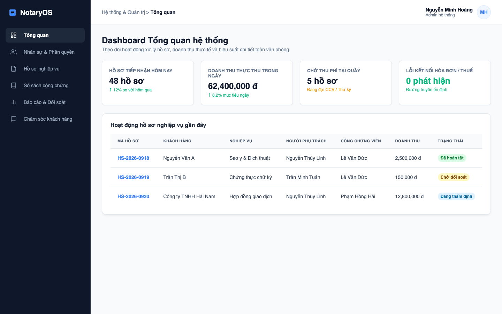

# PRD: TỔNG QUAN HỆ THỐNG CRM CHO VĂN PHÒNG CÔNG CHỨNG

## 1. Tổng quan hệ thống

Hệ thống CRM cho văn phòng công chứng là một nền tảng phần mềm hỗ trợ quản lý tổng thể hoạt động của văn phòng, từ khách hàng, nhân sự, hồ sơ, hợp đồng, phí dịch vụ cho đến lưu trữ và chăm sóc sau giao dịch.

Có thể hình dung hệ thống như một "trung tâm điều hành số" của văn phòng công chứng. Mọi thông tin quan trọng đều được tập trung tại một nơi: khách hàng là ai, đang làm hồ sơ gì, hồ sơ do ai phụ trách, đã kiểm tra đến bước nào, hợp đồng đang ở phiên bản nào, phí đã tính ra sao, hồ sơ đã ký chưa, đã lưu trữ chưa và sau đó có cần chăm sóc lại khách hàng hay không.

Thay vì dữ liệu nằm rải rác ở nhiều nơi như sổ tay, file Excel, Zalo cá nhân, máy tính từng nhân viên hoặc hồ sơ giấy, hệ thống gom các dữ liệu này về một nền tảng chung để toàn bộ văn phòng cùng làm việc trên cùng một nguồn thông tin.

### 1.1. Bức tranh tổng thể của hệ thống

Hệ thống được chia thành các nhóm module chính sau:

- **CRM và quản lý khách hàng:** Lưu thông tin khách hàng, lịch sử giao dịch, hồ sơ đã từng thực hiện, kênh liên hệ và hoạt động chăm sóc sau dịch vụ.
- **Quản lý nhân sự và phân quyền:** Quản lý tài khoản nhân viên, vai trò công việc, quyền truy cập, phân công hồ sơ và theo dõi khối lượng xử lý của từng người.
- **Quản lý hồ sơ công chứng:** Tạo hồ sơ, tiếp nhận giấy tờ, theo dõi trạng thái xử lý, kiểm tra checklist nghiệp vụ và lưu toàn bộ lịch sử thao tác.
- **Quản lý hợp đồng và biểu mẫu:** Quản lý mẫu hợp đồng, lời chứng, văn bản nghiệp vụ, phiên bản dự thảo, bản đã chỉnh sửa, bản in và bản sau ký.
- **Quản lý phí và thanh toán:** Tính phí, ghi nhận phụ phí, theo dõi trạng thái thanh toán, hỗ trợ xuất hóa đơn và kiểm tra lại lịch sử thu phí theo hồ sơ.
- **Lưu trữ hồ sơ điện tử:** Đóng gói tài liệu, phân loại file, gắn mã lưu trữ và hỗ trợ tra cứu hồ sơ cũ.
- **Tích hợp bên ngoài:** Có thể kết nối với Zalo OA, email, SMS, hóa đơn điện tử, hệ thống lưu trữ hoặc các hệ thống tra cứu nghiệp vụ khác khi cần.

Nhìn tổng thể, hệ thống không chỉ là nơi lưu thông tin hồ sơ. Đây là bộ công cụ hỗ trợ văn phòng quản lý cả ba lớp vận hành quan trọng:

- **Lớp khách hàng:** Ai đã đến văn phòng, đã dùng dịch vụ gì, cần chăm sóc lại như thế nào.
- **Lớp nghiệp vụ:** Hồ sơ đang ở bước nào, đang sử dụng dịch vụ gì, cần nhập thông tin gì, phí được tính như thế nào.
- **Lớp quản trị:** Nhân sự đang xử lý bao nhiêu việc, doanh thu và phí ra sao, hồ sơ nào cần theo dõi tiếp.

###### Giao diện mẫu (Prototype) - Dashboard Tổng quan hệ thống:

> [!NOTE]
> Chi tiết đặc tả kỹ thuật và các Use Case chi tiết cho từng phân hệ nghiệp vụ cốt lõi:
> - Phân hệ Nghiệp vụ **Sao Y Bản Chính**: Xem [SRS_SaoY_IEEE.md](SRS_SaoY_IEEE.md)
> - Phân hệ Nghiệp vụ **Dịch Thuật Công Chứng**: Xem [SRS_DichThuat_IEEE.md](SRS_DichThuat_IEEE.md)
> - Phân hệ Nghiệp vụ **Chứng Thực Chữ Ký**: Xem [SRS_ChungThucChuKy_IEEE.md](SRS_ChungThucChuKy_IEEE.md)

### 1.2. Giá trị vận hành cốt lõi

Từ bức tranh trên, văn phòng có thể:

- Quản lý khách hàng, nhân sự, hồ sơ và hợp đồng tập trung.
- Theo dõi trạng thái xử lý của từng hồ sơ theo thời gian thực.
- Phân công công việc rõ ràng cho từng nhân sự trong văn phòng.
- Hỗ trợ soạn thảo văn bản, hợp đồng và lời chứng theo mẫu.
- Tính phí, ghi nhận thanh toán và hỗ trợ xuất hóa đơn.
- Lưu trữ hồ sơ điện tử đầy đủ, dễ tra cứu.
- Chăm sóc khách hàng sau khi hoàn tất dịch vụ.

---

## 2. Vấn đề hệ thống cần giải quyết

Trong quá trình vận hành thực tế, văn phòng công chứng thường gặp một số khó khăn:

- Thông tin khách hàng chưa được lưu trữ tập trung, khó biết khách đã từng giao dịch hay chưa.
- Nhân sự, vai trò và phân công công việc chưa được quản lý tập trung, khiến người quản lý khó nắm ai đang phụ trách hồ sơ nào.
- Hồ sơ được tiếp nhận từ nhiều nguồn khác nhau nên dễ thiếu giấy tờ hoặc khó theo dõi tiến độ.
- Nhân sự phải nhập lại nhiều thông tin từ CCCD, hộ chiếu, giấy tờ tài sản, hợp đồng cũ.
- Việc kiểm tra hồ sơ phụ thuộc nhiều vào kinh nghiệm cá nhân, dễ bỏ sót bước nếu khối lượng công việc cao.
- Mẫu hợp đồng, lời chứng, phiên bản văn bản và dữ liệu khách hàng chưa được liên kết chặt chẽ.
- Việc tính phí, ghi nhận phụ phí, theo dõi thanh toán và xuất hóa đơn còn có thể bị tách rời khỏi hồ sơ nghiệp vụ.
- Hồ sơ hoàn tất nhưng việc scan, phân loại và lưu trữ điện tử còn mất thời gian.
- Dữ liệu khách hàng cũ chưa được tận dụng tốt để chăm sóc lại hoặc duy trì mối quan hệ lâu dài.
- Người quản lý thiếu báo cáo tổng quan để đánh giá số lượng hồ sơ, doanh thu, hiệu suất nhân sự và các điểm nghẽn trong quy trình.

Hệ thống được xây dựng để giải quyết các vấn đề trên bằng cách chuẩn hóa quy trình, tập trung dữ liệu và hỗ trợ tự động hóa các thao tác lặp lại.

---

## 3. Các Module chính của hệ thống

### 3.1. Module CRM và quản lý khách hàng

Module này lưu trữ thông tin khách hàng theo hồ sơ định danh như CCCD, hộ chiếu, số điện thoại và lịch sử giao dịch.

Khi khách hàng quay lại văn phòng, nhân viên có thể nhanh chóng tra cứu thông tin cũ, biết khách đã từng làm dịch vụ gì, vào thời điểm nào, hồ sơ trước đây gồm những tài liệu nào và ai từng phụ trách.

Giá trị mang lại:

- Không thất lạc dữ liệu khách hàng.
- Giảm thời gian nhập lại thông tin.
- Tăng khả năng chăm sóc và giữ chân khách hàng cũ.
- Giảm phụ thuộc vào trí nhớ hoặc dữ liệu cá nhân của từng nhân viên.

### 3.2. Module quản lý nhân sự và phân quyền

Module này giúp văn phòng quản lý danh sách nhân sự sử dụng hệ thống, bao gồm lễ tân, thư ký, công chứng viên, trưởng văn phòng, kế toán và các vai trò khác nếu có.

Mỗi nhân sự được gán vai trò và quyền truy cập phù hợp. Ví dụ: lễ tân có thể tạo hồ sơ ban đầu, thư ký có thể xử lý nghiệp vụ và soạn thảo, công chứng viên có thể phê duyệt, kế toán có thể xem phí và thanh toán, người quản lý có thể xem báo cáo tổng thể.

Hệ thống cũng hỗ trợ theo dõi hồ sơ đang được giao cho từng người, số lượng công việc đang xử lý, hồ sơ quá hạn hoặc hồ sơ cần ưu tiên.

Giá trị mang lại:

- Phân quyền rõ ràng theo vai trò.
- Biết mỗi hồ sơ đang do ai phụ trách.
- Theo dõi được khối lượng công việc của từng nhân sự.
- Giảm rủi ro nhân viên xem hoặc sửa dữ liệu không thuộc phạm vi phụ trách.

### 3.3. Module tiếp nhận và tạo hồ sơ

Module này hỗ trợ tạo hồ sơ ngay khi khách hàng bắt đầu sử dụng dịch vụ.

Nhân viên có thể nhập thông tin thủ công, tải lên giấy tờ, quét CCCD/hộ chiếu hoặc để khách tự điền thông tin qua mã QR tại quầy.

Mỗi hồ sơ được cấp một mã riêng để theo dõi từ lúc tiếp nhận đến khi hoàn tất và lưu trữ.

Giá trị mang lại:

- Hồ sơ được khởi tạo rõ ràng ngay từ đầu.
- Dễ kiểm soát khách nào đang chờ, hồ sơ nào đang xử lý, hồ sơ nào đã hoàn tất.
- Hạn chế tình trạng thiếu thông tin hoặc thất lạc giấy tờ.

### 3.4. Module phân công và theo dõi tiến độ

Hệ thống cho phép trưởng văn phòng hoặc người quản lý phân công hồ sơ cho thư ký, công chứng viên hoặc nhân sự phù hợp.

Mỗi hồ sơ có trạng thái xử lý rõ ràng, ví dụ: mới tiếp nhận, đang kiểm tra, đang soạn thảo, chờ khách kiểm tra, chờ ký, đã hoàn tất, đã lưu trữ.

Giá trị mang lại:

- Người quản lý nắm được toàn bộ tình hình vận hành.
- Nhân sự biết rõ mình đang phụ trách hồ sơ nào.
- Giảm việc hỏi qua lại bằng miệng hoặc qua tin nhắn cá nhân.
- Dễ phát hiện hồ sơ bị chậm, bị thiếu thông tin hoặc cần ưu tiên xử lý.

### 3.5. Module kiểm tra hồ sơ và checklist nghiệp vụ

Hệ thống cung cấp checklist theo từng loại dịch vụ để nhân viên kiểm tra những bước quan trọng trước khi chuyển sang giai đoạn tiếp theo.

Ví dụ: kiểm tra giấy tờ tùy thân, kiểm tra thông tin hai mặt CCCD, kiểm tra tình trạng ngăn chặn, kiểm tra giấy tờ liên quan đến hôn nhân, ủy quyền, tài sản hoặc pháp nhân.

Các checklist có thể được cấu hình theo quy trình nội bộ của văn phòng và theo từng nhóm dịch vụ.

Với các dịch vụ phức tạp như hợp đồng giao dịch, để đảm bảo quy trình chặt chẽ và không bỏ sót các bước nghiệp vụ an toàn, thư ký bắt buộc phải tích chọn đầy đủ checklist trước khi hệ thống cho phép chuyển sang bước tiếp theo:

- [ ] Kiểm tra tình trạng ngăn chặn trên hệ thống dữ liệu công chứng UCHI.
- [ ] Kiểm tra thời hạn hiệu lực của CCCD/Hộ chiếu.
- [ ] Đối chiếu mặt trước và mặt sau CCCD thuộc cùng một giấy tờ/cùng một người, không bị upload nhầm mặt sau của người khác.
- [ ] Kiểm tra tình trạng hôn nhân/Hợp đồng ủy quyền liên quan (nếu có).

Giá trị mang lại:

- Chuẩn hóa quy trình kiểm tra hồ sơ.
- Giảm rủi ro bỏ sót bước nghiệp vụ quan trọng.
- Giúp nhân viên mới làm việc theo cùng một chuẩn với nhân viên có kinh nghiệm.
- Tạo dấu vết rõ ràng về việc ai đã kiểm tra, kiểm tra lúc nào.

### 3.6. Module quản lý hợp đồng, văn bản và biểu mẫu

Hệ thống hỗ trợ quản lý mẫu văn bản, mẫu hợp đồng, lời chứng và các biểu mẫu nghiệp vụ của văn phòng.

Sau khi dữ liệu hồ sơ đã được kiểm tra, thư ký có thể chọn mẫu phù hợp. Hệ thống sẽ tự động điền các thông tin đã xác nhận vào văn bản, ví dụ thông tin bên A, bên B, tài sản, giá trị giao dịch, người đại diện, nội dung ủy quyền hoặc các thông tin liên quan khác.

Thư ký vẫn có thể chỉnh sửa văn bản trước khi trình công chứng viên hoặc gửi khách hàng kiểm tra.

Mỗi hợp đồng có thể được quản lý theo phiên bản: bản nháp, bản đã chỉnh sửa, bản gửi khách kiểm tra, bản in ký và bản scan sau ký. Điều này giúp văn phòng biết rõ hợp đồng đã thay đổi những gì, ai chỉnh sửa và bản nào là bản cuối cùng.

Giá trị mang lại:

- Rút ngắn thời gian soạn thảo.
- Giảm việc sao chép thủ công giữa nhiều file.
- Hạn chế sai sót do dùng nhầm thông tin hoặc nhầm mẫu.
- Dễ quản lý phiên bản văn bản trước và sau chỉnh sửa.

### 3.7. Module quản lý phí, thanh toán và hóa đơn

Hệ thống hỗ trợ ghi nhận các khoản phí liên quan đến hồ sơ, bao gồm phí công chứng, phí chứng thực, phí dịch vụ, phí phát sinh, phí ký ngoài trụ sở, phí xử lý nhanh hoặc các khoản thu khác theo cấu hình của văn phòng.

Với một số loại hồ sơ, hệ thống có thể hỗ trợ đề xuất mức phí dựa trên dữ liệu nhập vào và công thức đã được cấu hình. Nhân sự có thẩm quyền vẫn có thể kiểm tra, điều chỉnh và xác nhận trước khi thu phí.

Module này cũng có thể hỗ trợ theo dõi trạng thái thanh toán của từng hồ sơ như chưa thu, đã thu một phần, đã thu đủ, đã xuất hóa đơn hoặc cần điều chỉnh. Khi cần, hệ thống có thể kết nối với phần mềm hóa đơn điện tử để giảm thao tác nhập lại dữ liệu.

Giá trị mang lại:

- Minh bạch quá trình tính phí.
- Giảm sai sót khi cộng nhiều khoản phí.
- Dễ kiểm tra lại lịch sử thu phí theo từng hồ sơ.
- Có thể kết nối với phần mềm hóa đơn điện tử khi cần.

### 3.8. Module lưu trữ hồ sơ điện tử

Khi hồ sơ hoàn tất, hệ thống hỗ trợ lưu trữ toàn bộ tài liệu liên quan dưới dạng hồ sơ điện tử, bao gồm giấy tờ khách hàng đã cung cấp, bản dự thảo, bản đã ký, tài liệu scan sau ký, ảnh chụp tại quầy nếu có và các file liên quan khác.

Hồ sơ được phân loại, gắn mã lưu trữ và có thể tra cứu lại theo khách hàng, số giấy tờ, loại dịch vụ, ngày thực hiện hoặc mã hồ sơ.

Giá trị mang lại:

- Dễ tra cứu hồ sơ cũ khi cần.
- Giảm phụ thuộc vào hồ sơ giấy.
- Tiết kiệm thời gian tìm kiếm tài liệu.
- Tạo nền tảng cho việc lưu trữ và kiểm soát hồ sơ lâu dài.

### 3.9. Module chăm sóc khách hàng sau dịch vụ qua Zalo OA

Sau khi khách hàng sử dụng xong dịch vụ, hệ thống có thể tự động kích hoạt luồng chăm sóc qua tài khoản Zalo OA của văn phòng.

Các tin nhắn có thể bao gồm:

- Tin nhắn cảm ơn khách hàng đã sử dụng dịch vụ.
- Tin nhắn khảo sát chất lượng phục vụ.
- Tin nhắn nhắc khách lưu lại kênh liên hệ chính thức của văn phòng.
- Tin nhắn chăm sóc lại theo nhóm dịch vụ đã sử dụng, nếu văn phòng có nhu cầu cấu hình thêm.

Giá trị mang lại:

- Tạo trải nghiệm chuyên nghiệp sau khi khách hoàn tất dịch vụ.
- Giữ liên hệ với khách hàng qua kênh chính thức của văn phòng.
- Hỗ trợ thu thập phản hồi để cải thiện chất lượng phục vụ.
- Tăng khả năng khách hàng quay lại hoặc giới thiệu người quen.

---

## 4. Nhóm dịch vụ hệ thống hỗ trợ

Hệ thống được thiết kế linh hoạt để phục vụ các nhóm dịch vụ phổ biến tại văn phòng công chứng. Trong giai đoạn hiện tại, hệ thống hỗ trợ đầy đủ 3 phân hệ dịch vụ cốt lõi sau:

### 4.1. Phân hệ Sao Y Bản Chính (Certified Copying)
Hỗ trợ tiếp nhận nhanh và tính phí tự động cho các loại giấy tờ sao y thường gặp:
- Sao y CCCD.
- Sao y giấy tờ tùy thân và hộ tịch.
- Sao y giấy tờ học vấn, bằng cấp.
- Sao y giấy tờ sở hữu tài sản (Kiểm tra UCHI).
- Sao y giấy tờ doanh nghiệp, tổ chức (B2B, Tách hóa đơn tự động).

*Chi tiết đặc tả kỹ thuật xem tại [SRS_SaoY_IEEE.md](SRS_SaoY_IEEE.md).*

### 4.2. Phân hệ Chứng Thực Chữ Ký (Signature Certification)
Hỗ trợ chứng thực chữ ký cá nhân trực tiếp hoặc chữ ký trên các văn bản cam đoan, giấy ủy quyền theo quy định:
- Chứng thực chữ ký cá nhân thông thường.
- Chứng thực chữ ký trên giấy ủy quyền.
- Chứng thực chữ ký trên tờ khai, lý lịch.

*Chi tiết đặc tả kỹ thuật xem tại [SRS_ChungThucChuKy_IEEE.md](SRS_ChungThucChuKy_IEEE.md).*

### 4.3. Phân hệ Dịch Thuật Công Chứng & Chứng Thực Chữ Ký Người Dịch (Translation Notary)
Hỗ trợ quy trình dịch thuật từ các CTV liên kết, tính phí thù lao và tổ chức chứng thực chữ ký người dịch (CTV):
- Dịch thuật tài liệu cá nhân thông thường (Anh, Pháp, Trung, Nhật, Hàn...).
- Dịch thuật chuyên ngành doanh nghiệp phức tạp (B2B, cam kết NDA bảo mật).
- Dịch thuật đặt trước trực tuyến qua Zalo OA (Luồng O2O, đối khớp bản gốc).
- Dịch thuật đa ngôn ngữ tách/gộp hồ sơ.

*Chi tiết đặc tả kỹ thuật xem tại [SRS_DichThuat_IEEE.md](SRS_DichThuat_IEEE.md).*

### 4.4. Các dịch vụ mở rộng trong tương lai (Future Scope)
Về sau, hệ thống có thể cấu hình mở rộng thêm các nhóm dịch vụ khác như:
- Hợp đồng giao dịch (Chuyển nhượng, mua bán, tặng cho tài sản).
- Hồ sơ thừa kế (Khai nhận di sản, thỏa thuận phân chia di sản).
- Các dịch vụ riêng theo nhu cầu vận hành đặc thù của từng văn phòng.

Mỗi nhóm dịch vụ có thể có bộ giấy tờ, checklist, biểu mẫu và quy trình xử lý riêng. Điều này giúp hệ thống phù hợp với cách vận hành thực tế của từng văn phòng, thay vì áp một quy trình cứng cho tất cả hồ sơ.

---

## 5. Quy trình khách đến sử dụng dịch vụ sao y

Quy trình dưới đây mô tả trường hợp khách hàng đến văn phòng để sao y giấy tờ. Đây là luồng đơn giản, dễ hiểu và phù hợp để làm nền tảng cho phiên bản đầu tiên của hệ thống.

1. Khách hàng đến văn phòng và yêu cầu sao y giấy tờ.
2. Nhân viên mở hệ thống, chọn nhóm dịch vụ **Sao y**.
3. Nhân viên chọn loại sao y cụ thể, ví dụ **Sao y CCCD**. Ngoài ra, nhân viên có thể chọn các loại khác như sao y giấy tờ tùy thân và hộ tịch, giấy tờ học vấn/bằng cấp, giấy tờ sở hữu tài sản hoặc giấy tờ doanh nghiệp/tổ chức.
4. Sau khi chọn loại dịch vụ, hệ thống hiển thị form nhập thông tin khách hàng gồm tên khách hàng, số CCCD và số điện thoại.
5. Nhân viên nhập số bản cần sao y.
6. Hệ thống lấy mức giá tương ứng từ module **Quản lý phí** và tự tính thành tiền theo công thức: số bản cần sao y x mức giá của loại dịch vụ.
7. Nhân viên kiểm tra lại thông tin, báo giá cho khách hàng.
8. Khi khách hàng đồng ý, nhân viên lưu hồ sơ trên hệ thống.
9. Hồ sơ được ghi nhận vào lịch sử khách hàng, lịch sử dịch vụ và dữ liệu phí để có thể tra cứu lại sau này.
10. Sau khi dịch vụ hoàn tất, hệ thống tự động gửi tin nhắn cảm ơn hoặc khảo sát chất lượng dịch vụ qua tài khoản Zalo OA của văn phòng.

Luồng này giúp văn phòng tiếp nhận nhanh các hồ sơ sao y thường gặp, đồng thời vẫn lưu được đầy đủ thông tin khách hàng, loại dịch vụ, số bản, đơn giá, thành tiền và lịch sử xử lý.

> [!NOTE]
> Chi tiết đặc tả kỹ thuật các Use Case, sơ đồ luồng dữ liệu (Sequence Diagram) và các luồng ngoại lệ cho quy trình này, xem tại [SRS_SaoY_IEEE.md](SRS_SaoY_IEEE.md).

---

## 6. Giá trị mang lại cho văn phòng công chứng

### 6.1. Tăng hiệu quả vận hành

Hệ thống giúp giảm thời gian nhập liệu, giảm thao tác lặp lại và giúp nhân sự phối hợp rõ ràng hơn trong từng hồ sơ.

### 6.2. Kiểm soát hồ sơ tốt hơn

Mọi hồ sơ đều có trạng thái, người phụ trách, tài liệu đi kèm và lịch sử xử lý. Người quản lý có thể theo dõi toàn bộ hoạt động mà không cần hỏi từng nhân sự.

### 6.3. Giảm rủi ro sai sót nghiệp vụ

Checklist, cảnh báo dữ liệu và quy trình kiểm tra giúp hạn chế bỏ sót giấy tờ, nhập sai thông tin hoặc dùng nhầm mẫu văn bản.

### 6.4. Quản lý dữ liệu khách hàng lâu dài

Dữ liệu khách hàng được lưu trữ tập trung, có lịch sử giao dịch rõ ràng, giúp văn phòng xây dựng tài sản dữ liệu thay vì để thông tin phân tán ở từng cá nhân.

### 6.5. Nâng cao trải nghiệm khách hàng

Khách hàng được tiếp nhận nhanh hơn, kiểm tra văn bản thuận tiện hơn, nhận thông báo rõ ràng hơn và có cảm giác văn phòng làm việc chuyên nghiệp, hiện đại.

### 6.6. Sẵn sàng mở rộng trong tương lai

Khi quy trình đã được số hóa, văn phòng có thể tiếp tục mở rộng thêm các tính năng như báo cáo quản trị, kết nối hóa đơn điện tử, tích hợp Zalo OA hoặc tích hợp hệ thống tra cứu nội bộ.

---

## 7. Kết luận

Hệ thống CRM cho văn phòng công chứng không chỉ là một phần mềm lưu hồ sơ, mà là nền tảng hỗ trợ vận hành tổng thể cho văn phòng.

Hệ thống giúp văn phòng quản lý khách hàng tốt hơn, xử lý hồ sơ rõ ràng hơn, giảm thao tác thủ công, hạn chế sai sót, nâng cao chất lượng phục vụ và tạo nền tảng dữ liệu lâu dài cho hoạt động kinh doanh.

Điểm quan trọng nhất của hệ thống là chuẩn hóa quy trình nghiệp vụ và tập trung dữ liệu vận hành. Nhân sự văn phòng vẫn giữ vai trò xử lý chuyên môn, còn hệ thống đóng vai trò hỗ trợ, nhắc việc, tính phí, lưu trữ và tra cứu để công việc hằng ngày diễn ra nhanh hơn, nhất quán hơn và dễ quản lý hơn.
