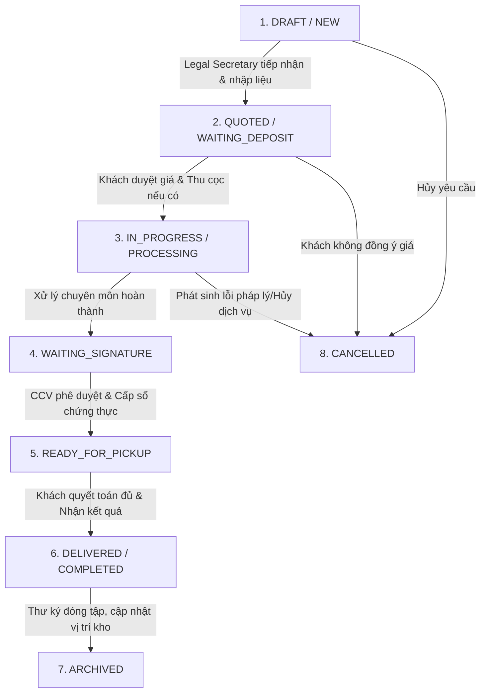

# SOFTWARE REQUIREMENTS SPECIFICATION (SRS)

## HỆ THỐNG CRM CHO VĂN PHÒNG CÔNG CHỨNG

Version: 1.0  

---

# 1. GIỚI THIỆU (INTRODUCTION)

## 1.1 Mục đích (Purpose)
Tài liệu này mô tả chi tiết các yêu cầu chức năng và phi chức năng của hệ thống CRM dành riêng cho Văn phòng Công chứng (VPCC). Hệ thống tập trung tối ưu hóa các quy trình nghiệp vụ nội bộ, quản lý thông tin khách hàng, số hóa hồ sơ giao dịch, và tự động hóa quy trình quản lý tài chính nhằm nâng cao hiệu suất vận hành của văn phòng.

Tài liệu này đóng vai trò là căn cứ kỹ thuật chính thức được sử dụng bởi các bên liên quan bao gồm: Product Owner (PO), Business Analyst (BA), Đội ngũ Phát triển Phần mềm (Developers), Đội ngũ Kiểm thử (Testers) và Ban lãnh đạo VPCC để nghiệm thu sản phẩm.

## 1.2 Phạm vi (Scope)
Hệ thống hỗ trợ quản lý toàn trình các nhóm nghiệp vụ đặc thù sau trong phiên bản đầu tiên:
* **Chứng thực sao y bản chính:** Tiếp nhận, đếm số trang, tính phí và lưu trữ dữ liệu bản sao.
* **Chứng thực chữ ký:** Quản lý thông tin cá nhân của người yêu cầu chứng thực chữ ký, lưu vết biểu mẫu chứng thực chữ ký.
* **Dịch thuật công chứng:** Tiếp nhận tài liệu, tính phí dịch thuật và chứng thực, phân phối tài liệu cho Biên dịch viên, kiểm soát tiến độ, quản lý phê duyệt của Công chứng viên.

**Các tính năng nằm ngoài phạm vi phiên bản MVP (Out of Scope):**
* Tích hợp Ký số / Chữ ký điện tử (Digital Signature).
* Tự động nhận diện và trích xuất dữ liệu tài liệu (OCR).
* Ứng dụng trên thiết bị di động độc lập (Mobile App).
* Tích hợp cổng thanh toán trực tuyến (Online Payment Gateway).

## 1.3 Thuật ngữ và Từ viết tắt (Definitions and Acronyms)

| Thuật ngữ / Viết tắt | Ý nghĩa / Định nghĩa |
| :--- | :--- |
| **KH** | Khách hàng - Người cá nhân hoặc đại diện tổ chức đến yêu cầu dịch vụ. |
| **CCCD / Hộ chiếu** | Căn cước công dân hoặc Hộ chiếu của người tham gia giao dịch. |
| **Legal Secretary** | Thư ký nghiệp vụ / Chuyên viên pháp lý - Người trực tiếp tiếp nhận hồ sơ, làm việc với khách hàng, soạn thảo văn bản và chuyển duyệt. |
| **Translator** | Biên dịch viên - Nhân viên thuộc phòng dịch thuật hoặc Cộng tác viên bên ngoài được giao trách nhiệm dịch thuật tài liệu. |
| **Notary** | Công chứng viên (CCV) - Người có thẩm quyền thẩm định, phê duyệt và ký xác nhận tính hợp pháp của hồ sơ theo quy định pháp luật. |
| **Accountant** | Kế toán / Thu ngân - Người kiểm soát dòng tiền, hóa đơn, thu chi tài chính và đối soát thù lao dịch thuật. |
| **CRM** | Customer Relationship Management - Hệ thống quản lý quan hệ khách hàng và điều hành tác nghiệp nội bộ. |
| **CTV** | Cộng tác viên - Các biên dịch viên tự do bên ngoài hợp tác với VPCC theo từng vụ việc. |
| **Case** | Hồ sơ nghiệp vụ - Một đơn vị quản lý trên hệ thống bao gồm thông tin khách hàng, tài liệu đính kèm, các tác vụ xử lý và thông tin tài chính đi kèm. |
| **Master Data** | Dữ liệu danh mục cốt lõi - Các dữ liệu nền tảng như bảng ngôn ngữ, danh mục biểu mẫu, cấu hình hệ thống. |
| **Manual Override** | Ghi đè thủ công - Cơ chế cho phép người dùng có thẩm quyền tự nhập giá trị (ví dụ: đơn giá) thay vì sử dụng giá trị tự động tính từ hệ thống. |

---
# 2. MÔ TẢ TỔNG QUAN (OVERALL DESCRIPTION)

## 2.1 Bối cảnh hệ thống (Product Perspective)
Hệ thống CRM cho Văn phòng Công chứng là một nền tảng quản lý quy trình tác nghiệp nội bộ (Workflow Management) và quản lý quan hệ khách hàng độc lập. Hệ thống kết nối tập trung các bộ phận nghiệp vụ trong văn phòng nhằm số hóa toàn bộ vòng đời của một hồ sơ dịch vụ từ khâu tiếp nhận, xử lý chuyên môn, thu phí, phê duyệt cho đến lưu trữ điện tử.

## 2.2 Chức năng sản phẩm tổng quan (Product Functions)
Hệ thống CRM cung cấp giải pháp quản lý tập trung cho 3 luồng dịch vụ cốt lõi tại văn phòng công chứng:

1. **Phân hệ Quản lý Hồ sơ Sao y bản chính:**
   * Tiếp nhận và đếm số lượng văn bản gốc, số bản cần nhân bản.
   * Tính toán chi phí tự động theo quy định và in phiếu thu.
   * Quản lý trạng thái đóng dấu và trả kết quả.

2. **Phân hệ Quản lý Hồ sơ Chứng thực chữ ký:**
    * Ghi nhận thông tin nhân thân (CCCD/Hộ chiếu) của người yêu cầu chứng thực.
    * Lưu trữ và quản lý các biểu mẫu chứng thực chữ ký chuẩn (Chữ ký trên tờ khai, lý lịch, văn bản cam đoan, giấy ủy quyền đơn giản).
    * Cấp số chứng thực chữ ký theo thời gian thực.

3. **Phân hệ Quản lý Hồ sơ Dịch thuật công chứng:**
   * Tiếp nhận hồ sơ tài liệu, xác định ngôn ngữ nguồn và ngôn ngữ đích.
   * Tính phí dịch thuật linh hoạt theo hai phương thức: Theo số trang (đối với tài liệu dài, hợp đồng, văn bản thương mại) HOẶC Theo gói/Bộ văn bản (đối với giấy tờ cá nhân định hình sẵn như CCCD, Hộ chiếu, Giấy khai sinh, Bằng cấp).
   * Tích hợp cơ chế cho phép nhập giá thủ công hoặc ghi đè giá trực tiếp trên từng hồ sơ đối với các trường hợp đặc thù.
   * Điều phối, giao việc và giám sát tiến độ của Biên dịch viên/Cộng tác viên (CTV).
   * Trình ký Công chứng viên phê duyệt chứng thực chữ ký người dịch.

4. **Phân hệ Quản lý Tài chính (Áp dụng chung):**
    * Thu tiền tạm ứng (cọc tiền) và quyết toán thu đủ trước khi trả kết quả.
    * Xuất phiếu thu, biên lai và theo dõi công nợ khách hàng doanh nghiệp.
    * Đối soát thù lao chi trả cho Cộng tác viên dịch thuật.

5. **Phân hệ Quản lý Lưu trữ và Báo cáo:**
    * Số hóa tài liệu đầu vào/đầu ra (Scan/Upload đính kèm hồ sơ).
    * Định vị vị trí hồ sơ gốc trong kho lưu trữ vật lý.
    * Xuất báo cáo thống kê hồ sơ, doanh thu, báo cáo định kỳ nộp Sở Tư pháp.

## 2.3 Vai trò người dùng (Roles & Actors)

Hệ thống phân quyền dựa trên 5 vai trò cốt lõi tham gia vào các luồng nghiệp vụ. Vai trò Lễ tân được gộp hoàn toàn vào vai trò Thư ký nghiệp vụ để tối ưu nhân sự toàn trình.

| Tên vai trò (Hệ thống) | Tên tiếng Việt | Mô tả trách nhiệm trong hệ thống |
| :--- | :--- | :--- |
| **Admin** | Quản trị viên | Quản lý tài khoản, phân quyền nhân viên, cấu hình bảng giá gốc, quản lý danh mục biểu mẫu, cấu hình hệ thống và giám sát nhật ký hệ thống (Audit Log). |
| **Legal Secretary** | Thư ký nghiệp vụ | Tiếp nhận yêu cầu ban đầu của khách hàng; tạo mới hồ sơ (Case) cho cả 3 luồng dịch vụ; phân loại tài liệu; tính phí/báo giá; thu tiền cọc và quyết toán; thực hiện sao y; chuyển duyệt hồ sơ chứng thực; chỉ định người dịch; kiểm tra chất lượng bản dịch và trực tiếp trả kết quả cho khách hàng. |
| **Translator** | Biên dịch viên (Internal/CTV) | Nhận tài liệu dịch được phân công; cập nhật tiến độ xử lý; tải lên bản dịch dự thảo (Draft); trực tiếp ký tên cam đoan vào bản dịch giấy trước khi trình Công chứng viên. |
| **Notary** | Công chứng viên (CCV) | Thẩm định tính pháp lý của hồ sơ gốc, hồ sơ chứng thực chữ ký và bản dịch; thực hiện ký chứng thực; phê duyệt cấp số chứng thực/số quyển trên hệ thống. |
| **Accountant** | Kế toán / Thu ngân | Giám sát dòng tiền thu chi của Thư ký; quản lý hóa đơn tài chính; đối soát doanh thu tổng của văn phòng; thực hiện đối soát và duyệt chi thù lao cho Cộng tác viên (CTV). |

## 2.4 Giả định và Phụ thuộc (Assumptions and Dependencies)
* **Giả định:** Tất cả nhân viên sử dụng hệ thống đều được trang bị máy tính có kết nối mạng nội bộ ổn định và máy quét tài liệu (Scanner) để số hóa hồ sơ trực tiếp tại bàn làm việc.
* **Phụ thuộc:** Luồng in ấn và xuất bản kết quả phụ thuộc vào tính sẵn sàng của hạ tầng phần cứng vật lý (Máy in, máy photocoppy) tại văn phòng. Các chức năng xuất hóa đơn điện tử phụ thuộc vào độ ổn định kết nối API của bên thứ ba (như Viettel, VNPT hoặc BKAV).
---
# 3. YÊU CẦU VỀ LUỒNG NGHIỆP VỤ & TRẠNG THÁI HỒ SƠ (CASE WORKFLOW STATUS)
## 3.1 Sơ đồ luồng trạng thái hồ sơ tổng thể (Case Status Lifecycle)

Mọi hồ sơ (Case) thuộc 3 phân hệ dịch vụ (Sao y, Chứng thực chữ ký, Dịch thuật công chứng) khi được khởi tạo trên hệ thống sẽ dịch chuyển qua các trạng thái tuần tự dưới sự vận hành của Thư ký nghiệp vụ, Công chứng viên và Kế toán:

## 3.2 Quy tắc chuyển trạng thái chi tiết (Status Transition Rules)
Hệ thống bắt buộc phải kiểm tra các điều kiện ràng buộc dưới đây trước khi cho phép hồ sơ chuyển dịch sang trạng thái kế tiếp.

| Trạng thái gốc | Trạng thái đích | Điều kiện kích hoạt (Trigger/Condition) | Tác nhân thực hiện |
| :--- | :--- | :--- | :--- |
| **N/A** | **DRAFT / NEW** | Khách hàng mang hồ sơ đến văn phòng. Thư ký tạo ID hồ sơ mới, hệ thống tự động ghi nhận thời gian khởi tạo và thông tin định danh ban đầu. | Legal Secretary |
| **DRAFT / NEW** | **QUOTED** | Thư ký hoàn thành việc nhập thông số tính phí (Đếm số trang sao y, chọn loại biểu mẫu chứng thực chữ ký, hoặc nhập đơn giá dịch thuật theo trang/theo bộ). Hệ thống xuất phiếu báo giá tạm tính. | Legal Secretary |
| **QUOTED** | **IN_PROGRESS** | Khách hàng đồng ý với báo giá. Thư ký ghi nhận trạng thái: Đã thu cọc (nếu có) hoặc Đã xác nhận triển khai. Hệ thống kích hoạt quyền xử lý hồ sơ cho bộ phận chuyên môn (Sao chép tài liệu, chỉ định Translator). | Legal Secretary |
| **IN_PROGRESS** | **WAITING_SIGNATURE**| **Đối với Sao y/Chứng thực:** Thư ký hoàn thành in bản sao hoặc điền thông tin vào biểu mẫu.<br><br>**Đối với Dịch thuật:** Translator tải file dịch lên và Thư ký nghiệp vụ xác nhận đạt chất lượng.<br><br>Hồ sơ được đóng gói, tích chọn checklist và chuyển lên hàng đợi trình ký. | Legal Secretary |
| **WAITING_SIGNATURE**| **READY_FOR_PICKUP** | Công chứng viên (Notary) kiểm tra hồ sơ gốc và bản in giấy, nhấn "Phê duyệt" trên hệ thống để cấp Số chứng thực (Số quyển) theo thời gian thực. Văn phòng tiến hành đóng dấu vật lý. | Notary |
| **READY_FOR_PICKUP** | **DELIVERED** | Khách hàng đến nhận kết quả. Thư ký quét mã hồ sơ hoặc tìm kiếm ID, hệ thống kiểm tra trạng thái tài chính. Kế toán thu nốt phần tiền còn lại (nếu có) và xuất hóa đơn điện tử. Thư ký bàn giao tài liệu gốc và kết quả. | Legal Secretary / Accountant |
| **DELIVERED** | **ARCHIVED** | Thư ký nghiệp vụ quét/đính kèm bản lưu điện tử cuối cùng (nếu có), cập nhật chính xác vị trí lưu trữ của hồ sơ giấy (Tủ số, Kệ số, Ngăn số) vào hệ thống và đóng hồ sơ vĩnh viễn. | Legal Secretary |
| **Bất kỳ trạng thái nào trước SIGNATURE** | **CANCELLED** | Khách hàng hủy dịch vụ hoặc Công chứng viên phát hiện văn bản gốc bị giả mạo, tẩy xóa, không đủ điều kiện pháp lý để thực hiện dịch vụ. Tác nhân phải nhập lý do hủy bắt buộc vào hệ thống. | Legal Secretary / Notary / Ban Quản lý |
---
# 4. CÁC YÊU CẦU CHỨC NĂNG CHI TIẾT (DETAILED FUNCTIONAL REQUIREMENTS)
---

## 4.1 QUẢN LÝ KHÁCH HÀNG (CRM MANAGEMENT)
### 4.1.1 Tiếp nhận & Đăng ký Khách hàng (Customer Registration)
* **FR-CRM-001:** Hệ thống phải cho phép khởi tạo hồ sơ khách hàng mới vào cơ sở dữ liệu tập trung.
* **FR-CRM-002:** Thông tin khách hàng bắt buộc phải bao gồm các trường dữ liệu sau:
    * Họ và tên khách hàng (Cá nhân hoặc tên Doanh nghiệp).
    * Số điện thoại liên hệ chính.
    * Số CCCD / Hộ chiếu / Mã số thuế (đối với Doanh nghiệp B2B).
    * Địa chỉ thường trú / Địa chỉ trụ sở.
* **FR-CRM-003:** **[Quy tắc chặn trùng]:** Hệ thống phải tự động kiểm tra tính duy nhất của Số CCCD/Hộ chiếu/Mã số thuế trên toàn hệ thống trước khi cho phép bấm nút "Lưu".
* **FR-CRM-004:** Nếu Số CCCD/Hộ chiếu/Mã số thuế đã tồn tại, hệ thống phải tự động ngăn chặn hành vi tạo mới, đồng thời hiển thị ngay lập tức hồ sơ chi tiết của khách hàng hiện có lên màn hình để Thư ký tiếp tục xử lý.
* **FR-CRM-005:** Hệ thống phải tự động ghi nhận chính xác thời gian (Timestamp) tạo lập hồ sơ khách hàng.
* **FR-CRM-006:** Hệ thống phải tự động ghi vết ID tài khoản của nhân viên (`Legal Secretary`) trực tiếp thao tác tạo khách hàng.

### 4.1.2 Tra cứu & Hồ sơ điện tử (Customer Search & Profile)
* **FR-CRM-007:** Hệ thống phải cung cấp thanh tìm kiếm nhanh hỗ trợ Thư ký nghiệp vụ lọc khách hàng theo: Họ tên, Số điện thoại, hoặc Số CCCD/Mã số thuế.
* **FR-CRM-008:** Hệ thống phải tích hợp thuật toán tìm kiếm gần đúng (Fuzzy Search) theo Họ tên tiếng Việt (có dấu hoặc không dấu) để tăng tốc độ trả kết quả tại bàn tiếp nhận.
* **FR-CRM-009:** Kết quả tìm kiếm hiển thị dưới dạng lưới (Grid View) gồm: Mã khách hàng, Họ tên, Số điện thoại, Số CCCD/MST và Trạng thái công nợ hiện tại.
* **FR-CRM-010:** Hệ thống phải cho phép click chọn để xem chi tiết Hồ sơ điện tử (360-degree Profile) của khách hàng.
* **FR-CRM-011:** Giao diện hồ sơ khách hàng phải hiển thị danh sách lịch sử toàn bộ các hồ sơ nghiệp vụ (`Case ID`) mà khách hàng này đã từng thực hiện tại văn phòng.
* **FR-CRM-012:** Hệ thống phải tự động tính toán và hiển thị tổng số lượng hồ sơ đã thực hiện thành công của khách hàng.
* **FR-CRM-013:** Hệ thống phải tự động tính tổng lũy kế giá trị giao dịch tài chính (Tổng số tiền khách đã chi trả cho văn phòng) ngay trong trang cá nhân của khách hàng.
* **FR-CRM-014:** Cho phép sửa đổi thông tin hành chính của khách hàng (SĐT, Địa chỉ, Email nhận hóa đơn).
* **FR-CRM-015:** **[Ràng buộc Bảo mật]:** Mọi hành vi sửa đổi thông tin khách hàng bắt buộc phải bị hệ thống ép ghi nhận vào `Audit Log` (Gồm giá trị cũ và giá trị mới).

---
## 4.2 QUẢN LÝ HỒ SƠ NGHIỆP VỤ (CASE MANAGEMENT)

### 4.2.1 Khởi tạo Hồ sơ (Create Case)
* **FR-CASE-001:** Hệ thống phải cho phép tạo mới một hồ sơ vụ việc (`Case`).
* **FR-CASE-002:** Ràng buộc toàn vẹn: Mỗi hồ sơ khi khởi tạo bắt buộc phải được gắn kết duy nhất với một mã khách hàng (`Customer ID`) cụ thể.
* **FR-CASE-003:** Mỗi hồ sơ phải sở hữu một mã số định danh duy nhất (`Case ID`) trên toàn hệ thống để quản lý.
* **FR-CASE-004:** **[Quy tắc sinh mã]:** Mã hồ sơ phải được hệ thống tự động sinh ra theo cấu trúc quy chuẩn thời gian thực. Cấu trúc cấu thành: `HS-[NĂM HIỆN TẠI]-[MÃ SỐ TỰ TĂNG 6 CHỮ SỐ]`.
    * *Ví dụ:* `HS-2026-000001`
* **FR-CASE-005:** Hệ thống phải ghi nhận tự động ID của `Legal Secretary` tạo hồ sơ và thời gian khởi tạo hồ sơ vào thuộc tính của Case.

### 4.2.2 Phân loại Dịch vụ & Điều phối (Service Type & Assignment)
* **FR-CASE-006:** Hệ thống phải cho phép Thư ký nghiệp vụ chọn một hoặc kết hợp nhiều loại dịch vụ trong cùng một hồ sơ (`Case`). Các dịch vụ mặc định bao gồm:
    * Sao y bản chính.
    * Chứng thực chữ ký cá nhân (Tờ khai, ủy quyền đơn giản...).
    * Dịch thuật công chứng.
* **FR-CASE-007:** Hệ thống cung cấp chức năng phân công/chỉ định tài khoản xử lý hồ sơ:
    * Cho phép chỉ định một `Legal Secretary` phụ trách chính toàn trình.
    * Đối với dịch vụ Dịch thuật: Cho phép chỉ định một hoặc nhiều Biên dịch viên (`Translator` nội bộ hoặc Cộng tác viên bên ngoài) tham gia xử lý các file dịch khác nhau trong cùng một hồ sơ.
* **FR-CASE-008:** Hệ thống phải ghi nhận chính xác thời gian phân công việc và người thực hiện thao tác điều phối công việc đó.

### 4.2.3 Kiểm soát Trạng thái Hồ sơ (Workflow Status Control)
* **FR-CASE-009:** Hệ thống quản lý vòng đời hồ sơ qua 8 trạng thái nghiêm ngặt được định nghĩa sẵn bao gồm: `DRAFT / NEW`, `QUOTED`, `IN_PROGRESS`, `WAITING_SIGNATURE`, `READY_FOR_PICKUP`, `DELIVERED`, `ARCHIVED`, `CANCELLED`.
* **FR-CASE-010:** Hệ thống phải áp dụng cấu hình máy trạng thái (State Machine), chỉ cho phép hồ sơ chuyển dịch trạng thái theo đúng sơ đồ Workflow quy định (được mô tả chi tiết tại Chương 3). Nghiêm cấm việc nhảy cóc trạng thái khi chưa thỏa mãn điều kiện.
* **FR-CASE-011:** Mọi hành động kích hoạt chuyển trạng thái hồ sơ phải được hệ thống ghi nhận vào lịch sử tiến độ hồ sơ, bao gồm: Mã trạng thái cũ, Mã trạng thái mới, ID tài khoản kích hoạt và mốc thời gian chi tiết.

---

## 4.3 QUẢN LÝ TÀI LIỆU SỐ & BIỂU MẪU (DOCUMENT & TEMPLATE MANAGEMENT)

### 4.3.1 Số hóa Tài liệu (Upload Document)
* **FR-DOC-001:** Hệ thống cung cấp tính năng tải tệp tin đính kèm trực tiếp vào từng danh mục tài liệu con nằm trong hồ sơ nghiệp vụ (`Case`).
* **FR-DOC-002:** Hệ thống chỉ cho phép tải lên các định dạng tệp tin quy chuẩn sau: `PDF`, `JPG`, `PNG`, `DOCX`.
* **FR-DOC-003:** **[Quy tắc kiểm tra file]:** Hệ thống phải thực hiện kiểm tra định dạng đuôi file và quét dung lượng file (Mức trần 50MB) trước khi lưu file vào máy chủ. Nếu file không đúng định dạng hoặc vượt dung lượng, phải hiển thị thông báo từ chối rõ ràng.
* **FR-DOC-004:** Hệ thống phải giữ nguyên tên file gốc của khách hàng khi hiển thị trên giao diện và ghi nhận thông tin: Người tải lên, thời gian tải lên của từng tệp tin.

### 4.3.2 Quản lý Phiên bản dịch thuật (Document Version Control)
* **FR-DOC-005:** Riêng đối với phân hệ dịch thuật, hệ thống phải hỗ trợ cơ chế lưu trữ đa phiên bản (Version Control) cho tệp tin dự thảo bản dịch (`.docx`).
* **FR-DOC-006:** Mỗi lần `Translator` tải lên một tệp bản dịch mới thay thế cho bản cũ, hệ thống phải tự động tăng số hiệu phiên bản (Ví dụ: `V1.0`, `V1.1`, `V2.0`) chứ không được ghi đè mất file cũ.
* **FR-DOC-007:** Hệ thống cung cấp giao diện cho phép `Legal Secretary` hoặc `Notary` xem lại và tải về các phiên bản lịch sử cũ để đối chiếu khi cần thiết.

### 4.3.3 Quản lý Biểu mẫu Lời chứng (Template Management)
* **FR-DOC-008:** Hệ thống cung cấp phân hệ cho phép tài khoản `Admin` tạo lập và quản lý kho các mẫu văn bản/Lời chứng thực chữ ký chuẩn (Template) theo quy định của pháp luật.
* **FR-DOC-009:** Hỗ trợ tính năng chỉnh sửa nội dung template hoặc cấu hình Vô hiệu hóa (Deactivate) một mẫu lời chứng khi văn bản pháp luật hết hiệu lực.
* **FR-DOC-010:** **[Tự động sinh văn bản]:** Khi hồ sơ dịch thuật hoặc chứng thực chữ ký đạt điều kiện, hệ thống phải hỗ trợ tính năng tự động đổ dữ liệu (Token Mapping) từ hồ sơ (Họ tên khách, Số CCCD, Ngày phê duyệt) vào phôi mẫu để sinh ra file văn bản Lời chứng hoàn chỉnh, sẵn sàng cho việc in ấn.


---

## 4.4 QUẢN LÝ BIỂU PHÍ, BÁO GIÁ & TÀI CHÍNH (PRICING & FINANCIAL MANAGEMENT)

### 4.4.1 Cấu hình Bảng giá gốc (Fee Configuration)
* **FR-PRI-001:** Hệ thống cấp màn hình cho `Admin` để cấu hình Bảng đơn giá gốc cho dịch vụ Sao y (tính theo trang) và dịch vụ Chứng thực chữ ký (tính theo biểu mẫu).
* **FR-PRI-002:** Cho phép cấu hình Bảng đơn giá gốc cho phân hệ Dịch thuật đa ngôn ngữ dựa trên: Cặp ngôn ngữ (Ngôn ngữ nguồn - Ngôn ngữ đích) kết hợp với Đơn vị tính (Theo trang văn bản dài HOẶC Theo bộ giấy tờ hộ tịch cá nhân định hình sẵn).
* **FR-PRI-003:** Hệ thống phải hỗ trợ thiết lập thời gian hiệu lực của bảng giá gốc (Ngày bắt đầu có hiệu lực và Ngày hết hiệu lực).
* **FR-PRI-004:** Mọi hành vi sửa đổi bảng giá gốc phải được lưu vết lịch sử phiên bản giá để phục vụ công tác kiểm toán tài chính sau này.

### 4.4.2 Cơ chế Tính toán chi phí & Báo giá chi tiết (Fee Calculation & Quoting)
* **FR-PRI-005:** **[Tính phí Sao y tự động]:** Thành tiền dịch vụ Sao y bản chính bắt buộc phải áp dụng công thức tự động:
  $$\text{Thành tiền} = \text{Số lượng bản sao cần in} \times \text{Số lượng trang của tài liệu gốc} \times \text{Đơn giá sao y tương ứng}$$
* **FR-PRI-006:** **[Cơ chế Tính phí Dịch thuật Linh hoạt - Ý đồ PO]:** Đối với tài liệu dịch thuật, hệ thống phải hiển thị form cấu hình cho phép Thư ký nghiệp vụ linh động tick chọn phương thức tính phí thích hợp cho từng loại văn bản trong cùng một hồ sơ:
    * Nếu chọn `Tính theo trang`: Thành tiền dịch thuật = Số trang dịch thực tế $\times$ Đơn giá trang theo ngôn ngữ.
    * Nếu chọn `Tính trọn gói theo bộ/văn bản` (Áp dụng cho CCCD, Hộ chiếu, Khai sinh, Bằng cấp...): Thành tiền dịch thuật = Số lượng bộ văn bản $\times$ Đơn giá gói quy định cho loại giấy tờ đó.
* **FR-PRI-007:** **[Manual Override - Ghi đè giá thủ công]:** Hệ thống phải cung cấp một ô nhập liệu trống "Đơn giá tùy chỉnh" tại từng dòng tài liệu dịch thuật. Nhân sự có thẩm quyền (`Legal Secretary`) có quyền nhập đè một mức giá thỏa thuận trực tiếp bằng tay đối với các trường hợp hồ sơ đặc thù, hệ thống sẽ ưu tiên lấy mức giá nhập tay này để tính toán thay vì lấy đơn giá tự động từ bảng giá gốc.
* **FR-PRI-008:** Hệ thống phải hỗ trợ cấu hình Phí chứng thực chữ ký người dịch (Phí bản dịch công chứng) bằng cách tự động tính:
  $$\text{Phí chứng thực bản dịch} = \text{Số lượng bản in công chứng cần xuất} \times \text{Đơn giá lời chứng quy định}$$
* **FR-PRI-009:** Hệ thống cho phép Thư ký nghiệp vụ nhập thêm các mục Phụ phí dịch vụ (Ví dụ: Phí dịch khẩn/lấy ngay, Phí ngoài giờ, Phí đi lại ký ngoài trụ sở) và nhập số tiền Chiết khấu / Giảm giá trực tiếp (bằng số tiền tuyệt đối hoặc theo tỷ lệ %) cho hồ sơ.
* **FR-PRI-010:** Hệ thống tự động tính toán và hiển thị Tổng báo giá cuối cùng của hồ sơ theo công thức bắt buộc sau:
  $$\text{Tổng báo giá hồ sơ} = \text{Phí dịch thuật} + \text{Phí sao y} + \text{Phí chứng thực} + \text{Phụ phí dịch vụ} - \text{Chiết khấu}$$
* **FR-PRI-011:** Hệ thống cho phép Thư ký nghiệp vụ lưu báo giá, ghi nhận mốc thời gian và ID tài khoản tạo báo giá. Hồ sơ chỉ được phép cập nhật báo giá khi đang ở trạng thái `DRAFT / NEW` hoặc `QUOTED`. Một khi khách hàng đã chấp thuận báo giá, hệ thống sẽ thực hiện khóa tính năng sửa giá để bảo vệ dữ liệu.
* **FR-PRI-012:** **[Chặn điều phối]:** Hệ thống phải thiết lập điều kiện chặn: Tuyệt đối không cho phép Thư ký thực hiện gán việc (Assign) cho Biên dịch viên xử lý tài liệu nếu hồ sơ chưa được cập nhật trạng thái "Khách hàng đồng ý báo giá" (Trạng thái hồ sơ chuyển sang `IN_PROGRESS`).

### 4.4.3 Ghi nhận Thanh toán & Quản lý Hóa đơn (Payment & Invoicing)
* **FR-PAY-001:** Hệ thống phải hỗ trợ tính năng thanh toán
* **FR-FIN-004:** Hệ thống phải tự động kết nối API với nền tảng hóa đơn điện tử (e-Invoice) để khởi tạo và phát hành hóa đơn hợp pháp ngay khi trạng thái thanh toán chuyển sang `PAID`.

---

## 4.5 PHÂN HỆ ĐIỀU PHỐI VÀ THỰC HIỆN DỊCH THUẬT (TRANSLATION MANAGEMENT)

### 4.5.1 Phân công biên dịch (Translator Assignment)
* **FR-TRN-001:** Hệ thống phải cung cấp bộ lọc danh sách Biên dịch viên và Cộng tác viên (CTV) dựa trên tiêu chí Cặp ngôn ngữ nghiệp vụ và Chuyên ngành tài liệu.
* **FR-TRN-002:** Hệ thống phải hiển thị số lượng công việc hiện tại (Workload) của từng Biên dịch viên để Thư ký điều phối đánh giá năng lực tiếp nhận.
* **FR-TRN-003:** Hệ thống phải bắt buộc thiết lập Hạn chót hoàn thành bản dịch (Translation Deadline) khi giao việc và tự động chặn nếu thời gian này muộn hơn hoặc bằng giờ hẹn trả khách hàng trừ đi 4 tiếng.

### 4.5.2 Thực hiện dịch thuật (Translation Execution)
* **FR-TRN-004:** Hệ thống phải cung cấp cổng thông tin (Portal) riêng cho Biên dịch viên/CTV để theo dõi danh sách nhiệm vụ được giao và tải xuống file gốc số hóa (`file_raw_url`).
* **FR-TRN-005:** Hệ thống phải hỗ trợ tính năng tải lên bản dịch dự thảo và bắt buộc tệp tin tuân thủ định dạng văn bản có thể chỉnh sửa (`.doc`, `.docx`).
* **FR-TRN-006:** Hệ thống phải tự động chuyển trạng thái hồ sơ sang `PENDING_REVIEW` và phát thông báo nhắc việc đến Thư ký nghiệp vụ ngay khi Translator bấm xác nhận hoàn thành nộp bài.

### 4.5.3 Kiểm duyệt bản dịch (Translation Review)
* **FR-TRN-007:** Hệ thống phải cho phép Thư ký nghiệp vụ ghi nhận biên bản lỗi, nhập lý do chi tiết và vị trí dòng/trang cần sửa đổi khi thực hiện lệnh Từ chối phê duyệt (`Reject`).
* **FR-TRN-008:** Hệ thống phải tự động đóng băng phiên bản bản dịch đạt chuẩn (`Freeze Documents`) sau khi Thư ký bấm nút Phê duyệt (`Approve`), ngăn chặn mọi hành vi sửa đổi dữ liệu trước khi chuyển sang khâu công chứng.

---

## 4.6 PHÂN HỆ THẨM ĐỊNH & KÝ CHỨNG THỰC (NOTARIZATION MANAGEMENT)

### 4.6.1 Thẩm định hồ sơ & Ký chứng thực (Case Notarization)
* **FR-NOT-001:** Hệ thống phải cung cấp giao diện Thẩm định tập trung cho Công chứng viên, hiển thị toàn bộ hồ sơ điện tử gồm: Tài liệu gốc số hóa, Bản dịch đã duyệt và Lịch sử thực thi checklist của các khâu trước.
* **FR-NOT-002:** Hệ thống phải cho phép Công chứng viên thực hiện lệnh phê duyệt ký số điện tử hoặc từ chối chứng thực kèm biên bản lý do pháp lý.

### 4.6.2 Quản lý sổ chứng thực & Cấp số tự động (Notary Book & Numbering)
* **FR-NOT-003:** Hệ thống phải tự động quản lý cấu hình các Sổ chứng thực tư pháp điện tử đang mở theo từng loại dịch vụ.
* **FR-NOT-004:** Hệ thống phải tự động truy vấn và cấp số chứng thực tự tăng liên tục (`notary_number`) từ sổ cái tư pháp tương ứng ngay khi Công chứng viên bấm nút Ký xác nhận thành công.

---

## 4.7 PHÂN HỆ KIỂM SOÁT CHECKLIST ĐIỆN TỬ (CHECKLIST GATEKEEPING)

### 4.7.1 Thực thi checklist điện tử (Checklist Execution)
* **FR-CHK-001:** Hệ thống phải hiển thị động bộ mã checklist quy định (Ví dụ: `CHK-TRN-001` cho khâu tiếp nhận, `CHK-TRN-002` cho khâu kiểm duyệt bản dịch) tùy thuộc vào trạng thái hiện tại của hồ sơ vụ việc.
* **FR-CHK-002:** Hệ thống phải ghi nhận chi tiết kết quả tích chọn (`Đạt` / `Không đạt`) của từng hạng mục tiêu chuẩn, kèm theo ID tài khoản nhân sự thực hiện và mốc thời gian thực thực hiện.
* **FR-CHK-003:** Hệ thống phải tự động tính toán trạng thái tổng của bộ Checklist: Chỉ xác nhận là `PASSED` khi và chỉ khi 100% các hạng mục thành phần đều được tích chọn đạt tiêu chuẩn.

### 4.7.2 Chốt chặn quy trình vòng đời hồ sơ (Workflow Gatekeeping)
* **FR-CHK-004:** Hệ thống phải thiết lập các chốt chặn kỹ thuật nghiêm ngặt (`Gatekeeper`), đóng băng hoàn toàn nút chuyển trạng thái tiếp theo của hồ sơ nếu bộ Checklist tương ứng ở khâu hiện tại đang có trạng thái `FAILED` hoặc chưa hoàn thành.

---

## 4.8 PHÂN HỆ ĐỐI SOÁT TÀI CHÍNH TỰ ĐỘNG (FINANCIAL RECONCILIATION)

### 4.8.1 Đối soát quyết toán tự động (Automated Financial Reconciliation)
* **FR-FIN-001:** Hệ thống phải tích hợp cơ chế Webhook để nhận tín hiệu biến động số dư tức thời từ ngân hàng liên kết hoặc cổng thanh toán trực tuyến.
* **FR-FIN-002:** Hệ thống phải tự động phân tích cú pháp nội dung chuyển khoản để bóc tách Mã hồ sơ vụ việc (`case_id`), tiến hành đối soát khớp số tiền thực nhận với tổng tiền cần thanh toán trong CRM.
* **FR-FIN-003:** Hệ thống phải tự động cập nhật trạng thái thanh toán của Case sang `PAID` ngay khi luồng đối soát tự động xác nhận khớp dòng tiền thành công.

---

## 4.9 PHÂN HỆ THÔNG BÁO TỰ ĐỘNG QUA ZALO OA (ZALO NOTIFICATION DISPATCH)

### 4.9.1 Gửi thông báo tự động qua Zalo OA (Zalo Notification Dispatch)
* **FR-ZALO-001:** Hệ thống phải tự động kích hoạt tiến trình gửi tin nhắn thông báo kèm mã QR thanh toán động tới số điện thoại khách hàng qua Zalo OA ngay khi báo giá được phê duyệt.
* **FR-ZALO-002:** Hệ thống phải hỗ trợ gửi tin nhắn tự động thông báo hồ sơ đã xử lý xong và đính kèm liên kết truy cập bảo mật để khách hàng tải về file mềm kết quả dạng PDF có chữ ký số.
* **FR-ZALO-003:** Hệ thống phải ghi nhận nhật ký trạng thái gửi tin nhắn Zalo OA (`Thành công` / `Thất bại` kèm mã lỗi từ Zalo API) vào cơ sở dữ liệu để phục vụ công tác giám sát kỹ thuật.
# 5. CÁC YÊU CẦU PHI CHỨC NĂNG (NON-FUNCTIONAL REQUIREMENTS)

## 5.1 Bảo mật và Phân quyền (Security & Authorization)

### 5.1.1 Yêu cầu chi tiết

| Mã Yêu Cầu | Tên Yêu Cầu | Mô Tả Chi Tiết |
| :--- | :--- | :--- |
| **NFR-SEC-001** | Kiểm soát truy cập (RBAC) | Hệ thống phải phân quyền nghiêm ngặt dựa trên vai trò (Role-Based Access Control). Người dùng ở vai trò này không được phép truy cập hoặc thao tác trên các màn hình chức năng của vai trò khác nếu không được cấp quyền đặc biệt. |
| **NFR-SEC-002** | Khóa dữ liệu tự động | Ngay sau khi hồ sơ chuyển sang trạng thái `READY_FOR_PICKUP` (đã cấp số chứng thực), hệ thống phải thực hiện đóng băng (Read-only) toàn bộ thông tin nghiệp vụ, file scan gốc và file dịch. Không một vai trò nào (kể cả Legal Secretary hay Notary) được sửa đổi, trừ tài khoản Admin hệ thống. |
| **NFR-SEC-003** | Nhật ký hệ thống (Audit Trail) | Mọi hành động Xem (View), Tải về (Download), Sửa đổi (Update), Xóa (Delete) thông tin khách hàng, file tài liệu hoặc cấu hình đơn giá thủ công bắt buộc phải được hệ thống ghi log tự động: Ai thực hiện, Vào lúc nào, IP nào, Giá trị trước và sau khi thay đổi. |
| **NFR-SEC-004** | Bảo mật dữ liệu khách hàng | Mật khẩu người dùng phải được mã hóa một chiều (bằng bcrypt hoặc PBKDF2) trước khi lưu vào cơ sở dữ liệu. Toàn bộ đường truyền dữ liệu giữa client và server phải được mã hóa qua giao thức HTTPS (TLS 1.3). |

---

## 5.2 Hiệu năng và Khả năng mở rộng (Performance & Scalability)

### 5.2.1 Yêu cầu chi tiết

| Mã Yêu Cầu | Tên Yêu Cầu | Mô Tả Chi Tiết |
| :--- | :--- | :--- |
| **NFR-PER-001** | Thời gian phản hồi (Response Time) | Thời gian phản hồi cho các thao tác tìm kiếm hồ sơ, tra cứu danh mục, lọc dữ liệu khách hàng không được vượt quá 1.5 giây trong điều kiện mạng nội bộ ổn định. |
| **NFR-PER-002** | Thời gian cấp số chứng thực | Thao tác nhấn "Phê duyệt và Cấp số tự động" của Công chứng viên phải được xử lý cô lập (Atomic Transaction) để tránh trùng số và thời gian xử lý không quá 2 giây. |
| **NFR-PER-003** | Xử lý file dung lượng lớn | Hệ thống phải hỗ trợ tải lên và xử lý đồng thời các tệp tài liệu scan/ảnh dạng PDF, ZIP, JPEG có dung lượng tối đa 50MB/file mà không làm treo hàng đợi xử lý của các người dùng khác. |

---

## 5.3 Độ tin cậy và Khả năng bảo trì (Reliability & Maintainability)

### 5.3.1 Yêu cầu chi tiết

| Mã Yêu Cầu | Tên Yêu Cầu | Mô Tả Chi Tiết |
| :--- | :--- | :--- |
| **NFR-REL-001** | Tần suất hoạt động (Availability) | Hệ thống phải đảm bảo hoạt động liên tục 24/7 phục vụ công tác tác nghiệp và tra cứu, thời gian hoạt động ổn định tối thiểu đạt 99.5% mỗi năm (Uptime). |
| **NFR-REL-002** | Sao lưu dữ liệu (Backup) | Cơ sở dữ liệu và kho tệp tin lưu trữ (tài liệu scan, bản dịch) phải được hệ thống tự động sao lưu định kỳ (Auto-backup) vào lúc 23:00 hàng ngày sang một máy chủ lưu trữ độc lập hoặc Cloud Storage. |
| **NFR-REL-003** | Khôi phục sau sự cố (Disaster Recovery) | Trong trường hợp xảy ra sự cố phần cứng hoặc sập nguồn điện tại văn phòng, hệ thống phải đảm bảo khả năng toàn vẹn dữ liệu, không làm mất các phiên làm việc đã được bấm "Lưu". Thời gian khôi phục hệ thống (RTO) dưới 2 giờ. |

---

## 5.4 Giao diện và Trải nghiệm người dùng (Usability)

### 5.4.1 Yêu cầu chi tiết

| Mã Yêu Cầu | Tên Yêu Cầu | Mô Tả Chi Tiết |
| :--- | :--- | :--- |
| **NFR-USA-001** | Ngôn ngữ giao diện | Toàn bộ giao diện hiển thị, thông báo lỗi, nhãn nhập liệu, phiếu thu và các văn bản xuất bản từ hệ thống phải sử dụng 100% tiếng Việt chuẩn, không lỗi phông chữ. |
| **NFR-USA-002** | Thiết kế trực quan | Giao diện phải được thiết kế rõ ràng, độ tương phản cao, cỡ chữ tối thiểu 14px để hỗ trợ các Công chứng viên hoặc nhân sự lớn tuổi thao tác chính xác, không mỏi mắt. |
| **NFR-USA-003** | Hỗ trợ nhập liệu nhanh | Hệ thống phải hỗ trợ tối đa việc sử dụng phím tắt (Hotkeys) trên bàn phím (ví dụ: `Enter` để lưu, `F2` để tạo mới) để Thư ký nghiệp vụ nhập thông số hồ sơ và số trang mà không cần lạm dụng chuột. |
---
# 6. ĐẶC TẢ CHI TIẾT USE CASE (USE CASE SPECIFICATIONS)

## 6.1 PHÂN HỆ QUẢN LÝ KHÁCH HÀNG & KHỞI TẠO VỤ VIỆC

### USE CASE: KHỞI TẠO HỒ SƠ KHÁCH HÀNG (CREATE CUSTOMER)

* **Mã hiệu:** UC-CRM-01
* **Tên Use Case:** Khởi tạo hồ sơ khách hàng
* **Mô tả:** Cho phép Thư ký nghiệp vụ nhập mới dữ liệu định danh của cá nhân hoặc tổ chức doanh nghiệp vào hệ thống CRM tập trung nhằm phục vụ các giao dịch nghiệp vụ.
* **Tác nhân chính (Primary Actor):** Legal Secretary (Thư ký nghiệp vụ)
* **Sự kiện kích hoạt (Trigger):** Khách hàng liên hệ giao dịch trực tiếp tại quầy hoặc gửi thông tin qua kênh từ xa (Zalo/Email) nhưng hệ thống kiểm tra chưa có dữ liệu.

#### Điều kiện tiên quyết & Sau điều kiện
* **Điều kiện tiên quyết (Preconditions):** Thư ký nghiệp vụ đã đăng nhập vào hệ thống CRM thành công và được cấp quyền khởi tạo.
* **Sau điều kiện (Postconditions):** Bản ghi khách hàng được lưu trữ thành công vào cơ sở dữ liệu và hệ thống sẵn sàng cho việc tạo lập hồ sơ vụ việc (`Case`).

#### Luồng sự kiện chính (Main Flow)

| Bước | Hành động của Tác nhân (Actor Action) | Phản hồi của Hệ thống (System Response) |
| :--- | :--- | :--- |
| **1** | Tại màn hình quản trị CRM, chọn tính năng **"Tạo khách hàng mới"**. | Hiển thị biểu mẫu nhập liệu (Form) bao gồm các trường trống: Họ tên, Số điện thoại, Số CCCD/Hộ chiếu/MST, Địa chỉ liên hệ. |
| **2** | Tiến hành nhập các thông tin hành chính bắt buộc của khách hàng. | Hệ thống kiểm tra định dạng dữ liệu theo thời gian thực (Real-time Validation) đối với số điện thoại và định dạng số định danh. |
| **3** | Nhấn nút **"Lưu dữ liệu"**. | Hệ thống thực hiện câu lệnh truy vấn quét toàn bộ CSDL để kiểm tra tính duy nhất của Số CCCD/Hộ chiếu/MST. |
| **4** | | Khởi tạo một bản ghi khách hàng mới với mã ID (`customer_id`) tự động tăng. |
| **5** | | Tự động ghi nhận mốc thời gian hệ thống và ID tài khoản của Thư ký thực hiện vào thuộc tính bản ghi. |
| **6** | | Tự động cập nhật nhật ký hệ thống (`Audit Log`) cho hành động tạo mới dữ liệu. |
| **7** | | Hiển thị thông báo: **"Khởi tạo hồ sơ khách hàng thành công"** và điều hướng về giao diện quản lý khách hàng. |

#### Luồng thay thế (Alternative Flows)
* **A1: Phát hiện trùng lặp Số định danh (CCCD / Hộ chiếu / Mã số thuế)**
    * **A1.1.** Tại bước 3 của Luồng chính, nếu hệ thống tìm thấy dữ liệu trùng lặp, lập tức chặn hành động lưu mới bản ghi để tránh rác dữ liệu.
    * **A1.2.** Hiển thị thông báo cảnh báo: *"Dữ liệu số định danh này đã tồn tại trên hệ thống. Vui lòng kiểm tra lại!"*.
    * **A1.3.** Tự động tải và hiển thị toàn bộ trang chi tiết Hồ sơ điện tử của khách hàng hiện có lên màn hình để nhân viên tiếp tục tác nghiệp.

#### Luồng ngoại lệ (Exception Flows)
* **E1: Lỗi xác thực dữ liệu đầu vào (Validation Error)**
    * **E1.1.** Nhân viên bỏ trống trường bắt buộc hoặc nhập sai cấu trúc dữ liệu quy định, nhấn nút "Lưu dữ liệu".
    * **E1.2.** Hệ thống ngăn chặn hành động gửi request lên Server, bôi đỏ các trường nhập lỗi và hiển thị nhãn cảnh báo chi tiết để Thư ký chỉnh sửa.

#### Yêu cầu chức năng liên quan
* [FR-CRM-001](#411-tiếp-nhận--đăng-ký-khách-hàng-customer-registration), [FR-CRM-002](#411-tiếp-nhận--đăng-ký-khách-hàng-customer-registration), [FR-CRM-003](#411-tiếp-nhận--đăng-ký-khách-hàng-customer-registration), [FR-CRM-004](#411-tiếp-nhận--đăng-ký-khách-hàng-customer-registration), [FR-CRM-005](#411-tiếp-nhận--đăng-ký-khách-hàng-customer-registration), [FR-CRM-006](#411-tiếp-nhận--đăng-ký-khách-hàng-customer-registration)

---

### USE CASE: TRA CỨU HỒ SƠ KHÁCH HÀNG (SEARCH CUSTOMER)

* **Mã hiệu:** UC-CRM-02
* **Tên Use Case:** Tra cứu khách hàng
* **Mô tả:** Cho phép nhân viên văn phòng tìm kiếm nhanh thông tin hành chính, theo dõi lịch sử giao dịch và kiểm tra trạng thái công nợ lũy kế của một khách hàng bất kỳ.
* **Tác nhân chính (Primary Actor):** Legal Secretary (Thư ký nghiệp vụ)

#### Luồng sự kiện chính (Main Flow)

| Bước | Hành động của Tác nhân (Actor Action) | Phản hồi của Hệ thống (System Response) |
| :--- | :--- | :--- |
| **1** | Truy cập vào phân hệ **"Quản lý khách hàng"**. | Hiển thị thanh tìm kiếm tổng hợp và danh sách khách hàng được cập nhật mới nhất. |
| **2** | Nhập từ khóa tìm kiếm (Một phần của Họ tên, Số điện thoại hoặc CCCD/MST) vào ô tra cứu. | Hệ thống kích hoạt bộ lọc tìm kiếm gần đúng (Fuzzy Search) hoặc tìm kiếm chính xác tùy theo định dạng ký tự đầu vào. |
| **3** | | Hiển thị bảng lưới kết quả (Grid View) chứa các thông tin tổng quan: Mã khách hàng, Họ tên, Số điện thoại, CCCD/MST. |
| **4** | Click chọn vào dòng khách hàng muốn kiểm tra. | Hệ thống truy xuất dữ liệu để hiển thị trang Hồ sơ điện tử chi tiết (360 Profile) bao gồm: Thông tin hành chính, danh sách các Case vụ việc lịch sử, tổng số Case đã làm và tổng giá trị giao dịch tài chính tích lũy. |

#### Luồng ngoại lệ (Exception Flows)
* **E1: Không tồn tại kết quả tra cứu phù hợp**
    * **E1.1.** Hệ thống kiểm tra toàn bộ CSDL và trả về kết quả rỗng (0 bản ghi).
    * **E1.2.** Hiển thị thông báo trên màn hình: *"Không tìm thấy thông tin khách hàng nào khớp với từ khóa tra cứu"*. Đồng thời tự động hiển thị một nút hành động nhanh **"Thêm mới khách hàng"** ngay bên dưới.

#### Yêu cầu chức năng liên quan
* [FR-CRM-007](#412-tra-cứu--hồ-sơ-điện-tử-customer-search--profile), [FR-CRM-008](#412-tra-cứu--hồ-sơ-điện-tử-customer-search--profile), [FR-CRM-009](#412-tra-cứu--hồ-sơ-điện-tử-customer-search--profile), [FR-CRM-010](#412-tra-cứu--hồ-sơ-điện-tử-customer-search--profile), [FR-CRM-011](#412-tra-cứu--hồ-sơ-điện-tử-customer-search--profile)

---

### USE CASE: KHỞI TẠO HỒ SƠ NGHIỆP VỤ (CREATE CASE)

* **Mã hiệu:** UC-CAS-01
* **Tên Use Case:** Khởi tạo hồ sơ nghiệp vụ
* **Mô tả:** Cho phép Thư ký nghiệp vụ mở một hồ sơ vụ việc mới cho khách hàng, lựa chọn tổ hợp các dịch vụ yêu cầu để hệ thống sinh mã theo dõi trực tuyến.
* **Tác nhân chính (Primary Actor):** Legal Secretary (Thư ký nghiệp vụ)

#### Điều kiện tiên quyết & Sau điều kiện
* **Điều kiện tiên quyết (Preconditions):** Thư ký nghiệp vụ đã chọn được một tài khoản khách hàng xác định thông qua việc tra cứu (`UC-CRM-02`) hoặc tạo mới thành công (`UC-CRM-01`).
* **Sau điều kiện (Postconditions):** Hồ sơ vụ việc (`Case`) được khởi tạo thành công với trạng thái ban đầu là `DRAFT / NEW`.

#### Luồng sự kiện chính (Main Flow)

| Bước | Hành động của Tác nhân (Actor Action) | Phản hồi của Hệ thống (System Response) |
| :--- | :--- | :--- |
| **1** | Tại trang Hồ sơ điện tử của khách hàng, bấm nút **"Mở hồ sơ mới"**. | Hiển thị giao diện thiết lập hồ sơ. Hệ thống tự động sinh và hiển thị Mã số hồ sơ duy nhất theo cấu trúc: `HS-2026-[6 SỐ TỰ TĂNG]`. |
| **2** | Tích chọn loại dịch vụ yêu cầu cho hồ sơ (Cho phép chọn một hoặc nhiều mục đồng thời: *Sao y bản chính*, *Chứng thực chữ ký*, *Dịch thuật công chứng*). | Hệ thống ghi nhận loại dịch vụ và tự động mở ra các tab cấu hình động tương ứng với đặc thù dịch vụ đó. |
| **3** | Nhập các thông tin bổ sung nếu có (Hạn chót mong muốn của khách, Ghi chú đặc biệt). | Hệ thống kiểm tra tính hợp lệ của ngày hẹn trả kết quả (không được nhỏ hơn thời gian hiện tại). |
| **4** | Nhấn nút **"Tạo hồ sơ"**. | *(Hệ thống thực hiện ngầm)* Tạo mới một bản ghi trong `Bảng CASE`, liên kết với `customer_id` hiện tại, lưu vết ID tài khoản Thư ký tạo và mốc thời gian thực. |
| **5** | | Chuyển trạng thái hồ sơ về `DRAFT / NEW`. |
| **6** | | Hiển thị thông báo thành công và tự động điều hướng Thư ký đến màn hình Quản lý chi tiết tài liệu bên trong Case để tiến hành số hóa. |

#### Luồng thay thế (Alternative Flows)

* **A1: Khách hàng có lịch hẹn đặt trước trên hệ thống (Appointment Check-in)**
    * **A1.1.** Tại bước 1, nếu khách hàng này đã được xác nhận đến văn phòng thông qua luồng Check-in lịch hẹn trước đó, hệ thống tự động kế thừa toàn bộ thông tin yêu cầu dịch vụ đã ghi nhận lúc đặt lịch.
    * **A1.2.** Thư ký nghiệp vụ chỉ cần kiểm tra lại các mục dịch vụ tích chọn sẵn mà không cần thao tác chọn lại từ đầu, sau đó tiếp tục từ Bước 3 của Luồng chính.

#### Luồng ngoại lệ (Exception Flows)

* **E1: Không lựa chọn loại dịch vụ nào cho hồ sơ**
    * **E1.1.** Tại bước 4, Thư ký nghiệp vụ để trống toàn bộ các ô tích chọn dịch vụ và nhấn nút "Tạo hồ sơ".
    * **E1.2.** Hệ thống ngăn chặn hành động lưu, hiển thị cảnh báo đỏ trên màn hình: *"Vui lòng lựa chọn ít nhất một loại dịch vụ để khởi tạo hồ sơ!"*.
* **E2: Ngày hẹn trả kết quả không hợp lệ**
    * **E2.1.** Thư ký nhập ngày hẹn trả nằm trong quá khứ hoặc trước thời gian xử lý tối thiểu quy định.
    * **E2.2.** Hệ thống bôi đỏ trường ngày tháng, hiển thị thông báo lỗi: *"Ngày hẹn trả kết quả không được nhỏ hơn ngày hiện tại"*.

#### Yêu cầu chức năng liên quan
* [FR-CASE-001](#421-khởi-tạo-hồ-sơ-create-case), [FR-CASE-002](#421-khởi-tạo-hồ-sơ-create-case), [FR-CASE-003](#421-khởi-tạo-hồ-sơ-create-case), [FR-CASE-004](#421-khởi-tạo-hồ-sơ-create-case), [FR-CASE-006](#422-phân-loại-dịch-vụ--điều-phối-service-type--assignment)

## 6.2 PHÂN HỆ SỐ HÓA TÀI LIỆU & CẤU HÌNH BIỂU PHÍ LINH HOẠT

### USE CASE: ĐÍNH KÈM & SỐ HÓA TÀI LIỆU GỐC (UPLOAD DOCUMENT)

* **Mã hiệu:** UC-DOC-01
* **Tên Use Case:** Đính kèm và số hóa tài liệu gốc
* **Mô tả:** Thư ký nghiệp vụ tải lên các tệp tin quét (Scan) hoặc hình ảnh độ phân giải cao của tài liệu gốc do khách hàng cung cấp nhằm lưu trữ và làm căn cứ xử lý chuyên môn từ xa.
* **Tác nhân chính (Primary Actor):** Legal Secretary (Thư ký nghiệp vụ)
* **Sự kiện kích hoạt (Trigger):** Thư ký tiếp nhận tài liệu giấy của khách hàng tại quầy hoặc nhận file mềm qua cổng tiếp nhận trực tuyến.

#### Điều kiện tiên quyết & Sau điều kiện
* **Điều kiện tiên quyết (Preconditions):** Hồ sơ vụ việc (`Case`) đã được khởi tạo và đang ở trạng thái cho phép cập nhật dữ liệu (`DRAFT / NEW`).
* **Sau điều kiện (Postconditions):** Tệp tin được lưu trữ an toàn trên kho dữ liệu đám mây, thông tin tài liệu xuất hiện trong danh mục quản lý của Case.

#### Luồng sự kiện chính (Main Flow)

| Bước | Hành động của Tác nhân (Actor Action) | Phản hồi của Hệ thống (System Response) |
| :--- | :--- | :--- |
| **1** | Tại tab "Danh mục tài liệu" của hồ sơ, nhấn nút **"Thêm tài liệu"**. | Hiển thị bảng điều khiển tải lên (Upload Panel) kèm các trường nhập liệu tên tài liệu, loại tài liệu. |
| **2** | Kéo thả tệp tin hoặc chọn file từ thiết bị cục bộ, sau đó nhập tên gọi phân biệt của tài liệu. | Hệ thống tự động kiểm tra định dạng đuôi file (`PDF`, `JPG`, `PNG`, `DOCX`) và kiểm tra dung lượng file (tối đa 50MB). |
| **3** | Nhấn nút **"Tải lên"**. | Hệ thống truyền tải dữ liệu mã hóa lên Server, lưu trữ đường dẫn vào thuộc tính `file_raw_url` của `Bảng CASE_DOCUMENT`. |
| **4** | | Hệ thống ghi vết mốc thời gian tải lên, ID tài khoản nhân sự thực hiện và liên kết trực tiếp với `case_id`. |
| **5** | | Cập nhật danh sách tài liệu hiển thị trên giao diện theo thời gian thực và kích hoạt trạng thái "Chờ cấu hình dịch vụ". |

#### Luồng ngoại lệ (Exception Flows)

* **E1: Tệp tin sai định dạng hoặc vượt quá dung lượng cho phép**
    * **E1.1.** Tại bước 2, Thư ký chọn file không nằm trong danh mục hỗ trợ (ví dụ file `.zip`, `.exe`) hoặc file vượt quá 50MB.
    * **E1.2.** Hệ thống lập tức chặn hành động, hiển thị cảnh báo đỏ: *"Định dạng tệp tin hoặc dung lượng không được hỗ trợ (Tối đa 50MB, định dạng: PDF, JPG, PNG, DOCX)"* và khóa nút gửi dữ liệu lên server.

#### Yêu cầu chức năng liên quan
* [FR-DOC-001](#431-số-hóa-tài-liệu-upload-document), [FR-DOC-002](#431-số-hóa-tài-liệu-upload-document), [FR-DOC-003](#431-số-hóa-tài-liệu-upload-document), [FR-DOC-004](#431-số-hóa-tài-liệu-upload-document)

---

### USE CASE: CẤU HÌNH NGÔN NGỮ & BIỂU PHÍ TÍNH PHÍ (CONFIGURE CASE DETAILS)

* **Mã hiệu:** UC-PRI-01
* **Tên Use Case:** Cấu hình ngôn ngữ và biểu phí tính phí
* **Mô tả:** Thư ký nghiệp vụ định nghĩa các thuộc tính chuyên môn dịch thuật cho từng tài liệu và lựa chọn cơ chế tính phí linh hoạt (theo trang hoặc trọn gói theo bộ) theo đúng cấu trúc quản lý.
* **Tác nhân chính (Primary Actor):** Legal Secretary (Thư ký nghiệp vụ)

#### Điều kiện tiên quyết & Sau điều kiện
* **Điều kiện tiên quyết (Preconditions):** Hồ sơ vụ việc đã có ít nhất một bản ghi tài liệu gốc được số hóa lên hệ thống thành công (`UC-DOC-01`).
* **Sau điều kiện (Postconditions):** Cấu hình tính phí của từng tài liệu được ghi nhận, làm tiền đề để hệ thống tự động tổng hợp bảng báo giá.

#### Luồng sự kiện chính (Main Flow)

| Bước | Hành động của Tác nhân (Actor Action) | Phản hồi của Hệ thống (System Response) |
| :--- | :--- | :--- |
| **1** | Tại dòng tài liệu cần xử lý, Thư ký lựa chọn **Ngôn ngữ nguồn** và **Ngôn ngữ đích** từ danh sách thả xuống. | Hệ thống ghi nhận cặp ngôn ngữ dịch thuật tương ứng. |
| **2** | Tại cột "Phương thức tính phí", chọn một trong hai tùy chọn: **"Tính theo trang"** HOẶC **"Tính trọn gói theo bộ"**. | Hệ thống thay đổi nhãn đơn vị tính hiển thị ở cột số lượng tương ứng với lựa chọn (`Trang` hoặc `Bộ`). |
| **3** | Nhập số lượng thực tế vào ô Số lượng và nhập số bản in cần xuất bản vào ô **"Số bản chứng thực"**. | Hệ thống tự động truy vấn Bảng giá gốc tương ứng với cặp ngôn ngữ và phương thức tính để hiển thị đơn giá gợi ý. |
| **4** | Nhấn nút **"Áp dụng cấu hình"**. | Hệ thống chạy ngầm công thức tính toán: Tổng tiền tài liệu = (Số lượng $\times$ Đơn giá dịch) + (Số bản chứng thực $\times$ Đơn giá chứng thực). |
| **5** | | Lưu toàn bộ thông tin vào cấu hình tài liệu của Case, đồng thời cập nhật tổng tiền tạm tính của toàn bộ hồ sơ lên thanh trạng thái. |

#### Luồng thay thế (Alternative Flows)

* **A1: Áp dụng đơn giá thỏa thuận riêng (Manual Price Override)**
    * **A1.1.** Tại bước 3, đối với các khách hàng doanh nghiệp thân thiết hoặc có thỏa thuận đặc biệt, Thư ký nhập trực tiếp một mức giá khác vào ô **"Đơn giá tùy chỉnh"**.
    * **A1.2.** Hệ thống ghi nhận giá trị nhập tay, kích hoạt thuộc tính ghi đè (`Manual Override`) để ưu tiên dùng mức giá này tính toán tổng tiền thay cho đơn giá tự động của hệ thống và đánh dấu nhãn `Custom Price` trên giao diện.

#### Yêu cầu chức năng liên quan
* [FR-PRI-002](#441-cấu-hình-bảng-giá-gốc-fee-configuration), [FR-PRI-006](#442-cơ-chế-tính-toán-chi-phí-báo-giá-chi-tiết-fee-calculation--quoting), [FR-PRI-007](#442-cơ-chế-tính-toán-chi-phí-báo-giá-chi-tiết-fee-calculation--quoting), [FR-PRI-008](#442-cơ-chế-tính-toán-chi-phí-báo-giá-chi-tiết-fee-calculation--quoting)

## 6.3 PHÂN HỆ KIỂM SOÁT CHECKLIST ĐIỆN TỬ & PHÊ DUYỆT BÁO GIÁ

### USE CASE: THỰC THI CHECKLIST NGHIỆP VỤ (EXECUTE CHECKLIST)

* **Mã hiệu:** UC-CHK-01
* **Tên Use Case:** Thực thi checklist nghiệp vụ
* **Mô tả:** Cho phép Thư ký nghiệp vụ tích chọn kiểm tra từng hạng mục tiêu chuẩn pháp lý/kỹ thuật của hồ sơ theo các bộ mã checklist quy định, nhằm chốt chặn sai sót trước khi chuyển bước quy trình.
* **Tác nhân chính (Primary Actor):** Legal Secretary (Thư ký nghiệp vụ)
* **Sự kiện kích hoạt (Trigger):** Hồ sơ chuyển sang các cột mốc quan trọng (Tiếp nhận ban đầu, Kiểm duyệt bản dịch, Trước khi trình ký).

#### Điều kiện tiên quyết & Sau điều kiện
* **Điều kiện tiên quyết (Preconditions):** Thư ký nghiệp vụ đang mở một hồ sơ vụ việc cụ thể và hệ thống yêu cầu xác nhận bộ Checklist tương ứng với trạng thái hiện tại.
* **Sau điều kiện (Postconditions):** Bộ checklist được ghi nhận kết quả (`PASSED` hoặc `FAILED`), hệ thống mở khóa hoặc đóng băng luồng đi tùy thuộc vào kết quả này.

#### Luồng sự kiện chính (Main Flow)

| Bước | Hành động của Tác nhân (Actor Action) | Phản hồi của Hệ thống (System Response) |
| :--- | :--- | :--- |
| **1** | Tại màn hình quản lý tiến độ Case, bấm vào tab **"Kiểm soát Checklist"**. | Hiển thị danh sách các điều kiện kiểm tra của mã checklist tương ứng (Ví dụ: `CHK-TRN-001` cho khâu tiếp nhận). |
| **2** | Tiến hành đối chiếu hồ sơ thực tế và tích chọn `Đạt` vào từng đầu mục tiêu chuẩn hiển thị trên màn hình. | Hệ thống ghi nhận trạng thái tích chọn của từng item theo thời gian thực. |
| **3** | Sau khi tích đủ tất cả các mục, nhấn nút **"Xác nhận hoàn thành Checklist"**. | Hệ thống kiểm tra: Nếu 100% các mục đều đạt, hệ thống tự động ghi nhận trạng thái chung của bộ Checklist đó là `PASSED / APPROVED`. |
| **4** | | Ghi vết ID nhân sự thực hiện, mốc thời gian thực hiện chấm checklist để phục vụ hậu kiểm. |
| **5** | | Mở khóa trạng thái tiếp theo của hồ sơ, cho phép thực hiện bước xử lý chuyên môn tiếp theo. |

#### Luồng thay thế (Alternative Flows)

* **A1: Phát hiện hạng mục không đạt tiêu chuẩn (Checklist Failed)**
    * **A1.1.** Tại bước 2, Thư ký phát hiện một hoặc nhiều hạng mục bị lỗi (Ví dụ: Tài liệu gốc bị mờ, rách) và tích chọn `Không đạt` hoặc bỏ trống mục đó.
    * **A1.2.** Khi nhấn "Xác nhận hoàn thành Checklist", hệ thống lập tức đánh dấu trạng thái bộ Checklist là `FAILED / REJECTED`.
    * **A1.3.** Hệ thống đóng băng nút chuyển bước của hồ sơ, hiển thị cảnh báo đỏ: *"Hồ sơ chưa đạt tiêu chuẩn kiểm soát. Vui lòng yêu cầu bổ sung hoặc xử lý lại!"* và tự động chuyển hồ sơ về trạng thái chờ bổ sung thông tin.

#### Yêu cầu chức năng liên quan
* [FR-CHK-001](#471-thực-thi-checklist-điện-tử-checklist-execution), [FR-CHK-002](#471-thực-thi-checklist-điện-tử-checklist-execution), [FR-CHK-003](#471-thực-thi-checklist-điện-tử-checklist-execution), [FR-CHK-004](#472-chốt-chặn-quy-trình-vòng-đời-hồ-sơ-workflow-gatekeeping)

---

### USE CASE: PHÊ DUYỆT BÁO GIÁ & GỬI THÔNG TIN THANH TOÁN (APPROVE QUOTATION & SEND PAYMENT)

* **Mã hiệu:** UC-PRI-02
* **Tên Use Case:** Phê duyệt báo giá và gửi thông tin thanh toán
* **Mô tả:** Thư ký nghiệp vụ xác nhận bảng tổng hợp chi phí cuối cùng của hồ sơ và thực hiện lệnh gửi báo giá tự động cho khách hàng qua kênh Zalo/Email.
* **Tác nhân chính (Primary Actor):** Legal Secretary (Thư ký nghiệp vụ)

#### Điều kiện tiên quyết & Sau điều kiện
* **Điều kiện tiên quyết (Preconditions):** Toàn bộ tài liệu trong hồ sơ đã được cấu hình ngôn ngữ và tính phí hoàn tất (`UC-PRI-01`), đồng thời đạt checklist tiếp nhận `CHK-TRN-001`.
* **Sau điều kiện (Postconditions):** Trạng thái hồ sơ chuyển từ `DRAFT / NEW` sang `QUOTED`, một thông báo chứa liên kết báo giá/thanh toán được gửi tới khách hàng.

#### Luồng sự kiện chính (Main Flow)

| Bước | Hành động của Tác nhân (Actor Action) | Phản hồi của Hệ thống (System Response) |
| :--- | :--- | :--- |
| **1** | Ấn nút **"Xem tổng hợp báo giá"** tại màn hình chi tiết hồ sơ vụ việc. | Hiển thị bảng tổng hợp chi tiết tất cả các khoản phí (Phí dịch, phí in ấn, phí chứng thực, thuế VAT nếu có). |
| **2** | Kiểm tra thông tin và nhấn nút **"Phê duyệt báo giá"**. | Hệ thống khóa toàn bộ các trường cấu hình tính phí trước đó để đảm bảo tính toàn vẹn dữ liệu tài chính. |
| **3** | | Chuyển trạng thái hồ sơ trên hệ thống sang `QUOTED`. |
| **4** | Nhấn nút **"Gửi báo giá cho khách hàng"**. | Hệ thống tự động biên dịch dữ liệu sang mẫu tin nhắn thông báo, đính kèm mã QR thanh toán động định dạng VietQR (chứa sẵn số tiền cọc/thanh toán và nội dung chuyển khoản là Mã hồ sơ). |
| **5** | | Gọi API hệ thống gửi tin nhắn qua Zalo OA hoặc Email của khách hàng theo thời gian thực. |

#### Yêu cầu chức năng liên quan
* [FR-PRI-009](#442-cơ-chế-tính-toán-chi-phí-báo-giá-chi-tiết-fee-calculation--quoting), [FR-PRI-011](#442-cơ-chế-tính-toán-chi-phí-báo-giá-chi-tiết-fee-calculation--quoting), [FR-ZALO-001](#491-gửi-thông-báo-tự-động-qua-zalo-oa-zalo-notification-dispatch)

## 6.4 PHÂN HỆ CHỈ ĐỊNH & THỰC HIỆN DỊCH THUẬT CHUYÊN MÔN

### USE CASE: CHỈ ĐỊNH BIÊN DỊCH VIÊN (ASSIGN TRANSLATOR)

* **Mã hiệu:** UC-TRN-01
* **Tên Use Case:** Chỉ định biên dịch viên
* **Mô tả:** Thư ký nghiệp vụ lựa chọn và gán trách nhiệm xử lý dịch thuật tài liệu cho một Biên dịch viên nội bộ hoặc Cộng tác viên (CTV) phù hợp với cặp ngôn ngữ và chuyên ngành của hồ sơ.
* **Tác nhân chính (Primary Actor):** Legal Secretary (Thư ký nghiệp vụ)
* **Sự kiện kích hoạt (Trigger):** Hồ sơ đã được khách hàng xác nhận báo giá/đóng cọc thành công và chuyển sang trạng thái chờ xử lý dịch thuật.

#### Điều kiện tiên quyết & Sau điều kiện
* **Điều kiện tiên quyết (Preconditions):** Hồ sơ vụ việc (`Case`) đang ở trạng thái `READY_FOR_TRANSLATION` và đã vượt qua chốt chặn tài chính.
* **Sau điều kiện (Postconditions):** Bản ghi hồ sơ được liên kết với ID của Translator, hệ thống kích hoạt quyền truy cập tài liệu tương ứng cho nhân sự đó.

#### Luồng sự kiện chính (Main Flow)

| Bước | Hành động của Tác nhân (Actor Action) | Phản hồi của Hệ thống (System Response) |
| :--- | :--- | :--- |
| **1** | Tại màn hình điều phối hồ sơ dịch thuật, nhấn nút **"Chỉ định người dịch"**. | Hiển thị danh sách bộ lọc các Biên dịch viên/CTV đang hoạt động trên hệ thống. |
| **2** | Chọn bộ lọc theo Cặp ngôn ngữ nghiệp vụ (Ví dụ: Anh - Việt) và Chuyên ngành (Kinh tế, Pháp lý...). | Hệ thống tự động lọc và xếp hạng các Translator thỏa mãn tiêu chí, hiển thị kèm số lượng đầu việc họ đang đảm nhận (Workload). |
| **3** | Tích chọn tên Translator phù hợp, thiết lập "Hạn chót hoàn thành bản dịch" (Translation Deadline). | Hệ thống kiểm tra: Đảm bảo thời gian deadline của người dịch phải nhỏ hơn thời gian hẹn trả khách hàng ít nhất 4 tiếng. |
| **4** | Nhấn nút **"Xác nhận giao việc"**. | Hệ thống lưu thông tin phân công, chuyển trạng thái hồ sơ sang `PROCESSING_TRANSLATION`. |
| **5** | | Gửi một thông báo đẩy (Push Notification) và email tự động tới tài khoản của Translator được chỉ định để thông báo nhận việc. |

#### Luồng ngoại lệ (Exception Flows)

* **E1: Thiết lập thời gian hoàn thành bản dịch (Deadline) không hợp lệ**
    * **E1.1.** Thư ký nghiệp vụ thiết lập giờ hoàn thành của Translator trùng hoặc muộn hơn giờ hẹn trả kết quả vật lý cho khách hàng.
    * **E1.2.** Hệ thống ngăn chặn hành động lưu, bôi đỏ trường nhập liệu và hiển thị cảnh báo: *"Hạn chót của biên dịch viên phải trước thời gian hẹn trả kết quả tối thiểu 4 tiếng để phục vụ khâu kiểm duyệt và chứng thực!"*.

#### Yêu cầu chức năng liên quan
* [FR-TRN-001](#451-phân-công-biên-dịch-translator-assignment), [FR-TRN-002](#451-phân-công-biên-dịch-translator-assignment), [FR-TRN-003](#451-phân-công-biên-dịch-translator-assignment)

---

### USE CASE: THỰC HIỆN DỊCH THUẬT & TẢI LÊN BẢN DỊCH (PERFORM TRANSLATION & UPLOAD)

* **Mã hiệu:** UC-TRN-02
* **Tên Use Case:** Thực hiện dịch thuật và tải lên bản dịch
* **Mô tả:** Biên dịch viên truy cập hệ thống để tải tài liệu gốc số hóa, tiến hành dịch chuyên môn và tải lên tệp tin dịch thuật hoàn chỉnh (.docx) để trình duyệt.
* **Tác nhân chính (Primary Actor):** Translator (Biên dịch viên / Cộng tác viên)

#### Điều kiện tiên quyết & Sau điều kiện
* **Điều kiện tiên quyết (Preconditions):** Translator đã đăng nhập vào Hệ thống/Cổng thông tin CTV thành công và được giao phụ trách hồ sơ tương ứng.
* **Sau điều kiện (Postconditions):** Tệp tin kết quả dịch thuật được ghi nhận trên hệ thống, sẵn sàng chuyển sang khâu kiểm duyệt chất lượng kỹ thuật.

#### Luồng sự kiện chính (Main Flow)

| Bước | Hành động của Tác nhân (Actor Action) | Phản hồi của Hệ thống (System Response) |
| :--- | :--- | :--- |
| **1** | Truy cập phân hệ "Nhiệm vụ được giao", bấm vào mã hồ sơ cần xử lý. | Hiển thị thông tin chi tiết yêu cầu, cặp ngôn ngữ, deadline và nút tải xuống tài liệu gốc số hóa. |
| **2** | Nhấn tải file gốc, thực hiện dịch thuật chuyên môn trên máy tính cá nhân. | *(Hệ thống ghi nhận trạng thái làm việc ngoại tuyến của người dùng)*. |
| **3** | Sau khi hoàn thành bản dịch, quay lại giao diện hệ thống và nhấn nút **"Tải lên bản dịch"**. | Hiển thị pop-up yêu cầu chọn tệp tin kết quả. |
| **4** | Chọn tệp tin bản dịch dạng định dạng Word (`.doc` hoặc `.docx`) từ máy tính và nhấn nút **"Xác nhận hoàn thành"**. | Hệ thống kiểm tra định dạng tệp tin và tiến hành quét virus/bảo mật ngầm. |
| **5** | | Lưu trữ file dịch vào thuộc tính `file_translated_url` của hồ sơ, ghi nhận thời gian nộp bài thực tế của Translator. |
| **6** | | Tự động chuyển trạng thái hồ sơ sang `PENDING_REVIEW` và bắn thông báo nhắc việc đến Thư ký nghiệp vụ phụ trách khâu hậu kiểm. |

#### Luồng ngoại lệ (Exception Flows)

* **E1: Tải lên tệp tin sai định dạng quy định**
    * **E1.1.** Translator chọn tệp tin định dạng không cho phép sửa đổi (Ví dụ: tệp tin ảnh `.jpg`, `.png` hoặc file nén `.zip`) để tải lên làm bản dịch.
    * **E1.2.** Hệ thống từ chối nhận file, hiển thị lỗi: *"Bản dịch dự thảo bắt buộc phải tuân thủ định dạng tài liệu văn bản chỉnh sửa (.doc, .docx) để phục vụ công tác rà soát lỗi kỹ thuật!"*.

#### Yêu cầu chức năng liên quan
* [FR-TRN-004](#452-thực-hiện-dịch-thuật-translation-execution), [FR-TRN-005](#452-thực-hiện-dịch-thuật-translation-execution), [FR-TRN-006](#452-thực-hiện-dịch-thuật-translation-execution)

## 6.5 PHÂN HỆ KIỂM DUYỆT CHẤT LƯỢNG BẢN DỊCH & TRÌNH KÝ CÔNG CHỨNG

### USE CASE: KIỂM DUYỆT CHẤT LƯỢNG BẢN DỊCH (REVIEW TRANSLATION)

* **Mã hiệu:** UC-TRN-03
* **Tên Use Case:** Kiểm duyệt chất lượng bản dịch
* **Mô tả:** Thư ký nghiệp vụ rà soát lỗi kỹ thuật, định dạng, chính tả của bản dịch dự thảo do Translator nộp lên theo tiêu chuẩn kiểm duyệt nhằm quyết định phê duyệt hoặc từ chối sửa lại.
* **Tác nhân chính (Primary Actor):** Legal Secretary (Thư ký nghiệp vụ)
* **Sự kiện kích hoạt (Trigger):** Translator hoàn thành việc tải lên bản dịch và hệ thống phát thông báo yêu cầu kiểm duyệt.

#### Điều kiện tiên quyết & Sau điều kiện
* **Điều kiện tiên quyết (Preconditions):** Hồ sơ vụ việc (`Case`) đang ở trạng thái `PENDING_REVIEW` và tệp tin `.docx` sản phẩm đã được ghi nhận.
* **Sau điều kiện (Postconditions):** Bản dịch được xác nhận đạt chất lượng chuyên môn hoặc bị trả về yêu cầu sửa đổi/hiệu đính.

#### Luồng sự kiện chính (Main Flow)

| Bước | Hành động của Tác nhân (Actor Action) | Phản hồi của Hệ thống (System Response) |
| :--- | :--- | :--- |
| **1** | Tại màn hình duyệt hồ sơ, Thư ký nhấn mở tệp tin `.docx` bản dịch để rà soát đối chiếu với tài liệu gốc. | Hệ thống hiển thị tài liệu song song hoặc cho phép tải file về kiểm tra. |
| **2** | Kích hoạt và thực thi bộ Checklist đánh giá chất lượng kỹ thuật bản dịch (`CHK-TRN-002`). | Hệ thống ghi nhận kết quả tích chọn từng tiêu chí rà soát (lỗi chính tả, định dạng, nội dung cốt lõi). |
| **3** | Toàn bộ tiêu chí đạt yêu cầu, Thư ký nhấn nút **"Phê duyệt bản dịch (Approve)"**. | Hệ thống chuyển trạng thái tài liệu sang `TRANSLATION_APPROVED`. |
| **4** | | Khóa phiên bản bản dịch đạt chuẩn để chuẩn bị cho công tác in ấn, đóng tập niêm phong. |
| **5** | | Kích hoạt lệnh chờ thực thi bộ checklist điều kiện ký duyệt cuối cùng (`CHK-TRN-003`). |

#### Luồng thay thế (Alternative Flows)

* **A1: Bản dịch không đạt chất lượng kỹ thuật hoặc sai sót chuyên môn (Reject & Rework)**
    * **A1.1.** Tại bước 3, Thư ký phát hiện bản dịch lỗi định dạng hoặc dịch sai nghĩa, nhấn nút **"Từ chối phê duyệt (Reject)"**.
    * **A1.2.** Hệ thống mở biểu mẫu nhập liệu yêu cầu, bắt buộc Thư ký điền lý do từ chối và vị trí dòng/trang cần sửa đổi.
    * **A1.3.** Nhấn "Xác nhận trả về", hệ thống tự động đổi trạng thái hồ sơ về `TRANSLATION_REJECTED`, đồng thời đóng băng luồng công chứng và bắn thông báo hỏa tốc yêu cầu sửa đổi (Rework) kèm nội dung biên bản lỗi sang màn hình làm việc của Translator phụ trách.

#### Yêu cầu chức năng liên quan
* [FR-TRN-007](#453-kiểm-duyệt-bản-dịch-translation-review), [FR-TRN-008](#453-kiểm-duyệt-bản-dịch-translation-review), [FR-CHK-002](#471-thực-thi-checklist-điện-tử-checklist-execution)

---

### USE CASE: PHÊ DUYỆT CẤP SỐ & KÝ CHỨNG THỰC (SIGN & APPROVE CASE)

* **Mã hiệu:** UC-NOT-01
* **Tên Use Case:** Phê duyệt cấp số và ký chứng thực
* **Mô tả:** Công chứng viên kiểm tra tính pháp lý tổng thể của toàn bộ Case vụ việc, tiến hành bấm phê duyệt điện tử để hệ thống tự động cấp số chứng thực tự động từ sổ cái tư pháp.
* **Tác nhân chính (Primary Actor):** Notary (Công chứng viên)

#### Điều kiện tiên quyết & Sau điều kiện
* **Điều kiện tiên quyết (Preconditions):** Hồ sơ đã vượt qua kiểm duyệt bản dịch (`UC-TRN-03`), hoàn thành kiểm tra checklist điều kiện sẵn sàng ký duyệt `CHK-TRN-003` đạt 100% `PASSED`.
* **Sau điều kiện (Postconditions):** Hồ sơ được cấp số chứng thực pháp lý duy nhất, văn bản sẵn sàng in ấn đóng dấu vật lý và chuyển trạng thái sang chờ quyết toán/bàn giao.

#### Luồng sự kiện chính (Main Flow)

| Bước | Hành động của Tác nhân (Actor Action) | Phản hồi của Hệ thống (System Response) |
| :--- | :--- | :--- |
| **1** | Công chứng viên truy cập phân hệ "Phê duyệt hồ sơ tư pháp", chọn Case đang xếp hàng chờ ký. | Hệ thống hiển thị toàn bộ hồ sơ điện tử (Tài liệu gốc số hóa, Bản dịch đã phê duyệt, Nhật ký thực thi 3 tầng checklist trước đó). |
| **2** | Thẩm định tính pháp lý của hồ sơ, nhấn nút **"Ký xác nhận & Cấp số"**. | Hệ thống tự động gọi lệnh truy vấn tới cấu hình Sổ chứng thực tư pháp điện tử trực tuyến đang mở. |
| **3** | | Tự động lấy ra số thứ tự tiếp theo của Sổ chứng thực, gán mã số đó vào trường thuộc tính `notary_number` của hồ sơ. |
| **4** | | Đóng băng vĩnh viễn toàn bộ file gốc và file dịch thuật trong Case (`Freeze Documents`), không cho phép bất kỳ vai trò nào chỉnh sửa hay xóa bỏ để đảm bảo tính an toàn tư pháp. |
| **5** | | Chuyển trạng thái hồ sơ vụ việc sang `WAITING_FOR_FINANCE` (Chờ đối soát tài chính) và bắn thông báo hỏa tốc đến bộ phận kế toán. |

#### Luồng ngoại lệ (Exception Flows)

* **E1: Công chứng viên phát hiện sai sót pháp lý nghiêm trọng của hồ sơ gốc**
    * **E1.1.** Công chứng viên phát hiện tài liệu gốc có dấu hiệu tẩy xóa hoặc không đủ tư cách pháp lý để chứng thực, nhấn nút **"Từ chối chứng thực (Notary Reject)"**.
    * **E1.2.** Hệ thống yêu cầu nhập lý do pháp lý. Sau khi ấn xác nhận, hệ thống hủy bỏ lệnh cấp số, chuyển trạng thái Case về `CASE_REJECTED`, đóng luồng vụ việc và gửi thông báo khẩn cấp cho Thư ký nghiệp vụ tiếp nhận để hoàn trả hồ sơ hoặc xử lý khủng hoảng với khách hàng.

#### Yêu cầu chức năng liên quan
* [FR-NOT-001](#461-thẩm-định-hồ-sơ--ký-chứng-thực-case-notarization), [FR-NOT-002](#461-thẩm-định-hồ-sơ--ký-chứng-thực-case-notarization), [FR-NOT-003](#462-quản-lý-sổ-chứng-thực--cấp-số-tự-động-notary-book--numbering)


## 6.6 PHÂN HỆ QUYẾT TOÁN TÀI CHÍNH, BÀN GIAO KẾT QUẢ & ĐÓNG LƯU TRỮ

### USE CASE: GHI NHẬN THANH TOÁN & XUẤT HÓA ĐƠN (RECORD PAYMENT & INVOICE)

* **Mã hiệu:** UC-FIN-01
* **Tên Use Case:** Ghi nhận thanh toán và xuất hóa đơn
* **Mô tả:** Hệ thống tự động ghi nhận dữ liệu dòng tiền thanh toán hoặc Thư ký nghiệp vụ nhập tay phiếu thu đối soát, sau đó hệ thống tự động xuất hóa đơn điện tử gửi khách hàng.
* **Tác nhân chính (Primary Actor):** Hệ thống tự động (Automated System) hoặc Kế toán / Thư ký nghiệp vụ

#### Điều kiện tiên quyết & Sau điều kiện
* **Điều kiện tiên quyết (Preconditions):** Hồ sơ vụ việc đã được Công chứng viên phê duyệt cấp số chứng thực (`UC-NOT-01`) và đang ở trạng thái `WAITING_FOR_FINANCE`.
* **Sau điều kiện (Postconditions):** Trạng thái thanh toán của hồ sơ được cập nhật thành `PAID`, hệ thống ghi nhận doanh thu và kích hoạt quyền bàn giao tài liệu.

#### Luồng sự kiện chính (Main Flow)

| Bước | Hành động của Tác nhân (Actor Action) | Phản hồi của Hệ thống (System Response) |
| :--- | :--- | :--- |
| **1** | Khách hàng quét mã VietQR động để thanh toán nốt phần tiền còn lại của hồ sơ qua ứng dụng ngân hàng. | Hệ thống nhận tín hiệu (Webhook) thông báo biến động số dư từ cổng thanh toán/ngân hàng liên kết. |
| **2** | | Tự động phân tích nội dung chuyển khoản chứa Mã hồ sơ để đối chiếu khớp dữ liệu tài chính với tổng tiền trong Case. |
| **3** | | Cập nhật thuộc tính trạng thái thanh toán của Case sang `PAID` (Đã thanh toán đầy đủ). |
| **4** | | Tự động gọi API tới hệ thống Hóa đơn điện tử (e-Invoice) để khởi tạo và phát hành hóa đơn theo thông tin mã số thuế/email đã lưu trong CRM. |
| **5** | | Gửi hóa đơn điện tử bản mềm dạng PDF trực tiếp về Email hoặc Zalo của khách hàng. |

#### Luồng thay thế (Alternative Flows)

* **A1: Khách hàng thanh toán bằng tiền mặt trực tiếp tại quầy**
    * **A1.1.** Khách hàng nộp tiền mặt trực tiếp, Thư ký nghiệp vụ hoặc Kế toán truy cập vào phân hệ "Quản lý công nợ", chọn mã hồ sơ tương ứng.
    * **A1.2.** Bấm nút **"Lập phiếu thu tiền mặt"**, nhập số tiền thực thu và ấn "Xác nhận quyết toán".
    * **A1.3.** Hệ thống cập nhật trạng thái Case thành `PAID` và in phiếu thu vật lý ra máy in tại quầy, sau đó tiếp tục từ Bước 4 của Luồng chính.

#### Yêu cầu chức năng liên quan
* [FR-FIN-001](#481-đối-soát-quyết-toán-tự-động-automated-financial-reconciliation), [FR-FIN-003](#481-đối-soát-quyết-toán-tự-động-automated-financial-reconciliation), [FR-FIN-004](#482-xuất-hóa-đơn--ghi-nhận-doanh-thu-invoice-issuance--revenue-logging)

---

### USE CASE: BÀN GIAO KẾT QUẢ VÀ ĐÓNG LƯU TRỮ HỒ SƠ (DELIVER & CLOSE CASE)

* **Mã hiệu:** UC-CAS-02
* **Tên Use Case:** Bàn giao kết quả và đóng lưu trữ hồ sơ
* **Mô tả:** Thư ký nghiệp vụ thực hiện bàn giao hồ sơ giấy vật lý cho khách hàng, hệ thống tự động gửi bản mềm sao lưu qua Zalo OA và đóng khóa vĩnh viễn hồ sơ vụ việc vào kho lưu trữ điện tử.
* **Tác nhân chính (Primary Actor):** Legal Secretary (Thư ký nghiệp vụ)

#### Điều kiện tiên quyết & Sau điều kiện
* **Điều kiện tiên quyết (Preconditions):** Hồ sơ đã được quyết toán tài chính thành công (`UC-FIN-01`) với trạng thái `PAID`.
* **Sau điều kiện (Postconditions):** Hồ sơ chuyển sang trạng thái cuối cùng là `CLOSED`, đóng lại toàn bộ vòng đời xử lý dịch vụ.

#### Luồng sự kiện chính (Main Flow)

| Bước | Hành động của Tác nhân (Actor Action) | Phản hồi của Hệ thống (System Response) |
| :--- | :--- | :--- |
| **1** | Khách hàng đến nhận kết quả vật lý tại quầy, Thư ký nghiệp vụ nhấn nút **"Bàn giao hồ sơ"** trên màn hình CRM. | Hiển thị bảng checklist điều kiện đóng hồ sơ (`CHK-TRN-004`). |
| **2** | Tích chọn xác nhận các đầu mục: Đã ký biên bản giao nhận, Đã trả đủ tài liệu gốc cho khách. | Hệ thống kiểm tra tính đầy đủ của checklist bàn giao. |
| **3** | Nhấn nút **"Xác nhận đóng hồ sơ"**. | Hệ thống chuyển trạng thái của toàn bộ Case sang `CLOSED`. |
| **4** | | Tự động kích hoạt luồng gửi thông báo chăm sóc khách hàng qua Zalo OA, đính kèm đường link bảo mật để khách có thể tải file mềm bản dịch đã công chứng (định dạng PDF có chữ ký số) bất cứ lúc nào. |
| **5** | | Đồng bộ toàn bộ dữ liệu Case, file quét, nhật ký xử lý, mã số chứng thực vào phân hệ Kho lưu trữ điện tử vĩnh viễn (Digital Archive Vault). |

#### Yêu cầu chức năng liên quan
* [FR-CASE-012](#425-đóng-hồ-sơ--lưu-trữ-case-closure--archiving), [FR-CASE-013](#425-đóng-hồ-sơ--lưu-trữ-case-closure--archiving), [FR-ZALO-003](#491-gửi-thông-báo-tự-động-qua-zalo-oa-zalo-notification-dispatch)
---
# 7. LUỒNG DỊCH VỤ HỆ THỐNG (SERVICE WORKFLOWS / SEQUENCE FLOWS)

## 7.1 LUỒNG DỊCH VỤ DỊCH THUẬT (TRANSLATION SERVICE WORKFLOW)

Luồng dịch vụ này mô tả toàn bộ vòng đời xử lý của một yêu cầu dịch thuật chuyên môn: từ khâu tiếp nhận, định danh khách hàng trên CRM, khởi tạo hồ sơ vụ việc, cấu hình biểu phí linh hoạt, phân công thực thi, kiểm duyệt chất lượng cho đến khâu cấp số tư pháp và đóng lưu trữ vĩnh viễn.

```mermaid
flowchart TD

    START([Khách hàng yêu cầu dịch thuật công chứng])

    CH{Kênh tiếp nhận}

    %% =========================
    %% CRM CUSTOMER INTAKE
    %% =========================
    subgraph CRM_Intake["Quản lý Khách hàng (CRM)"]
        M1[UC-CRM-02 Tra cứu khách hàng]
        M2{Khách hàng đã tồn tại?}
        M3[UC-CRM-01 Khởi tạo hồ sơ khách hàng]
    end

    %% =========================
    %% CASE CREATION
    %% =========================
    subgraph Case_Creation["Khởi tạo Vụ việc"]
        C1[UC-CAS-01 Khởi tạo hồ sơ nghiệp vụ]
    end

    %% =========================
    %% LEGAL SECRETARY - INITIAL CONFIG & FEES
    %% =========================
    subgraph Secretary_Fees["Thư ký nghiệp vụ: Cấu hình & Phí"]
        D1[UC-DOC-01 Đính kèm & số hóa tài liệu gốc]
        D2[UC-CHK-01 Thực thi checklist nghiệp vụ<br/>CHK-TRN-001 Khâu Tiếp nhận]
        D3{Checklist đạt yêu cầu?}
        D4[Yêu cầu khách hàng bổ sung giấy tờ]
        D5[UC-PRI-01 Cấu hình ngôn ngữ & biểu phí tính phí]
        D6[UC-PRI-02 Phê duyệt báo giá & gửi thông tin thanh toán]
    end

    %% =========================
    %% TRANSLATOR PORTAL
    %% =========================
    subgraph Translator_Flow["Biên dịch viên (Translator Portal)"]
        T1[UC-TRN-01 Chỉ định biên dịch viên]
        T2[UC-TRN-02 Thực hiện dịch thuật & tải lên bản dịch]
    end

    %% =========================
    %% QUALITY CONTROL (REVIEW)
    %% =========================
    subgraph Quality_Control["Kiểm duyệt Chất lượng"]
        R1[UC-TRN-03 Kiểm duyệt chất lượng bản dịch<br/>CHK-TRN-002 Khâu Bản dịch]
        R2{Bản dịch đạt chuẩn?}
    end

    %% =========================
    %% LEGAL SECRETARY - VALIDATION
    %% =========================
    subgraph Secretary_Validation["Thư ký nghiệp vụ: Chốt chặn Tư pháp"]
        V1[UC-CHK-01 Thực thi checklist nghiệp vụ<br/>CHK-TRN-003 Điều kiện Ký]
        V2{Sẵn sàng trình ký?}
    end

    %% =========================
    %% NOTARY APPROVAL
    %% =========================
    subgraph Notary_Approval["Công chứng viên (Notary)"]
        N1[UC-NOT-01 Phê duyệt cấp số & ký chứng thực<br/>Freeze Documents]
    end

    %% =========================
    %% FINANCE RESOLUTION
    %% =========================
    subgraph Finance_Resolution["Quyết toán Tài chính"]
        F1[UC-FIN-01 Ghi nhận thanh toán & xuất hóa đơn]
    end

    %% =========================
    %% DELIVERY & ARCHIVE
    %% =========================
    subgraph Delivery_Archive["Bàn giao & Lưu trữ"]
        DL1[UC-CAS-02 Bàn giao kết quả và đóng lưu trữ hồ sơ<br/>CHK-TRN-004 Khâu Bàn giao]
    end

    END([Kết thúc vòng đời Case])

    %% ===== KÊN TIẾP NHẬN ĐIỀU HƯỚNG =====
    START --> CH
    CH -->|Tại quầy / Trực tuyến| M1

    %% ===== LUỒNG XỬ LÝ KHÁCH HÀNG CRM =====
    M1 --> M2
    M2 -->|Không| M3
    M2 -->|Có| C1
    M3 --> C1

    %% ===== LUỒNG SỐ HÓA & CHECKLIST ĐẦU VÀO =====
    C1 --> D1
    D1 --> D2
    D2 --> D3
    D3 -->|Không đạt| D4
    D4 --> D1
    D3 -->|Đạt| D5

    %% ===== LUỒNG TÍNH PHÍ & GIAO VIỆC TRANSLATOR =====
    D5 --> D6
    D6 --> T1
    T1 --> T2

    %% ===== VÒNG LẶP KIỂM DUYỆT BẢN DỊCH =====
    T2 --> R1
    R1 --> R2
    R2 -->|Không đạt / Reject| T2
    R2 -->|Đạt| V1

    %% ===== CHỐT CHẶN TRÌNH KÝ & CẤP SỐ TƯ PHÁP =====
    V1 --> V2
    V2 -->|Không đạt| T2
    V2 -->|Đạt| N1

    %% ===== QUYẾT TOÁN & BÀN GIAO LƯU TRỮ VĨNH VIỄN =====
    N1 --> F1
    F1 --> DL1
    DL1 --> END

    %% ===== CẤU HÌNH ANCHOR LINKS (THEO QUY TẮC TIẾNG VIỆT CÓ DẤU CỦA BẠN) =====
    click M3 "#use-case-khởi-tạo-hồ-sơ-khách-hàng-create-customer"
    click M1 "#use-case-tra-cứu-hồ-sơ-khách-hàng-search-customer"
    click C1 "#use-case-khởi-tạo-hồ-sơ-nghiệp-vụ-create-case"
    
    click D1 "#use-case-đính-kèm--số-hóa-tài-liệu-gốc-upload-document"
    click D2 "#use-case-thực-thi-checklist-nghiệp-vụ-execute-checklist"
    click V1 "#use-case-thực-thi-checklist-nghiệp-vụ-execute-checklist"
    
    click D5 "#use-case-cấu-hình-ngôn-ngữ--biểu-phí-tính-phí-configure-case-details"
    click D6 "#use-case-phê-duyệt-báo-giá--gửi-thông-tin-thanh-toán-approve-quotation--send-payment"
    
    click T1 "#use-case-chỉ-định-biên-dịch-viên-assign-translator"
    click T2 "#use-case-thực-hiện-dịch-thuật--tải-lên-bản-dịch-perform-translation--upload"
    click R1 "#use-case-kiểm-duyệt-chất-lượng-bản-dịch-review-translation"
    
    click N1 "#use-case-phê-duyệt-cấp-số--ký-chứng-thực-sign--approve-case"
    click F1 "#use-case-ghi-nhận-thanh-toán--xuất-hóa-đơn-record-payment--invoice"
    click DL1 "#use-case-bàn-giao-kết-quả-và-đóng-lưu-trữ-hồ-sơ-deliver--close-case"
   ```

---
# 8. MA TRẬN PHÂN QUYỀN CHỨC NĂNG (FUNCTIONAL PERMISSION MATRIX)

## 8.1 Bảng phân quyền chi tiết

Dưới đây là ma trận phân quyền truy cập và thao tác đối với các mã yêu cầu chức năng cốt lõi của hệ thống CRM, áp dụng cho 3 phân hệ dịch vụ (Sao y, Chứng thực chữ ký, Dịch thuật công chứng) và phân hệ Quản lý Tài chính:

| Mã Chức Năng | Chi Tiết Chức Năng | Legal Secretary | Translator | Notary | Accountant | Admin |
| :--- | :--- | :---: | :---: | :---: | :---: | :---: |
| **FR-CAS-001** | Khởi tạo hồ sơ mới (Tạo Case ID) |  | ❌ | ❌ | ❌ |  |
| **FR-CAS-002** | Đính kèm, số hóa tài liệu scan/ảnh gốc |  | ❌ | ❌ | ❌ |  |
| **FR-CAS-003** | Khóa hồ sơ tự động sau khi cấp số | ❌ | ❌ | ❌ | ❌ |  |
| **FR-CAS-004** | Xem nhật ký hệ thống (Audit Trail) | ❌ | ❌ | ❌ | ❌ |  |
| **FR-FIN-001** | Tính phí Sao y bản chính tự động |  | ❌ | ❌ | ❌ |  |
| **FR-FIN-002** | Tính phí Chứng thực chữ ký tự động |  | ❌ | ❌ | ❌ |  |
| **FR-FIN-003** | Cấu hình/Nhập đơn giá thủ công trên Case |  | ❌ | ❌ | ❌ |  |
| **FR-FIN-004** | Ghi nhận cọc tiền, quyết toán thu phí |  | ❌ | ❌ |  |  |
| **FR-FIN-005** | Nhập và đối soát thù lao chi trả cho CTV |  | ❌ | ❌ |  |  |
| **FR-TRN-001** | Chỉ định Biên dịch viên phụ trách |  | ❌ | ❌ | ❌ |  |
| **FR-TRN-002** | Xem danh sách việc, tải tài liệu cần dịch | ❌ |  | ❌ | ❌ |  |
| **FR-TRN-003** | Tải lên file dịch dự thảo (`.doc`, `.docx`) | ❌ |  | ❌ | ❌ |  |
| **FR-TRN-004** | Đánh giá chất lượng bản dịch (Duyệt/Trả lại) |  | ❌ | ❌ | ❌ |  |
| **FR-NOT-001** | Truy cập hàng đợi trình ký điện tử | ❌ | ❌ |  | ❌ |  |
| **FR-NOT-002** | Tích chọn checklist thẩm định pháp lý | ❌ | ❌ |  | ❌ |  |
| **FR-NOT-003** | Phê duyệt và Cấp số chứng thực tự động | ❌ | ❌ |  | ❌ |  |
| **FR-NOT-004** | Từ chối phê duyệt (Yêu cầu sửa/Hủy case) | ❌ | ❌ |  | ❌ |  |

*Ghi chú ký hiệu:* *(Có quyền thực hiện); **❌** (Không có quyền thực hiện).*

---
