```mermaid
flowchart TD

    START([Khách hàng yêu cầu dịch thuật công chứng])

    D0{Đã có lịch hẹn?}

    subgraph Appointment["Appointment Management"]
        A1[UC-031 Create Appointment]
        A2[UC-032 Assign Appointment]
        A3[UC-033 Send Appointment Reminder]
        A4[UC-034 Check In Appointment]
    end

    subgraph Receptionist["Receptionist"]

        W1[Tiếp nhận khách Walk-in hoặc tài liệu từ Zalo/Email]

        C1[UC-002 Search Customer]

        C2{Khách hàng tồn tại?}

        C3[UC-001 Create Customer]

        CASE1[UC-004 Create Case]

        CASE2[UC-005 Assign Case]

    end

    subgraph Secretary["Secretary"]

        DOC1[UC-007 Upload Document]

        V1[UC-009 Execute Checklist<br/>CHK-TRN-001]

        V2{Checklist đạt yêu cầu?}

        V3[Yêu cầu khách bổ sung hồ sơ]

        T1[UC-024 Define Translation Languages]

        Q1[UC-037 Calculate Translation Fee]

        Q2[UC-038 Approve Quotation]

        T2[UC-021 Assign Translator]

    end

    subgraph Translator["Translator"]

        T3[UC-022 Perform Translation]

        T4[UC-025 Upload Translation Document]

    end

    subgraph Reviewer["Reviewer"]

        R1[UC-023 Review Translation<br/>CHK-TRN-002]

        R2{Bản dịch đạt yêu cầu?}

    end

    subgraph Secretary_Validation["Secretary"]

        S1[UC-009 Execute Checklist<br/>CHK-TRN-003]

        S2{Đủ điều kiện trình ký?}

    end

    subgraph Notary["Notary"]

        N1[UC-006 Update Case Status<br/>WAITING_SIGNATURE]

        N2[UC-026 Sign Case]

    end

    subgraph Finance["Finance"]

        P1[UC-012 Record Payment]

        P2{Thanh toán đủ?}

        INV1[UC-040 Generate Invoice]

        INV2[UC-041 Send Invoice]

    end

    subgraph Secretary_Result["Secretary"]

        CC1[UC-028 Complete Case]

        CC2[Case Status = READY_FOR_PICKUP]

        RP1[UC-035 Schedule Result Pickup]

    end

    subgraph System["System"]

        RP2[UC-018 Send Notification]

    end

    subgraph Receptionist_Delivery["Receptionist"]

        RP3[Khách đến nhận kết quả]

        RP4[UC-036 Confirm Result Delivery<br/>CHK-TRN-004]

        RP5[Case Status = DELIVERED]

    end

    subgraph Archive["Secretary"]

        AR1[UC-014 Archive Case]

        AR2[Case Status = ARCHIVED]

    end

    END([Kết thúc])

    START --> D0

    D0 -->|Có| A1
    A1 --> A2
    A2 --> A3
    A3 --> A4
    A4 --> C1

    D0 -->|Không| W1
    W1 --> C1

    C1 --> C2

    C2 -->|Không| C3
    C3 --> CASE1

    C2 -->|Có| CASE1

    CASE1 --> CASE2

    CASE2 --> DOC1

    DOC1 --> V1

    V1 --> V2

    V2 -->|Không đạt| V3
    V3 --> DOC1

    V2 -->|Đạt| T1

    T1 --> Q1

    Q1 --> Q2

    Q2 --> T2

    T2 --> T3

    T3 --> T4

    T4 --> R1

    R1 --> R2

    R2 -->|Không đạt| T3

    R2 -->|Đạt| S1

    S1 --> S2

    S2 -->|Không đạt| T3

    S2 -->|Đạt| N1

    N1 --> N2

    N2 --> P1

    P1 --> P2

    P2 -->|Chưa đủ| P1

    P2 -->|Đủ| INV1

    INV1 --> INV2

    INV2 --> CC1

    CC1 --> CC2

    CC2 --> RP1

    RP1 --> RP2

    RP2 --> RP3

    RP3 --> RP4

    RP4 --> RP5

    RP5 --> AR1

    AR1 --> AR2

    AR2 --> END

    click A1 "#uc-031-create-appointment"
    click A2 "#uc-032-assign-appointment"
    click A3 "#uc-033-send-appointment-reminder"
    click A4 "#uc-034-check-in-appointment"

    click C1 "#uc-002-search-customer"
    click C3 "#uc-001-create-customer"
    click CASE1 "#uc-004-create-case"
    click CASE2 "#uc-005-assign-case"

    click DOC1 "#uc-007-upload-document"

    click V1 "#uc-009-execute-checklist"
    click S1 "#uc-009-execute-checklist"

    click T1 "#uc-024-define-translation-languages"

    click Q1 "#uc-037-calculate-translation-fee"
    click Q2 "#uc-038-approve-quotation"

    click T2 "#uc-021-assign-translator"
    click T3 "#uc-022-perform-translation"
    click T4 "#uc-025-upload-translation-document"

    click R1 "#uc-023-review-translation"

    click N1 "#uc-006-update-case-status"
    click N2 "#uc-026-sign-case"

    click P1 "#uc-012-record-payment"

    click INV1 "#uc-040-generate-invoice"
    click INV2 "#uc-041-send-invoice"

    click CC1 "#uc-028-complete-case"

    click RP1 "#uc-035-schedule-result-pickup"
    click RP2 "#uc-018-send-notification"
    click RP4 "#uc-036-confirm-result-delivery"

    click AR1 "#uc-014-archive-case"
```

# ĐẶC TẢ YÊU CẦU PHẦN MỀM (SRS)

## HỆ THỐNG CRM CHO VĂN PHÒNG CÔNG CHỨNG

Version: 1.0

---

# 1. GIỚI THIỆU

## 1.1 Mục đích

Tài liệu này mô tả các yêu cầu chức năng và phi chức năng của hệ thống CRM cho Văn phòng Công chứng (VPCC).

Mục tiêu của hệ thống là:

* Quản lý tập trung dữ liệu khách hàng.
* Quản lý hồ sơ công chứng.
* Quản lý quy trình nghiệp vụ.
* Quản lý phí và thanh toán.
* Lưu trữ hồ sơ điện tử.
* Hỗ trợ chăm sóc khách hàng sau dịch vụ.

Tài liệu được sử dụng bởi:

* Product Owner
* Business Analyst
* Developer
* Tester
* Ban lãnh đạo VPCC

---

## 1.2 Phạm vi

Hệ thống hỗ trợ các nhóm nghiệp vụ:

* Sao y bản chính
* Chứng thực chữ ký
* Dịch thuật công chứng

Phiên bản MVP chưa bao gồm:

* Ký số
* OCR nhận diện giấy tờ
* Mobile App
* Tích hợp thanh toán trực tuyến

---

## 1.3 Thuật ngữ

| Thuật ngữ | Ý nghĩa                    |
| --------- | -------------------------- |
| KH        | Khách hàng                 |
| CCCD      | Căn cước công dân          |
| OA        | Official Account           |
| UCHI      | Hệ thống tra cứu ngăn chặn |
| CTV       | Cộng tác viên              |
| VPCC      | Văn phòng công chứng       |

---

## 1.4 Tài liệu tham khảo

* PRD CRM cho VPCC
* IEEE 830 SRS Template
* Quy trình nghiệp vụ VPCC

---

# 2. MÔ TẢ TỔNG QUAN

## 2.1 Bối cảnh

Hiện nay dữ liệu khách hàng và hồ sơ được lưu rải rác trên:

* Excel
* Hồ sơ giấy
* Zalo cá nhân
* Máy tính nhân viên

Hệ thống CRM đóng vai trò trung tâm quản lý dữ liệu tập trung.

---

## 2.2 Các chức năng chính

### CRM & Khách hàng

* Quản lý thông tin khách hàng
* Quản lý lịch sử giao dịch

### Tiếp nhận hồ sơ

* Tạo hồ sơ
* Upload tài liệu
* Theo dõi trạng thái

### Checklist nghiệp vụ

* Kiểm tra hồ sơ
* Kiểm tra UCHI
* Kiểm tra CCCD

### Hợp đồng & Biểu mẫu

* Quản lý template
* Sinh văn bản

### Phí & Thanh toán

* Tính phí
* Quản lý thanh toán
* Xuất hóa đơn

### Lưu trữ điện tử

* Lưu hồ sơ
* Tra cứu hồ sơ

### Chăm sóc khách hàng

* Gửi Zalo OA
* Khảo sát

---

## 2.3 Vai trò người dùng

### Lễ tân (Receptionist)

Quản lý tiếp nhận khách hàng.

### Thư ký nghiệp vụ (Legal Secretary)

Xử lý hồ sơ nghiệp vụ.

### Công chứng viên (Notary Public)

Kiểm tra và phê duyệt hồ sơ.

### Kế toán (Accountant)

Quản lý phí và thanh toán.

### Quản lý / Ban lãnh đạo (Manager)

Theo dõi báo cáo và vận hành.

### Quản trị hệ thống (System Administrator)

Quản trị hệ thống.

---

## 2.4 Môi trường vận hành

* Web Application
* Chrome
* Edge

---

## 2.5 Ràng buộc

Bắt buộc tích hợp:

* UCHI
* Zalo OA
* Hóa đơn điện tử

---

# 3. LUỒNG NGHIỆP VỤ XỬ LÝ

## 3.1 Dịch thuật công chứng

### Mô tả

Dịch vụ Dịch thuật công chứng được sử dụng để tiếp nhận tài liệu gốc của khách hàng, thực hiện dịch thuật sang ngôn ngữ đích, kiểm duyệt bản dịch và hoàn tất hồ sơ để chuyển sang bước ký công chứng.

---
### Luồng xử lý nghiệp vụ

---

### Vai trò tham gia

#### Lễ tân (Receptionist)

* Tiếp nhận khách hàng
* Tạo hồ sơ
* Upload tài liệu gốc

#### Secretary

* Kiểm tra hồ sơ
* Thực hiện checklist
* Phân công biên dịch viên
* Theo dõi tiến độ xử lý

#### Translator

* Thực hiện dịch thuật
* Upload bản dịch
* Chỉnh sửa bản dịch theo yêu cầu

#### Reviewer

* Kiểm duyệt bản dịch
* Phê duyệt hoặc từ chối bản dịch

#### Notary

* Ký xác nhận hồ sơ

---

### Điều kiện hoàn tất xử lý nghiệp vụ

Hồ sơ dịch thuật được xem là hoàn tất xử lý nghiệp vụ khi:

* Tài liệu gốc hợp lệ.
* Bản dịch đã được upload.
* Bản dịch đã được kiểm duyệt.
* Kết quả kiểm duyệt là APPROVED.

Khi đáp ứng đầy đủ điều kiện trên, hồ sơ được phép chuyển từ trạng thái:

PROCESSING

↓

WAITING_SIGNATURE

---

### Use Cases liên quan

* UC-004 Create Case
* UC-007 Upload Document
* UC-009 Execute Checklist
* UC-021 Assign Translator
* UC-022 Perform Translation
* UC-023 Review Translation
* UC-006 Update Case Status
* UC-012 Record Payment
* UC-014 Archive Case
* UC-018 Send Notification

---

### Functional Requirements liên quan

* FR-CASE-001
* FR-CASE-002
* FR-DOC-001
* FR-DOC-002
* FR-CHK-001
* FR-CHK-008
* FR-TRN-001
* FR-TRN-002
* FR-TRN-003
* FR-TRN-004
* FR-TRN-005
* FR-TRN-006
* FR-TRN-007

---

### Quy tắc nghiệp vụ (Business Rules) liên quan

* BR-004
* BR-007
* BR-036
* BR-037
* BR-038
* BR-039
* BR-040

---

# 4. LUỒNG TRẠNG THÁI HỒ SƠ

## 4.1 Mục đích

Workflow hồ sơ được sử dụng để quản lý vòng đời của một hồ sơ công chứng từ khi tiếp nhận đến khi lưu trữ.

Mọi hồ sơ trong hệ thống phải tuân theo quy trình chuyển trạng thái được định nghĩa trong tài liệu này.

---

## 4.2 Trạng thái hồ sơ

### NEW

Hồ sơ vừa được tạo trong hệ thống nhưng chưa được tiếp nhận xử lý.

#### Hoạt động cho phép

* Chỉnh sửa thông tin hồ sơ
* Upload tài liệu
* Phân công người phụ trách

---

### RECEIVED

Hồ sơ đã được tiếp nhận.

### Hoạt động cho phép

* Cập nhật thông tin hồ sơ
* Upload tài liệu
* Bổ sung khách hàng
* Phân công người phụ trách

---

### VERIFYING

Hồ sơ đang được kiểm tra tính hợp lệ.

#### Hoạt động cho phép

* Thực hiện checklist
* Kiểm tra giấy tờ
* Yêu cầu bổ sung hồ sơ
* Upload tài liệu bổ sung

---

### PROCESSING

Hồ sơ đang được xử lý theo nghiệp vụ của loại dịch vụ.

#### Hoạt động cho phép

* Thực hiện nghiệp vụ chuyên môn
* Cập nhật tài liệu
* Tạo phiên bản tài liệu
* Ghi nhận kết quả xử lý

#### Ví dụ theo từng dịch vụ

##### Sao y

* Photo tài liệu
* Đóng dấu sao y
* Kiểm tra số lượng bản sao

##### Chứng thực chữ ký

* Đối chiếu giấy tờ tùy thân
* Kiểm tra văn bản
* Xác nhận chữ ký

##### Dịch thuật công chứng

* Phân công biên dịch viên
* Thực hiện dịch thuật
* Upload bản dịch
* Kiểm duyệt bản dịch
* Hoàn tất bản dịch

##### Hợp đồng mua bán nhà đất

* Soạn thảo hợp đồng
* Kiểm tra hồ sơ pháp lý
* Xác minh thông tin các bên

---

### WAITING_SIGNATURE

Hồ sơ đã hoàn tất xử lý nghiệp vụ và đang chờ công chứng viên ký xác nhận.

#### Hoạt động cho phép

* Xem hồ sơ
* In hồ sơ
* Ký xác nhận
* Thu phí

#### Không cho phép

* Chỉnh sửa checklist
* Chỉnh sửa tài liệu đã phê duyệt

---
### READY_FOR_PICKUP
Sản phầm như bản dịch đã hoàn tất và sẵn sàng để khách hàng đến nhận

---
### DELIVERED
Sản phẩm đã đến tay KH

---
### COMPLETED

Hồ sơ đã hoàn tất.

#### Hoạt động cho phép

* Xem hồ sơ
* In hồ sơ
* Gửi thông báo khách hàng
* Xuất báo cáo

#### Không cho phép

* Chỉnh sửa hồ sơ
* Xóa hồ sơ

---

### ARCHIVED

Hồ sơ đã được lưu trữ.

#### Hoạt động cho phép

* Tra cứu hồ sơ

#### Không cho phép

* Chỉnh sửa hồ sơ
* Xóa hồ sơ
* Thay đổi trạng thái

---

## 4.3 Sơ đồ trạng thái

NEW

↓

RECEIVED

↓

VERIFYING

↓

PROCESSING

↓

WAITING_SIGNATURE

↓

COMPLETED

↓

ARCHIVED

---

### 4.4 Quy tắc chuyển trạng thái

##### NEW → RECEIVED

Điều kiện

* Hồ sơ đã được tạo thành công
* Có khách hàng

---
#### RECEIVED → VERIFYING

Điều kiện

* Có khách hàng
* Có loại dịch vụ
* Có người phụ trách hồ sơ

Liên quan Business Rules

* BR-002
* BR-003

---

### VERIFYING → PROCESSING

Điều kiện

* Checklist hoàn tất

Liên quan Business Rules

* BR-004
* BR-017
* BR-033

---

### PROCESSING → WAITING_SIGNATURE

Điều kiện

* Nghiệp vụ xử lý của loại dịch vụ đã hoàn tất

Ví dụ

Sao y

* Đã hoàn tất sao y

Chứng thực chữ ký

* Đã hoàn tất kiểm tra chữ ký

Dịch thuật công chứng

* Bản dịch đã được kiểm duyệt và phê duyệt

Liên quan Business Rules

* BR-024
* BR-025
* BR-028

---

### WAITING_SIGNATURE → COMPLETED

Điều kiện

* Công chứng viên đã ký xác nhận
* Thanh toán đầy đủ

Liên quan Business Rules

* BR-007

---

### COMPLETED → ARCHIVED

Điều kiện

* Hồ sơ được lưu trữ

Liên quan Business Rules

* BR-005
* BR-014

---

## 4.5 Quy trình xử lý dịch vụ Dịch thuật công chứng

Khi hồ sơ thuộc loại dịch vụ "Dịch thuật công chứng" và ở trạng thái PROCESSING, hệ thống phải hỗ trợ quy trình xử lý sau:

1. Phân công biên dịch viên
2. Thực hiện dịch thuật
3. Upload bản dịch
4. Kiểm duyệt bản dịch
5. Chỉnh sửa bản dịch (nếu cần)
6. Phê duyệt bản dịch

Sau khi bản dịch được phê duyệt, hồ sơ được phép chuyển sang trạng thái WAITING_SIGNATURE.

Use Cases liên quan:

* UC-021 Assign Translator
* UC-022 Perform Translation
* UC-023 Review Translation

Functional Requirements liên quan:

* FR-TRN-001
* FR-TRN-002
* FR-TRN-003
* FR-TRN-004
* FR-TRN-005
* FR-TRN-006
* FR-TRN-007

---

## 4.6 Quy trình xử lý ngoại lệ

### Hồ sơ bị từ chối

Trong giai đoạn VERIFYING hoặc PROCESSING, nếu phát hiện hồ sơ không hợp lệ:

* Hệ thống ghi nhận lý do từ chối
* Hệ thống thông báo cho người phụ trách
* Hồ sơ không được phép chuyển sang trạng thái tiếp theo

### Hồ sơ cần bổ sung

Trong giai đoạn VERIFYING:

* Người xử lý ghi nhận yêu cầu bổ sung
* Khách hàng bổ sung giấy tờ
* Hồ sơ tiếp tục ở trạng thái VERIFYING

### Thanh toán chưa hoàn tất

Nếu hồ sơ ở trạng thái WAITING_SIGNATURE:

* Không được phép chuyển sang COMPLETED
* Hệ thống hiển thị số tiền còn phải thanh toán

# 5. YÊU CẦU CHỨC NĂNG

## 5.1 CUSTOMER MANAGEMENT (CRM)

### 5.1.1 Customer Registration

#### FR-CRM-001

Hệ thống phải cho phép tạo khách hàng mới.

#### FR-CRM-002

Thông tin khách hàng tối thiểu bao gồm:

* Họ và tên
* Số điện thoại
* CCCD/Hộ chiếu
* Địa chỉ

#### FR-CRM-003

Hệ thống phải kiểm tra tính duy nhất của CCCD trước khi tạo khách hàng.

#### FR-CRM-004

Nếu CCCD đã tồn tại, hệ thống phải hiển thị hồ sơ khách hàng hiện có thay vì tạo mới.

#### FR-CRM-005

Hệ thống phải ghi nhận thời gian tạo khách hàng.

#### FR-CRM-006

Hệ thống phải ghi nhận người tạo khách hàng.

---

### 5.1.2 Customer Search

#### FR-CRM-007

Hệ thống phải cho phép tìm kiếm khách hàng theo:

* Họ tên
* Số điện thoại
* CCCD

#### FR-CRM-008

Hệ thống phải hỗ trợ tìm kiếm gần đúng theo họ tên.

#### FR-CRM-009

Kết quả tìm kiếm phải hiển thị:

* Mã khách hàng
* Họ tên
* Số điện thoại
* CCCD

---

### 5.1.3 Customer Profile

#### FR-CRM-010

Hệ thống phải cho phép xem chi tiết thông tin khách hàng.

#### FR-CRM-011

Hệ thống phải hiển thị lịch sử hồ sơ của khách hàng.

#### FR-CRM-012

Hệ thống phải hiển thị tổng số hồ sơ đã thực hiện.

#### FR-CRM-013

Hệ thống phải hiển thị tổng giá trị giao dịch của khách hàng.

#### FR-CRM-014

Hệ thống phải cho phép cập nhật thông tin khách hàng.

#### FR-CRM-015

Mọi thay đổi thông tin khách hàng phải được ghi nhận Audit Log.

---

## 5.2 CASE MANAGEMENT

### 5.2.1 Create Case

#### FR-CASE-001

Hệ thống phải cho phép tạo hồ sơ mới.

#### FR-CASE-002

Mỗi hồ sơ phải thuộc đúng một khách hàng.

#### FR-CASE-003

Mỗi hồ sơ phải có mã hồ sơ duy nhất.

#### FR-CASE-004

Mã hồ sơ phải được sinh tự động.

Ví dụ:

HS-2026-000001

#### FR-CASE-005

Người tạo hồ sơ phải được lưu trong hệ thống.

#### FR-CASE-006

Thời gian tạo hồ sơ phải được lưu trong hệ thống.

---

### 5.2.2 Service Type

#### FR-CASE-007

Hệ thống phải cho phép lựa chọn loại dịch vụ.

#### FR-CASE-008

Các loại dịch vụ mặc định gồm:

* Sao y
* Chứng thực chữ ký
* Dịch thuật công chứng

---

### 5.2.3 Case Assignment

#### FR-CASE-010

Hệ thống phải cho phép chỉ định người phụ trách hồ sơ.

#### FR-CASE-011

Một hồ sơ có thể có nhiều người tham gia xử lý.

#### FR-CASE-012

Hệ thống phải ghi nhận thời gian phân công.

---

### 5.2.4 Case Status

#### FR-CASE-013

Hệ thống phải quản lý trạng thái hồ sơ.

#### FR-CASE-014

Các trạng thái mặc định gồm:

* NEW
* RECEIVED
* VERIFYING
* PROCESSING
* WAITING_SIGNATURE
* COMPLETED
* ARCHIVED

#### FR-CASE-015

Hệ thống chỉ cho phép chuyển trạng thái hợp lệ theo workflow đã cấu hình.

#### FR-CASE-016

Mọi thay đổi trạng thái phải được ghi lịch sử.

#### FR-CASE-017

Hệ thống phải lưu người thực hiện thay đổi trạng thái.

#### FR-CASE-018

Hệ thống phải lưu thời gian thay đổi trạng thái.

---

## 5.3 DOCUMENT MANAGEMENT

### 5.3.1 Upload Document

#### FR-DOC-001

Hệ thống phải cho phép tải tài liệu đính kèm vào hồ sơ.

#### FR-DOC-002

Các định dạng được hỗ trợ:

* PDF
* JPG
* PNG
* DOCX

#### FR-DOC-003

Hệ thống phải kiểm tra định dạng file trước khi tải lên.

#### FR-DOC-004

Hệ thống phải lưu tên file gốc.

#### FR-DOC-005

Hệ thống phải lưu thời gian tải file.

#### FR-DOC-006

Hệ thống phải lưu người tải file.

---

### 5.3.2 Document Version

#### FR-DOC-007

Hệ thống phải hỗ trợ nhiều phiên bản tài liệu.

#### FR-DOC-008

Mỗi phiên bản phải có số phiên bản riêng.

#### FR-DOC-009

Hệ thống phải lưu lịch sử phiên bản.

---

### 5.3.3 Template Management

#### FR-DOC-010

Hệ thống phải cho phép tạo template văn bản.

#### FR-DOC-011

Hệ thống phải cho phép chỉnh sửa template.

#### FR-DOC-012

Hệ thống phải cho phép vô hiệu hóa template.

#### FR-DOC-013

Hệ thống phải hỗ trợ sinh văn bản từ template.

---

## 5.4 CHECKLIST MANAGEMENT

### 5.4.1 Checklist Configuration

#### FR-CHK-001

Hệ thống phải cho phép cấu hình checklist theo loại dịch vụ.

#### FR-CHK-002

Mỗi checklist bao gồm nhiều Checklist Item.

Checklist Item bao gồm:

- Tên hạng mục
- Loại kiểm tra
- Kết quả kiểm tra
- Ghi chú
- Người kiểm tra
- Thời gian kiểm tra

#### FR-CHK-003

Mỗi hạng mục phải có trạng thái:

* Chưa kiểm tra
* Đạt
* Không đạt

---

### 5.4.2 Checklist Execution

#### FR-CHK-004

Người xử lý phải có thể đánh dấu kết quả kiểm tra.

#### FR-CHK-005

Hệ thống phải lưu người thực hiện kiểm tra.

#### FR-CHK-006

Hệ thống phải lưu thời gian kiểm tra.

#### FR-CHK-007

Hệ thống phải cho phép nhập ghi chú cho từng mục.

---

### 5.4.3 Validation

#### FR-CHK-008

Hệ thống không cho phép chuyển sang WAITING_SIGNATURE khi checklist chưa hoàn tất.

#### FR-CHK-009

Hệ thống phải cảnh báo nếu checklist có mục không đạt.

---

### 5.5 PAYMENT MANAGEMENT

### 5.5.1 Fee Configuration

#### FR-PAY-001

Hệ thống phải cho phép cấu hình bảng phí.

#### FR-PAY-002

Mỗi loại dịch vụ phải có đơn giá riêng.

#### FR-PAY-003

Hệ thống phải lưu lịch sử thay đổi đơn giá.

---

### 5.5.2 Fee Calculation

#### FR-PAY-004

Hệ thống phải tự động tính phí dựa trên loại dịch vụ.

#### FR-PAY-005

Đối với sao y, thành tiền được tính theo:

Số lượng bản × Đơn giá

#### FR-PAY-006

Hệ thống phải hỗ trợ phụ phí.

#### FR-PAY-007

Hệ thống phải hiển thị tổng phí phải thu.

---

### 5.5.3 Payment

#### FR-PAY-008

Hệ thống phải cho phép ghi nhận thanh toán.

#### FR-PAY-009

Hệ thống phải hỗ trợ thanh toán nhiều lần.

#### FR-PAY-010

Hệ thống phải tính số tiền còn lại.

#### FR-PAY-011

Trạng thái thanh toán gồm:

* Unpaid
* Partial Paid
* Paid

#### FR-PAY-012

Hệ thống phải lưu người thu tiền.

#### FR-PAY-013

Hệ thống phải lưu thời gian thu tiền.

#### FR-PAY-014

Hệ thống không cho phép COMPLETED nếu thanh toán chưa đủ.

---

## 5.6 ARCHIVE MANAGEMENT

### 5.6.1 Archive Case

#### FR-ARC-001

Hệ thống phải cho phép lưu trữ hồ sơ hoàn tất.

#### FR-ARC-002

Hệ thống phải lưu toàn bộ tài liệu của hồ sơ.

#### FR-ARC-003

Hệ thống phải lưu thời gian lưu trữ.

---

### 5.6.2 Archive Search

#### FR-ARC-004

Hệ thống phải cho phép tìm kiếm hồ sơ lưu trữ theo:

* Mã hồ sơ
* Khách hàng
* CCCD
* Loại dịch vụ

#### FR-ARC-005

Hệ thống phải hỗ trợ tìm kiếm theo khoảng thời gian.

#### FR-ARC-006

Hệ thống phải hỗ trợ lọc theo trạng thái.

---

### 5.6.3 Archive Protection

#### FR-ARC-007

Không cho phép xóa hồ sơ đã lưu trữ.

#### FR-ARC-008

Không cho phép chỉnh sửa dữ liệu hồ sơ đã lưu trữ.

---

## 5.7 USER MANAGEMENT

### 5.7.1 User Account

#### FR-USER-001

Admin phải có thể tạo tài khoản.

#### FR-USER-002

Admin phải có thể khóa tài khoản.

#### FR-USER-003

Admin phải có thể mở khóa tài khoản.

#### FR-USER-004

Admin phải có thể đặt lại mật khẩu.

---

### 5.7.2 Role Management

#### FR-USER-005

Các role mặc định gồm:

* Lễ tân
* Thư ký nghiệp vụ
* Công chứng viên
* Kế toán
* Quản lý
* Quản trị viên

#### FR-USER-006

Người dùng chỉ được truy cập chức năng thuộc quyền hạn của mình.

#### FR-USER-007

Hệ thống phải kiểm tra quyền truy cập trước khi thực hiện chức năng.

---

## 5.8 NOTIFICATION MANAGEMENT

### 5.8.1 Zalo Notification

#### FR-ZALO-001

Hệ thống phải cho phép gửi tin nhắn qua Zalo OA.

#### FR-ZALO-002

Tin nhắn cảm ơn phải được gửi sau khi hồ sơ hoàn tất.

#### FR-ZALO-003
Hệ thống phải cho phép gửi khảo sát chất lượng.

#### FR-ZALO-004

Hệ thống phải lưu lịch sử gửi tin nhắn.

#### FR-ZALO-005

Hệ thống phải ghi nhận trạng thái gửi.

---

### 5.8.2 Reminder

#### FR-ZALO-006

Hệ thống phải hỗ trợ gửi nhắc việc nội bộ.

#### FR-ZALO-007

Hệ thống phải cho phép cấu hình mẫu thông báo.

---

## 5.9 DASHBOARD & REPORT

### 5.9.1 Dashboard

#### FR-RPT-001

Hệ thống phải hiển thị tổng số hồ sơ theo trạng thái.

#### FR-RPT-002

Hệ thống phải hiển thị số hồ sơ trong ngày.

#### FR-RPT-003

Hệ thống phải hiển thị số hồ sơ hoàn tất trong ngày.

#### FR-RPT-004

Hệ thống phải hiển thị doanh thu trong ngày.

---

### 5.9.2 Reports

#### FR-RPT-005

Hệ thống phải xuất báo cáo doanh thu.

#### FR-RPT-006

Hệ thống phải xuất báo cáo hồ sơ.

#### FR-RPT-007

Hệ thống phải xuất báo cáo hiệu suất nhân sự.

#### FR-RPT-008

Hệ thống phải hỗ trợ xuất Excel.

#### FR-RPT-009

Hệ thống phải hỗ trợ xuất PDF.

---

## 5.10 AUDIT LOG

#### FR-AUDIT-001

Hệ thống phải ghi nhận mọi thao tác tạo dữ liệu.

#### FR-AUDIT-002

Hệ thống phải ghi nhận mọi thao tác cập nhật dữ liệu.

#### FR-AUDIT-003

Hệ thống phải ghi nhận mọi thao tác xóa dữ liệu.

#### FR-AUDIT-004

Audit Log phải bao gồm:

* Người thực hiện
* Thời gian
* Hành động
* Dữ liệu trước
* Dữ liệu sau

#### FR-AUDIT-005

Audit Log không được phép chỉnh sửa.

#### FR-AUDIT-006

Audit Log không được phép xóa.

---

## 5.11 Translation Management

#### FR-TRN-001

Hệ thống phải cho phép phân công biên dịch viên cho hồ sơ dịch thuật.

#### FR-TRN-002

Hệ thống phải cho phép tải lên bản dịch của tài liệu.

#### FR-TRN-003

Hệ thống phải quản lý trạng thái xử lý dịch thuật.

#### FR-TRN-004

Hệ thống phải cho phép kiểm duyệt và phê duyệt bản dịch.

#### FR-TRN-005

Hệ thống phải lưu lịch sử chỉnh sửa và phiên bản của bản dịch.

#### FR-TRN-006

Hệ thống phải cho phép xác định ngôn ngữ nguồn và ngôn ngữ đích của hồ sơ dịch thuật.

#### FR-TRN-007

Hệ thống phải cho phép quản lý danh sách biên dịch viên theo ngôn ngữ được hỗ trợ.

---

## 5.12 Appointment Management

#### FR-APT-001

Hệ thống phải cho phép tạo lịch hẹn tư vấn cho khách hàng.

#### FR-APT-002

Hệ thống phải cho phép cập nhật trạng thái lịch hẹn.

#### FR-APT-003

Hệ thống phải cho phép phân công nhân viên phụ trách lịch hẹn.

#### FR-APT-004

Hệ thống phải hỗ trợ gửi thông báo nhắc lịch hẹn cho khách hàng.

---

## 5.13 Notification Management

#### FR-NOTI-001

Hệ thống phải hỗ trợ gửi thông báo cho khách hàng theo các sự kiện nghiệp vụ.

#### FR-NOTI-002

Hệ thống phải lưu lịch sử gửi thông báo.

#### FR-NOTI-003

Hệ thống phải hỗ trợ quản lý mẫu thông báo.

---

## 5.14 Result Delivery Management

#### FR-DEL-001

Hệ thống phải cho phép tạo lịch hẹn trả kết quả cho khách hàng.

#### FR-DEL-002

Hệ thống phải hỗ trợ gửi thông báo hẹn nhận kết quả.

#### FR-DEL-003

Hệ thống phải cho phép xác nhận khách hàng đã nhận kết quả.

#### FR-DEL-004

Hệ thống phải ghi nhận người nhận kết quả.

#### FR-DEL-005

Hệ thống phải ghi nhận thời gian bàn giao kết quả.

#### FR-DEL-006

Hệ thống phải lưu lịch sử bàn giao kết quả.

#### FR-DEL-007

Hệ thống phải cập nhật trạng thái hồ sơ thành DELIVERED sau khi bàn giao thành công.

---

## 5.15 Pricing Management

### FR-PRI-001

Hệ thống phải cho phép cấu hình bảng giá dịch thuật theo cặp ngôn ngữ.

### FR-PRI-002

Hệ thống phải cho phép cấu hình đơn giá dịch thuật theo đơn vị tính.

Ví dụ:

* Theo trang
* Theo từ
* Theo tài liệu

### FR-PRI-003

Hệ thống phải tự động tính phí dịch thuật dựa trên:

* Ngôn ngữ nguồn
* Ngôn ngữ đích
* Số trang
* Đơn giá áp dụng

### FR-PRI-004

Hệ thống phải cho phép cấu hình phí chứng thực chữ ký người dịch.

### FR-PRI-005

Hệ thống phải tự động tính phí chứng thực dựa trên:

* Số bản công chứng
* Đơn giá chứng thực

### FR-PRI-006

Hệ thống phải cho phép nhập phụ phí dịch vụ.

Ví dụ:

* Dịch chuyên ngành
* Dịch khẩn
* Phí xử lý đặc biệt
* Phí ngoài giờ

### FR-PRI-007

Hệ thống phải cho phép nhập chiết khấu hoặc giảm giá cho hồ sơ.

### FR-PRI-008

Hệ thống phải tự động tính tổng báo giá hồ sơ.

Công thức:

Tổng báo giá =
Phí dịch thuật +
Phí chứng thực +
Phụ phí dịch vụ -
Chiết khấu

### FR-PRI-009

Hệ thống phải cho phép lưu báo giá của hồ sơ.

### FR-PRI-010

Hệ thống phải ghi nhận người tạo báo giá và thời gian tạo báo giá.

### FR-PRI-011

Hệ thống phải cho phép cập nhật báo giá trước khi khách hàng chấp thuận.

### FR-PRI-012

Hệ thống phải lưu lịch sử thay đổi báo giá.

### FR-PRI-013

Hệ thống phải cho phép ghi nhận việc khách hàng chấp thuận báo giá.

### FR-PRI-014

Hệ thống phải lưu thời gian khách hàng chấp thuận báo giá.

### FR-PRI-015

Hệ thống phải ngăn việc phân công biên dịch viên nếu báo giá chưa được khách hàng chấp thuận.

### FR-PRI-016

Hệ thống phải hỗ trợ tính phí cho hồ sơ có nhiều ngôn ngữ đích.

### FR-PRI-017

Hệ thống phải tính phí riêng cho từng ngôn ngữ đích trong hồ sơ đa ngôn ngữ.

### FR-PRI-018

Hệ thống phải cho phép gộp phí của nhiều yêu cầu dịch thuật vào cùng một giao dịch thanh toán.

### FR-PRI-019

Hệ thống phải cho phép tạo báo giá doanh nghiệp (B2B).

### FR-PRI-020

Hệ thống phải cho phép lưu thông tin xuất hóa đơn doanh nghiệp.

Bao gồm:

* Tên công ty
* Mã số thuế
* Địa chỉ
* Email nhận hóa đơn

### FR-PRI-021

Hệ thống phải hỗ trợ cấu hình hiệu lực của bảng giá.

Ví dụ:

* Ngày bắt đầu hiệu lực
* Ngày kết thúc hiệu lực

### FR-PRI-022

Hệ thống phải lưu lịch sử thay đổi bảng giá.

### FR-PRI-023

Hệ thống phải cho phép tra cứu báo giá theo:

* Hồ sơ
* Khách hàng
* Khoảng thời gian
* Trạng thái chấp thuận

### FR-PRI-024

Hệ thống phải hiển thị chi tiết các thành phần cấu thành báo giá.

Bao gồm:

* Phí dịch thuật
* Phí chứng thực
* Phụ phí
* Giảm giá
* Tổng tiền

### FR-PRI-025

Hệ thống phải hỗ trợ xuất báo giá dưới dạng PDF.

---
## UC-037 Tính phí dịch thuật (Calculate Translation Fee)

### Mã Use Case

UC-037

### Tên Use Case

Tính phí dịch thuật (Calculate Translation Fee)

### Mô tả

Cho phép tính toán báo giá dịch thuật dựa trên ngôn ngữ, số trang và các loại phí áp dụng.

### Tác nhân chính

Lễ tân

### Tác nhân hỗ trợ

Hệ thống

### Sự kiện kích hoạt

Receptionist tạo hồ sơ dịch thuật mới.

### Tiền điều kiện

* Hồ sơ đã được tạo.
* Tài liệu đã được upload.
* Đã xác định ngôn ngữ nguồn và ngôn ngữ đích.

### Hậu điều kiện

* Báo giá được tạo.
* Tổng phí được tính toán.
* Báo giá được lưu vào hệ thống.

### Luồng sự kiện chính

| Bước | Tác nhân | Hành động |
| ---- | ------------ | ----------------------------------- |
| 1    | Lễ tân | Mở hồ sơ dịch thuật                 |
| 2    | Lễ tân | Nhập số trang tài liệu              |
| 3    | Lễ tân | Chọn ngôn ngữ nguồn                 |
| 4    | Lễ tân | Chọn ngôn ngữ đích                  |
| 5    |    Hệ thống    | Tra cứu bảng giá                    |
| 6    |    Hệ thống    | Tính phí dịch thuật                 |
| 7    |    Hệ thống    | Tính phí chứng thực                 |
| 8    | Lễ tân | Nhập phụ phí hoặc giảm giá (nếu có) |
| 9    |    Hệ thống    | Tính tổng báo giá                   |
| 10   |    Hệ thống    | Lưu báo giá                         |
| 11   |    Hệ thống    | Hiển thị báo giá                    |

### Yêu cầu chức năng liên quan

* FR-PRI-001
* FR-PRI-002
* FR-PRI-003
* FR-PRI-004
* FR-PRI-005
* FR-PRI-006
* FR-PRI-007
* FR-PRI-008

### Quy tắc nghiệp vụ liên quan

* BR-036

---

## UC-038 Phê duyệt báo giá (Approve Quotation)

### Mã Use Case

UC-038

### Tên Use Case

Phê duyệt báo giá (Approve Quotation)

### Mô tả

Cho phép ghi nhận việc khách hàng chấp thuận báo giá trước khi hồ sơ được xử lý.

### Tác nhân chính

Lễ tân

### Tác nhân hỗ trợ

Khách hàng
System

### Sự kiện kích hoạt

Báo giá đã được tạo.

### Tiền điều kiện

* Báo giá tồn tại.
* Hồ sơ chưa được phân công cho biên dịch viên.

### Hậu điều kiện

* Báo giá được đánh dấu đã chấp thuận.
* Hồ sơ đủ điều kiện chuyển sang bước phân công biên dịch viên.

### Luồng sự kiện chính

| Bước | Tác nhân | Hành động |
| ---- | ------------ | ------------------------------- |
| 1    | Lễ tân | Hiển thị báo giá cho khách hàng |
| 2    |   Khách hàng   | Xem báo giá                     |
| 3    |   Khách hàng   | Đồng ý báo giá                  |
| 4    | Lễ tân | Xác nhận chấp thuận             |
| 5    |    Hệ thống    | Cập nhật trạng thái báo giá     |
| 6    |    Hệ thống    | Lưu thời gian chấp thuận        |
| 7    |    Hệ thống    | Ghi Audit Log                   |

### Luồng sự kiện thay thế A1 – Khách hàng từ chối báo giá (Customer Rejects Quotation)

| Bước | Tác nhân | Hành động |
| ---- | ------------ | -------------------- |
| A1.1 |   Khách hàng   | Từ chối báo giá      |
| A1.2 | Lễ tân | Điều chỉnh báo giá   |
| A1.3 |    Hệ thống    | Lưu lịch sử thay đổi |

### Yêu cầu chức năng liên quan

* FR-PRI-009
* FR-PRI-010
* FR-PRI-011
* FR-PRI-012
* FR-PRI-013
* FR-PRI-014
* FR-PRI-015

### Quy tắc nghiệp vụ liên quan

* BR-037
* BR-038

---

## UC-039 Quản lý bảng giá dịch thuật (Manage Translation Pricing)

### Mã Use Case

UC-039

### Tên Use Case

Quản lý bảng giá dịch thuật (Manage Translation Pricing)

### Mô tả

Cho phép quản trị viên quản lý bảng giá dịch thuật.

### Tác nhân chính

Quản trị viên

### Tác nhân hỗ trợ

Hệ thống

### Sự kiện kích hoạt

Admin muốn tạo hoặc cập nhật bảng giá.

### Tiền điều kiện

* Quản trị viên đã đăng nhập.

### Hậu điều kiện

* Bảng giá được tạo hoặc cập nhật.
* Lịch sử thay đổi được lưu.

### Luồng sự kiện chính

| Bước | Tác nhân | Hành động |
| ---- | ------ | ------------------------------- |
| 1    | Quản trị viên  | Mở màn hình quản lý bảng giá    |
| 2    | Hệ thống | Hiển thị danh sách bảng giá     |
| 3    | Quản trị viên  | Tạo mới hoặc chỉnh sửa bảng giá |
| 4    | Quản trị viên  | Nhập ngôn ngữ nguồn             |
| 5    | Quản trị viên  | Nhập ngôn ngữ đích              |
| 6    | Quản trị viên  | Nhập đơn giá                    |
| 7    | Quản trị viên  | Nhập thời gian hiệu lực         |
| 8    | Quản trị viên  | Lưu bảng giá                    |
| 9    | Hệ thống | Kiểm tra dữ liệu                |
| 10   | Hệ thống | Lưu bảng giá                    |
| 11   | Hệ thống | Lưu lịch sử thay đổi            |

### Yêu cầu chức năng liên quan

* FR-PRI-021
* FR-PRI-022

### Quy tắc nghiệp vụ liên quan

* BR-036

---

## UC-040 Tạo hóa đơn (Generate Invoice)

### Mã Use Case

UC-040

### Tên Use Case

Tạo hóa đơn (Generate Invoice)

### Mô tả

Cho phép tạo hóa đơn điện tử cho hồ sơ đã thanh toán.

### Tác nhân chính

Kế toán

### Tác nhân hỗ trợ

Hệ thống

### Sự kiện kích hoạt

Thanh toán được xác nhận thành công.

### Tiền điều kiện

* Hồ sơ đã thanh toán.
* Thông tin hóa đơn hợp lệ.

### Hậu điều kiện

* Hóa đơn được tạo.
* Hóa đơn được liên kết với hồ sơ.

### Luồng sự kiện chính

| Bước | Tác nhân | Hành động |
| ---- | ------- | ----------------------------- |
| 1    | Kế toán | Mở hồ sơ đã thanh toán        |
| 2    | Kế toán | Chọn tạo hóa đơn              |
| 3    | Hệ thống  | Hiển thị thông tin thanh toán |
| 4    | Kế toán | Xác nhận thông tin hóa đơn    |
| 5    | Hệ thống  | Tạo hóa đơn                   |
| 6    | Hệ thống  | Lưu thông tin hóa đơn         |
| 7    | Hệ thống  | Liên kết hóa đơn với hồ sơ    |

### Yêu cầu chức năng liên quan

* FR-PRI-019
* FR-PRI-020

---

## UC-041 Gửi hóa đơn (Send Invoice)

### Mã Use Case

UC-041

### Tên Use Case

Gửi hóa đơn (Send Invoice)

### Mô tả

Cho phép gửi hóa đơn điện tử cho khách hàng hoặc doanh nghiệp.

### Tác nhân chính

Kế toán

### Tác nhân hỗ trợ

Hệ thống

### Sự kiện kích hoạt

Hóa đơn đã được tạo.

### Tiền điều kiện

* Hóa đơn tồn tại.
* Email nhận hóa đơn hợp lệ.

### Hậu điều kiện

* Hóa đơn được gửi thành công.
* Lịch sử gửi hóa đơn được lưu.

### Luồng sự kiện chính

| Bước | Tác nhân | Hành động |
| ---- | ------- | -------------------------- |
| 1    | Kế toán | Chọn hóa đơn cần gửi       |
| 2    | Hệ thống  | Hiển thị thông tin hóa đơn |
| 3    | Kế toán | Xác nhận gửi               |
| 4    | Hệ thống  | Gửi email hóa đơn          |
| 5    | Hệ thống  | Ghi nhận lịch sử gửi       |
| 6    | Hệ thống  | Hiển thị kết quả gửi       |

### Yêu cầu chức năng liên quan

* FR-PRI-020

---

# 6. ĐẶC TẢ USE CASE CHI TIẾT

### UC-001 Tạo khách hàng (CREATE CUSTOMER)

#### Mã Use Case

UC-001

### Tên Use Case

Tạo khách hàng (CREATE CUSTOMER)

### Mô tả

Cho phép nhân viên tạo mới khách hàng trong hệ thống CRM.

### Tác nhân chính

Lễ tân

### Tác nhân phụ

Secretary

### Sự kiện kích hoạt

Khách hàng mới đến văn phòng và chưa tồn tại trong hệ thống.

### Tiền điều kiện

* Người dùng đã đăng nhập.
* Người dùng có quyền tạo khách hàng.

### Hậu điều kiện

* Thông tin khách hàng được lưu thành công.
* Audit Log được tạo.

### Luồng sự kiện chính

| Bước | Hành động của Tác nhân | Phản hồi của Hệ thống |
| ---- | ------------------------------- | --------------------------------- |
| 1    | Chọn chức năng "Tạo khách hàng" | Hiển thị form tạo khách hàng      |
| 2    | Nhập thông tin khách hàng       | Kiểm tra dữ liệu bắt buộc         |
| 3    | Chọn lưu                        | Kiểm tra CCCD đã tồn tại hay chưa |
| 4    |                                 | Tạo khách hàng mới                |
| 5    |                                 | Sinh mã khách hàng                |
| 6    |                                 | Ghi Audit Log                     |
| 7    |                                 | Hiển thị thông báo thành công     |

### Luồng sự kiện thay thế A1

#### CCCD đã tồn tại

| Bước | Hành động của Tác nhân | Phản hồi của Hệ thống |
| ---- | ------------ | ------------------------------------- |
| A1.1 | Nhấn lưu     | Tìm thấy khách hàng có cùng CCCD      |
| A1.2 |              | Hiển thị thông tin khách hàng hiện có |
| A1.3 |              | Không tạo khách hàng mới              |

### Luồng ngoại lệ E1

#### Thiếu dữ liệu bắt buộc

| Bước | Hành động của Tác nhân | Phản hồi của Hệ thống |
| ---- | ------------ | ------------------------------ |
| E1.1 | Nhấn lưu     | Phát hiện dữ liệu không hợp lệ |
| E1.2 |              | Hiển thị lỗi validation        |

### Quy tắc nghiệp vụ (Business Rules)

* BR-001

### Yêu cầu chức năng liên quan

* [FR-CRM-001](#fr-crm-001)
* FR-CRM-002
* FR-CRM-003
* FR-CRM-004
* FR-AUDIT-001

---

## UC-002 Tìm kiếm khách hàng (SEARCH CUSTOMER)

### Mã Use Case

UC-002

### Tên Use Case

Tìm kiếm khách hàng (SEARCH CUSTOMER)

### Mô tả

Cho phép tìm kiếm khách hàng trong hệ thống.

### Tác nhân chính

Lễ tân

### Sự kiện kích hoạt

Người dùng cần tìm thông tin khách hàng.

### Tiền điều kiện

* Người dùng đã đăng nhập.

### Hậu điều kiện

* Danh sách khách hàng phù hợp được hiển thị.

### Luồng sự kiện chính

| Bước | Hành động của Tác nhân | Phản hồi của Hệ thống |
| ---- | ---------------------------- | ---------------------------- |
| 1    | Truy cập màn hình khách hàng | Hiển thị bộ lọc tìm kiếm     |
| 2    | Nhập từ khóa                 | Tìm kiếm khách hàng          |
| 3    |                              | Hiển thị danh sách kết quả   |
| 4    | Chọn khách hàng              | Hiển thị chi tiết khách hàng |

### Luồng sự kiện thay thế A1

#### Tìm bằng CCCD

| Bước | Hành động của Tác nhân | Phản hồi của Hệ thống |
| ---- | ------------ | ------------------ |
| A1.1 | Nhập CCCD    | Tìm kiếm theo CCCD |
| A1.2 |              | Hiển thị kết quả   |

### Luồng sự kiện thay thế A2

#### Tìm bằng số điện thoại

| Bước | Hành động của Tác nhân | Phản hồi của Hệ thống |
| ---- | ------------------ | --------------------------- |
| A2.1 | Nhập số điện thoại | Tìm kiếm theo số điện thoại |
| A2.2 |                    | Hiển thị kết quả            |

### Luồng ngoại lệ E1

#### Không tìm thấy khách hàng

| Bước | Hành động của Tác nhân | Phản hồi của Hệ thống |
| ---- | ------------------ | --------------------------------- |
| E1.1 | Thực hiện tìm kiếm | Không có kết quả                  |
| E1.2 |                    | Hiển thị thông báo không tìm thấy |

### Yêu cầu chức năng liên quan

* FR-CRM-007
* FR-CRM-008
* FR-CRM-009

---

## UC-003 Cập nhật khách hàng (UPDATE CUSTOMER)

### Mã Use Case

UC-003

### Tên Use Case

Cập nhật khách hàng (UPDATE CUSTOMER)

### Mô tả

Cho phép cập nhật thông tin khách hàng.

### Tác nhân chính

Lễ tân

Secretary

### Sự kiện kích hoạt

Khách hàng yêu cầu cập nhật thông tin.

### Tiền điều kiện

* Khách hàng đã tồn tại.
* Người dùng có quyền cập nhật.

### Hậu điều kiện

* Thông tin khách hàng được cập nhật.
* Audit Log được ghi nhận.

### Luồng sự kiện chính

| Bước | Hành động của Tác nhân | Phản hồi của Hệ thống |
| ---- | ----------------------- | ----------------------------- |
| 1    | Mở thông tin khách hàng | Hiển thị dữ liệu hiện tại     |
| 2    | Chỉnh sửa thông tin     | Kiểm tra dữ liệu              |
| 3    | Nhấn lưu                | Cập nhật dữ liệu              |
| 4    |                         | Ghi Audit Log                 |
| 5    |                         | Hiển thị thông báo thành công |

### Luồng ngoại lệ E1

#### Dữ liệu không hợp lệ

| Bước | Hành động của Tác nhân | Phản hồi của Hệ thống |
| ---- | ------------ | ------------------- |
| E1.1 | Nhấn lưu     | Validation thất bại |
| E1.2 |              | Hiển thị lỗi        |

### Yêu cầu chức năng liên quan

* FR-CRM-014
* FR-CRM-015
* FR-AUDIT-002

---

## UC-004 Tạo hồ sơ (CREATE CASE)

### Mã Use Case

UC-004

### Tên Use Case

Tạo hồ sơ (CREATE CASE)

### Mô tả

Tạo hồ sơ công chứng mới cho khách hàng.

### Tác nhân chính

Lễ tân

### Sự kiện kích hoạt

Khách hàng yêu cầu sử dụng dịch vụ công chứng.

### Tiền điều kiện

* Khách hàng tồn tại trong hệ thống.
* Người dùng có quyền tạo hồ sơ.
* Người dùng đã đăng nhập.

### Hậu điều kiện

* Hồ sơ được tạo.
* Hồ sơ ở trạng thái RECEIVED.
* Checklist được khởi tạo.
* Nếu hồ sơ được tạo từ Appointment thì Appointment được liên kết với hồ sơ.

### Luồng sự kiện chính

| Bước | Hành động của Tác nhân | Phản hồi của Hệ thống |
|------|----------------------|-------------------------------|
| 1    | Chọn tạo hồ sơ       | Hiển thị form tạo hồ sơ       |
| 2    | Chọn khách hàng      | Hiển thị thông tin khách hàng |
| 3    | Chọn loại dịch vụ    | Hiển thị cấu hình dịch vụ     |
| 4    | Nhập thông tin hồ sơ | Kiểm tra dữ liệu              |
| 5    | Nhấn lưu             | Sinh mã hồ sơ                 |
| 6    |                      | Tạo hồ sơ                     |
| 7    |                      | Khởi tạo checklist            |
| 8    |                      | Đặt trạng thái RECEIVED       |
| 9    |                      | Ghi Audit Log                 |
| 10   |                      | Hiển thị thông báo thành công |

### Luồng sự kiện thay thế A1

#### Khách hàng chưa tồn tại

| Bước | Hành động của Tác nhân | Phản hồi của Hệ thống |
| ---- | -------------- | -------------------------- |
| A1.1 | Tìm khách hàng | Không tìm thấy             |
| A1.2 |                | Yêu cầu tạo khách hàng mới |
| A1.3 | Tạo khách hàng | Quay lại bước 2            |

#### Tạo hồ sơ từ Appointment
| Bước | Hành động của Tác nhân | Phản hồi của Hệ thống |
|------|------------------------------|----------------------------------------------|
| A2.1 | 	Mở Appointment đã Check-In	 | Hiển thị thông tin Appointment               |
| A2.2 | 	Chọn "Tạo hồ sơ"	           | Kiểm tra dữ liệu Appointment                 |
| A2.3 | 		                           | Tạo hồ sơ mới                                |
| A2.4 | 		                           | Sao chép thông tin khách hàng từ Appointment |
| A2.5 | 		                           | Liên kết Appointment với Case                |
| A2.6 | 		                           | Cập nhật Appointment Status = COMPLETED      |
| A2.7 | 		                           | Gán trạng thái hồ sơ NEW                     |
| A2.8 | 		                           | Ghi Audit Log                                |
| A2.9 | 		                           | Hiển thị hồ sơ vừa tạo                       |

### Luồng ngoại lệ E1

#### Loại dịch vụ chưa được cấu hình

| Bước | Hành động của Tác nhân | Phản hồi của Hệ thống |
| ---- | ------------ | ------------------------ |
| E1.1 | Chọn dịch vụ | Không tìm thấy cấu hình  |
| E1.2 |              | Hiển thị lỗi             |
| E1.3 |              | Không cho phép tạo hồ sơ |

### Quy tắc nghiệp vụ (Business Rules)

* BR-002
* BR-003

### Yêu cầu chức năng liên quan

* FR-CASE-001
* FR-CASE-002
* FR-CASE-003
* FR-CASE-004
* FR-CASE-005
* FR-CASE-006

---

## UC-005 Phân công hồ sơ (ASSIGN CASE)

### Mã Use Case

UC-005

### Tên Use Case

Phân công hồ sơ (ASSIGN CASE)

### Mô tả

Phân công hồ sơ cho nhân viên xử lý.

### Tác nhân chính

Quản lý

Secretary

### Sự kiện kích hoạt

Hồ sơ cần được giao cho người phụ trách.

### Tiền điều kiện

* Hồ sơ tồn tại.
* Hồ sơ chưa hoàn tất.

### Hậu điều kiện

* Người phụ trách được gán vào hồ sơ.

### Luồng sự kiện chính

| Bước | Hành động của Tác nhân | Phản hồi của Hệ thống |
| ---- | ------------------------ | ----------------------------- |
| 1    | Mở hồ sơ                 | Hiển thị thông tin hồ sơ      |
| 2    | Chọn chức năng phân công | Hiển thị danh sách nhân viên  |
| 3    | Chọn nhân viên           | Kiểm tra quyền xử lý          |
| 4    | Xác nhận                 | Lưu phân công                 |
| 5    |                          | Ghi lịch sử phân công         |
| 6    |                          | Hiển thị thông báo thành công |

### Luồng ngoại lệ E1

#### Nhân viên bị khóa tài khoản

| Bước | Hành động của Tác nhân | Phản hồi của Hệ thống |
| ---- | -------------- | ----------------------------- |
| E1.1 | Chọn nhân viên | Kiểm tra trạng thái tài khoản |
| E1.2 |                | Từ chối phân công             |
| E1.3 |                | Hiển thị lỗi                  |

### Yêu cầu chức năng liên quan

* FR-CASE-010
* FR-CASE-011
* FR-CASE-012

---

## UC-006 Cập nhật trạng thái hồ sơ (UPDATE CASE STATUS)

### Mã Use Case

UC-006

### Tên Use Case

Cập nhật trạng thái hồ sơ (UPDATE CASE STATUS)

### Mô tả

Cập nhật trạng thái hồ sơ theo workflow nghiệp vụ.

### Tác nhân chính

Thư ký nghiệp vụ

Notary

### Sự kiện kích hoạt

Người xử lý hoàn thành một bước nghiệp vụ.

### Tiền điều kiện

* Hồ sơ tồn tại.
* Người dùng có quyền cập nhật trạng thái.

### Hậu điều kiện

* Trạng thái hồ sơ được cập nhật.
* Lịch sử trạng thái được ghi nhận.

### Luồng sự kiện chính

| Bước | Hành động của Tác nhân | Phản hồi của Hệ thống |
| ---- | ------------------- | ------------------------------------ |
| 1    | Mở hồ sơ            | Hiển thị thông tin hồ sơ             |
| 2    | Chọn trạng thái mới | Kiểm tra workflow                    |
| 3    | Xác nhận            | Kiểm tra điều kiện chuyển trạng thái |
| 4    |                     | Cập nhật trạng thái                  |
| 5    |                     | Ghi lịch sử trạng thái               |
| 6    |                     | Ghi Audit Log                        |
| 7    |                     | Hiển thị thông báo thành công        |

### Luồng sự kiện thay thế A1

#### VERIFYING → PROCESSING

| Bước | Hành động của Tác nhân | Phản hồi của Hệ thống |
| ---- | --------------- | -------------------------- |
| A1.1 | Chọn PROCESSING | Kiểm tra checklist         |
| A1.2 |                 | Checklist hợp lệ           |
| A1.3 |                 | Cho phép chuyển trạng thái |

### Luồng sự kiện thay thế A2

#### WAITING_SIGNATURE → COMPLETED

| Bước | Hành động của Tác nhân | Phản hồi của Hệ thống |
| ---- | -------------- | ----------------------- |
| A2.1 | Chọn COMPLETED | Kiểm tra thanh toán     |
| A2.2 |                | Thanh toán đầy đủ       |
| A2.3 |                | Cho phép hoàn tất hồ sơ |

### Luồng ngoại lệ E1

#### Checklist chưa hoàn tất

| Bước | Hành động của Tác nhân | Phản hồi của Hệ thống |
| ---- | --------------------------------------------- | ------------------------- |
| E1.1 | Chuyển sang PROCESSING hoặc WAITING_SIGNATURE | Kiểm tra checklist        |
| E1.2 |                                               | Checklist chưa hoàn tất   |
| E1.3 |                                               | Từ chối chuyển trạng thái |

### Luồng ngoại lệ E2

#### Thanh toán chưa hoàn tất

| Bước | Hành động của Tác nhân | Phản hồi của Hệ thống |
| ---- | --------------------- | ------------------------- |
| E2.1 | Chuyển sang COMPLETED | Kiểm tra thanh toán       |
| E2.2 |                       | Phát hiện còn công nợ     |
| E2.3 |                       | Từ chối chuyển trạng thái |

### Quy tắc nghiệp vụ (Business Rules)

* BR-004
* BR-006
* BR-007

### Yêu cầu chức năng liên quan

* FR-CASE-013
* FR-CASE-014
* FR-CASE-015
* FR-CASE-016
* FR-CASE-017
* FR-CASE-018
* FR-CHK-008
* FR-PAY-014

---

## UC-007 Tải lên tài liệu (UPLOAD DOCUMENT)

### Mã Use Case

UC-007

### Tên Use Case

Tải lên tài liệu (UPLOAD DOCUMENT)

### Mô tả

Cho phép người dùng tải tài liệu lên hồ sơ công chứng.

### Tác nhân chính

Lễ tân

Secretary

### Sự kiện kích hoạt

Người dùng cần bổ sung hoặc cập nhật tài liệu cho hồ sơ.

### Tiền điều kiện

* Hồ sơ đã tồn tại.
* Người dùng có quyền chỉnh sửa hồ sơ.
* Hồ sơ chưa ở trạng thái ARCHIVED.

### Hậu điều kiện

* Tài liệu được lưu thành công.
* Thông tin file được ghi nhận.
* Audit Log được tạo.

### Luồng sự kiện chính

| Bước | Hành động của Tác nhân | Phản hồi của Hệ thống |
| ---- | -------------------------------- | ----------------------------- |
| 1    | Mở hồ sơ                         | Hiển thị thông tin hồ sơ      |
| 2    | Chọn chức năng "Upload tài liệu" | Hiển thị cửa sổ chọn file     |
| 3    | Chọn file cần tải lên            | Kiểm tra định dạng file       |
| 4    |                                  | Kiểm tra kích thước file      |
| 5    | Xác nhận upload                  | Lưu file vào hệ thống         |
| 6    |                                  | Tạo bản ghi tài liệu          |
| 7    |                                  | Ghi Audit Log                 |
| 8    |                                  | Hiển thị thông báo thành công |

### Luồng sự kiện thay thế A1

#### Upload nhiều file

| Bước | Hành động của Tác nhân | Phản hồi của Hệ thống |
| ---- | --------------- | -------------------------- |
| A1.1 | Chọn nhiều file | Kiểm tra từng file         |
| A1.2 |                 | Upload toàn bộ file hợp lệ |
| A1.3 |                 | Hiển thị kết quả upload    |

### Luồng ngoại lệ E1

#### Định dạng không được hỗ trợ

| Bước | Hành động của Tác nhân | Phản hồi của Hệ thống |
| ---- | ------------ | ---------------------- |
| E1.1 | Chọn file    | Kiểm tra định dạng     |
| E1.2 |              | Từ chối upload         |
| E1.3 |              | Hiển thị thông báo lỗi |

### Luồng ngoại lệ E2

#### Dung lượng vượt giới hạn

| Bước | Hành động của Tác nhân | Phản hồi của Hệ thống |
| ---- | ------------ | ---------------------- |
| E2.1 | Chọn file    | Kiểm tra dung lượng    |
| E2.2 |              | Từ chối upload         |
| E2.3 |              | Hiển thị thông báo lỗi |

### Quy tắc nghiệp vụ (Business Rules)

* BR-021
* BR-022
* BR-023

### Yêu cầu chức năng liên quan

* FR-DOC-001
* FR-DOC-002
* FR-DOC-003
* FR-DOC-004
* FR-DOC-005
* FR-DOC-006
* FR-AUDIT-001

---

## UC-008 Quản lý phiên bản tài liệu (MANAGE DOCUMENT VERSION)

### Mã Use Case

UC-008

### Tên Use Case

Quản lý phiên bản tài liệu (MANAGE DOCUMENT VERSION)

### Mô tả

Cho phép tạo và quản lý các phiên bản của tài liệu.

### Tác nhân chính

Thư ký nghiệp vụ

Notary

### Sự kiện kích hoạt

Tài liệu cần chỉnh sửa hoặc cập nhật.

### Tiền điều kiện

* Tài liệu đã tồn tại.
* Người dùng có quyền chỉnh sửa tài liệu.

### Hậu điều kiện

* Phiên bản mới được tạo.
* Lịch sử phiên bản được lưu.

### Luồng sự kiện chính

| Bước | Hành động của Tác nhân | Phản hồi của Hệ thống |
| ---- | ---------------------- | ----------------------------- |
| 1    | Mở tài liệu            | Hiển thị thông tin tài liệu   |
| 2    | Chọn tạo phiên bản mới | Hiển thị form upload          |
| 3    | Upload file mới        | Kiểm tra file                 |
| 4    | Xác nhận               | Tạo phiên bản mới             |
| 5    |                        | Tăng số phiên bản             |
| 6    |                        | Lưu lịch sử phiên bản         |
| 7    |                        | Hiển thị thông báo thành công |

### Luồng sự kiện thay thế A1

#### Xem lịch sử phiên bản

| Bước | Hành động của Tác nhân | Phản hồi của Hệ thống |
| ---- | ---------------------- | ---------------------------- |
| A1.1 | Chọn lịch sử phiên bản | Hiển thị danh sách phiên bản |
| A1.2 | Chọn phiên bản         | Hiển thị chi tiết            |

### Luồng ngoại lệ E1

#### Phiên bản không tồn tại

| Bước | Hành động của Tác nhân | Phản hồi của Hệ thống |
| ---- | -------------- | ---------------------- |
| E1.1 | Chọn phiên bản | Không tìm thấy dữ liệu |
| E1.2 |                | Hiển thị lỗi           |

### Quy tắc nghiệp vụ (Business Rules)
- BR-024
- BR-025
- BR-026
- BR-027

### Yêu cầu chức năng liên quan

* FR-DOC-007
* FR-DOC-008
* FR-DOC-009

---

## UC-009 Thực hiện checklist (EXECUTE CHECKLIST)

### Mã Use Case

UC-009

### Tên Use Case

Thực hiện checklist (EXECUTE CHECKLIST)

### Mô tả

Thực hiện kiểm tra các hạng mục checklist của hồ sơ.

### Tác nhân chính

Thư ký nghiệp vụ

Notary

### Sự kiện kích hoạt

Hồ sơ chuyển sang giai đoạn VERIFYING.

### Tiền điều kiện

* Hồ sơ tồn tại.
* Checklist đã được khởi tạo.
* Người dùng có quyền xử lý hồ sơ.

### Hậu điều kiện

* Kết quả checklist được lưu.
* Trạng thái checklist được cập nhật.

### Luồng sự kiện chính

| Bước | Hành động của Tác nhân | Phản hồi của Hệ thống |
| ---- | -------------------------- | ----------------------------- |
| 1    | Mở hồ sơ                   | Hiển thị checklist            |
| 2    | Chọn hạng mục cần kiểm tra | Hiển thị thông tin chi tiết   |
| 3    | Chọn kết quả kiểm tra      | Ghi nhận kết quả              |
| 4    | Nhập ghi chú (nếu có)      | Lưu ghi chú                   |
| 5    | Xác nhận                   | Lưu kết quả kiểm tra          |
| 6    |                            | Ghi nhận người kiểm tra       |
| 7    |                            | Ghi nhận thời gian kiểm tra   |
| 8    |                            | Cập nhật trạng thái checklist |

### Luồng sự kiện thay thế A1

#### Đánh dấu đạt

| Bước | Hành động của Tác nhân | Phản hồi của Hệ thống |
| ---- | ------------ | ---------------- |
| A1.1 | Chọn "Đạt"   | Lưu kết quả PASS |

### Luồng sự kiện thay thế A2

#### Đánh dấu không đạt

| Bước | Hành động của Tác nhân | Phản hồi của Hệ thống |
| ---- | ---------------- | ----------------- |
| A2.1 | Chọn "Không đạt" | Lưu kết quả FAIL  |
| A2.2 |                  | Hiển thị cảnh báo |

### Luồng sự kiện thay thế A3

#### Hoàn tất checklist

| Bước | Hành động của Tác nhân | Phản hồi của Hệ thống |
| ---- | --------------------- | --------------------------- |
| A3.1 | Hoàn thành tất cả mục | Kiểm tra checklist          |
| A3.2 |                       | Đánh dấu checklist hoàn tất |

### Luồng ngoại lệ E1

#### Thiếu hạng mục bắt buộc

| Bước | Hành động của Tác nhân | Phản hồi của Hệ thống |
| ---- | ----------------------- | ------------------------ |
| E1.1 | Chọn hoàn tất checklist | Kiểm tra dữ liệu         |
| E1.2 |                         | Phát hiện mục chưa xử lý |
| E1.3 |                         | Từ chối hoàn tất         |

### Quy tắc nghiệp vụ (Business Rules)
- BR-029
- BR-030
- BR-031
- BR-032
- BR-033
- BR-034

### Yêu cầu chức năng liên quan

* FR-CHK-004
* FR-CHK-005
* FR-CHK-006
* FR-CHK-007
* FR-CHK-008
* FR-CHK-009

---

## UC-010 Cấu hình biểu mẫu checklist (CONFIGURE CHECKLIST TEMPLATE)

### Mã Use Case

UC-010

### Tên Use Case

Cấu hình biểu mẫu checklist (CONFIGURE CHECKLIST TEMPLATE)

### Mô tả

Cho phép cấu hình checklist mẫu cho từng loại dịch vụ.

### Tác nhân chính

Quản trị viên

Manager

### Sự kiện kích hoạt

Cần tạo mới hoặc chỉnh sửa checklist nghiệp vụ.

### Tiền điều kiện

* Người dùng có quyền quản trị checklist.

### Hậu điều kiện

* Checklist template được lưu.
* Checklist template có thể sử dụng khi tạo hồ sơ mới.

### Luồng sự kiện chính

| Bước | Hành động của Tác nhân | Phản hồi của Hệ thống |
| ---- | ------------------------------------ | ----------------------------- |
| 1    | Truy cập màn hình Checklist Template | Hiển thị danh sách template   |
| 2    | Chọn tạo mới                         | Hiển thị form tạo template    |
| 3    | Nhập thông tin template              | Kiểm tra dữ liệu              |
| 4    | Thêm các checklist item              | Hiển thị danh sách item       |
| 5    | Đánh dấu item bắt buộc               | Lưu cấu hình                  |
| 6    | Xác nhận                             | Tạo checklist template        |
| 7    |                                      | Hiển thị thông báo thành công |

### Luồng sự kiện thay thế A1

#### Chỉnh sửa template

| Bước | Hành động của Tác nhân | Phản hồi của Hệ thống |
| ---- | -------------- | ----------------- |
| A1.1 | Chọn template  | Hiển thị chi tiết |
| A1.2 | Chỉnh sửa item | Cập nhật dữ liệu  |
| A1.3 | Lưu            | Ghi nhận thay đổi |

### Luồng sự kiện thay thế A2

#### Vô hiệu hóa template

| Bước | Hành động của Tác nhân | Phản hồi của Hệ thống |
| ---- | ---------------- | ---------------------------- |
| A2.1 | Chọn template    | Hiển thị thông tin           |
| A2.2 | Chọn vô hiệu hóa | Cập nhật trạng thái Inactive |

### Luồng ngoại lệ E1

#### Template đang được sử dụng

| Bước | Hành động của Tác nhân | Phản hồi của Hệ thống |
| ---- | ------------ | ----------------- |
| E1.1 | Xóa template | Kiểm tra liên kết |
| E1.2 |              | Từ chối xóa       |
| E1.3 |              | Hiển thị cảnh báo |

### Quy tắc nghiệp vụ (Business Rules)

* Mỗi loại dịch vụ có thể có nhiều template.
* Template chỉ áp dụng cho hồ sơ tạo sau thời điểm kích hoạt.
* Không được xóa template đang được sử dụng.

### Yêu cầu chức năng liên quan

* FR-CHK-001
* FR-CHK-002
* FR-CHK-003

---

## UC-012 Ghi nhận thanh toán (RECORD PAYMENT)

### Mã Use Case

UC-012

### Tên Use Case

Ghi nhận thanh toán (RECORD PAYMENT)

### Mô tả

Cho phép ghi nhận thanh toán của khách hàng cho hồ sơ công chứng.

### Tác nhân chính

Kế toán

### Tác nhân phụ

Receptionist

### Sự kiện kích hoạt

Khách hàng thực hiện thanh toán.

### Tiền điều kiện

* Người dùng đã đăng nhập.
* Người dùng có quyền ghi nhận thanh toán.
* Hồ sơ tồn tại.
* Hồ sơ chưa được thanh toán đầy đủ.

### Hậu điều kiện

* Giao dịch thanh toán được lưu.
* Công nợ hồ sơ được cập nhật.
* Audit Log được tạo.

### Luồng sự kiện chính

| Bước | Hành động của Tác nhân | Phản hồi của Hệ thống |
| ---- | ---------------------------------- | ------------------------------ |
| 1    | Mở hồ sơ                           | Hiển thị thông tin thanh toán  |
| 2    | Chọn chức năng ghi nhận thanh toán | Hiển thị form thanh toán       |
| 3    | Nhập số tiền thanh toán            | Kiểm tra dữ liệu               |
| 4    | Chọn phương thức thanh toán        | Hiển thị danh sách phương thức |
| 5    | Xác nhận thanh toán                | Lưu giao dịch                  |
| 6    |                                    | Cập nhật số tiền đã thanh toán |
| 7    |                                    | Tính toán số tiền còn lại      |
| 8    |                                    | Ghi Audit Log                  |
| 9    |                                    | Hiển thị thông báo thành công  |

### Luồng sự kiện thay thế A1

#### Thanh toán nhiều lần

| Bước | Hành động của Tác nhân | Phản hồi của Hệ thống |
| ---- | ------------------------ | --------------------------------- |
| A1.1 | Nhập thanh toán một phần | Lưu giao dịch                     |
| A1.2 |                          | Cập nhật công nợ còn lại          |
| A1.3 |                          | Giữ trạng thái chưa thanh toán đủ |

### Luồng ngoại lệ E1

#### Số tiền không hợp lệ

| Bước | Hành động của Tác nhân | Phản hồi của Hệ thống |
| ---- | ------------ | ------------------------------ |
| E1.1 | Nhập số tiền | Kiểm tra dữ liệu               |
| E1.2 |              | Phát hiện số tiền không hợp lệ |
| E1.3 |              | Hiển thị thông báo lỗi         |

### Yêu cầu chức năng liên quan

* FR-PAY-001
* FR-PAY-002
* FR-PAY-003
* FR-PAY-004

### Quy tắc nghiệp vụ liên quan

* BR-007

---

## UC-014 Lưu trữ hồ sơ (ARCHIVE CASE)

### Mã Use Case

UC-014

### Tên Use Case

Lưu trữ hồ sơ (ARCHIVE CASE)

### Mô tả

Cho phép lưu trữ hồ sơ đã hoàn tất để phục vụ tra cứu và quản lý lâu dài.

### Tác nhân chính

Hệ thống

### Tác nhân phụ

Secretary

### Sự kiện kích hoạt

Hồ sơ đủ điều kiện lưu trữ.

### Tiền điều kiện

* Hồ sơ ở trạng thái COMPLETED.

### Hậu điều kiện

* Hồ sơ chuyển sang trạng thái ARCHIVED.
* Thời gian lưu trữ được ghi nhận.
* Tài liệu hồ sơ được lưu giữ.
* Audit Log được tạo.

### Luồng sự kiện chính

| Bước | Hành động của Tác nhân | Phản hồi của Hệ thống |
| ---- | ---------------------- | ----------------------------------- |
| 1    | Khởi tạo lưu trữ hồ sơ | Kiểm tra trạng thái hồ sơ           |
| 2    |                        | Xác nhận hồ sơ đủ điều kiện lưu trữ |
| 3    |                        | Chuyển trạng thái ARCHIVED          |
| 4    |                        | Ghi nhận thời gian lưu trữ          |
| 5    |                        | Lưu toàn bộ tài liệu hồ sơ          |
| 6    |                        | Ghi Audit Log                       |
| 7    |                        | Hiển thị kết quả thành công         |

### Luồng sự kiện thay thế A1

#### Lưu trữ thủ công

| Bước | Hành động của Tác nhân | Phản hồi của Hệ thống |
| ---- | ---------------------------- | ------------------ |
| A1.1 | Secretary chọn lưu trữ hồ sơ | Kiểm tra điều kiện |
| A1.2 |                              | Thực hiện lưu trữ  |
| A1.3 |                              | Ghi nhận kết quả   |

### Luồng ngoại lệ E1

#### Hồ sơ chưa hoàn tất

| Bước | Hành động của Tác nhân | Phản hồi của Hệ thống |
| ---- | --------------- | ------------------------------ |
| E1.1 | Yêu cầu lưu trữ | Kiểm tra trạng thái            |
| E1.2 |                 | Phát hiện hồ sơ chưa COMPLETED |
| E1.3 |                 | Từ chối lưu trữ                |

### Yêu cầu chức năng liên quan

* FR-ARC-001
* FR-ARC-002
* FR-ARC-003

### Quy tắc nghiệp vụ liên quan

* BR-005

---

## UC-018 Gửi thông báo (SEND NOTIFICATION)

### Mã Use Case

UC-018

### Tên Use Case

Gửi thông báo (SEND NOTIFICATION)

### Mô tả

Cho phép gửi thông báo tới khách hàng về trạng thái hoặc kết quả xử lý hồ sơ.

### Tác nhân chính

Hệ thống

### Tác nhân phụ

Secretary

### Sự kiện kích hoạt

Xảy ra sự kiện yêu cầu gửi thông báo.

### Tiền điều kiện

* Hồ sơ tồn tại.
* Khách hàng có thông tin liên hệ hợp lệ.

### Hậu điều kiện

* Thông báo được gửi.
* Lịch sử gửi thông báo được lưu.
* Audit Log được tạo.

### Luồng sự kiện chính

| Bước | Hành động của Tác nhân | Phản hồi của Hệ thống |
| ---- | ------------------------------------ | ------------------------ |
| 1    | Sự kiện gửi thông báo được kích hoạt | Xác định loại thông báo  |
| 2    |                                      | Tạo nội dung thông báo   |
| 3    |                                      | Lấy thông tin người nhận |
| 4    |                                      | Gửi thông báo            |
| 5    |                                      | Lưu lịch sử gửi          |
| 6    |                                      | Ghi Audit Log            |

### Luồng sự kiện thay thế A1

#### Gửi thông báo thủ công

| Bước | Hành động của Tác nhân | Phản hồi của Hệ thống |
| ---- | ------------------ | ----------------- |
| A1.1 | Chọn gửi thông báo | Hiển thị nội dung |
| A1.2 | Xác nhận gửi       | Thực hiện gửi     |
| A1.3 |                    | Lưu lịch sử gửi   |

### Luồng ngoại lệ E1

#### Không có thông tin liên hệ

| Bước | Hành động của Tác nhân | Phản hồi của Hệ thống |
| ---- | ----------------------- | -------------------------------- |
| E1.1 | Thực hiện gửi thông báo | Kiểm tra người nhận              |
| E1.2 |                         | Không tìm thấy thông tin liên hệ |
| E1.3 |                         | Hủy gửi thông báo                |

### Luồng ngoại lệ E2

#### Gửi thất bại

| Bước | Hành động của Tác nhân | Phản hồi của Hệ thống |
| ---- | ------------- | ------------------- |
| E2.1 | Thực hiện gửi | Kết nối dịch vụ gửi |
| E2.2 |               | Gửi thất bại        |
| E2.3 |               | Ghi nhận lỗi        |
| E2.4 |               | Cho phép gửi lại    |

### Yêu cầu chức năng liên quan

* FR-NOTI-001
* FR-NOTI-002
* FR-NOTI-003

### Quy tắc nghiệp vụ liên quan

* BR-008
---
## UC-021 Phân công biên dịch viên (ASSIGN TRANSLATOR)

### Mã Use Case

UC-021

### Tên Use Case

Phân công biên dịch viên (ASSIGN TRANSLATOR)

### Mô tả

Cho phép phân công biên dịch viên thực hiện dịch thuật cho hồ sơ dịch thuật công chứng.

### Tác nhân chính

Thư ký nghiệp vụ

### Tác nhân phụ

Manager

### Sự kiện kích hoạt

Hồ sơ dịch thuật đã hoàn tất bước xác minh và sẵn sàng xử lý.

### Tiền điều kiện

* Người dùng đã đăng nhập.
* Người dùng có quyền phân công hồ sơ.
* Hồ sơ tồn tại.
* Hồ sơ thuộc loại dịch vụ Dịch thuật công chứng.
* Hồ sơ đang ở trạng thái PROCESSING.
* Đã xác định ngôn ngữ nguồn và ngôn ngữ đích.

### Hậu điều kiện

* Biên dịch viên được gán cho hồ sơ.
* Thông tin phân công được lưu.
* Lịch sử phân công được ghi nhận.
* Audit Log được tạo.

### Luồng sự kiện chính

| Bước | Hành động của Tác nhân | Phản hồi của Hệ thống |
| ---- | ----------------------------------------- | --------------------------------- |
| 1    | Mở hồ sơ dịch thuật                       | Hiển thị thông tin hồ sơ          |
| 2    | Chọn chức năng "Phân công biên dịch viên" | Hiển thị danh sách biên dịch viên |
| 3    | Chọn biên dịch viên                       | Kiểm tra năng lực ngôn ngữ        |
| 4    | Xác nhận phân công                        | Lưu thông tin phân công           |
| 5    |                                           | Ghi nhận thời gian phân công      |
| 6    |                                           | Ghi nhận người phân công          |
| 7    |                                           | Ghi Audit Log                     |
| 8    |                                           | Hiển thị thông báo thành công     |

### Luồng sự kiện thay thế A1

#### Thay đổi biên dịch viên

| Bước | Hành động của Tác nhân | Phản hồi của Hệ thống |
| ---- | ------------------------ | -------------------- |
| A1.1 | Chọn biên dịch viên khác | Hiển thị danh sách   |
| A1.2 | Xác nhận thay đổi        | Cập nhật phân công   |
| A1.3 |                          | Ghi lịch sử thay đổi |

### Luồng ngoại lệ E1

#### Biên dịch viên không phù hợp ngôn ngữ

| Bước | Hành động của Tác nhân | Phản hồi của Hệ thống |
| ---- | ------------------- | --------------------------------------- |
| E1.1 | Chọn biên dịch viên | Kiểm tra năng lực                       |
| E1.2 |                     | Phát hiện không hỗ trợ ngôn ngữ yêu cầu |
| E1.3 |                     | Từ chối phân công                       |

### Yêu cầu chức năng liên quan

* FR-TRN-001
* FR-TRN-006
* FR-TRN-007

### Quy tắc nghiệp vụ liên quan

* BR-036
* BR-037

---

## UC-022 Thực hiện dịch thuật (PERFORM TRANSLATION)

### Mã Use Case

UC-022

### Tên Use Case

Thực hiện dịch thuật (PERFORM TRANSLATION)

### Mô tả

Cho phép biên dịch viên thực hiện dịch thuật và nộp bản dịch cho hồ sơ.

### Tác nhân chính

Biên dịch viên

### Sự kiện kích hoạt

Biên dịch viên được phân công xử lý hồ sơ dịch thuật.

### Tiền điều kiện

* Hồ sơ đã được phân công biên dịch viên.
* Hồ sơ đang ở trạng thái PROCESSING.
* Biên dịch viên có quyền truy cập hồ sơ.

### Hậu điều kiện

* Bản dịch được tải lên hệ thống.
* Phiên bản bản dịch được tạo.
* Hồ sơ sẵn sàng cho bước kiểm duyệt.

### Luồng sự kiện chính

| Bước | Hành động của Tác nhân | Phản hồi của Hệ thống |
| ---- | ----------------------- | ----------------------------- |
| 1    | Mở hồ sơ được phân công | Hiển thị tài liệu gốc         |
| 2    | Tải tài liệu gốc        | Hiển thị tài liệu             |
| 3    | Thực hiện dịch thuật    |                               |
| 4    | Chọn Upload bản dịch    | Hiển thị màn hình tải file    |
| 5    | Chọn file bản dịch      | Kiểm tra file                 |
| 6    | Xác nhận upload         | Lưu bản dịch                  |
| 7    |                         | Tạo phiên bản tài liệu        |
| 8    |                         | Ghi Audit Log                 |
| 9    |                         | Hiển thị thông báo thành công |

### Luồng sự kiện thay thế A1

#### Cập nhật bản dịch

| Bước | Hành động của Tác nhân | Phản hồi của Hệ thống |
| ---- | ------------------- | --------------------- |
| A1.1 | Upload bản dịch mới | Kiểm tra file         |
| A1.2 |                     | Tạo phiên bản mới     |
| A1.3 |                     | Lưu lịch sử phiên bản |

### Luồng ngoại lệ E1

#### File không hợp lệ

| Bước | Hành động của Tác nhân | Phản hồi của Hệ thống |
| ---- | ------------ | ---------------------- |
| E1.1 | Upload file  | Kiểm tra định dạng     |
| E1.2 |              | Từ chối upload         |
| E1.3 |              | Hiển thị thông báo lỗi |

### Luồng ngoại lệ E2

#### Hồ sơ chưa được phân công

| Bước | Hành động của Tác nhân | Phản hồi của Hệ thống |
| ---- | -------------- | ---------------------- |
| E2.1 | Truy cập hồ sơ | Kiểm tra phân công     |
| E2.2 |                | Từ chối truy cập       |
| E2.3 |                | Hiển thị thông báo lỗi |

### Yêu cầu chức năng liên quan

* FR-TRN-002
* FR-TRN-005

### Quy tắc nghiệp vụ liên quan

* BR-039

---

## UC-023 Kiểm duyệt bản dịch (REVIEW TRANSLATION)

### Mã Use Case

UC-023

### Tên Use Case

Kiểm duyệt bản dịch (REVIEW TRANSLATION)

### Mô tả

Cho phép kiểm duyệt và phê duyệt bản dịch trước khi chuyển sang bước ký công chứng.

### Tác nhân chính

Người kiểm duyệt

### Tác nhân phụ

Notary

### Sự kiện kích hoạt

Biên dịch viên đã hoàn tất và nộp bản dịch.

### Tiền điều kiện

* Hồ sơ đang ở trạng thái PROCESSING.
* Bản dịch đã được tải lên hệ thống.
* Người dùng có quyền kiểm duyệt bản dịch.

### Hậu điều kiện

* Kết quả kiểm duyệt được lưu.
* Hồ sơ được phê duyệt hoặc trả về chỉnh sửa.
* Audit Log được tạo.

### Luồng sự kiện chính

| Bước | Hành động của Tác nhân | Phản hồi của Hệ thống |
| ---- | -------------------------- | --------------------------------- |
| 1    | Mở hồ sơ dịch thuật        | Hiển thị tài liệu gốc và bản dịch |
| 2    | Kiểm tra nội dung bản dịch |                                   |
| 3    | Chọn "Phê duyệt"           | Hiển thị xác nhận                 |
| 4    | Xác nhận phê duyệt         | Lưu kết quả                       |
| 5    |                            | Ghi người kiểm duyệt              |
| 6    |                            | Ghi thời gian kiểm duyệt          |
| 7    |                            | Ghi Audit Log                     |
| 8    |                            | Hiển thị thông báo thành công     |

### Luồng sự kiện thay thế A1

#### Từ chối bản dịch

| Bước | Hành động của Tác nhân | Phản hồi của Hệ thống |
| ---- | -------------- | -------------------------------------------- |
| A1.1 | Chọn "Từ chối" | Hiển thị ô nhập nhận xét                     |
| A1.2 | Nhập lý do     | Lưu nhận xét                                 |
| A1.3 | Xác nhận       | Ghi kết quả REJECTED                         |
| A1.4 |                | Chuyển hồ sơ về cho biên dịch viên chỉnh sửa |

### Luồng ngoại lệ E1

#### Chưa có bản dịch

| Bước | Hành động của Tác nhân | Phản hồi của Hệ thống |
| ---- | -------------------- | ----------------------- |
| E1.1 | Thực hiện kiểm duyệt | Kiểm tra bản dịch       |
| E1.2 |                      | Không tìm thấy bản dịch |
| E1.3 |                      | Từ chối kiểm duyệt      |

### Luồng ngoại lệ E2

#### Bản dịch không phải phiên bản mới nhất

| Bước | Hành động của Tác nhân | Phản hồi của Hệ thống |
| ---- | -------------------- | ---------------------- |
| E2.1 | Thực hiện kiểm duyệt | Kiểm tra phiên bản     |
| E2.2 |                      | Phát hiện phiên bản cũ |
| E2.3 |                      | Hiển thị cảnh báo      |

### Yêu cầu chức năng liên quan

* FR-TRN-003
* FR-TRN-004
* FR-TRN-005

### Quy tắc nghiệp vụ liên quan

* BR-038
* BR-039
* BR-040

---
## UC-024 Định nghĩa ngôn ngữ dịch thuật (DEFINE TRANSLATION LANGUAGES)

### Mã Use Case

UC-024

### Tên Use Case

Định nghĩa ngôn ngữ dịch thuật (DEFINE TRANSLATION LANGUAGES)

### Mô tả

Cho phép xác định ngôn ngữ nguồn và ngôn ngữ đích của hồ sơ dịch thuật.

### Tác nhân chính

Thư ký nghiệp vụ

### Sự kiện kích hoạt

Hồ sơ dịch thuật được tạo mới.

### Tiền điều kiện

* Hồ sơ tồn tại.
* Hồ sơ thuộc loại Dịch thuật công chứng.

### Hậu điều kiện

* Ngôn ngữ nguồn được lưu.
* Ngôn ngữ đích được lưu.

### Luồng sự kiện chính

| Bước | Hành động của Tác nhân | Phản hồi của Hệ thống |
| ---- | ------------------- | ----------------------------- |
| 1    | Mở hồ sơ dịch thuật | Hiển thị thông tin hồ sơ      |
| 2    | Chọn ngôn ngữ nguồn | Hiển thị danh sách ngôn ngữ   |
| 3    | Chọn ngôn ngữ đích  | Hiển thị danh sách ngôn ngữ   |
| 4    | Xác nhận            | Kiểm tra dữ liệu              |
| 5    |                     | Lưu ngôn ngữ nguồn            |
| 6    |                     | Lưu ngôn ngữ đích             |
| 7    |                     | Hiển thị thông báo thành công |

### Luồng ngoại lệ E1

#### Chưa chọn ngôn ngữ

| Bước | Hành động của Tác nhân | Phản hồi của Hệ thống |
| ---- | ------------- | -------------------------- |
| E1.1 | Lưu thông tin | Kiểm tra dữ liệu           |
| E1.2 |               | Hiển thị lỗi bắt buộc nhập |

### Yêu cầu chức năng liên quan

* FR-TRN-006

### Quy tắc nghiệp vụ liên quan

* BR-036

---

## UC-025 Tải lên tài liệu dịch thuật (UPLOAD TRANSLATION DOCUMENT)

### Mã Use Case

UC-025

### Tên Use Case

Tải lên tài liệu dịch thuật (UPLOAD TRANSLATION DOCUMENT)

### Mô tả

Cho phép tải lên bản dịch của tài liệu gốc.

### Tác nhân chính

Biên dịch viên

### Sự kiện kích hoạt

Bản dịch hoàn tất.

### Tiền điều kiện

* Hồ sơ đã được phân công biên dịch viên.
* Hồ sơ ở trạng thái PROCESSING.

### Hậu điều kiện

* Bản dịch được lưu.
* Phiên bản tài liệu được tạo.

### Luồng sự kiện chính

| Bước | Hành động của Tác nhân | Phản hồi của Hệ thống |
| ---- | ----------------------- | -------------------------- |
| 1    | Mở hồ sơ                | Hiển thị thông tin hồ sơ   |
| 2    | Chọn Upload Translation | Hiển thị màn hình tải file |
| 3    | Chọn file               | Kiểm tra file              |
| 4    | Xác nhận upload         | Lưu tài liệu               |
| 5    |                         | Tạo phiên bản mới          |
| 6    |                         | Ghi Audit Log              |
| 7    |                         | Hiển thị thành công        |

### Luồng ngoại lệ E1

#### File không hợp lệ

| Bước | Hành động của Tác nhân | Phản hồi của Hệ thống |
| ---- | ------------ | ------------------ |
| E1.1 | Upload file  | Kiểm tra định dạng |
| E1.2 |              | Từ chối upload     |
| E1.3 |              | Hiển thị lỗi       |

### Yêu cầu chức năng liên quan

* FR-TRN-002
* FR-TRN-005

### Quy tắc nghiệp vụ liên quan

* BR-021
* BR-023
* BR-039

---
## UC-031 Tạo lịch hẹn (CREATE APPOINTMENT)

### Mã Use Case

UC-031

### Tên Use Case

Tạo lịch hẹn (CREATE APPOINTMENT)

### Mô tả

Cho phép tạo lịch hẹn tư vấn cho khách hàng trước khi khách đến văn phòng công chứng.

### Tác nhân chính

Lễ tân

### Sự kiện kích hoạt

Khách hàng liên hệ văn phòng công chứng qua điện thoại, Zalo, Facebook, Website hoặc trực tiếp tại văn phòng.

### Tiền điều kiện

* Người dùng đã đăng nhập.
* Người dùng có quyền tạo lịch hẹn.

### Hậu điều kiện

* Lịch hẹn được tạo thành công.
* Trạng thái lịch hẹn là SCHEDULED.
* Thông tin khách hàng tiềm năng được lưu.

### Luồng sự kiện chính

| Bước | Hành động của Tác nhân | Phản hồi của Hệ thống |
| ---- | --------------------------- | ----------------------------- |
| 1    | Chọn chức năng tạo lịch hẹn | Hiển thị form tạo lịch hẹn    |
| 2    | Nhập thông tin khách hàng   | Hiển thị dữ liệu đã nhập      |
| 3    | Chọn loại dịch vụ           | Hiển thị danh sách dịch vụ    |
| 4    | Chọn ngày giờ hẹn           | Kiểm tra lịch                 |
| 5    | Nhập ghi chú                | Hiển thị nội dung ghi chú     |
| 6    | Xác nhận tạo lịch hẹn       | Lưu lịch hẹn                  |
| 7    |                             | Gán trạng thái SCHEDULED      |
| 8    |                             | Ghi Audit Log                 |
| 9    |                             | Hiển thị thông báo thành công |

### Luồng sự kiện thay thế A1

#### Khách hàng chưa xác định thời gian hẹn

| Bước | Hành động của Tác nhân | Phản hồi của Hệ thống |
| ---- | ---------------------- | ----------------------------------- |
| A1.1 | Bỏ trống thời gian hẹn | Cho phép lưu dưới dạng chờ xác nhận |
| A1.2 |                        | Trạng thái vẫn là SCHEDULED         |

### Luồng ngoại lệ E1

#### Thiếu thông tin bắt buộc

| Bước | Hành động của Tác nhân | Phản hồi của Hệ thống |
| ---- | ------------ | ----------------------------- |
| E1.1 | Lưu lịch hẹn | Kiểm tra dữ liệu              |
| E1.2 |              | Hiển thị lỗi dữ liệu bắt buộc |

### Yêu cầu chức năng liên quan

* FR-APT-001
* FR-APT-002

---

## UC-032 Phân công lịch hẹn (ASSIGN APPOINTMENT)

### Mã Use Case

UC-032

### Tên Use Case

Phân công lịch hẹn (ASSIGN APPOINTMENT)

### Mô tả

Cho phép phân công nhân viên phụ trách theo dõi và chăm sóc lịch hẹn.

### Tác nhân chính

Lễ tân

### Sự kiện kích hoạt

Lịch hẹn được tạo mới.

### Tiền điều kiện

* Lịch hẹn tồn tại.
* Lịch hẹn chưa được phân công.

### Hậu điều kiện

* Nhân viên phụ trách được gán.
* Lịch sử phân công được lưu.

### Luồng sự kiện chính

| Bước | Hành động của Tác nhân | Phản hồi của Hệ thống |
| ---- | ------------------------ | ----------------------------- |
| 1    | Mở lịch hẹn              | Hiển thị thông tin lịch hẹn   |
| 2    | Chọn nhân viên phụ trách | Hiển thị danh sách nhân viên  |
| 3    | Xác nhận phân công       | Lưu thông tin phân công       |
| 4    |                          | Ghi Audit Log                 |
| 5    |                          | Hiển thị thông báo thành công |

### Luồng sự kiện thay thế A1

#### Tự động phân công

| Bước | Hành động của Tác nhân | Phản hồi của Hệ thống |
| ---- | ---------------------- | ----------------------------------- |
| A1.1 | Chọn tự động phân công | Hệ thống xác định nhân viên phù hợp |
| A1.2 |                        | Gán nhân viên phụ trách             |

### Luồng ngoại lệ E1

#### Nhân viên không khả dụng

| Bước | Hành động của Tác nhân | Phản hồi của Hệ thống |
| ---- | -------------- | ---------------------------------- |
| E1.1 | Chọn nhân viên | Kiểm tra trạng thái                |
| E1.2 |                | Thông báo nhân viên không khả dụng |

### Yêu cầu chức năng liên quan

* FR-APT-003

---

## UC-033 Gửi nhắc nhở lịch hẹn (SEND APPOINTMENT REMINDER)

### Mã Use Case

UC-033

### Tên Use Case

Gửi nhắc nhở lịch hẹn (SEND APPOINTMENT REMINDER)

### Mô tả

Cho phép gửi thông báo nhắc lịch hẹn cho khách hàng.

### Tác nhân chính

Hệ thống

### Tác nhân phụ

Receptionist

### Sự kiện kích hoạt

Đến thời điểm nhắc lịch theo cấu hình.

### Tiền điều kiện

* Lịch hẹn tồn tại.
* Lịch hẹn ở trạng thái SCHEDULED hoặc CONFIRMED.
* Có thông tin liên hệ khách hàng.

### Hậu điều kiện

* Thông báo được gửi.
* Lịch sử gửi được lưu.

### Luồng sự kiện chính

| Bước | Hành động của Tác nhân | Phản hồi của Hệ thống |
| ---- | ----------------------- | ---------------------- |
| 1    | Đến thời gian nhắc lịch | Kiểm tra lịch hẹn      |
| 2    |                         | Tạo nội dung nhắc lịch |
| 3    |                         | Gửi thông báo          |
| 4    |                         | Lưu lịch sử gửi        |
| 5    |                         | Ghi Audit Log          |

### Luồng sự kiện thay thế A1

#### Gửi thủ công

| Bước | Hành động của Tác nhân | Phản hồi của Hệ thống |
| ---- | ------------------ | ----------------- |
| A1.1 | Chọn gửi nhắc lịch | Hiển thị nội dung |
| A1.2 | Xác nhận gửi       | Thực hiện gửi     |
| A1.3 |                    | Lưu lịch sử gửi   |

### Luồng ngoại lệ E1

#### Không có thông tin liên hệ

| Bước | Hành động của Tác nhân | Phản hồi của Hệ thống |
| ---- | ------------- | ----------------------- |
| E1.1 | Gửi nhắc lịch | Kiểm tra người nhận     |
| E1.2 |               | Hủy gửi và ghi nhận lỗi |

### Yêu cầu chức năng liên quan

* FR-APT-004
* FR-NOTI-001

---

## UC-034 Tiếp nhận lịch hẹn (Check-in) (CHECK IN APPOINTMENT)

### Mã Use Case

UC-034

### Tên Use Case

Tiếp nhận lịch hẹn (Check-in) (CHECK IN APPOINTMENT)

### Mô tả

Cho phép xác nhận khách hàng đã đến văn phòng theo lịch hẹn.

### Tác nhân chính

Lễ tân

### Sự kiện kích hoạt

Khách hàng đến văn phòng công chứng.

### Tiền điều kiện

* Lịch hẹn tồn tại.
* Lịch hẹn ở trạng thái CONFIRMED hoặc REMINDED.

### Hậu điều kiện

* Trạng thái lịch hẹn chuyển sang CHECKED_IN.
* Thời gian check-in được ghi nhận.

### Luồng sự kiện chính

| Bước | Hành động của Tác nhân | Phản hồi của Hệ thống |
| ---- | --------------------- | ------------------------------ |
| 1    | Tìm lịch hẹn          | Hiển thị thông tin lịch hẹn    |
| 2    | Xác nhận khách đã đến | Hiển thị thông tin khách hàng  |
| 3    | Chọn Check In         | Cập nhật trạng thái CHECKED_IN |
| 4    |                       | Ghi nhận thời gian check-in    |
| 5    |                       | Ghi Audit Log                  |
| 6    |                       | Hiển thị thông báo thành công  |

### Luồng sự kiện thay thế A1

#### Khách đến không đúng giờ

| Bước | Hành động của Tác nhân | Phản hồi của Hệ thống |
| ---- | ------------------ | -------------------------- |
| A1.1 | Thực hiện Check In | Ghi nhận thời gian thực tế |
| A1.2 |                    | Vẫn cập nhật CHECKED_IN    |

### Luồng ngoại lệ E1

#### Không tìm thấy lịch hẹn

| Bước | Hành động của Tác nhân | Phản hồi của Hệ thống |
| ---- | ------------ | --------------------------------- |
| E1.1 | Tìm lịch hẹn | Kiểm tra dữ liệu                  |
| E1.2 |              | Hiển thị thông báo không tìm thấy |

### Yêu cầu chức năng liên quan

* FR-APT-005

---
## UC-035 Đặt lịch nhận kết quả (Schedule Result Pickup)

### Mã Use Case

UC-035

### Tên Use Case

Đặt lịch nhận kết quả (Schedule Result Pickup)

### Mô tả

Cho phép tạo lịch hẹn nhận kết quả cho khách hàng sau khi hồ sơ đã hoàn tất xử lý.

### Tác nhân chính

Thư ký nghiệp vụ

### Tác nhân hỗ trợ

* Lễ tân
* Hệ thống

### Sự kiện kích hoạt

Hồ sơ đã hoàn tất xử lý và sẵn sàng trả kết quả cho khách hàng.

### Tiền điều kiện

* Hồ sơ tồn tại.
* Hồ sơ đã được ký xác nhận.
* Hồ sơ đã thanh toán đầy đủ.
* Hồ sơ ở trạng thái READY_FOR_PICKUP.

### Hậu điều kiện

* Lịch hẹn nhận kết quả được tạo.
* Lịch hẹn được liên kết với hồ sơ.
* Thông tin lịch hẹn được lưu vào hệ thống.

### Luồng sự kiện chính

| Bước | Tác nhân | Hành động |
| ---- | --------- | ---------------------------------------- |
| 1    | Thư ký nghiệp vụ | Mở hồ sơ cần trả kết quả                 |
| 2    |  Hệ thống   | Hiển thị thông tin hồ sơ                 |
| 3    | Thư ký nghiệp vụ | Chọn chức năng tạo lịch hẹn nhận kết quả |
| 4    |  Hệ thống   | Hiển thị form lịch hẹn                   |
| 5    | Thư ký nghiệp vụ | Nhập ngày giờ nhận kết quả               |
| 6    | Thư ký nghiệp vụ | Nhập ghi chú (nếu có)                    |
| 7    | Thư ký nghiệp vụ | Xác nhận tạo lịch hẹn                    |
| 8    |  Hệ thống   | Kiểm tra dữ liệu                         |
| 9    |  Hệ thống   | Tạo lịch hẹn                             |
| 10   |  Hệ thống   | Liên kết lịch hẹn với hồ sơ              |
| 11   |  Hệ thống   | Ghi Audit Log                            |
| 12   |  Hệ thống   | Hiển thị thông báo thành công            |

### Luồng sự kiện thay thế A1 – Cập nhật lịch nhận kết quả (Update Pickup Schedule)

| Bước | Tác nhân | Hành động |
| ---- | --------- | ------------------------------ |
| A1.1 | Thư ký nghiệp vụ | Chọn chỉnh sửa lịch hẹn        |
| A1.2 |  Hệ thống   | Hiển thị thông tin lịch hẹn    |
| A1.3 | Thư ký nghiệp vụ | Cập nhật ngày giờ nhận kết quả |
| A1.4 | Thư ký nghiệp vụ | Xác nhận cập nhật              |
| A1.5 |  Hệ thống   | Lưu thay đổi                   |
| A1.6 |  Hệ thống   | Ghi Audit Log                  |

### Luồng ngoại lệ E1 – Invalid Pickup Date

| Bước | Tác nhân | Hành động |
| ---- | --------- | ------------------------------- |
| E1.1 | Thư ký nghiệp vụ | Tạo lịch hẹn                    |
| E1.2 |  Hệ thống   | Phát hiện ngày giờ không hợp lệ |
| E1.3 |  Hệ thống   | Hiển thị thông báo lỗi          |
| E1.4 | Thư ký nghiệp vụ | Nhập lại thông tin              |

### Yêu cầu chức năng liên quan

* FR-DEL-001
* FR-DEL-002

### Quy tắc nghiệp vụ liên quan

* BR-016
* BR-017

---

## UC-036 Xác nhận bàn giao kết quả (Confirm Result Delivery)

### Mã Use Case

UC-036

### Tên Use Case

Xác nhận bàn giao kết quả (Confirm Result Delivery)

### Mô tả

Cho phép xác nhận khách hàng đã nhận kết quả và hoàn tất quá trình bàn giao hồ sơ.

### Tác nhân chính

Lễ tân

### Tác nhân hỗ trợ

* Thư ký nghiệp vụ
* Hệ thống

### Sự kiện kích hoạt

Khách hàng đến nhận kết quả tại Văn phòng Công chứng.

### Tiền điều kiện

* Hồ sơ tồn tại.
* Hồ sơ ở trạng thái READY_FOR_PICKUP.
* Kết quả đã được chuẩn bị đầy đủ.
* Checklist bàn giao đã sẵn sàng thực hiện.

### Hậu điều kiện

* Việc bàn giao được ghi nhận.
* Trạng thái hồ sơ được cập nhật thành DELIVERED.
* Lịch sử bàn giao được lưu vào hệ thống.

### Luồng sự kiện chính

| Bước | Tác nhân | Hành động |
| ---- | ------------ | ----------------------------------------------- |
| 1    | Lễ tân | Mở hồ sơ cần bàn giao                           |
| 2    |    Hệ thống    | Hiển thị thông tin hồ sơ                        |
| 3    | Lễ tân | Xác minh người nhận kết quả                     |
| 4    | Lễ tân | Thực hiện CHK-TRN-004 Result Delivery Checklist |
| 5    |    Hệ thống    | Kiểm tra kết quả checklist                      |
| 6    | Lễ tân | Xác nhận hoàn tất bàn giao                      |
| 7    |    Hệ thống    | Ghi nhận người nhận                             |
| 8    |    Hệ thống    | Ghi nhận thời gian bàn giao                     |
| 9    |    Hệ thống    | Cập nhật trạng thái hồ sơ thành DELIVERED       |
| 10   |    Hệ thống    | Ghi Audit Log                                   |
| 11   |    Hệ thống    | Hiển thị thông báo thành công                   |

### Luồng sự kiện thay thế A1 – Người đại diện được ủy quyền (Authorized Representative)

| Bước | Tác nhân | Hành động |
| ---- | ------------ | ------------------------------------------ |
| A1.1 | Lễ tân | Phát hiện người nhận không phải khách hàng |
| A1.2 | Lễ tân | Kiểm tra giấy ủy quyền                     |
| A1.3 |    Hệ thống    | Lưu thông tin giấy ủy quyền                |
| A1.4 | Lễ tân | Tiếp tục bàn giao hồ sơ                    |

### Luồng ngoại lệ E1 – Checklist Not Completed

| Bước | Tác nhân | Hành động |
| ---- | ------------ | ----------------------------------- |
| E1.1 | Lễ tân | Xác nhận bàn giao                   |
| E1.2 |    Hệ thống    | Phát hiện checklist chưa hoàn thành |
| E1.3 |    Hệ thống    | Hiển thị thông báo lỗi              |
| E1.4 |    Hệ thống    | Không cho phép bàn giao             |

### Luồng ngoại lệ E2 – Case Not Ready

| Bước | Tác nhân | Hành động |
| ---- | ------------ | -------------------------------------------------- |
| E2.1 | Lễ tân | Mở hồ sơ                                           |
| E2.2 |    Hệ thống    | Kiểm tra trạng thái hồ sơ                          |
| E2.3 |    Hệ thống    | Hiển thị thông báo hồ sơ chưa sẵn sàng trả kết quả |

### Yêu cầu chức năng liên quan

* FR-DEL-003
* FR-DEL-004
* FR-DEL-005
* FR-DEL-006
* FR-DEL-007

### Quy tắc nghiệp vụ liên quan

* BR-018
* BR-019
* BR-020
* BR-021

---

# 7. MA TRẬN PHÂN QUYỀN

| Chức năng    | Lễ tân | Thư ký | CCV | Kế toán | Admin |
| ------------ | ------ | ------ | --- | ------- | ----- |
| Quản lý KH   | X      | X      |     |         | X     |
| Tạo hồ sơ    | X      | X      |     |         | X     |
| Sửa hồ sơ    |        | X      |     |         | X     |
| Duyệt hồ sơ  |        |        | X   |         | X     |
| Thanh toán   |        |        |     | X       | X     |
| Quản lý user |        |        |     |         | X     |

---

# 8. YÊU CẦU GIAO DIỆN

## 8.1 UI

Layout:

* Sidebar
* Header
* Content

Dashboard hiển thị:

* Hồ sơ mới
* Hồ sơ đang xử lý
* Hồ sơ hoàn tất
* Doanh thu

---

## 8.2 Hardware Interface

* Máy scan
* Máy in
* Máy quét CCCD

---

## 8.3 Software Interface

* UCHI API
* Zalo OA API
* Hóa đơn điện tử API

---

# 9. YÊU CẦU PHI CHỨC NĂNG

## Performance

Tra cứu hồ sơ:

< 2 giây

Tìm kiếm khách hàng:

< 1 giây

---

## Security

* RBAC
* Mã hóa mật khẩu bằng BCrypt
* HTTPS

---

## Availability

Uptime:

99%

---

## Reliability

Backup dữ liệu hằng ngày.

---

# 10. QUY TẮC NGHIỆP VỤ (BUSINESS RULES)

## BR-001
Không cho phép tạo khách hàng trùng CCCD.

## BR-002
Mỗi hồ sơ phải thuộc đúng một khách hàng.

## BR-003
Mỗi hồ sơ phải có ít nhất một người phụ trách.

## BR-004
Checklist phải hoàn tất trước khi chuyển sang WAITING_SIGNATURE.

## BR-005
Không được xóa hồ sơ COMPLETED hoặc ARCHIVED.

## BR-006
Mọi thay đổi trạng thái hồ sơ phải được ghi nhận vào Audit Log.

## BR-007
Hồ sơ chỉ được chuyển sang COMPLETED khi thanh toán đầy đủ.

## BR-008
Tin nhắn Zalo chỉ được gửi sau khi hồ sơ COMPLETED.

## BR-009
Mỗi hồ sơ phải có mã hồ sơ duy nhất.

## BR-010
Mỗi tài liệu phải thuộc đúng một hồ sơ.

## BR-011
Phiên bản tài liệu không được chỉnh sửa sau khi tạo.

## BR-012
Người dùng chỉ được thực hiện chức năng thuộc quyền của vai trò được gán.

## BR-013
Không được phân công hồ sơ cho tài khoản bị khóa.

## BR-014
Hồ sơ ARCHIVED không được phép chỉnh sửa.

## BR-015
Mọi khoản thu phải gắn với một hồ sơ.

## BR-016
Số tiền đã thu không được vượt quá tổng phí phải thu.

## BR-017
Mỗi Checklist Item phải có kết quả kiểm tra trước khi checklist được hoàn tất.

## BR-018
Checklist Template chỉ áp dụng cho các hồ sơ được tạo sau thời điểm kích hoạt Template.

## BR-019
Mọi thay đổi dữ liệu khách hàng phải được ghi nhận Audit Log.

## BR-020
Audit Log không được phép chỉnh sửa hoặc xóa.

## BR-021
Hệ thống chỉ cho phép tải lên các tài liệu có định dạng được hỗ trợ.

## BR-022
Các định dạng tài liệu được hỗ trợ gồm:
- PDF
- DOCX
- JPG
- PNG

## BR-023
Tên file gốc của tài liệu phải được lưu trong hệ thống khi tải lên.

## BR-024
Phiên bản tài liệu đã được tạo không được phép chỉnh sửa nội dung.

## BR-025
Mọi thay đổi đối với tài liệu phải được thực hiện bằng cách tạo phiên bản mới.

## BR-026
Hệ thống phải lưu toàn bộ lịch sử phiên bản của tài liệu.

## BR-027
Mỗi phiên bản tài liệu phải có mã hoặc số phiên bản duy nhất trong phạm vi tài liệu.

## BR-028

Mỗi phiên bản tài liệu phải lưu người tạo phiên bản và thời gian tạo phiên bản.

## BR-029
Mỗi Checklist Item phải có kết quả kiểm tra trước khi được đánh dấu hoàn thành.

## BR-030
Kết quả kiểm tra của Checklist Item chỉ được phép nhận một trong các giá trị được hệ thống hỗ trợ.

Ví dụ:
- PASS
- FAIL
- N/A

## BR-031
Mỗi Checklist Item phải ghi nhận người thực hiện kiểm tra.

## BR-032
Mỗi Checklist Item phải ghi nhận thời gian thực hiện kiểm tra.

## BR-033
Checklist chỉ được đánh dấu hoàn thành khi tất cả Checklist Item bắt buộc đã có kết quả kiểm tra.

## BR-034
Checklist Item có kết quả FAIL phải được phép nhập ghi chú giải thích nguyên nhân.

## BR-035
Checklist đã hoàn thành không được phép chỉnh sửa nếu hồ sơ đã chuyển sang trạng thái WAITING_SIGNATURE hoặc COMPLETED.

## BR-036
Hồ sơ dịch thuật phải xác định ngôn ngữ nguồn và ngôn ngữ đích trước khi được phân công biên dịch viên.

## BR-037
Chỉ biên dịch viên có năng lực đối với cặp ngôn ngữ yêu cầu mới được phép nhận phân công.

## BR-038
Bản dịch phải được kiểm duyệt và phê duyệt trước khi hồ sơ được chuyển sang WAITING_SIGNATURE.

## BR-039
Mọi thay đổi đối với bản dịch phải tạo phiên bản mới.

## BR-040
Kết quả kiểm duyệt phải được lưu cùng người kiểm duyệt và thời gian kiểm duyệt.

## BR-041

Hệ thống phải tính phí dịch thuật dựa trên ngôn ngữ đích và số trang tài liệu.

## BR-042

Hồ sơ dịch thuật phải có báo giá trước khi được phân công cho biên dịch viên.

## BR-043

Khách hàng phải chấp thuận báo giá trước khi hồ sơ được chuyển sang xử lý dịch thuật.

## BR-044

Phụ phí dịch vụ phải được ghi nhận riêng với phí dịch thuật.

## BR-045

Hồ sơ có nhiều ngôn ngữ đích phải tính phí riêng cho từng ngôn ngữ.

## BR-046

Mọi thay đổi báo giá phải được lưu lịch sử.

---

# 11. ĐỊNH NGHĨA CHECKLIST

## 11.1 Mục đích

Checklist là tập hợp các hạng mục kiểm tra được áp dụng trong quá trình xử lý hồ sơ nhằm đảm bảo tính đầy đủ, chính xác và tuân thủ quy trình nghiệp vụ.

Mỗi checklist:

* Được áp dụng cho một hoặc nhiều loại dịch vụ.
* Bao gồm các hạng mục kiểm tra (Checklist Items).
* Có người thực hiện.
* Có thời gian thực hiện.
* Có kết quả thực hiện.
* Được sử dụng làm điều kiện chuyển trạng thái hồ sơ.

Checklist là một cơ chế kiểm soát chất lượng thường được sử dụng trong quá trình rà soát yêu cầu và quy trình nghiệp vụ để đảm bảo tính đầy đủ, nhất quán và khả năng kiểm chứng.

---

## 11.2 CHK-TRN-001 – Checklist kiểm tra tài liệu dịch thuật (Translation Document Verification Checklist)

### Mục đích

Kiểm tra tính hợp lệ và đầy đủ của tài liệu trước khi thực hiện dịch thuật.

### Loại dịch vụ áp dụng

* Dịch thuật công chứng

### Thực hiện bởi

* Thư ký nghiệp vụ

### Use Cases liên quan

* UC-009 Execute Checklist

### Điều kiện hoàn thành

Tất cả các mục bắt buộc phải đạt.

### Hạng mục kiểm tra

| Code           | Hạng mục kiểm tra                              | Bắt buộc |
| -------------- | ---------------------------------------------- | -------- |
| CHK-TRN-001-01 | Đã nhận tài liệu gốc từ khách hàng             | Yes      |
| CHK-TRN-001-02 | Tài liệu có thể đọc được                       | Yes      |
| CHK-TRN-001-03 | Tài liệu không bị mất trang                    | Yes      |
| CHK-TRN-001-04 | Tài liệu không bị mờ hoặc hư hỏng nghiêm trọng | Yes      |
| CHK-TRN-001-05 | Xác định được ngôn ngữ nguồn                   | Yes      |
| CHK-TRN-001-06 | Xác định được ngôn ngữ đích                    | Yes      |
| CHK-TRN-001-07 | Đã ghi nhận số lượng trang                     | Yes      |
| CHK-TRN-001-08 | Đã upload đầy đủ tài liệu lên hệ thống         | Yes      |
| CHK-TRN-001-09 | Đã ghi nhận yêu cầu dịch thuật của khách hàng  | Yes      |
| CHK-TRN-001-10 | Hồ sơ đủ điều kiện phân công dịch thuật        | Yes      |

---

## 11.3 CHK-TRN-002 – Checklist kiểm duyệt bản dịch (Translation Review Checklist)

### Mục đích

Kiểm tra chất lượng bản dịch trước khi phê duyệt.

### Loại dịch vụ áp dụng

* Dịch thuật công chứng

### Thực hiện bởi

* Người kiểm duyệt

### Use Cases liên quan

* UC-023 Review Translation

### Điều kiện hoàn thành

Tất cả các mục bắt buộc phải đạt.

### Hạng mục kiểm tra

| Code           | Hạng mục kiểm tra                    | Bắt buộc |
| -------------- | ------------------------------------ | -------- |
| CHK-TRN-002-01 | Bản dịch đã được upload lên hệ thống | Yes      |
| CHK-TRN-002-02 | Đầy đủ tất cả các trang              | Yes      |
| CHK-TRN-002-03 | Không bỏ sót nội dung                | Yes      |
| CHK-TRN-002-04 | Thuật ngữ được sử dụng nhất quán     | Yes      |
| CHK-TRN-002-05 | Tên riêng được dịch chính xác        | Yes      |
| CHK-TRN-002-06 | Ngày tháng được dịch chính xác       | Yes      |
| CHK-TRN-002-07 | Số liệu được giữ nguyên              | Yes      |
| CHK-TRN-002-08 | Con dấu được mô tả đầy đủ            | Yes      |
| CHK-TRN-002-09 | Chữ ký được ghi nhận đầy đủ          | Yes      |
| CHK-TRN-002-10 | Không có lỗi chính tả nghiêm trọng   | Yes      |
| CHK-TRN-002-11 | Không có lỗi ngữ pháp nghiêm trọng   | Yes      |
| CHK-TRN-002-12 | Định dạng đáp ứng yêu cầu            | Yes      |
| CHK-TRN-002-13 | Bản dịch đủ điều kiện phê duyệt      | Yes      |

---

## 11.4 CHK-TRN-003 – Checklist chứng thực bản dịch (Translation Certification Checklist)

### Mục đích

Kiểm tra điều kiện trình công chứng viên ký xác nhận.

### Loại dịch vụ áp dụng

* Dịch thuật công chứng

### Thực hiện bởi

* Thư ký nghiệp vụ

### Use Cases liên quan

* UC-009 Execute Checklist
* UC-026 Sign Case

### Điều kiện hoàn thành

Tất cả các mục bắt buộc phải đạt.

### Hạng mục kiểm tra

| Code           | Hạng mục kiểm tra                 | Bắt buộc |
| -------------- | --------------------------------- | -------- |
| CHK-TRN-003-01 | Bản gốc đã được lưu trong hồ sơ   | Yes      |
| CHK-TRN-003-02 | Bản dịch đã được phê duyệt        | Yes      |
| CHK-TRN-003-03 | Biên dịch viên đã được ghi nhận   | Yes      |
| CHK-TRN-003-04 | Ngôn ngữ nguồn đã được xác định   | Yes      |
| CHK-TRN-003-05 | Ngôn ngữ đích đã được xác định    | Yes      |
| CHK-TRN-003-06 | Hồ sơ đã đính kèm đầy đủ tài liệu | Yes      |
| CHK-TRN-003-07 | Hồ sơ có người phụ trách          | Yes      |
| CHK-TRN-003-08 | Hồ sơ đủ điều kiện trình ký       | Yes      |

---

## 11.5 CHK-TRN-004 – Checklist bàn giao kết quả (Result Delivery Checklist)

### Mục đích

Kiểm tra điều kiện bàn giao kết quả cho khách hàng.

### Loại dịch vụ áp dụng

* Dịch thuật công chứng

### Thực hiện bởi

* Lễ tân
* Thư ký nghiệp vụ

### Use Cases liên quan

* UC-036 Confirm Result Delivery

### Điều kiện hoàn thành

Tất cả các mục bắt buộc phải đạt.

### Hạng mục kiểm tra

| Code           | Hạng mục kiểm tra                      | Bắt buộc |
| -------------- | -------------------------------------- | -------- |
| CHK-TRN-004-01 | Bản dịch công chứng đã được in         | Yes      |
| CHK-TRN-004-02 | Tài liệu đã được đóng dấu              | Yes      |
| CHK-TRN-004-03 | Tài liệu đã được ký xác nhận           | Yes      |
| CHK-TRN-004-04 | Hồ sơ đã thanh toán đầy đủ             | Yes      |
| CHK-TRN-004-05 | Đã chuẩn bị đầy đủ tài liệu giao khách | Yes      |
| CHK-TRN-004-06 | Đã xác minh người nhận kết quả         | Yes      |
| CHK-TRN-004-07 | Khách hàng đã ký nhận kết quả          | Yes      |
| CHK-TRN-004-08 | Đã ghi nhận thời gian bàn giao         | Yes      |

